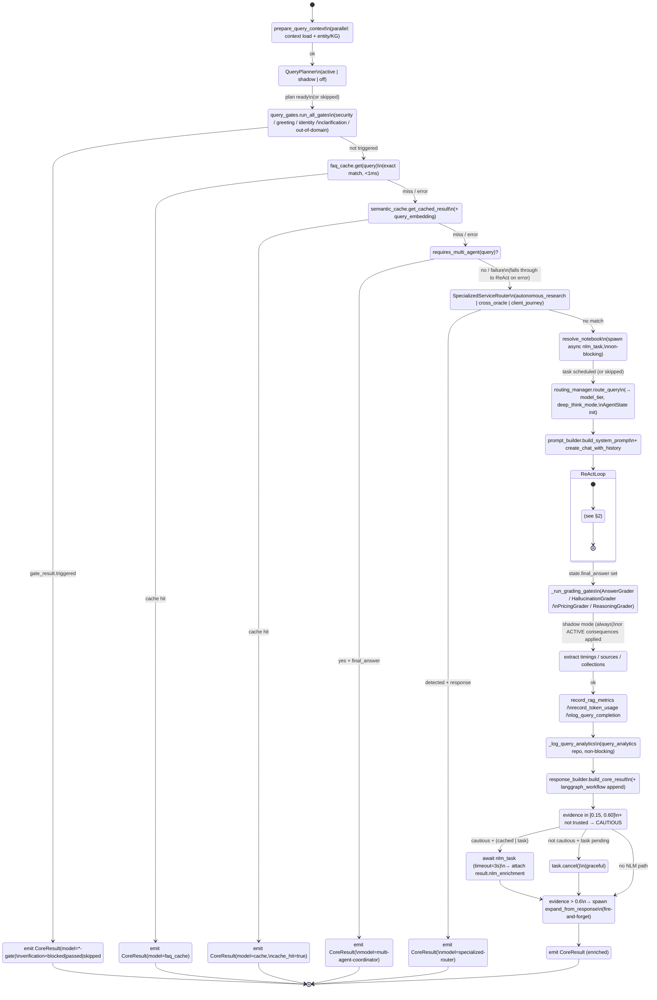
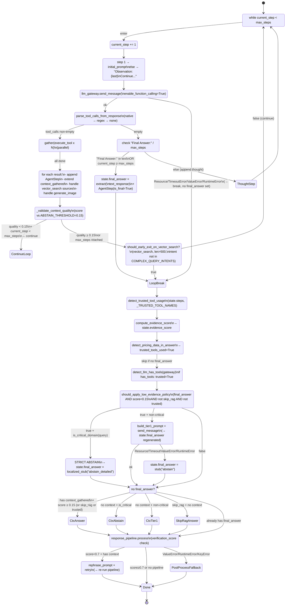

# Orchestrator Core — State Machine (Wave 1)

**Scope:** `backend/services/rag/agentic/orchestrator_core.py` (1,499 LOC) + `reasoning.py` (1,408 LOC).
**Generated:** 2026-04-22, session/orchestrator-audit.
**Method:** Manual read of `process_query_core`, `execute_react_loop`, `execute_react_loop_stream`, policy helpers (`_reasoning_policy.py`, `_reasoning_loop_helpers.py`, `_reasoning_evidence.py`). Mermaid stateDiagram-v2 dialect.

The system has two nested state machines:

1. **Orchestrator pipeline** (outer) — linear pipeline from query arrival to `CoreResult` emission, with multiple early-return gates. Lives in `OrchestratorCore.process_query_core`.
2. **ReAct loop** (inner) — multi-step reasoning loop with tool calls. Lives in `ReasoningEngine.execute_react_loop[_stream]`.

---

## 1. Outer state machine — `process_query_core`

### 1.1 Mermaid diagram



### 1.2 Transitions table (outer)

| # | From | To | Condition / guard |
|---|------|-----|-------------------|
| O1 | `PrepareContext` | `QueryPlanner` | Always (context + entities ready or fallback empty) |
| O2 | `QueryPlanner` | `GatesCheck` | Always (active / shadow / off all pass through) |
| O3 | `GatesCheck` | `GateReturn → [*]` | `gate_result.triggered == True` |
| O4 | `GatesCheck` | `FAQCacheCheck` | `gate_result.triggered == False` |
| O5 | `FAQCacheCheck` | `FAQReturn → [*]` | `faq_cache.get(query)` returned non-None |
| O6 | `FAQCacheCheck` | `SemanticCacheCheck` | miss or exception (graceful degradation) |
| O7 | `SemanticCacheCheck` | `SemanticReturn → [*]` | `cached` truthy |
| O8 | `SemanticCacheCheck` | `MultiAgentCheck` | miss or handled exception |
| O9 | `MultiAgentCheck` | `MultiAgentReturn → [*]` | `_multi_agent_coordinator and requires_multi_agent(query)` and `ma_result["final_answer"]` |
| O10 | `MultiAgentCheck` | `SSRCheck` | coordinator absent, `requires_multi_agent` false, or exception |
| O11 | `SSRCheck` | `SSRReturn → [*]` | `_specialized_router` detected category with `ssr_result["response"]` |
| O12 | `SSRCheck` | `NLMSpeculative` | no SSR match |
| O13 | `NLMSpeculative` | `Routing` | always (spawn-and-continue pattern) |
| O14 | `Routing` | `BuildPrompt` | always |
| O15 | `BuildPrompt` | `ReActLoop` | always |
| O16 | `ReActLoop` | `GradingGates` | `ReasoningEngine.execute_react_loop` returns (success path). On raise, `RuntimeError` propagates (no GradingGates). |
| O17 | `GradingGates` | `MetricsExtract` | always (grader errors caught, non-blocking) |
| O18 | `MetricsExtract` | `RecordMetrics` → `LogAnalytics` → `BuildResponse` | always linear |
| O19 | `BuildResponse` | `NLMMerge` | always |
| O20 | `NLMMerge` | `NLMAwait` | `0.15 ≤ evidence_score ≤ 0.60` AND `not trusted_tools_used` AND (cache hit OR task pending) |
| O21 | `NLMMerge` | `NLMCancel` | not cautious AND task pending → `task.cancel()` |
| O22 | `NLMMerge` | `KGAutoExpansion` | no NLM path taken |
| O23 | `NLMAwait`/`NLMCancel` | `KGAutoExpansion` | always |
| O24 | `KGAutoExpansion` | `Final → [*]` | `evidence_score > 0.6` → spawn task. Else: proceed to `Final` directly. Non-blocking either way. |

### 1.3 Invariants (outer)

Must hold at every early-return edge (`GateReturn`, `FAQReturn`, `SemanticReturn`, `MultiAgentReturn`, `SSRReturn`, `Final`):

- **I-O1**: A `CoreResult` is returned (never `None` nor an exception) on the happy path.
- **I-O2**: `entities` field on `CoreResult` reflects `extracted_entities` computed in `PrepareContext` (even on cache/gate returns).
- **I-O3**: `timings.total = time.time() - start_time`, always ≥ 0.
- **I-O4**: `nlm_task` (if created) is either awaited (`NLMAwait`) or cancelled (`NLMCancel`) — never leaked. This is why NLM speculative fire is placed *after* cache gates.
- **I-O5**: `tool_execution_counter["count"]` is monotonically non-decreasing across the pipeline.
- **I-O6**: `state.evidence_score ∈ [0.0, 1.0] ∪ {None}` when `BuildResponse` runs.
- **I-O7**: On `GateReturn`, `model_used` ends with `"-gate"` (security/greeting/casual/identity/clarification/out-of-domain). On `FAQReturn` → `"faq_cache"`, `SemanticReturn` → `"cache"`, `MultiAgentReturn` → `"multi-agent-coordinator"`, `SSRReturn` → `ssr_result.get("model", "specialized-router")`.

---

## 2. Inner state machine — `execute_react_loop`

### 2.1 Mermaid diagram



### 2.2 Transitions table (inner)

| # | From | To | Condition / guard |
|---|------|-----|-------------------|
| R1 | `LoopEntry` | `StepIncrement` → `BuildMessage` | `current_step < max_steps` |
| R2 | `LoopEntry` | (loop exit) | `current_step ≥ max_steps` |
| R3 | `SendMessage` | `ParseToolCalls` | success |
| R4 | `SendMessage` | `LoopBreak` | `ResourceExhausted | ServiceUnavailable | asyncio.TimeoutError | ValueError | RuntimeError` — **the loop breaks without setting `final_answer`**, downstream logic must generate one |
| R5 | `ParseToolCalls` | `HasToolCalls` | native or regex parse yielded ≥1 valid call |
| R6 | `ParseToolCalls` | `NoToolCall` | `parse_mode == "none"` (no calls) |
| R7 | `HasToolCalls` | `ProcessResults` | `asyncio.gather` returns (tool exceptions captured per-call as `f"Error: {e}"`) |
| R8 | `ProcessResults` | `QualityCheck` | always |
| R9 | `QualityCheck` | `ContinueLoop` | `quality_score < 0.15` AND `current_step < max_steps` → `continue` |
| R10 | `QualityCheck` | `EarlyExitCheck` | quality acceptable OR max reached |
| R11 | `EarlyExitCheck` | `LoopBreak` | `should_early_exit_on_vector_search(tool_name, result, intent)` True |
| R12 | `EarlyExitCheck` | `LoopEntry` | early-exit False (continue loop) |
| R13 | `NoToolCall` | `SetFinalAnswer` | `"Final Answer:" in text_response` OR `current_step ≥ max_steps` |
| R14 | `NoToolCall` | `ThoughtStep` | neither (keep thinking) |
| R15 | `ThoughtStep` | `LoopEntry` | always |
| R16 | `SetFinalAnswer` | `LoopBreak` | always |
| R17 | `TrustedCheck` | `EvidenceCalc` | always |
| R18 | `EvidenceCalc` | `AnswerContentCheck` | always |
| R19 | `AnswerContentCheck` | `HasToolsCheck` | always (may have flipped trusted=True) |
| R20 | `HasToolsCheck` | `LowEvidenceGate` | always (may have flipped trusted=True) |
| R21 | `LowEvidenceGate` | `CriticalBranch` | `should_apply_low_evidence_policy(...)` True AND `is_critical_domain(query)` True |
| R22 | `LowEvidenceGate` | `Tier1Regen` | `should_apply_low_evidence_policy(...)` True AND non-critical |
| R23 | `LowEvidenceGate` | `GenerateIfNeeded` | policy not applicable (answer ok, skip_rag, or trusted) |
| R24 | `Tier1Regen` | `AbstainFallback` | send_message raised; final_answer ← localized "abstain" stub |
| R25 | `GenerateIfNeeded` | `CtxAnswer` | `not final_answer AND context_gathered AND (score≥0.15 OR skip_rag OR trusted)` |
| R26 | `GenerateIfNeeded` | `CtxAbstain` | `not final_answer AND context_gathered AND score<0.15 AND not skip_rag AND not trusted AND is_critical` |
| R27 | `GenerateIfNeeded` | `CtxTier1` | same as R26 but non-critical |
| R28 | `GenerateIfNeeded` | `SkipRagAnswer` | `not final_answer AND not context_gathered AND skip_rag` |
| R29 | `PipelineVerify` | `SelfCorrection` | `processed["verification_score"] < 0.7` AND `state.context_gathered` |
| R30 | `PipelineVerify` | `PostProcessFallback` | `ValueError | RuntimeError | KeyError` raised |

### 2.3 Invariants (inner)

- **I-R1 (loop termination)**: `state.current_step ≤ state.max_steps + (len(tool_calls)-1)` at any point. The body has three exits: `break` (early-exit / SetFinalAnswer / error), `continue` (low quality), or natural loop condition (`current_step ≥ max_steps`). No infinite loop is possible provided `max_steps ≥ 1`.
- **I-R2 (final answer guaranteed)**: Past the `Done` state, `state.final_answer` is a non-empty string. Either set by (a) `SetFinalAnswer`, (b) low-evidence policy override (tier1 or strict abstain), (c) `CtxAnswer` / `CtxAbstain` / `CtxTier1`, (d) `SkipRagAnswer`, (e) pipeline self-correction, (f) fallback stub. **Exception:** if `SendMessage` raises on step 1 AND no subsequent branch regenerates, answer can be `None` — but in practice `should_apply_low_evidence_policy` requires `final_answer` to be truthy, so the policy short-circuits. See unclear #U1 below.
- **I-R3 (trusted bypass monotonic)**: Once `trusted_tools_used` flips to True, it stays True. Three independent flippers (detected tool usage, pricing markers in answer, LLM-had-tools).
- **I-R4 (evidence score is final)**: After `EvidenceCalc`, `state.evidence_score` is set (float 0..1). Subsequent branches may read but not re-compute it.
- **I-R5 (context_gathered monotonic)**: Only appended, never truncated. Used to accumulate tool observations across steps.
- **I-R6 (ABSTAIN threshold)**: `EvidenceScoreConstants.ABSTAIN_THRESHOLD = 0.15`. Below → ABSTAIN (critical) or Tier 1 fallback (non-critical).
- **I-R7 (parallel step counter bump)**: If N>1 tool calls executed in parallel, `current_step += len(tool_calls) - 1` after the loop body. Each parallel call produces its own `AgentStep`.
- **I-R8 (tool error isolation)**: A raise inside `_exec_tool_wrapper` is caught and returns `f"Error: {str(e)}"` as the observation — the loop does NOT break on a single tool failure, it continues with the error string in `tool_result`.

### 2.4 Trusted tool set (`_TRUSTED_TOOL_NAMES`)

```python
frozenset({"calculator", "crm_query", "get_pricing", "team_knowledge", "timesheet", "vector_search"})
```

When any of these succeeds, `trusted_tools_used = True` and the strict evidence gate is bypassed.

### 2.5 Early-exit predicate

`should_early_exit_on_vector_search(tool_name, tool_result, intent_type)`:

- tool_name == "vector_search", AND
- `len(tool_result) > 500` AND `"No relevant documents"` not in result, AND
- `intent_type not in COMPLEX_QUERY_INTENTS = {"business_complex", "business_strategic", "devai_code"}`

For complex queries, early exit is **disabled** — loop proceeds to allow KG/multi-tool reasoning.

---

## 3. Unclear / needs owner clarification

Flagged where the code doesn't make the intended behavior obvious from reading alone.

### U1 — Step-1 `send_message` raise path

At `reasoning.py:289-292`, if `llm_gateway.send_message` raises on step 1, the loop `break`s immediately. `state.final_answer` is still `None`, `context_gathered` is empty. Downstream:

- `should_apply_low_evidence_policy` requires `final_answer` truthy → False → skipped.
- `GenerateIfNeeded` (line 609) requires `state.context_gathered` truthy → False → skipped.
- `elif not state.final_answer` at line 732 handles: skip_rag path OR critical abstain OR non-critical Tier 1.

So in practice, Tier 1 or abstain stub fires even when step 1 fails. **But** if Tier 1's `send_message` *also* raises, `AbstainFallback` triggers via `_get_localized_stub("abstain", language)`. The final_answer is guaranteed non-None only if `_get_localized_stub` itself doesn't raise — which isn't tested.

**Question for owner:** Is the double-failure path (step-1 raise + Tier-1 raise) intentionally covered by the stub fallback, or is there a silent "empty answer" escape in practice? Worth a dedicated test.

### U2 — QueryPlanner in shadow vs active mode

Line 732-747 of `orchestrator_core.py`: when `_USE_QUERY_PLANNER=True`, `query_plan` is computed synchronously. When `_ENABLE_CRAG_ROUTER=True` AND `query_plan`, a `CRAGRouter` is instantiated and `crag_decision` computed. **However**, `crag_decision` is never consumed later in `process_query_core` — it's assigned to a local variable and that's it. This looks like dead code or a partial implementation.

**Question for owner:** Is `crag_decision` supposed to influence the routing manager, tier selection, or tool selection downstream? Currently it has no effect on behavior. Untestable until wired.

### U3 — `nlm_task` cancellation swallowed exception

Line 1021-1025: `await nlm_task` inside an `except (asyncio.CancelledError, Exception)` after `.cancel()`. The bare `Exception` catches any unrelated error from `nlm_enrichment_service.query`. If the service raised a bug (not a cancellation), it's silently swallowed — no logging, no metric. Non-blocking pattern, but noisy-failure debugging is harder. Not a bug; just worth knowing.

### U4 — `grading_gates` ACTIVE consequences

`_run_grading_gates` (line 1212-1229): when `_ENABLE_GRADING_GATES=True`, failed `answer` or `hallucination` grade clamps `state.evidence_score` to `min(existing, 0.15)` — pushing into ABSTAIN territory. This happens **after** the ReAct loop's own evidence gate ran. The downstream `NLMMerge` uses the (possibly clamped) score; `KGAutoExpansion` gate `>0.6` also. But the final answer has already been generated by reasoning.py before grading runs. So a "clamp to 0.15" here cannot regenerate the answer — it only affects NLM enrichment and KG expansion paths. **Intentional?** Suspected yes (active mode is about downstream confidence, not re-answering), but worth confirming.

### U5 — Streaming loop divergence

`execute_react_loop_stream` (line 905+) has extra logic not in sync:

- Line 1036-1040: `crm_query` explicit early exit + `trusted_tools_used=True` flag (sync does NOT have this — it relies on `detect_trusted_tool_usage` after the loop).
- Line 1095-1103: fallback scans for `detect_trusted_context_markers` / `detect_substantial_context` (sync path doesn't scan context markers explicitly).

**Impact:** Streaming can reach "trusted" earlier than sync for the same sequence of tool calls. State machines are not identical. Tests that mix streaming + sync must account for this drift.

### U6 — Parallel tool count vs `max_steps`

`reasoning.py:403-404`: after N>1 parallel tool executions, `state.current_step += len(tool_calls) - 1`. Combined with the per-iteration `current_step += 1` (line 248), total increment is `len(tool_calls)`. If `max_steps=3` and step 1 runs 5 tools in parallel, `current_step` jumps to 5, exceeding `max_steps`. Next `while` check fails, loop exits. **Is this intentional?** Seems so — fair budget enforcement — but the test for `max_steps` vs parallel-tool interaction is missing.

---

## 4. Coverage boundaries (what this diagram does NOT model)

Out of scope for Wave 1, tracked for Wave 2:

- **`execute_react_loop_stream`** — diagrammed as divergence only (§U5), not fully expanded. Has extra early-exit cases, yields events, no post-loop tier1 regen retry tracking.
- **Gating internals** — `QueryGates.run_all_gates` is a composite of 6+ gates (injection, greeting, casual, identity, clarification, out-of-domain); treated as a single state.
- **QueryPlanner internal states** — shadow mode spawns a background task; the sync-active branch is linear.
- **`prepare_query_context`** — parallel sub-SM inside `PrepareContext`: entity extraction, legacy KG retrieval, LangGraph workflow synthesis. All three run via `asyncio.gather(..., return_exceptions=True)` — any raise is converted to fallback values. Not diagrammed.
- **`response_pipeline.process`** — the verification pipeline is a sub-machine (verify → clean → citations). Treated as a black box.

---

**End of Wave 1 state machine map.** Proceed to `TEST_GAPS.md`.
