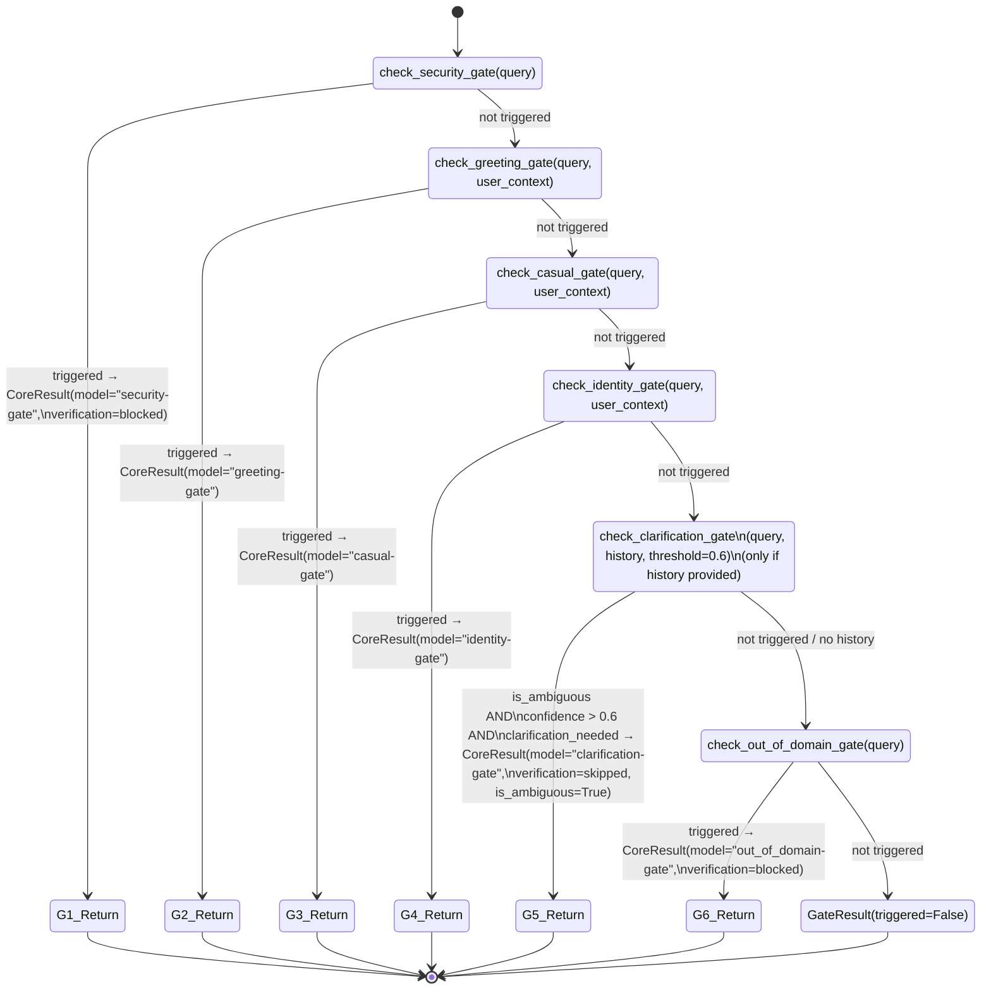

# QueryGates — Sub-Gate Decomposition (Wave 3)

**Scope:** `backend/services/rag/agentic/query_gates.py` (340 LOC).
**Generated:** 2026-04-22, session/orchestrator-streaming.
**Method:** Manual read of `QueryGates.run_all_gates` + each per-gate helper. Referenced by `STATE_MACHINE.md` §4 (outer state `GatesCheck`) and by `OrchestratorCore.process_query_core` via `self.query_gates.run_all_gates(...)`.

In the outer state machine (`STATE_MACHINE.md` §1), `GatesCheck` is represented as a single state. Opening that black box is the goal of this Wave 3 document: six concrete sub-gates, checked sequentially, short-circuiting on the first triggered result.

---

## 1. Composite view



---

## 2. Per-gate decomposition

Each row below is a self-contained sub-state of the composite. "Return type" is the shape of `GateResult` (see the `@dataclass` in `query_gates.py:30-37`).

| # | Gate | Trigger condition | Side effect | Return type on triggered |
|---|------|-------------------|-------------|--------------------------|
| **G1** | **Security** | `prompt_builder.detect_prompt_injection(query)` returns `(is_injection=True, response)` | `logger.warning("Blocked prompt injection/off-topic request")` | `GateResult(triggered=True, response=injection_response, gate_name="security", metadata={"reason": "prompt_injection"})` |
| **G2** | **Greeting** | `prompt_builder.check_greetings(query, context=user_context)` returns a truthy string | `logger.info("Returning direct greeting response (skipping RAG)")` | `GateResult(triggered=True, response=greeting_response, gate_name="greeting")` |
| **G3** | **Casual** | `prompt_builder.get_casual_response(query, context=user_context)` returns a truthy string | `logger.info("Returning direct casual response (skipping RAG)")` | `GateResult(triggered=True, response=casual_response, gate_name="casual")` |
| **G4** | **Identity** | `prompt_builder.check_identity_questions(query, context=user_context)` returns a truthy string | `logger.info("Returning hardcoded identity response")` | `GateResult(triggered=True, response=identity_response, gate_name="identity")` |
| **G5** | **Clarification** | Non-None `clarification_service`, plus `detect_ambiguity(query, history)` returns `{is_ambiguous: True, confidence: > 0.6, clarification_needed: True}` | Invokes `generate_clarification_request(query, ambiguity_info)` | `GateResult(triggered=True, response=clarification_msg, gate_name="clarification", metadata={is_ambiguous, confidence, reasons, entities})` |
| **G6** | **Out-of-domain** | `is_out_of_domain(query)` returns `(True, reason)` with reason key in `OUT_OF_DOMAIN_RESPONSES` | `logger.info(f"Query rejected as out-of-domain: {reason}")` | `GateResult(triggered=True, response=OUT_OF_DOMAIN_RESPONSES.get(reason, "unknown"), gate_name="out_of_domain", metadata={"reason": reason})` |
| **FT** | **Fallthrough** | No gate triggered | — | `GateResult(triggered=False)` (proceed to cache / ReAct) |

### 2.1 Trigger predicates — where they live

| Gate | Upstream function | Module |
|------|-------------------|--------|
| G1 | `SystemPromptBuilder.detect_prompt_injection` | `backend/services/rag/agentic/prompt_builder.py` |
| G2 | `SystemPromptBuilder.check_greetings` | `backend/services/rag/agentic/prompt_builder.py` |
| G3 | `SystemPromptBuilder.get_casual_response` | `backend/services/rag/agentic/prompt_builder.py` |
| G4 | `SystemPromptBuilder.check_identity_questions` | `backend/services/rag/agentic/prompt_builder.py` |
| G5 | `ClarificationService.detect_ambiguity` + `generate_clarification_request` | `backend/services/misc/clarification_service.py` |
| G6 | `is_out_of_domain` (module-level) | `backend/services/response/cleaner.py` |

---

## 3. `run_all_gates` composite execution order

Source of truth: `query_gates.py:235-291`.

```python
def run_all_gates(query, user_context, conversation_history=None) -> GateResult:
    # 1. Security gate (MUST be first)
    # 2. Greeting gate
    # 3. Casual gate
    # 4. Identity gate
    # 5. Clarification gate (ONLY IF conversation_history truthy)
    # 6. Out-of-domain gate
    # Fallthrough: GateResult(triggered=False)
```

### 3.1 Invariants (composite)

- **I-G1 (security priority)**: Security is always the first gate. A prompt-injection attempt that happens to look like a greeting cannot pass through G2. If someone reorders the gates in `run_all_gates`, G1-position tests (below) must fail.
- **I-G2 (short-circuit)**: At most one gate fires per composite call. Once any gate returns `triggered=True`, subsequent gates are NOT evaluated — their collaborators (e.g. `get_casual_response`) are not called.
- **I-G3 (clarification opt-in)**: Clarification is only attempted if `conversation_history` is truthy. The check is on the function argument, not on `clarification_service` presence — the service absence is handled separately inside `check_clarification_gate` via an early `return GateResult(triggered=False)`.
- **I-G4 (fallthrough is always `triggered=False`)**: When no gate triggers, the returned `GateResult` has `triggered=False`, `response=None`, `gate_name=None`. `OrchestratorCore.process_query_core` reads the boolean to decide whether to return early.
- **I-G5 (gate_result_to_core_result mapping)**:
  - `verification_status`:
    - `"blocked"` for `security` and `out_of_domain`
    - `"skipped"` for `clarification`
    - `"passed"` for all others (greeting, casual, identity)
  - `verification_score`: `0.0` for `security`/`out_of_domain`, `1.0` otherwise
  - `evidence_score`: `0.0` for `security`/`out_of_domain`/`clarification`, `1.0` otherwise
  - `model_used`: always `f"{gate_name}-gate"`
  - `warnings`: populated only for `security`/`out_of_domain` (with `"Query blocked: {reason}"`)
  - `is_ambiguous`: True only for clarification
  - `clarification_question`: populated only for clarification

---

## 4. Error propagation

`run_all_gates` does NOT wrap any call in a try/except. Exceptions raised by upstream predicates (e.g. `detect_prompt_injection`, `check_greetings`) propagate to the caller (`OrchestratorCore.process_query_core`). There the broader try/except in the outer pipeline catches and handles them — but `QueryGates` itself does not degrade gracefully inside this composite.

**Consequence for tests:** `run_all_gates` is deterministic per inputs; no hidden retry. The tests in §5 below exercise this contract, including the raise-propagates case.

---

## 5. Test plan (6-10 tests)

File: `test_query_gates_composite.py` — sibling of other wave3 files.

Priority: I-G1 (security-first) and I-G2 (short-circuit) are load-bearing for OWASP compliance. I-G5 mapping shapes downstream analytics.

| # | Test name | Sub-gate(s) / Invariant | Rationale |
|---|-----------|-------------------------|-----------|
| 1 | `test_security_gate_triggered_short_circuits_subsequent` | G1 + I-G1 + I-G2 | Security trigger → greeting/casual/identity/etc. are NOT called. |
| 2 | `test_greeting_triggered_short_circuits_from_casual_onward` | G2 + I-G2 | Greeting wins → casual/identity/clarification/OOD not queried. |
| 3 | `test_clarification_requires_history_argument` | G5 + I-G3 | With `conversation_history=None`, `clarification_service.detect_ambiguity` is NOT called, regardless of service presence. |
| 4 | `test_clarification_service_absence_returns_not_triggered` | G5 | `clarification_service=None` but history passed → `GateResult(triggered=False)`. Safe fallback, G6 still runs. |
| 5 | `test_clarification_below_confidence_threshold_not_triggered` | G5 | confidence = 0.5 (< 0.6) → not triggered; G6 (OOD) still evaluated. |
| 6 | `test_out_of_domain_fallthrough_to_react_path` | G6 + I-G4 | OOD evaluates `is_out_of_domain(query)` only if nothing else triggered. Unknown reason → uses "unknown" response. |
| 7 | `test_fallthrough_returns_triggered_false` | FT + I-G4 | No gate matches → `GateResult(triggered=False, response=None, gate_name=None)`. |
| 8 | `test_gate_result_to_core_result_security_mapping` | I-G5 | Security gate → `verification_score=0.0`, `verification_status="blocked"`, `evidence_score=0.0`, warnings populated. |
| 9 | `test_gate_result_to_core_result_clarification_mapping` | I-G5 | Clarification gate → `verification_status="skipped"`, `is_ambiguous=True`, `clarification_question` populated, `evidence_score=0.0`. |
| 10 | `test_upstream_raise_propagates_not_swallowed` | error propagation | Raise inside `check_greetings` (G2) propagates; not silently turned into `triggered=False`. |

---

**End of QueryGates Wave 3 decomposition.** Tests live in `test_query_gates_composite.py`.
