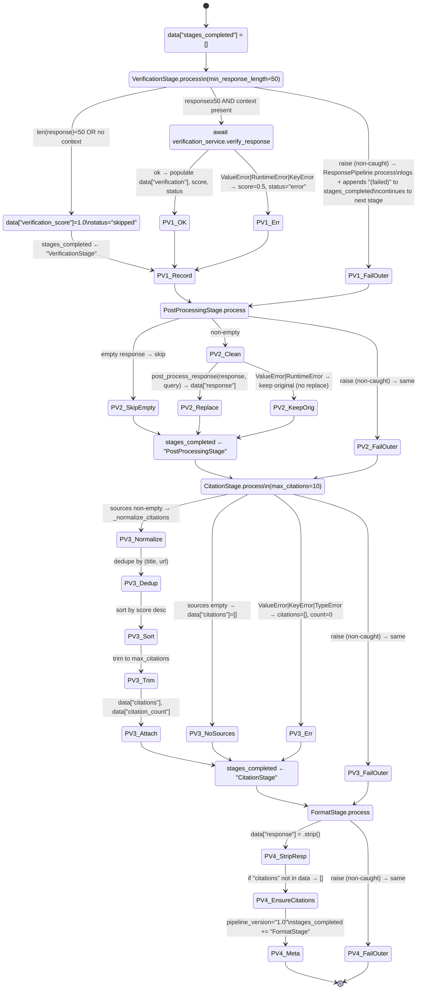

# ResponsePipeline — Sub-Machine (Wave 3)

**Scope:** `backend/services/rag/agentic/pipeline.py` (408 LOC).
**Generated:** 2026-04-22, session/orchestrator-streaming.
**Method:** Manual read of `ResponsePipeline.process` + each `PipelineStage` subclass. Referenced by `STATE_MACHINE.md` §2.1 state `PipelineVerify` (sync, post-loop) and §5.1 state `StreamPipelineVerify` (streaming, post-loop). This doc opens the "verify → clean → citations → format" black box.

In both sync and streaming state machines, `response_pipeline.process(pipeline_data)` is called **once** after the ReAct loop finishes with a non-empty `final_answer`. Its contract: a dict in, a mutated dict out; fields are added, the `response` string may be rewritten, `citations` may be injected. The call site swallows `ValueError | RuntimeError | KeyError` and falls back to `post_process_response`.

This document specifies what happens **inside** that call.

---

## 1. Pipeline composition (default)

`create_default_pipeline()` (`pipeline.py:388-408`):

```python
return ResponsePipeline([
    VerificationStage(min_response_length=50),
    PostProcessingStage(),
    CitationStage(max_citations=10),
    FormatStage(),
])
```



---

## 2. Per-stage semantics

### 2.1 VerificationStage

Source: `pipeline.py:60-126`.

| Aspect | Value |
|--------|-------|
| **Trigger** | `len(data.get("response",""))) >= min_response_length (default 50)` AND `data.get("context_chunks", [])` is non-empty |
| **Skip condition** | Either short response or no context → `verification_score=1.0`, `verification_status="skipped"`; no outbound verification_service call. |
| **Happy path** | `await verification_service.verify_response(query, draft_answer=response, context_chunks=...)` → populates `data["verification"]` (dict with is_valid, status, score, reasoning, missing_citations), `data["verification_score"]`, `data["verification_status"]`. |
| **Error path** | `ValueError | RuntimeError | KeyError` → `data["verification_score"]=0.5`, `data["verification_status"]="error"`. Logged at WARNING. |
| **Output fields** | `verification` (dict, optional), `verification_score` (float), `verification_status` (str) |

### 2.2 PostProcessingStage

Source: `pipeline.py:129-170`.

| Aspect | Value |
|--------|-------|
| **Trigger** | `data.get("response", "")` non-empty |
| **Skip condition** | empty response → no-op return |
| **Happy path** | `post_process_response(response, query)` → `data["response"] = cleaned`. Handles internal-reasoning marker stripping (THOUGHT:, ACTION:), language detection, procedural-question formatting, emotional acknowledgment. |
| **Error path** | `ValueError | RuntimeError` → keep original response (no `data["response"]` mutation). Logged at WARNING. |
| **Output fields** | mutates `data["response"]` |

### 2.3 CitationStage

Source: `pipeline.py:173-279`.

| Aspect | Value |
|--------|-------|
| **Trigger** | always runs; reads `data.get("sources", [])` |
| **Empty-sources path** | `data["citations"] = []`, `data["citation_count"] = 0` |
| **Happy path** | `_normalize_citations(sources)` filters out non-dict entries and entries missing `title`; dedupes by `(title, url)`; sorts descending by `float(score)`; trims to `max_citations` (default 10). Each citation has keys: `title`, `url`, `collection`, `score`, `snippet`, `metadata`. |
| **Error path** | `ValueError | KeyError | TypeError` → `data["citations"]=[]`, `data["citation_count"]=0`. Logged at WARNING. |
| **Output fields** | `citations` (list), `citation_count` (int) |

### 2.4 FormatStage

Source: `pipeline.py:282-311`.

| Aspect | Value |
|--------|-------|
| **Trigger** | always runs |
| **Effects** | `data["response"] = data["response"].strip()` (if present); ensures `data["citations"]` exists (even if empty); sets `data["pipeline_version"] = "1.0"`; appends `"FormatStage"` to `stages_completed`. |
| **Error path** | none declared — if any attribute access fails, it propagates to the outer `ResponsePipeline.process` catch. |
| **Output fields** | `pipeline_version`, `stages_completed` (list, always ends with "FormatStage" on happy path) |

---

## 3. ResponsePipeline.process — outer orchestration

Source: `pipeline.py:349-385`.

```python
async def process(self, data: dict[str, Any]) -> dict[str, Any]:
    if data is None:
        raise ValueError("Pipeline data cannot be None")
    data["stages_completed"] = []
    for stage in self.stages:
        try:
            data = await stage.process(data)
            data["stages_completed"].append(stage.name)
        except (ValueError, RuntimeError, KeyError, TypeError) as e:
            logger.error(...)
            data["stages_completed"].append(f"{stage.name} (failed)")
    return data
```

### 3.1 Invariants (pipeline-level)

- **I-P1 (data is never None on return)**: if the caller passes `None`, `process` raises `ValueError` synchronously; otherwise the mutated-in-place dict is returned. Callers may rely on "if I got a return, it's a dict".
- **I-P2 (chain continues on stage failure)**: if a stage raises one of `ValueError | RuntimeError | KeyError | TypeError`, the pipeline appends `"<StageName> (failed)"` to `stages_completed` and moves on. No stage failure aborts the chain. This differs from the reasoning-side caller (which falls back to `post_process_response` on pipeline-level raise); here the fallback is stage-internal.
- **I-P3 (stages_completed monotonic)**: the `stages_completed` list only appends, never truncates or reorders. Its length equals the number of stages attempted. Final entry is always the last stage's name or its `(failed)` variant.
- **I-P4 (default-pipeline cardinality)**: `create_default_pipeline()` produces exactly 4 stages in the fixed order [Verification, PostProcessing, Citation, Format]. Callers that want custom orderings instantiate `ResponsePipeline(stages=[...])` directly.
- **I-P5 (response shape guarantee)**: after all 4 default stages run, `data` has at minimum: `response: str`, `citations: list`, `pipeline_version: str`, `stages_completed: list[str]`. Additional fields (`verification`, `verification_score`, `verification_status`, `citation_count`) may or may not be present depending on stage inputs.
- **I-P6 (VerificationStage short-response bypass)**: responses shorter than `min_response_length` skip verification AND report `verification_score=1.0` — NOT `verification_score=0.0`. Callers reading this score must account for the "didn't bother" case.
- **I-P7 (CitationStage score coercion)**: `_normalize_citations` coerces `score` via `float(src.get("score", 0))`. A non-numeric score raises `ValueError` at coercion → caught at the stage boundary → citations zeroed.

---

## 4. Test plan (5-8 tests)

File: `test_response_pipeline_stages.py` — sibling of other wave3 files.

Priority: I-P1 (None raise), I-P2 (chain continues), I-P5 (shape guarantee), plus key error paths inside each stage.

| # | Test name | Stage / Invariant | Rationale |
|---|-----------|-------------------|-----------|
| 1 | `test_pipeline_process_none_data_raises_value_error` | I-P1 | `None` input → `ValueError` synchronously. |
| 2 | `test_verification_short_response_skips_and_marks_status_skipped` | VerificationStage + I-P6 | Response < 50 chars → status="skipped", score=1.0, verification_service NOT called. |
| 3 | `test_verification_service_raise_yields_error_status_and_half_score` | VerificationStage error path | `verify_response` raises `ValueError` → score=0.5, status="error". No unhandled raise escapes. |
| 4 | `test_postprocessing_empty_response_is_noop` | PostProcessingStage skip | empty response → no call to `post_process_response`, `data["response"]` unchanged. |
| 5 | `test_citation_normalize_dedupes_sorts_and_trims` | CitationStage happy path | 3 sources with duplicates + varying scores → dedupe + sort descending + trim to max_citations=2 keeps highest 2. |
| 6 | `test_citation_missing_title_filtered_out` | CitationStage filter | source with `{}`, `{"title": ""}`, non-dict entries → skipped; only valid titled sources survive. |
| 7 | `test_format_stage_ensures_citations_list_present` | FormatStage + I-P5 | data without `citations` key → FormatStage guarantees `data["citations"] = []` after run. Also strips response. |
| 8 | `test_stage_raise_does_not_abort_chain_marks_failed` | I-P2 + I-P3 | Inject a custom stage that raises `ValueError` mid-chain → next stage still runs, `stages_completed` contains `"<Name> (failed)"`. |

---

**End of ResponsePipeline Wave 3 decomposition.** Tests live in `test_response_pipeline_stages.py`.
