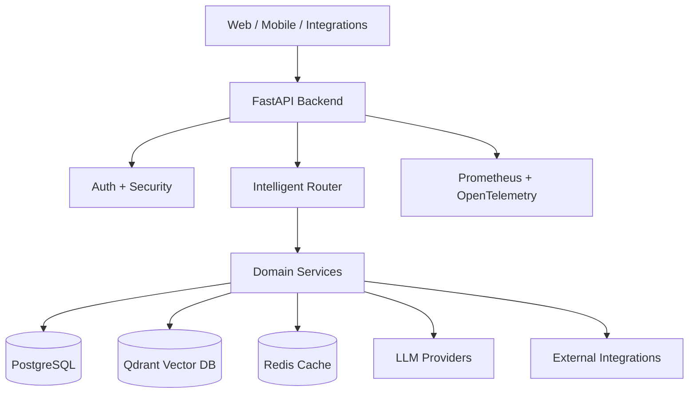
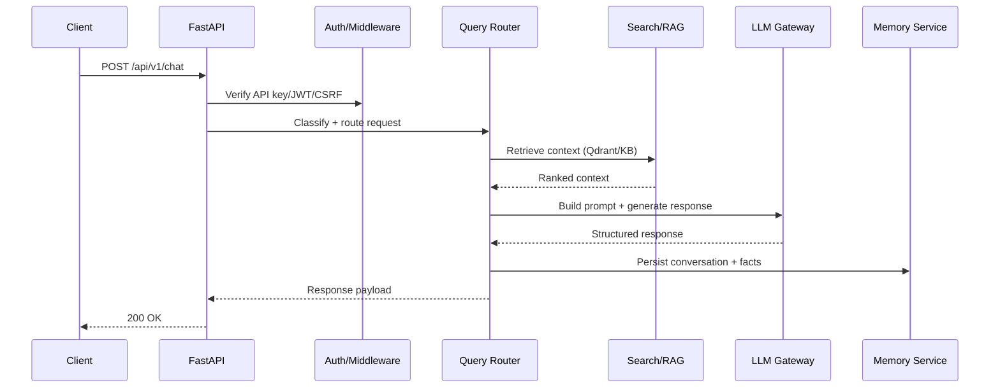
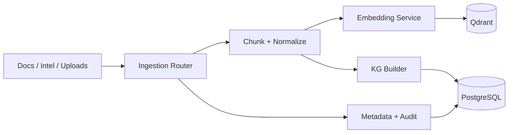
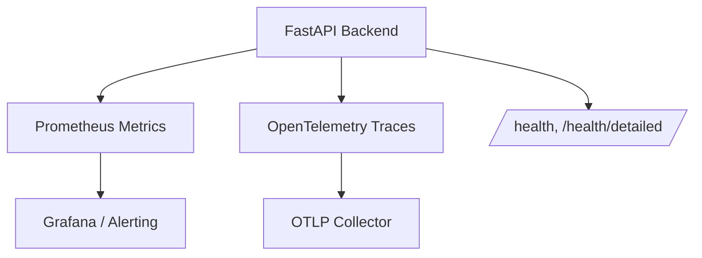

# Architecture (Mermaid)

This document provides high-level architecture diagrams for the backend. These
diagrams are kept intentionally concise to show system context, request flow,
and the ingestion/knowledge-graph pipeline.

## System Context

## Chat / Agentic RAG Request Flow

## Ingestion + Knowledge Graph Pipeline

## Observability & Health

