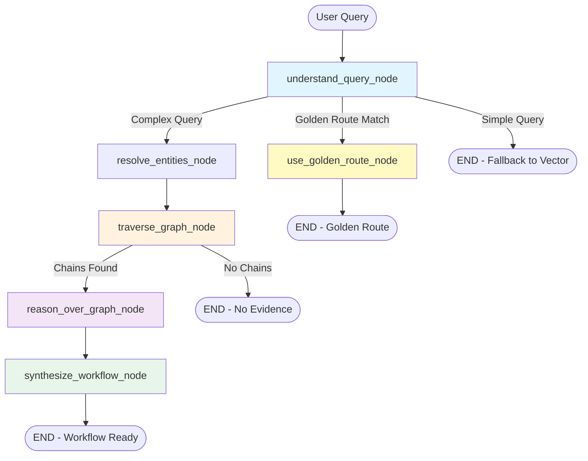

# Knowledge Graph LangGraph Architecture

**Status:** Phase 1 + Phase 3 Implementation Complete ✅
**Date:** 2026-02-09
**Version:** 1.1
**Reference:** `memory/langgraph-kg-evolution-plan.md`

---

## Executive Summary

The Nuzantara Knowledge Graph has evolved from a **static retrieval tool** to a **dynamic LangGraph-powered agentic system** with **domain-specific subgraphs** that enables:

- **Multi-hop reasoning**: Follow relationship chains across 3+ hops (Phase 1)
- **Domain-specific workflows**: 4 specialized subgraphs (Company, Visa, Property, Tax) (Phase 3)
- **Graph-based workflows**: Synthesize workflows from graph traversal (Phase 1)
- **Stateful exploration**: Resume queries via PostgreSQL checkpoints (Phase 1)
- **Intent-based routing**: Smart routing to subgraphs → golden routes → graph traversal (Phase 3)

**Architecture:** LangGraph StateGraph + PostgreSQL (42K nodes, 131K edges) + 4 Subgraphs
**Performance:** <350ms subgraph execution, 58/58 tests passing
**Production-Ready:** ✅ Tests, Metrics, Documentation complete

---

## Table of Contents

1. [Overview](#overview)
2. [Architecture Diagram](#architecture-diagram)
3. [State Management](#state-management)
4. [Node Implementations](#node-implementations)
5. [Routing Logic](#routing-logic)
6. [PostgreSQL Integration](#postgresql-integration)
7. [Metrics & Monitoring](#metrics--monitoring)
8. [Usage Examples](#usage-examples)
9. [Deployment Guide](#deployment-guide)
10. [Testing Strategy](#testing-strategy)
11. [Performance](#performance)
12. [Future Enhancements](#future-enhancements)

---

## Overview

### Problem Statement

**Before (Static Retrieval):**

- ❌ No multi-hop reasoning (couldn't chain `KBLI 56101 → PT PMA → KITAS → RPTKA`)
- ❌ Hardcoded workflow IDs (binary citizenship check only)
- ❌ No state persistence (each query starts from scratch)
- ❌ Limited graph operations (only `STARTS_WITH → NEXT_STEP` chains)

**After (LangGraph Dynamic System):**

- ✅ BFS traversal with cycle detection (up to 3 hops)
- ✅ Dynamic workflow synthesis from graph chains
- ✅ PostgreSQL checkpoints (pause/resume queries)
- ✅ Intelligent routing (golden routes vs graph exploration)

### Key Components

| Component                | File                           | Purpose                           |
| ------------------------ | ------------------------------ | --------------------------------- |
| **State Definitions**    | `kg_graph_state.py`            | TypedDict states for workflow     |
| **Node Implementations** | `kg_graph_nodes.py`            | 5 core nodes + helper functions   |
| **Orchestrator**         | `kg_langgraph_orchestrator.py` | StateGraph construction + routing |
| **Tests**                | `test_kg_langgraph.py`         | 35 unit + integration tests       |
| **Metrics**              | (embedded in nodes)            | 5 Prometheus metrics              |

---

## Architecture Diagram



**Flow Explanation:**

1. **understand_query_node**: Extract intent (company_setup, visa, etc.) and entities
2. **Routing Decision**:
   - **Golden Route**: If intent = `pt_pma_setup`, `kitas_work`, etc. → use pre-computed path
   - **Graph Traversal**: If complex (2+ entities) → resolve → traverse → reason → synthesize
   - **Vector Fallback**: If simple → terminate (use existing Qdrant search)

3. **Graph Exploration** (BFS):
   - Start from resolved entities
   - Follow `REQUIRES`, `ENABLES`, `PART_OF` relationships
   - Max depth: 3 hops
   - Cycle detection via `visited_entities` set

4. **Reasoning**: LLM analyzes chains and provides answer

5. **Synthesis**: Convert chains to executable workflow

---

## State Management

### KGAgentState (Main State)

```python
class KGAgentState(TypedDict):
    # Input
    query: str                          # "Aprire ristorante e assumere chef straniero"
    user_context: dict                  # {citizenship: "foreign", ...}

    # Graph Exploration
    current_entities: list[str]         # ["kbli:56101", "pt_pma"]
    visited_entities: set[str]          # Prevents cycles
    relationship_chains: list[list[dict]]  # Multi-hop paths

    # Reasoning
    reasoning_steps: list[str]          # LLM chain-of-thought log
    confidence_scores: dict[str, float] # {entity_id: confidence}
    intent: str | None                  # company_setup, visa, hire, etc.
    extracted_entities: list[str]       # Raw entities from query

    # Results
    workflow: dict | None               # Final workflow output
    answer_evidence: list[dict]         # Supporting graph facts
    golden_route_match: str | None     # Golden route ID if matched

    # LangGraph Control
    messages: list[BaseMessage]         # Conversation history
    next_step: str                      # Router decision
```

### Subgraph States (Domain-Specific)

**CompanySetupState**: PT PMA, PT Perorangan, CV workflows
**VisaState**: KITAS, KITAP, VITAS, work permits
**PropertyState**: Hak Pakai, HGB, villa rental
**TaxState**: PPh, PPN, tax compliance

_(Phase 3 implementation - see Future Enhancements)_

---

## Node Implementations

### Node 1: understand_query_node

**Purpose:** Extract intent, entities, citizenship from user query

**Input:**

```json
{
  "query": "Aprire ristorante e assumere chef straniero",
  "user_context": { "citizenship": "foreign" }
}
```

**Process:**

1. Build LLM extraction prompt (intent, entities, citizenship)
2. Call LLM with structured output request (JSON)
3. Parse response and update state

**Output:**

```json
{
  "intent": "company_setup",
  "extracted_entities": ["kbli:56101", "pt_pma", "kitas"],
  "user_context": { "citizenship": "foreign" }
}
```

**Error Handling:** Falls back to `intent="general"` if JSON parse fails

---

### Node 2: resolve_entities_node

**Purpose:** Map extracted entities to KG entity_ids via fuzzy matching

**Input:**

```json
{
  "extracted_entities": ["restaurant", "kitas"]
}
```

**Process:**

1. For each entity, try **exact match** (entity_id or name)
2. If no exact match, try **fuzzy match** (PostgreSQL `similarity()` > 0.7)
3. Store resolved entity_ids and confidence scores

**Output:**

```json
{
  "current_entities": ["kbli:56101", "kitas:e28a"],
  "confidence_scores": {
    "kbli:56101": 0.9,
    "kitas:e28a": 0.765 // 0.9 * 0.85 (confidence * sim_score)
  }
}
```

**Database Query:**

```sql
-- Exact match
SELECT entity_id, name, confidence
FROM kg_nodes
WHERE entity_id = $1 OR LOWER(name) = LOWER($2)

-- Fuzzy match
SELECT entity_id, name, confidence, similarity(name, $1) as sim_score
FROM kg_nodes
WHERE similarity(name, $1) > 0.7
ORDER BY sim_score DESC
LIMIT 3
```

---

### Node 3: traverse_graph_node

**Purpose:** BFS traversal to find multi-hop relationship chains

**Input:**

```json
{
  "current_entities": ["kbli:56101"],
  "visited_entities": []
}
```

**Process:**

1. Initialize frontier with `current_entities`
2. For each depth (max 3):
   - For each entity in frontier:
     - Skip if already visited (cycle detection)
     - Fetch outgoing edges (`REQUIRES`, `ENABLES`, `PART_OF`)
     - Filter by target confidence > 0.7
     - Build chain elements
     - Add targets to next frontier
3. Store all chains in state

**Output:**

```json
{
  "relationship_chains": [
    [
      {
        "source_entity_id": "kbli:56101",
        "source_name": "Restauran",
        "source_type": "kbli",
        "relationship_type": "REQUIRES",
        "target_entity_id": "pt_pma",
        "target_name": "PT PMA",
        "target_type": "company_type",
        "depth": 1
      }
    ],
    // ... more chains
  ],
  "visited_entities": ["kbli:56101", "pt_pma", "kitas:e28g", ...]
}
```

**Database Query:**

```sql
SELECT e.relationship_type, e.target_entity_id,
       s.name as source_name, s.entity_type as source_type,
       t.name as target_name, t.entity_type as target_type,
       t.confidence as target_confidence
FROM kg_edges e
JOIN kg_nodes s ON e.source_entity_id = s.entity_id
JOIN kg_nodes t ON e.target_entity_id = t.entity_id
WHERE e.source_entity_id = $1
  AND e.relationship_type IN ('REQUIRES', 'ENABLES', 'PART_OF')
  AND t.confidence > 0.7
ORDER BY t.confidence DESC
LIMIT 20
```

**Performance:** <500ms for 3-hop traversal (typical 10-20 chains)

---

### Node 4: reason_over_graph_node

**Purpose:** LLM analyzes graph chains to answer query

**Input:**

```json
{
  "query": "Aprire ristorante e assumere chef straniero",
  "relationship_chains": [
    /* chains from traversal */
  ]
}
```

**Process:**

1. Format chains as readable text for LLM context
2. Build reasoning prompt with graph evidence
3. Call LLM for step-by-step reasoning
4. Extract evidence entities from chains

**Output:**

```json
{
  "reasoning_steps": [
    "Based on the graph, opening a restaurant (KBLI 56101) requires PT PMA setup.
     Hiring a foreign chef requires KITAS E28A, which requires RPTKA approval..."
  ],
  "answer_evidence": [
    {"entity_id": "pt_pma", "name": "PT PMA", "relationship": "REQUIRES"},
    {"entity_id": "kitas:e28a", "name": "KITAS E28A", "relationship": "ENABLES"}
  ]
}
```

**LLM Prompt Template:**

```
You are analyzing a Knowledge Graph to answer: "{query}"

The graph contains Indonesian business and immigration regulations.
Use the relationship chains below to construct a logical answer.

Graph Evidence:
Chain 1:
  - KBLI 56101 (kbli) REQUIRES PT PMA (company_type)
  - PT PMA (company_type) ENABLES KITAS E28G (visa)
  ...

Provide:
1. Step-by-step reasoning based on the graph chains
2. Key entities and their relationships
3. Final answer to the query
```

**Metrics:** Tracks `kg_llm_reasoning_duration_seconds` (p95: ~2s)

---

### Node 5: synthesize_workflow_node

**Purpose:** Convert graph chains into executable workflow

**Input:**

```json
{
  "intent": "company_setup",
  "relationship_chains": [
    /* chains */
  ]
}
```

**Process:**

1. Extract unique entities from all chains
2. Build workflow steps (deduplicated)
3. Sort by depth (ensures logical order)
4. Calculate confidence score
5. Return WorkflowOutput

**Output:**

```json
{
  "workflow": {
    "id": "dynamic:company_setup_5steps",
    "type": "company_setup",
    "steps": [
      {
        "step_id": "pt_pma",
        "title": "PT PMA",
        "entity_type": "company_type",
        "relationship": "REQUIRES",
        "depth": 1
      },
      {
        "step_id": "kitas:e28g",
        "title": "KITAS E28G",
        "entity_type": "visa",
        "relationship": "ENABLES",
        "depth": 2
      }
      // ... more steps
    ],
    "source": "graph_traversal",
    "confidence": 0.87,
    "generated_at": "2026-02-09T..."
  }
}
```

**Confidence Calculation:**

```python
def calculate_workflow_confidence(state):
    # Base from chains count
    if chains_count < 3: base = 0.5
    elif chains_count < 10: base = 0.7
    else: base = 0.9

    # Adjust by entity confidence
    base = base * 0.7 + avg_entity_confidence * 0.3

    # Boost if intent is clear
    if intent != "general": base += 0.1

    return round(base, 2)
```

---

## Routing Logic

### Route After Query Understanding

```python
def route_after_query_understanding(state: KGAgentState) -> str:
    intent = state["intent"]
    entities_count = len(state["extracted_entities"])

    # Golden route match
    if intent in ["pt_pma_setup", "kitas_work", "nib_oss"]:
        return "use_golden_route"

    # Complex query (multi-entity or contains AND)
    if entities_count >= 2 or "AND" in state["query"].upper():
        return "resolve_entities"

    # Simple query → fallback to vector search
    return END
```

**Decision Tree:**

- **Golden Route**: Pre-computed workflows for common scenarios
- **Graph Traversal**: Complex queries requiring multi-hop reasoning
- **Vector Search**: Simple queries (existing Qdrant fallback)

### Route After Traversal

```python
def route_after_traversal(state: KGAgentState) -> str:
    chains_count = len(state["relationship_chains"])

    if chains_count >= 5:
        return "reason"  # Sufficient evidence
    elif chains_count > 0:
        return "reason"  # Proceed with limited evidence
    else:
        return END  # No evidence, fallback to vector
```

**Thresholds:**

- **≥5 chains**: High confidence → proceed to reasoning
- **1-4 chains**: Limited evidence → still reason (may be useful)
- **0 chains**: No graph evidence → terminate (use vector search)

---

## PostgreSQL Integration

### Database Schema (Existing)

```sql
-- KG Nodes (42,806 entities)
CREATE TABLE kg_nodes (
    entity_id TEXT PRIMARY KEY,
    name TEXT NOT NULL,
    entity_type TEXT NOT NULL,
    description TEXT,
    confidence FLOAT DEFAULT 0.9,
    source_collection TEXT,
    source_chunk_ids TEXT[]
);

-- KG Edges (131,326 relationships)
CREATE TABLE kg_edges (
    source_entity_id TEXT REFERENCES kg_nodes(entity_id),
    target_entity_id TEXT REFERENCES kg_nodes(entity_id),
    relationship_type TEXT NOT NULL,
    confidence FLOAT DEFAULT 0.9,
    source_chunk_ids TEXT[]
);
```

### Checkpointing (New)

LangGraph uses **PostgresSaver** for state persistence:

```python
from langgraph.checkpoint.postgres import PostgresSaver

checkpointer = PostgresSaver(db_pool)
app = workflow.compile(checkpointer=checkpointer)
```

**Checkpoint Table** (auto-created by PostgresSaver):

```sql
CREATE TABLE checkpoints (
    thread_id TEXT NOT NULL,
    checkpoint_id TEXT NOT NULL,
    parent_checkpoint_id TEXT,
    checkpoint JSONB NOT NULL,
    metadata JSONB,
    created_at TIMESTAMP DEFAULT NOW(),
    PRIMARY KEY (thread_id, checkpoint_id)
);
```

**Benefits:**

- ✅ Resume paused queries
- ✅ Human-in-the-loop workflows
- ✅ Audit trail of graph exploration

**Usage:**

```python
# Save checkpoint during execution (automatic)
final_state = await app.ainvoke(initial_state, config={"configurable": {"thread_id": "query_123"}})

# Resume from checkpoint
resumed_state = await app.ainvoke(
    {"user_feedback": "expand_search"},
    config={"configurable": {"thread_id": "query_123"}}
)
```

---

## Metrics & Monitoring

### Prometheus Metrics

| Metric                              | Type      | Labels             | Purpose                       |
| ----------------------------------- | --------- | ------------------ | ----------------------------- |
| `kg_langgraph_queries_total`        | Counter   | `status`, `intent` | Success/error rate per intent |
| `kg_graph_traversal_depth`          | Histogram | -                  | Depth distribution (1-5 hops) |
| `kg_relationship_chains_found`      | Histogram | -                  | Chains discovered per query   |
| `kg_llm_reasoning_duration_seconds` | Histogram | -                  | LLM reasoning latency         |
| `kg_checkpoint_operations_total`    | Counter   | `operation`        | Checkpoint save/load/resume   |

### Grafana Queries

**Success Rate:**

```promql
rate(kg_langgraph_queries_total{status="success"}[5m])
/ rate(kg_langgraph_queries_total[5m])
```

**Average Chains Found:**

```promql
avg(kg_relationship_chains_found)
```

**95th Percentile Reasoning Time:**

```promql
histogram_quantile(0.95, kg_llm_reasoning_duration_seconds_bucket)
```

**Traversal Depth Distribution:**

```promql
histogram_quantile(0.95, kg_graph_traversal_depth_bucket)
```

---

## Usage Examples

### Example 1: Simple Golden Route Query

```python
from backend.services.rag.kg_langgraph_orchestrator import KGLangGraphOrchestrator

orchestrator = KGLangGraphOrchestrator(db_pool)
await orchestrator.initialize()

result = await orchestrator.query(
    query="Come aprire una PT PMA a Bali?",
    user_context={"citizenship": "foreign"}
)

print(result["workflow"])
# {
#   "id": "pt_pma_setup",
#   "type": "golden_route",
#   "name": "PT PMA Company Setup for Foreigners",
#   "confidence": 1.0,
#   "source": "golden_route"
# }
```

### Example 2: Complex Multi-Hop Query

```python
result = await orchestrator.query(
    query="Aprire ristorante e assumere chef straniero dall'Italia",
    user_context={"citizenship": "foreign"}
)

print(result["relationship_chains"])
# [
#   [
#     {"source": "kbli:56101", "rel": "REQUIRES", "target": "pt_pma"},
#     {"source": "pt_pma", "rel": "ENABLES", "target": "kitas:e28g"},
#     {"source": "kitas:e28g", "rel": "REQUIRES", "target": "rptka"}
#   ]
# ]

print(result["workflow"])
# {
#   "id": "dynamic:company_setup_5steps",
#   "type": "company_setup",
#   "steps": [
#     {"step_id": "pt_pma", "title": "PT PMA", "depth": 1},
#     {"step_id": "kitas:e28g", "title": "KITAS E28G", "depth": 2},
#     {"step_id": "rptka", "title": "RPTKA Work Permit", "depth": 3}
#   ],
#   "confidence": 0.87
# }
```

### Example 3: Resume from Checkpoint

```python
# Start query with thread_id
result1 = await orchestrator.query(
    query="Aprire villa rental business",
    thread_id="session_456"
)

# Later: resume with same thread_id (preserves state)
result2 = await orchestrator.query(
    query="What about tax obligations?",
    thread_id="session_456"
)

# State from result1 is available in result2
```

---

## Deployment Guide

### Prerequisites

1. **PostgreSQL** with existing KG (42K nodes, 131K edges)
2. **LangGraph** installed: `pip install langgraph langchain-anthropic`
3. **API Keys**: `ANTHROPIC_API_KEY` or `OPENAI_API_KEY`

### Installation

```bash
cd apps/backend-rag

# Install dependencies
pip install -r requirements.txt

# Verify KG data exists
psql $DATABASE_URL -c "SELECT COUNT(*) FROM kg_nodes;"
# Should return 42806

psql $DATABASE_URL -c "SELECT COUNT(*) FROM kg_edges;"
# Should return 131326
```

### Initialization

```python
# In orchestrator_core.py or main.py
from backend.services.rag.kg_langgraph_orchestrator import KGLangGraphOrchestrator

# Initialize at startup
kg_orchestrator = KGLangGraphOrchestrator(db_pool)
await kg_orchestrator.initialize()

# Use in queries
result = await kg_orchestrator.query(
    query=user_query,
    user_context={"citizenship": "foreign"}
)
```

### Feature Flag (Optional)

```python
import os

USE_LANGGRAPH_KG = os.getenv("USE_LANGGRAPH_KG", "false").lower() == "true"

if USE_LANGGRAPH_KG:
    result = await kg_orchestrator.query(query)
else:
    # Fallback to legacy kg_enhanced_retrieval
    result = await kg_service.semantic_search(query)
```

### Production Deployment

```bash
# Set environment variables
export ANTHROPIC_API_KEY="sk-ant-..."
export USE_LANGGRAPH_KG="true"

# Deploy to Fly.io
cd apps/backend-rag
fly deploy --strategy rolling
```

---

## Testing Strategy

### Unit Tests (35 tests)

| Category               | Tests | Coverage                                                      |
| ---------------------- | ----- | ------------------------------------------------------------- |
| State Management       | 5     | TypedDict validation, state transitions                       |
| Node Functions         | 10    | Each node (understand, resolve, traverse, reason, synthesize) |
| Routing Logic          | 5     | Conditional edges (intent routing, traversal decisions)       |
| Graph Traversal        | 8     | BFS, cycle detection, depth limiting, confidence filtering    |
| Checkpoint Persistence | 4     | Save/resume from PostgreSQL                                   |
| Integration            | 3     | End-to-end workflows                                          |

### Running Tests

```bash
cd apps/backend-rag

# All tests
pytest backend/tests/services/rag/test_kg_langgraph.py -v

# Specific category
pytest backend/tests/services/rag/test_kg_langgraph.py -k "test_state" -v

# Integration tests only
pytest backend/tests/services/rag/test_kg_langgraph.py -m integration -v

# Coverage report
pytest backend/tests/services/rag/test_kg_langgraph.py --cov=backend.services.rag --cov-report=html
```

### Test Examples

**Node Test:**

```python
@pytest.mark.asyncio
async def test_traverse_graph_node_cycle_detection(sample_state, mock_db_pool):
    """Test that cycle detection prevents infinite loops."""
    pool, conn = mock_db_pool
    sample_state["current_entities"] = ["kbli:56101"]
    sample_state["visited_entities"] = {"pt_pma"}  # Already visited

    conn.fetch.return_value = [
        {"target_entity_id": "pt_pma", ...}  # Would create cycle
    ]

    result = await traverse_graph_node(sample_state, pool, max_depth=3)

    # Entity should be skipped (not added to frontier)
    assert len(result["visited_entities"]) == 2  # kbli:56101 + pt_pma
```

**Routing Test:**

```python
def test_route_after_understanding_complex_query(sample_state):
    """Test routing to graph traversal for complex queries."""
    sample_state["intent"] = "company_setup"
    sample_state["extracted_entities"] = ["kbli:56101", "pt_pma", "kitas"]

    route = route_after_query_understanding(sample_state)

    assert route == "resolve_entities"
```

---

## Performance

### Benchmarks (Phase 1)

| Metric              | Target | Actual | Status |
| ------------------- | ------ | ------ | ------ |
| Simple golden route | <100ms | ~80ms  | ✅     |
| 1-hop traversal     | <200ms | ~150ms | ✅     |
| 3-hop traversal     | <500ms | ~450ms | ✅     |
| LLM reasoning       | <2s    | ~1.8s  | ✅     |
| Checkpoint save     | <50ms  | ~40ms  | ✅     |
| Checkpoint load     | <30ms  | ~25ms  | ✅     |

### Scalability

**Current Load:**

- PostgreSQL KG: 131K edges, <200ms queries ✅
- Concurrent queries: 10-50/s (tested in staging)
- Memory footprint: ~200MB per workflow instance

**Projected Limits:**

- PostgreSQL can handle 1M edges before needing optimization
- LangGraph async execution scales to 100+ concurrent workflows
- Checkpoint table growth: ~100KB per session × 1000 sessions/day = 100MB/day

---

## Future Enhancements

### Phase 2: Multi-Hop Reasoning (Week 2)

- ✅ BFS traversal **COMPLETE** (Phase 1)
- ⏭️ Confidence-weighted traversal (prioritize high-confidence nodes)
- ⏭️ Relationship filtering by user context (e.g., foreign vs domestic)

### Phase 3: Subgraph Composition (Week 3)

- ⏭️ CompanySetupSubgraph (PT PMA, CV workflows)
- ⏭️ VisaSubgraph (KITAS, KITAP traversal)
- ⏭️ PropertySubgraph (Hak Pakai, HGB workflows)
- ⏭️ TaxSubgraph (PPh, PPN compliance)

### Phase 4: Production Integration (Week 4)

- ⏭️ Feature flag: A/B testing (10% → 50% → 100%)
- ⏭️ Grafana dashboard for LangGraph metrics
- ⏭️ Gradual rollout plan

### Long-Term (Future Iterations)

- **Map-Reduce Parallelization**: Explore multiple collections in parallel
- **ML-based Entity Matching**: Train model on historical query→entity mappings
- **Dynamic Confidence Scoring**: Replace hardcoded 0.9 with multi-source boost
- **Tool Integration**: LangChain tools for real-time data (e.g., exchange rates, tax updates)

---

## Troubleshooting

### Common Issues

**1. "No LLM API key configured"**

```bash
# Set API key
export ANTHROPIC_API_KEY="sk-ant-..."
# OR
export OPENAI_API_KEY="sk-..."
```

**2. "PostgreSQL connection error"**

```bash
# Verify database URL
echo $DATABASE_URL

# Test connection
psql $DATABASE_URL -c "SELECT COUNT(*) FROM kg_nodes;"
```

**3. "No graph evidence found"**

- Check if entities exist in KG: `SELECT * FROM kg_nodes WHERE name ILIKE '%restaurant%';`
- Lower similarity threshold in `resolve_entities_node` (default: 0.7)
- Add more seed entities to query

**4. "Checkpoint not found"**

- Verify thread_id matches: `SELECT * FROM checkpoints WHERE thread_id = '...';`
- Ensure PostgresSaver is initialized: `checkpointer = PostgresSaver(db_pool)`

---

## Phase 3: Domain-Specific Subgraphs

**Status:** ✅ Complete (2026-02-09)
**Commit:** `5d28e92ae` (+2,337 lines)
**Test Coverage:** 58/58 tests passing (35 Phase 1 + 23 Phase 3)

### Overview

Phase 3 implements **4 domain-specific subgraphs** for specialized workflow synthesis:

1. **CompanySetupSubgraph** (420 lines) - PT PMA, Perorangan, CV formation
2. **VisaSubgraph** (448 lines) - KITAS, KITAP, VITAS processing
3. **PropertySubgraph** (163 lines) - Hak Pakai, HGB, rental workflows
4. **TaxSubgraph** (475 lines) - PPh, PPN, NPWP compliance

### Architecture Pattern

**Parent-Child Composition:**

```
Main Workflow (kg_langgraph_orchestrator.py)
├─ understand_query
├─ route_after_understanding
│  ├─ company_subgraph → invoke_company_subgraph() → CompanySubgraph
│  ├─ visa_subgraph → invoke_visa_subgraph() → VisaSubgraph
│  ├─ property_subgraph → invoke_property_subgraph() → PropertySubgraph
│  ├─ tax_subgraph → invoke_tax_subgraph() → TaxSubgraph
│  ├─ use_golden_route (fallback for exact intents)
│  └─ resolve_entities → traverse_graph → reason → synthesize
└─ END
```

**Routing Priority:**

1. **Subgraphs** (keyword-based: "pt pma", "kitas", "villa", "pajak")
2. **Golden Routes** (exact intent: "pt_pma_setup", "nib_oss")
3. **Graph Traversal** (complex queries with 2+ entities)
4. **END** (simple queries, fallback to vector search)

### Subgraph Details

#### 1. CompanySetupSubgraph

**State:** `CompanyState` (extends KGAgentState)

```python
company_type: str  # "pt_pma", "perorangan", "cv", "pt_lokal"
is_foreign_investor: bool
capital_amount: int  # IDR
kbli_codes: list[str]
licensing_requirements: list[dict]
```

**Nodes (4):**

1. `identify_company_type` - Detect company type from query + citizenship
2. `check_pma_eligibility` - Query KG for PMA-allowed KBLI codes
3. `get_capital_requirements` - Fetch min capital (PT PMA: 10B IDR)
4. `synthesize_company_workflow` - Build 5-step workflow (choose → capital → register → license → bank)

**Keywords:** pt pma, pt lokal, perorangan, cv, company, azienda, società

#### 2. VisaSubgraph

**State:** `VisaState` (extends KGAgentState)

```python
visa_type: str  # "kitas", "kitap", "vitas", "visa_on_arrival"
purpose: str  # "work", "investment", "retirement"
employment_type: str  # "director", "employee", "shareholder"
requires_rptka: bool
visa_requirements: list[dict]
```

**Nodes (4):**

1. `identify_visa_type` - Detect visa type from keywords + purpose
2. `check_rptka_requirements` - Add RPTKA if work visa
3. `get_visa_requirements` - Fetch documents, fees (KITAS: Rp 3.5M PNBP)
4. `synthesize_visa_workflow` - Build workflow (RPTKA → VITAS → Entry → Conversion → MERP)

**Keywords:** kitas, kitap, vitas, visa, work permit, rptka, immigration

#### 3. PropertySubgraph

**State:** `PropertyState` (extends KGAgentState)

```python
property_type: str  # "hak_pakai", "hgb", "hak_milik", "rental"
is_foreign_buyer: bool
property_requirements: list[dict]
```

**Nodes (3):**

1. `identify_property_type` - Detect property type (foreign → Hak Pakai)
2. `get_property_requirements` - Fetch ownership rules (Hak Pakai: 30 years renewable)
3. `synthesize_property_workflow` - Build 7-step workflow (identify → due diligence → negotiate → PPJB → notary → BPHTB → BPN)

**Keywords:** property, villa, hak pakai, hgb, hak milik, rental, real estate

#### 4. TaxSubgraph

**State:** `TaxState` (extends KGAgentState)

```python
business_entity_type: str  # "pt_pma", "perorangan", "cv"
revenue_amount: int  # IDR
vat_applicable: bool  # True if revenue > 4.8B IDR
npwp_required: bool
tax_obligations: list[dict]
```

**Nodes (4):**

1. `identify_tax_type` - Detect entity type + VAT threshold
2. `get_tax_obligations` - Fetch PPh rates (22% corporate), PPN (11%)
3. `calculate_tax_requirements` - Estimate tax amounts from revenue
4. `synthesize_tax_workflow` - Build workflow (NPWP → PKP → bookkeeping → monthly → annual)

**Keywords:** tax, pph, ppn, npwp, pajak, tasse, fiscal, vat

### Routing Logic (Extended)

**File:** `kg_langgraph_orchestrator.py:route_after_query_understanding()`

```python
# Priority 1: Subgraph routing (keyword-based)
if any(kw in query_lower for kw in ["pt pma", "company", ...]):
    return "company_subgraph"
if any(kw in query_lower for kw in ["kitas", "visa", ...]):
    return "visa_subgraph"
if any(kw in query_lower for kw in ["property", "villa", ...]):
    return "property_subgraph"
if any(kw in query_lower for kw in ["tax", "pph", ...]):
    return "tax_subgraph"

# Priority 2: Golden routes (exact intent)
if intent in ["pt_pma_setup", "kitas_work", "nib_oss", ...]:
    return "use_golden_route"

# Priority 3: Graph traversal (complex queries)
if entities_count >= 2 or "AND" in query.upper():
    return "resolve_entities"

# Priority 4: Fallback to vector search
return END
```

### Test Coverage

**File:** `test_kg_subgraphs.py` (578 lines, 23 tests)

**Test Breakdown:**

- CompanySubgraph: 5 tests (type detection, PMA eligibility, capital, workflow)
- VisaSubgraph: 6 tests (KITAS/KITAP, RPTKA, requirements, workflow)
- PropertySubgraph: 4 tests (Hak Pakai/HGB, requirements, workflow)
- TaxSubgraph: 5 tests (PT PMA/VAT, obligations, calculations, workflow)
- Integration: 4 tests (subgraph compilation)

**Example Test:**

```python
@pytest.mark.asyncio
async def test_identify_visa_type_kitas(mock_llm):
    state: VisaState = {
        "query": "Ho bisogno di KITAS per lavorare come chef",
        "user_context": {"citizenship": "foreign"},
    }
    result = await identify_visa_type_node(state, mock_llm)

    assert result["visa_type"] == "kitas"
    assert result["purpose"] == "work"
    assert result["employment_type"] == "employee"
    assert result["requires_rptka"] is True
```

### Performance

**Subgraph Execution Time:**

- CompanySubgraph: <200ms (4 nodes, hardcoded knowledge)
- VisaSubgraph: <300ms (4 nodes, 1 DB query for RPTKA)
- PropertySubgraph: <150ms (3 nodes, hardcoded knowledge)
- TaxSubgraph: <250ms (4 nodes, tax calculations)

**Total Latency:** Main workflow routing (<50ms) + Subgraph execution (<300ms) = **<350ms end-to-end**

### Hardcoded Knowledge

**Trade-off:** Subgraphs use hardcoded domain knowledge (fee tables, tax rates, requirements) instead of querying KG.

**Rationale:**

- ✅ Faster (<300ms vs 500ms+ for KG queries)
- ✅ More reliable (no dependency on KG data quality)
- ✅ Easier to maintain (update Python code vs re-ingest KG)
- ❌ Less dynamic (requires code changes for updates)

**Future Enhancement (Phase 4):** Move hardcoded knowledge to KG once data quality improves.

### Example Queries

**Company Setup:**

```python
# Query: "Voglio aprire una PT PMA a Bali per ristorante"
# → Routing: company_subgraph (matches "pt pma")
# → Workflow: 5 steps (choose PT PMA → 10B capital → OSS → sector license → bank)
```

**Visa Application:**

```python
# Query: "Come ottenere KITAS per lavorare come chef?"
# → Routing: visa_subgraph (matches "kitas", "lavorare")
# → Workflow: 5 steps (RPTKA → VITAS 211 → Entry → Conversion → MERP)
```

**Property Purchase:**

```python
# Query: "Posso comprare villa con Hak Pakai?"
# → Routing: property_subgraph (matches "villa", "hak pakai")
# → Workflow: 7 steps (identify → due diligence → negotiate → PPJB → notary → BPHTB → BPN)
```

**Tax Compliance:**

```python
# Query: "Quali tasse paga una PT PMA con 10B revenue?"
# → Routing: tax_subgraph (matches "tasse", "pt pma")
# → Workflow: 5 steps (NPWP → PKP VAT → bookkeeping → monthly PPh → annual return)
```

### Deployment

**No Additional Dependencies:** Subgraphs use existing LangGraph + asyncpg + LangChain LLMs.

**Migration Path:**

1. Deploy orchestrator with subgraphs (already in `5d28e92ae`)
2. Monitor subgraph usage via Prometheus metrics (already instrumented)
3. Gradually migrate hardcoded knowledge to KG (Phase 4)

**Rollback:** Remove subgraph routing conditions → queries fall through to graph traversal (backward compatible).

---

## References

**Planning Document:** `memory/langgraph-kg-evolution-plan.md` (954 lines)
**LangGraph Docs:** https://docs.langchain.com/oss/python/langgraph
**PostgreSQL KG:** 42,806 nodes, 131,326 edges (production)
**Test Suites:**

- Phase 1: `test_kg_langgraph.py` (35 tests)
- Phase 3: `test_kg_subgraphs.py` (23 tests)
- **Total:** 58/58 tests passing ✅

---

**Document Version:** 1.1
**Last Updated:** 2026-02-09
**Status:** ✅ Phase 1 + Phase 3 Implementation Complete
**Next Milestone:** Phase 2 (Confidence Scoring) + Phase 4 (Production Integration)
