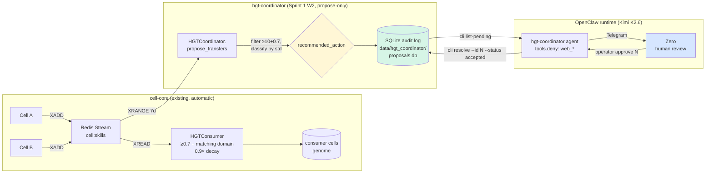

# HGT Coordinator — Quarantine Layer (Sprint 1 W2)

> **Status:** Shipped 2026-05-02. Layer is propose-only by design;
> automatic in-cell-core HGT remains untouched.
> **Reference:** `docs/audits/2026-05-02-cell-openclaw-brainstorm/99b_synthesis_v2.md` § Sprint 1.

## What this is

A second observation layer on top of the existing automatic HGT in
`packages/cell-core/cell_core/hgt/`. The in-cell-core layer keeps doing
its job (publish ≥0.7 + scope=Project skills to Redis Stream
`cell:skills`, consumers integrate them with 0.9× decay if domains
match). The coordinator runs OUTSIDE that layer, on a heartbeat
(default 7d window), aggregates per-skill statistics across cells, and
writes propose-only rows into a local SQLite audit log. The OpenClaw
agent (`hgt-coordinator`, model Kimi K2.6, `tools.deny=[web_search,
web_fetch, browser]`) reads the audit log and surfaces candidates for
human review.

**There is no auto-merge path.** The audit log is the source of truth;
operators resolve proposals via the CLI.

## Architecture



## Quarantine guarantees (verbatim)

Copied from `packages/cell-core/cell_core/hgt_coordinator/__init__.py`
to keep this doc and the source-of-truth docstring in lockstep:

1. **NO direct merge to consumer cells** (the existing automatic HGT
   consumer keeps its own ≥0.7 + matching-domain gate; this layer only
   writes to SQLite).
2. **The audit log is the source of truth** — operators resolve
   proposals manually via `mark_resolved`.
3. **Recovery:** if the OpenClaw agent (Kimi K2.6) misbehaves, set
   `agents.list[*].id == hgt-coordinator` to
   `"sandbox": {"mode": "off-disabled"}` in `~/.openclaw/openclaw.json`
   (or remove the entry entirely) and the propose-only python
   coordinator continues to populate the audit log without LLM
   reasoning. The audit log is canonical; the LLM ranking is
   decorative.

## Threshold justification

`≥10 total uses AND average confidence > 0.7` — settled in
brainstorm round 2 § "Q3 disagreement DeepSeek vs Codex/Gemini":

| LLM | Vote | Rationale |
|---|---|---|
| Codex | ≥10 + 0.7 | Sprint 1 should prioritize signal over volume — false positives at this stage damage operator trust. |
| Gemini | ≥10 + 0.7 | Aligned with Codex; bias toward fewer / higher-quality proposals during the propose-only phase. |
| DeepSeek | ≥5 + 0.6 | More proposals visible early lets the operator calibrate the system faster. |
| Final pick | **≥10 + 0.7** | Sprint 1 W2 is about safe defaults. Lowering thresholds is a Sprint 2 conversation once operator trust is established. |

`recommended_action` selection by confidence variance:

| std_confidence | action | meaning |
|---|---|---|
| < 0.15 | `propose` | Stable cross-cell pattern — surface to operator. |
| 0.15 – 0.25 | `defer` | Pattern exists but variance is medium — keep observing next cycle. |
| ≥ 0.25 | `reject` | Too noisy — do not surface unless explicitly requested. |

## Recovery procedure

If the OpenClaw agent goes off-rails (hallucinated proposals, repeated
escalation noise, accidental `resolve` with wrong status), the
operator has three escalation steps:

1. **Disable the agent** by editing `~/.openclaw/openclaw.json`:
   - Locate `agents.list[*].id == "hgt-coordinator"`.
   - Set `"sandbox": {"mode": "off-disabled"}` (or remove the entry).
   - Run `launchctl kickstart -k gui/$(id -u)/ai.openclaw.gateway` to
     reload the runtime. The python coordinator continues populating
     `proposals.db` on the heartbeat — no work is lost.
2. **Manual review queue** — open
   `data/hgt_coordinator/proposals.db` with any SQLite browser, run
   `SELECT * FROM proposals WHERE status='pending';` and resolve rows
   via `python -m cell_core.hgt_coordinator.cli resolve --id N --status
   {accepted|rejected|deferred} --by human:zero`.
3. **Stop the python coordinator** by removing it from any cron /
   OpenClaw heartbeat that calls it. Existing rows in the audit log
   remain readable; Sprint 2 may resume.

## OpenClaw configuration procedure

Edit `~/.openclaw/openclaw.json` to add the `hgt-coordinator` agent.
**Use python**, not `jq | bash` — the JSON quoting is too fragile per
Sprint 0 lessons.

```bash
cp ~/.openclaw/openclaw.json ~/.openclaw/openclaw.json.pre-hgt-coordinator-2026-05-02
python3 << 'PY'
import json, shutil
src = '/Users/nuzantara/.openclaw/openclaw.json.pre-hgt-coordinator-2026-05-02'
dst = '/Users/nuzantara/.openclaw/openclaw.json'
with open(src) as f: data = json.load(f)
new_agent = {
    "id": "hgt-coordinator",
    "workspace": "~/.openclaw/workspace-hgt",
    "model": {
        "primary": "openrouter/moonshotai/kimi-k2.6",
        "fallbacks": [
            "openrouter/qwen/qwen3-max",
            "deepseek/deepseek-reasoner",
            "ollama/qwen3.5:9b"
        ]
    },
    "heartbeat": {"every": "0"},
    "sandbox": {"mode": "off"},
    "tools": {"deny": ["web_search", "web_fetch", "browser"]}
}
data['agents']['list'] = [a for a in data['agents']['list'] if a.get('id') != 'hgt-coordinator']
data['agents']['list'].append(new_agent)
tmp = dst + '.tmp'
with open(tmp, 'w') as f: json.dump(data, f, indent=2)
with open(tmp) as f: json.load(f)  # validate roundtrip
shutil.move(tmp, dst)
print('OK')
PY
launchctl kickstart -k gui/$(id -u)/ai.openclaw.gateway
sleep 5
jq '.agents.list | map(.id)' ~/.openclaw/openclaw.json   # must include "hgt-coordinator"
```

`heartbeat.every="0"` keeps the agent **operator-triggered** for
Sprint 1 W2. A future PR can move it to a heartbeat schedule once the
audit log signal is calibrated.

## Out of scope (deferred to Sprint 2 / 3)

- **Auto-merge.** Explicit cicatrix-pattern: NO automation closes the
  loop. Human review is the final instance.
- **Bypass of the existing HGT consumer's domain filter** —
  coordinator proposes target cells already in the same domain.
- **PostgreSQL-backed audit log.** SQLite-local per ADR doctrine
  "JSONL canonical / SQLite per-machine" — see
  `docs/escalations/federation-bus.md`.
- **Per-handler ack of stream entries** — proposals are aggregated
  read-only from `XRANGE`, not consumed via consumer groups, so the
  outbox / ack story (cf. EventBus phase-3 cicatrix) does not apply
  here.

## File map

| Path | LOC | Role |
|---|---|---|
| `packages/cell-core/cell_core/hgt_coordinator/__init__.py` | 62 | Public API + quarantine doc |
| `packages/cell-core/cell_core/hgt_coordinator/proposal.py` | 78 | Frozen `Proposal` dataclass |
| `packages/cell-core/cell_core/hgt_coordinator/audit_log.py` | 294 | SQLite helpers (init, record, list, resolve) |
| `packages/cell-core/cell_core/hgt_coordinator/coordinator.py` | 350 | Stream observer + aggregator |
| `packages/cell-core/cell_core/hgt_coordinator/cli.py` | 240 | OpenClaw entry point |
| `packages/cell-core/cell_core/hgt_coordinator/__main__.py` | 14 | `python -m cell_core.hgt_coordinator` shim |
| `packages/cell-core/tests/test_hgt_coordinator.py` | 350 | 15 unit tests |
| `packages/cell-core/tests/test_hgt_coordinator_cli.py` | 120 | 4 CLI tests |
| `apps/openclaw-hgt-coordinator/AGENT_PROMPT.md` | — | Kimi K2.6 system role |
