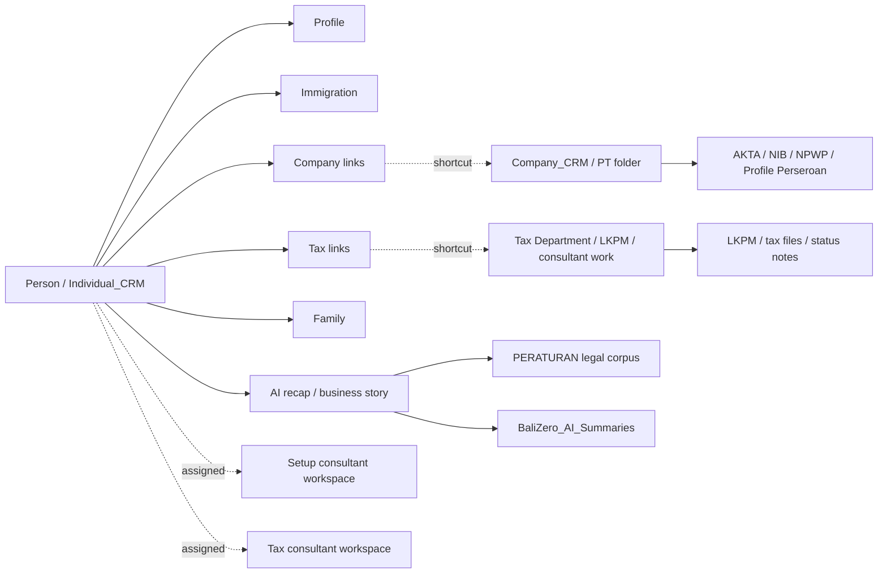

# Bali Zero Drive Map for Person-Centric CRM

Scanned from Google Drive on 2026-05-10 06:55 WITA from Pro.

Scope: `/BALI ZERO` canonical Drive folder `1hkOeV03YM5-sHbQhswYz809jsrnwC0At`.

This is a first operational map, not a destructive cleanup plan. It maps the visible top-level structure, the main CRM/team/tax patterns, and the workspace implications for `kita.balizero.com`.

## Executive Shape

The Drive already has the three faces discussed for the CRM:

- DB: structured CRM entities and live automation.
- Workspace: `kita.balizero.com`, where people should work from a person-centric view.
- Drive: file authority for client documents, company documents, tax evidence, team working folders, and legal/reference material.

The useful model is:



## Root Map

```text
/BALI ZERO
|-- BaliZero_AI_Summaries                    Google Sheet
|-- CRM
|-- TAX DEPARTMENT
|-- SETUP TEAM
|-- GARUDA
|-- MARKETING
|-- PERATURAN
|-- ARCHIVE                                  empty in sampled listing
`-- _DA_TRASHARE_                            contains many client-like folders
```

## CRM

```text
/BALI ZERO/CRM
|-- Individual_CRM
|-- Company_CRM
|-- Archive_CRM
|-- other
`-- Untitled spreadsheet
```

### Individual_CRM

Pattern observed:

```text
Individual_CRM/{client_id}_{person_name}
|-- 00_Profile
|-- 01_Immigration
|-- 02_Company
|-- 03_Tax
|-- 04_Family
`-- 99_Misc
```

Important finding: duplicate person folders are visible. Example:

- `11767_Caterina Falchero` appears twice.
- One version has only `00_Profile`.
- Another version has the complete template: `00_Profile`, `01_Immigration`, `02_Company`, `03_Tax`, `04_Family`, `99_Misc`.

This suggests folder creation automation can create partial duplicates or run twice. A safe dedupe workflow should be read-only first, then merge only after confirming by client id, person name, and content signature.

### Company_CRM

Pattern observed:

```text
Company_CRM/{PT company name}
|-- 00_AKTA
|-- 01_NIB
|-- 02_NPWP
|-- 03_Profile_Perseroan
`-- 99_Misc
```

Examples visible include many PT folders such as `PT Ruslana Media Consulting`, `PT Konsep Konstruksi Group`, `PT Kole International Trader`, `PT Kuat Solution Bali`, and many others.

### CRM other

Contains operational/master sheets and legacy/side folders:

```text
CRM/other
|-- Companies_Master.xlsx
|-- CRM_1023_Active_Clients_2026-03-25
|-- CRM_Soft_Deleted_To_Review_2026-03-25
|-- Company assignement
|-- list_client_11_03
|-- LIST CLIENTS
|-- Companies_DUPLICATI_Archivio.xlsx
|-- Company
|-- samples
`-- Individual_Damar
```

Implication: `other` is an intelligence source, but should not remain a hidden source of truth forever. Its sheets should be indexed and linked to CRM entities.

## Tax Department

```text
/BALI ZERO/TAX DEPARTMENT
|-- LKPM
|-- Members
|   |-- Dewa Ayu
|   |-- Veronika
|   |-- Angel
|   |-- Kadek
|   `-- Faisha
|-- Members
|   |-- Dewa Ayu
|   |-- Veronika
|   |-- Angel
|   |-- Kadek
|   `-- Faisha
|-- _Shared
|-- shortcuts: NA, DEA, Dewa Ayu
```

`LKPM` contains:

```text
LKPM
|-- LKPM Q1 2026
|-- SOP_LKPM_BaliZero.pdf
|-- LKPM_2025_BaliZero.pdf
|-- 2025_LKPM_Compliance_Blueprint.pdf
|-- End-to-End_LKPM_Submission_Workflow.mp4
`-- unnamed.jpg
```

Implication: tax work is already team-member oriented, but it should become shortcut-driven. Client folders should remain canonical in CRM, while Dewa/Ari/etc. receive shortcuts in their workspaces.

## Setup Team

```text
/BALI ZERO/SETUP TEAM
|-- TEAM
|   |-- Adit
|   |-- Anton
|   |-- Krishna
|   |-- Ari
|   |-- Surya
|   |-- Vino
|   |-- Rina
|   |-- Sahira
|   `-- JABATAN sheet
|-- KB
|   |-- CASES
|   |-- PROJECTS
|   |-- KBLI - PRESENTATION
|   |-- Bali_SLHS_2026_Blueprint.pdf
|   `-- SLHS_Brochure_BaliZero_2026.pdf
`-- UNITS INTELLIGENCE
    |-- BUSINESS INTELLIGENCE
    |-- IMMIGRATION INTELLIGENCE
    |-- PROPERTY INTELLIGENCE
    `-- 4TH POWER
```

Implication: setup team folders should become consultant desks. They should not own client files physically. They should receive assignment shortcuts into CRM person/company folders.

## Marketing and Garuda

```text
/BALI ZERO/MARKETING
|-- War Room
|-- Stories
|-- Members
|-- Members
`-- _Shared

/BALI ZERO/GARUDA
|-- published
|-- research
|-- drafts
|-- intelligence
|-- audio
|-- videos
`-- photos
```

Implication: marketing and Garuda are content/intelligence surfaces. They should consume sanitized CRM recaps, not raw client folders.

## Peraturan

`PERATURAN` is a legal/regulatory corpus. It includes a `list peraturan` spreadsheet, many PDF laws/regulations, and subfolders such as:

```text
PERATURAN
|-- list peraturan
|-- PERATURAN
|-- Perpres
|-- Permen
|-- PP
|-- PMK
`-- many PDF regulations
```

Visible examples include PP/PMK/Permen/Perpres documents, PP 28/2025 attachments, immigration, tax, labor, ATR/BPN, BKPM, POJK, and related law PDFs.

Implication: this is the source for AI explanations, risk labels, KBLI context, tax/regulatory recaps, and "why this document matters" cards.

## Workspace Design for kita.balizero.com

The UI should open from the person, not from company or tax.

Suggested person page layout:

```text
Person: 11767 Caterina Falchero
|-- Header
|   |-- identity, status, assigned consultants
|   `-- alerts: missing docs, deadlines, duplicates, stale folders
|-- Business Story
|   `-- AI recap built from Profile + Immigration + Company + Tax + docs
|-- Files
|   |-- Profile
|   |-- Immigration
|   |-- Companies
|   |-- Tax
|   |-- Family
|   `-- Misc
|-- Linked Companies
|   `-- company cards from Company_CRM folders
|-- Tax Timeline
|   `-- LKPM, SPT, NPWP, consultant notes
`-- Team Workspace
    |-- setup consultant shortcut location
    `-- tax consultant shortcut location
```

## Automations to Build

### 1. Drive Graph Index

Create a read-only graph index of Drive:

```text
drive_items(id, name, mime_type, parent_id, path, web_url, created_at, modified_at)
drive_edges(source_id, target_id, edge_type)
crm_drive_links(entity_type, entity_id, drive_item_id, confidence, source)
```

This lets the workspace show Drive as a navigable map without copying files.

### 2. Shortcut Orchestrator

When a person is assigned to a setup or tax consultant:

- ensure the canonical CRM folder exists;
- create a Drive shortcut inside the consultant folder;
- never copy files;
- record the shortcut id in DB;
- remove or archive shortcut when assignment closes.

Target pattern:

```text
SETUP TEAM/TEAM/Ari/_Active/{client_id}_{name} -> shortcut to CRM/Individual_CRM/{client_id}_{name}
TAX DEPARTMENT/Members/Dewa Ayu/_Active/{client_id}_{name} -> shortcut to CRM/Individual_CRM/{client_id}_{name}
```

### 3. Person-Centric Recaps

For each person, generate a short recap:

- identity and document status;
- linked companies and shareholder/director role when known;
- tax/LKPM status and consultant;
- missing documents;
- next deadlines;
- business story in plain language;
- evidence links back to Drive files.

Store it as a workspace card first. Optionally later write it back to Drive as:

```text
Individual_CRM/{client}/05_Intelligence/AI_Client_Brief
```

Do not create `05_Intelligence` automatically until the folder policy is approved.

### 4. Duplicate Detector

Read-only first:

- same client id + same normalized name;
- one folder complete, one partial;
- compare child folder names;
- produce a merge proposal;
- require human approval before moving files.

The 11767 pattern is the test case.

### 5. Regulatory Context Cards

Index `PERATURAN` into the RAG layer and expose only relevant cards inside the person/company view:

- "why this regulation matters";
- source PDF link;
- affected service: immigration, company setup, tax, property, LKPM;
- confidence and date.

## Gemini Pass Summary

Gemini agreed with the person-centric hub model and recommended:

- keep `Individual_CRM` as the master hub;
- keep `Company_CRM` as the physical source for PT files;
- use Drive shortcuts for company/tax/team links;
- treat team member folders as consultant desks, not file owners;
- add `AI_Client_Brief` style recaps;
- build duplicate detection before any cleanup;
- expose a relational visual map: `Person -> PT -> consultant -> tax/status`.

## Immediate Next Step

Do not reorganize Drive manually yet.

First implementation should be a read-only Drive graph scanner and a `kita.balizero.com` person page prototype that shows:

1. CRM person folder tree.
2. linked company folders.
3. assigned consultant shortcut targets.
4. AI recap.
5. duplicate warnings.

After that, run a pilot on 5 clients and only then enable shortcut creation.

## Additional Drive Passes - 2026-05-10

The user requested three more passes through folders and subfolders. These passes were read-only.

### Pass 1 - CRM Depth

Focused on `Individual_CRM` duplicates and one real `Company_CRM` folder.

Findings:

- `11767_Caterina Falchero` has at least two folders.
- The partial folder contains a real file: `passport_Caterina_Falchero.jpg`.
- The complete folder has the standard template, but several inner folders are empty.
- `01_Immigration` contains `Actual Visa` and `Previous Visa`, both empty in this sample.
- `02_Company` contains `AKTA`, `NIB`, `NPWP`, `Profile Perseroan`, empty in this sample.
- `03_Tax` contains `SPT company`, `SPT personal`, `LKPM reports`, `NPWP personal`, empty in this sample.
- `04_Family` and `99_Misc` are empty in this sample.

Important correction: duplicate cleanup must be a merge, not a delete. The partial folder may contain the real documents while the complete folder is only the intended template.

Company sample: `PT Ruslana Media Consulting`.

- `00_AKTA` contains many real PDFs and images, including dissolution/profile/power-of-attorney style documents and scanned pages.
- `03_Profile_Perseroan` contains `Profil Perseroan.pdf`.
- `01_NIB` and `02_NPWP` were empty in the sampled folder.
- `99_Misc` is not harmless: it contains person/shareholder subfolders and many mixed documents, including immigration PDFs, bank statements, photos, address text files, and company-related documents.

CRM implication: the future file classifier must inspect `99_Misc` and move or link documents into canonical subfolders only after type and entity confidence is high.

### Pass 2 - Tax and Setup Team Depth

Focused on team work folders and operational tax/setup folders.

Findings:

- Most `TAX DEPARTMENT/Members/*` folders sampled are empty.
- The newer `Dewa Ayu` tax member folder contains a Drive shortcut named `Dewa Ayu`.
- `LKPM/LKPM Q1 2026` contains shortcuts for team/member partitions:
  - `LKPM Q1 2026 (Angel)`
  - `LKPM Q1 2026 (Fasya)`
  - `LKPM Q1 2026 (Kadek)`
  - `LKPM Q1 2026 (DEWA AYU)`
- The same LKPM Q1 folder also contains two copies of `Indonesia's Village Investment Visa.pdf`.
- Most `SETUP TEAM/TEAM/*` folders sampled are empty.
- `SETUP TEAM/TEAM/Anton` contains a Google Doc named `llll`.
- `SETUP TEAM/KB/CASES` contains reference PDFs such as `Bali_Freelancer_Playbook_Visa_Tax_Strategy.pdf`, `Rent_Villa_UndertheRadar.pdf`, and broader Bali/human-capital PDFs.
- `SETUP TEAM/KB/PROJECTS` contains `Project_Kutuh_Villa.pdf`.
- `SETUP TEAM/KB/KBLI - PRESENTATION` contains `INSTRUCTIONS` and `PRESENTATIONS`.
- `UNITS INTELLIGENCE` subfolders sampled were empty.

Team implication: team member folders are already acting more like assignment surfaces than document repositories. This supports the shortcut-workspace model, but the current shortcut placement is inconsistent and should be generated by automation.

### Pass 3 - Marketing, Garuda, Peraturan, Trash Depth

Focused on content/intelligence branches and possible misplaced client folders.

Findings:

- `MARKETING/Stories` contains `Bali Waste Crisis.MOV`.
- Marketing member folders include names such as `Damar`, `Nina`, `Dea`, `Sahira`, but sampled folders are sparse.
- `GARUDA` subfolders sampled (`published`, `research`, `drafts`, `intelligence`) were empty.
- `PERATURAN` has useful internal hierarchy:
  - nested `PERATURAN` -> `PMK`, `PP`, `Permen`;
  - `Perpres` -> `2021`;
  - `Permen` -> `2024`, `2025`;
  - `PP` -> `2021`, `2025`;
  - `PMK` -> `2024`, `2025`.
- `_DA_TRASHARE_` contains client-like folders.
- Sample `client5468_Aleksei Aleksandrov_1777075666` contains the full person template:
  - `00_Profile`
  - `01_Immigration`
  - `02_Company`
  - `03_Tax`
  - `04_Family`
  - `99_Misc`
- Other sampled `_DA_TRASHARE_` client folders were empty.

Trash implication: `_DA_TRASHARE_` cannot be purged blindly. It may contain correctly structured client trees or stranded documents that should be compared against canonical `Individual_CRM` first.

## Updated Gemini Pass Summary

Gemini's second pass emphasized three practical corrections:

- deduplication must be merge-first because partial folders can contain the only real file;
- `99_Misc` and department folders need AI/OCR classification before the workspace can claim document completeness;
- `_DA_TRASHARE_` needs pre-purge recovery scanning because it contains client-like structures.

## Updated Implementation Priority

1. Build read-only Drive graph index.
2. Build duplicate detector with merge proposals, not automatic delete.
3. Build `_DA_TRASHARE_` recovery scanner before any cleanup.
4. Build document classifier for `99_Misc`, team folders, and misplaced files.
5. Only after those are reliable, enable consultant shortcut automation.
6. Then expose in `kita.balizero.com`:
   - canonical person folder status;
   - files found outside canonical locations;
   - duplicate folders;
   - trash/recovery candidates;
   - AI recap with evidence links.

## Tax Members Deep Dive - 2026-05-10

The user asked to go deeper into `TAX DEPARTMENT/Members`.

There are two visible `Members` folders under `TAX DEPARTMENT`.

Newer `Members` folder:

```text
TAX DEPARTMENT/Members
|-- Kadek                         empty
|-- Angel
|   `-- shortcut: NA
|-- Veronika                      empty
|-- Dewa Ayu
|   `-- shortcut: Dewa Ayu
`-- Faisha/Dea
    `-- shortcut: DEA
```

Older `Members` folder:

```text
TAX DEPARTMENT/Members
|-- Faisha                        empty
|-- Kadek                         empty
|-- Dewa Ayu                      empty
|-- Angel                         empty
`-- Veronika                      empty
```

Important correction: `Members` itself is mostly a shortcut layer, not the place where the real tax archive lives.

The useful tax content appears inside shortcut targets or adjacent historical folders:

- `Dewa Ayu` target contains many company folders, including `BIMALA`, `Ayouni Prima Bali PT`, `KLIENT RUSLANA`, `Antoine Gautier Bali PT`, `PT Health And Leisure Agency (1)`, `Nusa Futura Wan PT`, `TOTAL WOMAN BALI PT`, `RAWWY DIGITAL INDONESIA PT`, `RESILIENCY FITTNESS BALI PT`, `MAZO CONSULTING PT`, and `STONE REAL ESTATE PT`.
- `Dewa Ayu/BIMALA` contains real tax/company evidence: TIN card, certificate of registration, taxpayer account issuance letter, proof of receipt, and bank transaction PDFs.
- `Dewa Ayu/Ayouni Prima Bali PT` contains `Akses Coretax`, `Tax`, `Dokumen PT`, and a worksheet.
- `Dewa Ayu/KLIENT RUSLANA` contains `PT Vitality Develomoment Group`.
- `DEA` target contains company folders including `OCEAN CLOTHES AND SHOES PT`, `FOURAM ACTIVE WEAR PT`, `DYVO TRAVEL PT`, `BALI REALESTATE ABADI`, `NOEL LUX COSMETIC PT`, `SALES LAUNCH AND ORGANIZATION NETWORK PT`, `ZORRIN VIDEO PRODUCTION PT`, `RUDEN GROUP BALI PT`, `SUNNY SIDE PT`, and `SOHO VILLA BALI PT`.
- `DEA/OCEAN CLOTHES AND SHOES PT` contains `#TAX`, `AKTA`, person folders, `DOKUMEN`, `Profil Perseroan.pdf`, `Rincian PT.pdf`, Permata PDFs, and access text files.
- `DEA/FOURAM ACTIVE WEAR PT` contains `2025`, `2026`, `DOCUMENTS`, and `NPWP DIRECTOR.jpeg`.
- `DEA/DYVO TRAVEL PT` contains `Coretax Direktur`, `Tax`, `Dokumen`, a shortcut to `PT DYVO TRAVEL`, and `Akses Coretax ELINA NECHAIEVA.txt`.
- `LKPM Q1 2026 (DEWA AYU)` contains company folders with real approved LKPM PDFs. Samples checked: `PT Ventura Impact Positif` and `PT Ichnost West Sumbawa`.

Workspace implication:

`kita.balizero.com` should not treat `Members` as empty just because direct child folders are empty. It should resolve shortcuts and historical target folders, then show a tax consultant desk like:

```text
Tax consultant desk
|-- consultant: Dewa Ayu / DEA / Angel / Kadek / Veronika / Faisha
|-- assigned companies
|-- linked persons
|-- Coretax credentials/access docs
|-- LKPM submissions
|-- tax folders and evidence files
`-- missing canonical CRM links
```

Implementation implication:

The Drive graph index must store shortcut edges and resolved target folders. Without shortcut resolution, the CRM would incorrectly conclude that Tax `Members` is almost empty.
