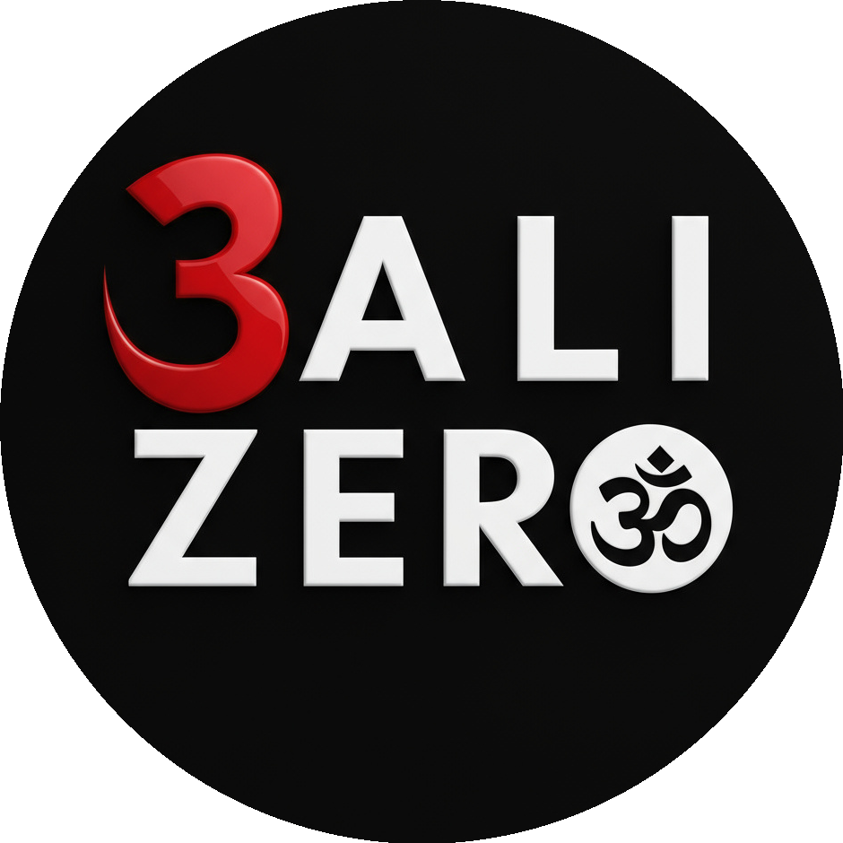

# Bali Zero — Price List 2026

**Effective:** 2026-01-01
**Version:** 2026.1
**Last updated:** 2026-05-06

> zero@balizero.com · +62 821 31 07 363 · balizero.com · Kerobokan, Bali, Indonesia

---

## Contents

- **I.** [Single Entry Visas](#single-entry-visas)
- **II.** [Multiple Entry Visas](#multiple-entry-visas)
- **III.** [KITAS Permits](#kitas-permits)
- **IV.** [KITAP + MERP](#kitap-permits)
- **V.** [Tax &amp; Accounting](#tax-accounting)
- **VI.** [Company Services](#company-services)
- **VII.** [Bali Zero Consultant Services](#consultant-services)
- **VIII.** [Other Process](#other-process)
- **IX.** [Urgent Processing](#urgent-processing)

---

## I. Single Entry Visas

_Short-stay visas for a single entry to Indonesia._

| Service                               | Description                                                                                                                                  | Price         |
| ------------------------------------- | -------------------------------------------------------------------------------------------------------------------------------------------- | ------------- |
| **C1 Tourism**                        | Tourist visa, single entry, valid 60 days. Cannot be used for work or business activities.                                                   | 2.300.000 IDR |
| **C1 Tourism — Extension (+60 days)** | Onshore extension of the C1 Tourism visa for an additional 60 days, processed at Indonesian immigration.                                     | 1.700.000 IDR |
| **C2 Business**                       | Business visa, single entry, valid 60 days. Suited to business meetings, negotiations and non-employment activities.                         | 3.600.000 IDR |
| **C18 Work Trial**                    | Single-entry visa for a 90-day work trial or skill assessment with an Indonesian employer prior to a full work permit.                       | 5.500.000 IDR |
| **C22A&amp;B Internship (60 Days)**   | Single-entry internship visa for foreign trainees, valid 60 days, sponsored by an Indonesian host organisation.                              | 4.800.000 IDR |
| **C22A&amp;B Internship (180 Days)**  | Single-entry internship visa for foreign trainees, valid 180 days, sponsored by an Indonesian host organisation.                             | 5.800.000 IDR |
| **C7A,B,C Music/Art**                 | Single-entry visa for performing artists, musicians and cultural workers visiting Indonesia for short-term events. Categories C7A, C7B, C7C. | 4.500.000 IDR |
| **C8A,B**                             | Single-entry visa for journalism and media activities (categories C8A, C8B), valid for short-term assignments in Indonesia.                  | 4.000.000 IDR |
| **C10 Speaker Visa**                  | Single-entry speaker visa for foreign nationals delivering talks, lectures or training sessions at events in Indonesia.                      | 3.500.000 IDR |
| **Bridging Visa**                     | Bridging visa to maintain legal stay during transition between immigration permits.                                                          | 3.500.000 IDR |

---

## II. Multiple Entry Visas

_Multi-entry visas for repeat travel._

| Service                                  | Description                                                                                                                                | Price          |
| ---------------------------------------- | ------------------------------------------------------------------------------------------------------------------------------------------ | -------------- |
| **D1 Tourism (1 Year)**                  | Multiple-entry tourist visa valid 1 year, allowing repeated visits with a maximum stay per entry as set by immigration.                    | 6.000.000 IDR  |
| **D1 Tourism (2 Years)**                 | Multiple-entry tourist visa valid 2 years, allowing repeated visits with a maximum stay per entry as set by immigration.                   | 8.000.000 IDR  |
| **D1 Tourism (5 Years)**                 | Multiple-entry tourist visa valid 5 years, allowing repeated visits with a maximum stay per entry as set by immigration.                   | 12.900.000 IDR |
| **D2 Business (1 Year)**                 | Multiple-entry business visa valid 1 year for business meetings and non-employment activities.                                             | 6.500.000 IDR  |
| **D2 Business (2 Years)**                | Multiple-entry business visa valid 2 years for business meetings and non-employment activities.                                            | 9.000.000 IDR  |
| **D12 Business Investigation (1 Year)**  | Multiple-entry business investigation visa valid 1 year, for investors and business representatives exploring opportunities in Indonesia.  | 7.500.000 IDR  |
| **D12 Business Investigation (2 Years)** | Multiple-entry business investigation visa valid 2 years, for investors and business representatives exploring opportunities in Indonesia. | 10.000.000 IDR |

---

## III. KITAS Permits

_Long-stay residence permits for foreign nationals._

| Service                                    | Description                                                                                                                                                | Price          |
| ------------------------------------------ | ---------------------------------------------------------------------------------------------------------------------------------------------------------- | -------------- |
| **Working KITAS (Altus/Onshore)**          | Standard work permit KITAS sponsored by an Indonesian employer. Onshore process via Altus, suited to candidates already in Indonesia.                      | 36.000.000 IDR |
| **Working KITAS (Offshore)**               | Standard work permit KITAS sponsored by an Indonesian employer. Offshore process for candidates outside Indonesia at time of application.                  | 34.500.000 IDR |
| **Working KITAS (Extend)**                 | Onshore extension of an existing Working KITAS sponsored by an Indonesian employer.                                                                        | 31.500.000 IDR |
| **Investor KITAS 2 Years (Altus/Onshore)** | Investor KITAS valid 2 years for shareholders of a PT PMA. Onshore process via Altus.                                                                      | 19.000.000 IDR |
| **Investor KITAS 2 Years (Offshore)**      | Investor KITAS valid 2 years for shareholders of a PT PMA. Offshore process for applicants outside Indonesia.                                              | 17.000.000 IDR |
| **Investor KITAS 2 Years (Extend)**        | Onshore extension of an existing 2-year Investor KITAS for shareholders of a PT PMA.                                                                       | 18.000.000 IDR |
| **Freelance E23 (Altus/Onshore)**          | Freelance E23 KITAS valid 6 months, sponsored work permit for independent professionals. Onshore process via Altus.                                        | 27.500.000 IDR |
| **Freelance E23 (Offshore)**               | Freelance E23 KITAS valid 6 months, sponsored work permit for independent professionals. Offshore process for applicants outside Indonesia.                | 25.800.000 IDR |
| **E33G Remote Worker (Altus/Onshore)**     | Digital nomad KITAS for remote workers employed by foreign companies. Onshore process via Altus, valid 1 year.                                             | 14.000.000 IDR |
| **E33G Remote Worker (Offshore)**          | Digital nomad KITAS for remote workers employed by foreign companies. Processed from outside Indonesia, valid 1 year.                                      | 13.000.000 IDR |
| **E33G Remote Worker (Extend)**            | Onshore extension of an existing E33G Remote Worker KITAS.                                                                                                 | 10.000.000 IDR |
| **Spouse 1 Year (Altus/Onshore)**          | Spouse KITAS valid 1 year for foreign spouses of Indonesian citizens or KITAS/KITAP holders. Onshore process via Altus.                                    | 13.500.000 IDR |
| **Spouse 1 Year (Offshore)**               | Spouse KITAS valid 1 year for foreign spouses of Indonesian citizens or KITAS/KITAP holders. Offshore process for applicants outside Indonesia.            | 11.000.000 IDR |
| **Spouse 1 Year (Extend)**                 | Onshore extension of an existing 1-year Spouse KITAS.                                                                                                      | 9.000.000 IDR  |
| **Spouse 2 Years (Altus/Onshore)**         | Spouse KITAS valid 2 years for foreign spouses of Indonesian citizens or KITAS/KITAP holders. Onshore process via Altus.                                   | 18.000.000 IDR |
| **Spouse 2 Years (Offshore)**              | Spouse KITAS valid 2 years for foreign spouses of Indonesian citizens or KITAS/KITAP holders. Offshore process for applicants outside Indonesia.           | 15.000.000 IDR |
| **Spouse 2 Years (Extend)**                | Onshore extension of an existing 2-year Spouse KITAS.                                                                                                      | 15.000.000 IDR |
| **Dependent 1 Year (Altus/Onshore)**       | Dependent KITAS valid 1 year for children or dependent family members of a primary KITAS/KITAP holder. Onshore process via Altus.                          | 13.500.000 IDR |
| **Dependent 1 Year (Offshore)**            | Dependent KITAS valid 1 year for children or dependent family members of a primary KITAS/KITAP holder. Offshore process for applicants outside Indonesia.  | 11.000.000 IDR |
| **Dependent 1 Year (Extend)**              | Onshore extension of an existing 1-year Dependent KITAS.                                                                                                   | 9.000.000 IDR  |
| **Dependent 2 Years (Altus/Onshore)**      | Dependent KITAS valid 2 years for children or dependent family members of a primary KITAS/KITAP holder. Onshore process via Altus.                         | 18.000.000 IDR |
| **Dependent 2 Years (Offshore)**           | Dependent KITAS valid 2 years for children or dependent family members of a primary KITAS/KITAP holder. Offshore process for applicants outside Indonesia. | 15.000.000 IDR |
| **Dependent 2 Years (Extend)**             | Onshore extension of an existing 2-year Dependent KITAS.                                                                                                   | 15.000.000 IDR |
| **Retirement (Altus/Onshore)**             | Retirement KITAS for foreign nationals 60+ meeting income requirements. Onshore process via Altus.                                                         | 16.000.000 IDR |
| **Retirement (Offshore)**                  | Retirement KITAS for foreign nationals 60+ meeting income requirements. Offshore process for applicants outside Indonesia.                                 | 14.000.000 IDR |
| **Retirement (Extend)**                    | Onshore extension of an existing Retirement KITAS.                                                                                                         | 10.000.000 IDR |
| **Born KITAS**                             | KITAS issuance for foreign children born in Indonesia, processed alongside the birth registration.                                                         | 9.000.000 IDR  |

---

## IV. KITAP + MERP

_Permanent residence permits and multiple re-entry permits._

| Service                     | Description                                                                                                                                   | Price          |
| --------------------------- | --------------------------------------------------------------------------------------------------------------------------------------------- | -------------- |
| **Investor KITAP + MERP**   | Permanent residence permit (KITAP) for investors holding shares in a PT PMA, bundled with Multiple Exit Re-entry Permit (MERP).               | 55.000.000 IDR |
| **Dependent KITAP + MERP**  | Permanent residence permit (KITAP) for dependent family members of a primary KITAP holder, bundled with Multiple Exit Re-entry Permit (MERP). | 33.000.000 IDR |
| **Retirement KITAP + MERP** | Permanent residence permit (KITAP) for retirees who have already held a Retirement KITAS, bundled with Multiple Exit Re-entry Permit (MERP).  | 45.000.000 IDR |
| **MERP 1 Year**             | Multiple Exit Re-entry Permit valid 1 year for KITAP holders, allowing repeated travel without losing residence status.                       | 4.000.000 IDR  |
| **MERP 2 Year**             | Multiple Exit Re-entry Permit valid 2 years for KITAP holders, allowing repeated travel without losing residence status.                      | 5.000.000 IDR  |

---

## V. Tax &amp; Accounting

_Monthly bookkeeping packages, annual filings and stand-alone fees._

### V.1 Monthly Tax Report — without LKPM &amp; Annual

| Service                                                                         | Description                                                                                                                                                                                                           | Price                         |
| ------------------------------------------------------------------------------- | --------------------------------------------------------------------------------------------------------------------------------------------------------------------------------------------------------------------- | ----------------------------- |
| **Monthly Tax Report — 0 to 50 transactions (without LKPM &amp; Annual)**       | Monthly bookkeeping and tax filing for companies with low transaction volume. See section V.4 for LKPM and Annual Tax stand-alone fees. _(Bank + Cash transactions combined. LKPM and Annual Tax NOT included.)_      | 1.800.000 IDR – 2.000.000 IDR |
| **Monthly Tax Report — 50 to 100 transactions (without LKPM &amp; Annual)**     | Monthly bookkeeping and tax filing for companies with moderate transaction volume. See section V.4 for LKPM and Annual Tax stand-alone fees. _(Bank + Cash transactions combined. LKPM and Annual Tax NOT included.)_ | 2.500.000 IDR – 3.000.000 IDR |
| **Monthly Tax Report — 100 to 200 transactions (without LKPM &amp; Annual)**    | Monthly bookkeeping and tax filing for companies with higher transaction volume. See section V.4 for LKPM and Annual Tax stand-alone fees. _(Bank + Cash transactions combined. LKPM and Annual Tax NOT included.)_   | 3.500.000 IDR – 4.500.000 IDR |
| **Monthly Tax Report — more than 200 transactions (without LKPM &amp; Annual)** | Monthly bookkeeping and tax filing for companies with high transaction volume. See section V.4 for LKPM and Annual Tax stand-alone fees. _(Bank + Cash transactions combined. LKPM and Annual Tax NOT included.)_     | 5.000.000 IDR                 |

### V.2 Monthly Tax Report — including LKPM + Annual

| Service                                                                       | Description                                                                                                                                                                                                                                               | Price         |
| ----------------------------------------------------------------------------- | --------------------------------------------------------------------------------------------------------------------------------------------------------------------------------------------------------------------------------------------------------- | ------------- |
| **Monthly Tax Report — 0 to 50 transactions (incl. LKPM &amp; Annual)**       | Bundled monthly bookkeeping, LKPM filing and Annual Tax report for companies with low transaction volume. _(Includes LKPM monthly contribution and Annual Tax report.)_                                                                                   | 2.500.000 IDR |
| **Monthly Tax Report — 50 to 100 transactions (incl. LKPM &amp; Annual)**     | Bundled monthly bookkeeping, LKPM filing and Annual Tax report for companies with moderate transaction volume. _(Includes LKPM monthly contribution and Annual Tax report.)_                                                                              | 3.500.000 IDR |
| **Monthly Tax Report — 100 to 200 transactions (incl. LKPM &amp; Annual)**    | Bundled monthly bookkeeping, LKPM filing and Annual Tax report for companies with higher transaction volume. _(Includes LKPM monthly contribution and Annual Tax report.)_                                                                                | 4.500.000 IDR |
| **Monthly Tax Report — more than 200 transactions (incl. LKPM &amp; Annual)** | Bundled monthly bookkeeping, LKPM filing and Annual Tax report for companies with high transaction volume. _(Includes LKPM monthly contribution and Annual Tax report. Companies with more than 200 transactions per year must use monthly bookkeeping.)_ | 6.500.000 IDR |

### V.3 Annual Basic Packages

| Service                    | Description                                                                                                                                                                                        | Price          |
| -------------------------- | -------------------------------------------------------------------------------------------------------------------------------------------------------------------------------------------------- | -------------- |
| **Annual Basic Package A** | Up to 100 transactions per year. Includes Income Tax calculation only and yearly Financial Report for Annual Tax submission. _(Does not include Annual Personal Tax report. No discount applies.)_ | 6.000.000 IDR  |
| **Annual Basic Package B** | 100-200 transactions per year. Income Tax only + yearly Financial Report. _(Does not include Annual Personal Tax report. No discount applies.)_                                                    | 9.000.000 IDR  |
| **Annual Basic Package C** | Up to 100 transactions per year. Income Tax + PPH 21 OR PPH Sewa (choose one) + yearly Financial Report. _(Does not include Annual Personal Tax report. No discount applies.)_                     | 12.000.000 IDR |
| **Annual Basic Package D** | 100-200 transactions per year. Income Tax + PPH 21 OR PPH Sewa (choose one) + yearly Financial Report. _(Does not include Annual Personal Tax report. No discount applies.)_                       | 15.000.000 IDR |
| **Annual Company ZERO**    | Yearly Financial Report only — for dormant companies with no transactions. _(No transactions in or out.)_                                                                                          | 3.000.000 IDR  |

### V.4 Annual &amp; Compliance Stand-alone Fees

| Service                              | Description                                                                                                                                                  | Price         |
| ------------------------------------ | ------------------------------------------------------------------------------------------------------------------------------------------------------------ | ------------- |
| **LKPM Yearly Report**               | Stand-alone yearly LKPM (investment realisation) report submitted to BKPM, required for all PT PMA companies.                                                | 4.000.000 IDR |
| **Annual Tax Company**               | Stand-alone Annual Corporate Tax report (SPT Tahunan PPh Badan) for Indonesian companies.                                                                    | 4.000.000 IDR |
| **Annual Tax Personal**              | Stand-alone Annual Personal Tax report (SPT Tahunan PPh Orang Pribadi) for individual taxpayers. _(Per person.)_                                             | 1.000.000 IDR |
| **Annual Tax Personal (additional)** | Stand-alone Annual Personal Tax report for additional persons beyond the first taxpayer in the same engagement. _(Each additional person beyond the first.)_ | 1.500.000 IDR |

---

## VI. Company Services

_PT PMA setup, virtual office and corporate amendments._

| Service                               | Description                                                                                                                                                                                      | Price                      |
| ------------------------------------- | ------------------------------------------------------------------------------------------------------------------------------------------------------------------------------------------------ | -------------------------- |
| **New Company (PT PMA)**              | Full incorporation of a new Indonesian foreign-owned limited company (PT PMA), including notarial deed, BKPM/OSS registration and tax ID issuance.                                               | 20.000.000 IDR             |
| **Virtual Office**                    | Virtual office address for company registration and correspondence, suited to clients without dedicated commercial premises. _(Only for clients without their own commercial premises.)_         | 5.000.000 IDR              |
| **Akta Perubahan (Revision Company)** | Notarial amendment deed (Akta Perubahan) for an existing Indonesian company. Pricing depends on scope of changes. _(Required when changing company address, directors, or business activities.)_ | Depend (Contact for quote) |

---

## VII. Bali Zero Consultant Services

_Compliance and registration fees handled by Bali Zero._

| Service                                | Description                                                                                                                                               | Price                         |
| -------------------------------------- | --------------------------------------------------------------------------------------------------------------------------------------------------------- | ----------------------------- |
| **Close PMA Company**                  | Full closure and deregistration of an Indonesian foreign-owned limited company (PT PMA), including notarial deed, BKPM and tax authority deregistration.  | 6.000.000 IDR – 7.500.000 IDR |
| **NPWPD Registration**                 | Local tax registration (Nomor Pokok Wajib Pajak Daerah) at the regency or city tax office, required per business location in Indonesia. _(Per location.)_ | 2.500.000 IDR                 |
| **BPJS Employee (Tenaga Kerja)**       | Registration with BPJS Ketenagakerjaan, the mandatory Indonesian social security scheme for employees covering accident, old-age and pension benefits.    | 2.500.000 IDR                 |
| **BPJS Insurance (Kesehatan)**         | Registration with BPJS Kesehatan, the mandatory Indonesian national health insurance scheme.                                                              | 2.500.000 IDR                 |
| **NPWP Personal + Coretax Activation** | Personal Indonesian tax ID (NPWP) issuance with activation on the Coretax platform. _(Per person.)_                                                       | 1.000.000 IDR                 |
| **Update Data / Coretax Activation**   | Update of taxpayer data (email, phone number, etc.) or stand-alone Coretax activation for an existing NPWP.                                               | 1.000.000 IDR                 |
| **EFIN Application**                   | Application for Electronic Filing Identification Number (EFIN) required to file taxes electronically with the Indonesian tax authority.                   | 1.000.000 IDR                 |

---

## VIII. Other Process

_Passports, identity documents and miscellaneous immigration filings._

| Service                                              | Description                                                                                                                                                     | Price         |
| ---------------------------------------------------- | --------------------------------------------------------------------------------------------------------------------------------------------------------------- | ------------- |
| **Reset Molina**                                     | Reset of immigration record on the Molina (immigration) database, often needed after data inconsistencies. _(Plus 400k urgent)_                                 | 1.000.000 IDR |
| **SKCK**                                             | Police clearance certificate (Surat Keterangan Catatan Kepolisian), often required for visa renewals and certain employment processes.                          | 2.000.000 IDR |
| **Mutation Passport**                                | Update of passport details on existing immigration permits after a passport renewal. _(Plus 350k urgent)_                                                       | 500.000 IDR   |
| **Mutation Address**                                 | Update of registered address on existing immigration permits.                                                                                                   | 500.000 IDR   |
| **Electronic Passport 5 Years**                      | Indonesian electronic passport (e-passport) issuance for 5-year validity.                                                                                       | 2.200.000 IDR |
| **Electronic Passport 10 Years**                     | Indonesian electronic passport (e-passport) issuance for 10-year validity.                                                                                      | 2.700.000 IDR |
| **Passport 5 Years**                                 | Indonesian standard passport issuance for 5-year validity.                                                                                                      | 1.300.000 IDR |
| **Passport 10 Years**                                | Indonesian standard passport issuance for 10-year validity.                                                                                                     | 2.200.000 IDR |
| **Domicilie Letter**                                 | Domicile letter (Surat Keterangan Domisili) issued by the local authority confirming the residential address.                                                   | 1.500.000 IDR |
| **SKTT**                                             | Temporary residence certificate (Surat Keterangan Tempat Tinggal) issued by the local civil registration office, required for KITAS holders.                    | 1.500.000 IDR |
| **Cancel RPTKA**                                     | Cancellation of an existing RPTKA (foreign worker utilisation plan) at the Ministry of Manpower.                                                                | 1.000.000 IDR |
| **Cancel Wajib Lapor**                               | Cancellation of mandatory employer reporting (Wajib Lapor Ketenagakerjaan) at the Ministry of Manpower.                                                         | 1.000.000 IDR |
| **EPO (Exit Permit Only)**                           | Exit Permit Only (EPO) for KITAS or KITAP holders permanently leaving Indonesia and surrendering their stay permit. _(Plus 300k urgent)_                        | 700.000 IDR   |
| **ERP (Exit Re-entry Permit)**                       | Single-use Exit Re-entry Permit (ERP) for KITAS holders travelling abroad and returning before permit expiry. _(Plus 500k urgent)_                              | 800.000 IDR   |
| **Mutation Address 2 Kanim**                         | Update of registered address requiring inter-Kanim (immigration office) transfer.                                                                               | 1.000.000 IDR |
| **Created Molina Express**                           | Express creation of immigration record on the Molina (immigration) database.                                                                                    | 500.000 IDR   |
| **Lapor Lahir (Under)**                              | Birth report registration for foreign nationals born in Indonesia, filed within the standard window. _(Under 60 days (Kanim NGR) / Under 90 days (Kanim DPS).)_ | 2.000.000 IDR |
| **Lapor Lahir (Up)**                                 | Birth report registration for foreign nationals born in Indonesia, filed after the standard window. _(Above 60 days (Kanim NGR) / Above 90 days (Kanim DPS).)_  | 4.000.000 IDR |
| **Process IMTA &amp; RPTKA Only (12 Months)**        | Stand-alone processing of IMTA and RPTKA work permit documents, valid for 12 months.                                                                            | 3.500.000 IDR |
| **Process IMTA &amp; RPTKA Only (6 Months Kebawah)** | Stand-alone processing of IMTA and RPTKA work permit documents, valid for 6 months or less.                                                                     | 6.000.000 IDR |
| **Driving License**                                  | Indonesian driving license (SIM) issuance for foreign nationals.                                                                                                | 1.600.000 IDR |

---

## IX. Urgent Processing

_Express processing tiers for time-sensitive filings._

| Service           | Description                                                                        | Price         |
| ----------------- | ---------------------------------------------------------------------------------- | ------------- |
| **Urgent 1 Hari** | Urgent processing surcharge for 1-day turnaround on eligible immigration services. | 3.000.000 IDR |
| **Urgent 2 Hari** | Urgent processing surcharge for 2-day turnaround on eligible immigration services. | 2.500.000 IDR |
| **Urgent 3 Hari** | Urgent processing surcharge for 3-day turnaround on eligible immigration services. | 1.000.000 IDR |

---

## Get in touch

- Website: <https://balizero.com>
- Email: <zero@balizero.com>
- WhatsApp: [+62 821 31 07 363](https://wa.me/628213107363)
- Office: Kerobokan, Bali, Indonesia
