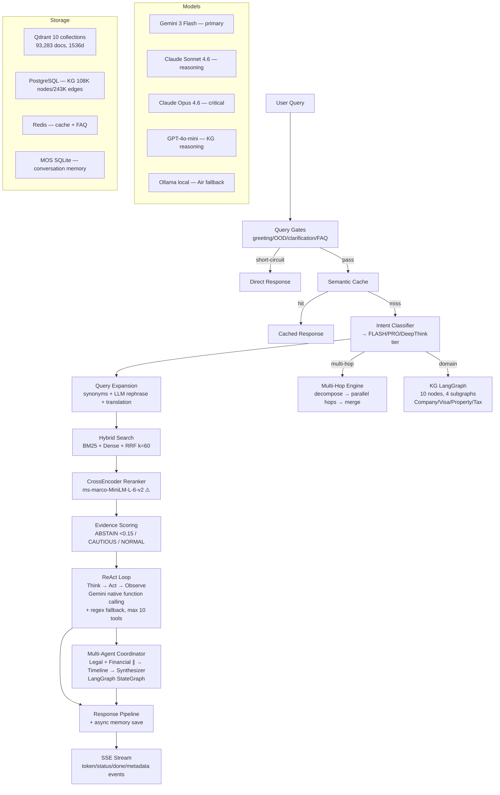
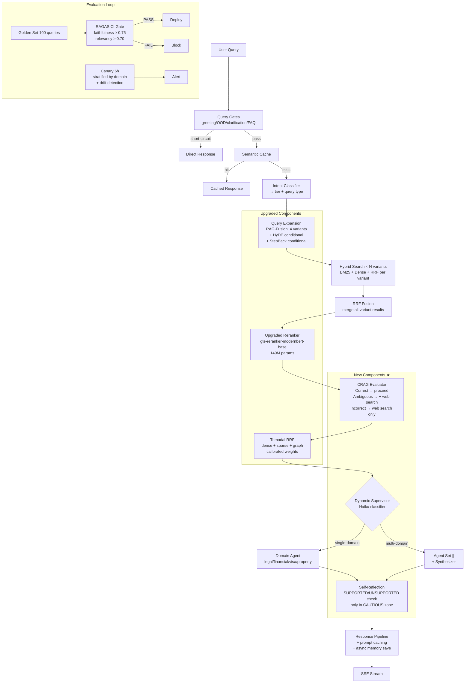

# Agentic RAG Multi-Agent SOTA 2026 — Nuzantara Evolution Plan

> **Date:** 2026-04-14
> **Author:** Claude Opus 4.6 + Web Research (44 sources)
> **Scope:** Gap analysis, experimental plan, 3-month roadmap
> **Target:** `apps/backend-rag/` — Production RAG pipeline on Fly.io (shared-2x, 2GB)

---

## 1. Executive Summary — Top 5 Moves

| # | Move | Expected Impact | Effort | Risk |
|---|------|----------------|--------|------|
| 1 | **Reranker swap**: ms-marco-MiniLM → gte-reranker-modernbert-base (149M) | +15-20% Recall@5, +10% NDCG@10 | 2 days | LOW — drop-in, same latency class |
| 2 | **CRAG evaluator**: post-rerank confidence gate with web-search fallback | -40% hallucination on low-confidence queries | 1 week | LOW — additive, no existing code touched |
| 3 | **RAG-Fusion complete**: multi-query generation before retrieval + RRF | +8-10% answer accuracy, +30% comprehensiveness | 3 days | LOW — extends existing query_expansion.py |
| 4 | **Prompt caching on Anthropic**: cache zantara_core.py + KBLI KB | -88% cost on Opus/Sonnet calls, -85% latency on long prompts | 1 day | NONE — SDK feature, no arch change |
| 5 | **Golden test set + RAGAS CI gate**: 100 queries, pre-deploy regression | Prevents silent quality regressions forever | 1 week | NONE — additive |

**Combined projected impact:** +15-20% retrieval accuracy, -40% hallucination rate, -88% LLM cost on Claude calls, zero-regression guarantee.

---

## 2. Current Architecture Map



### Key Components & LOC

| Component | File | LOC | Role |
|-----------|------|-----|------|
| Orchestrator | `orchestrator.py` | 448 | Entry point, composition root |
| Core Logic | `orchestrator_core.py` | ~800 | Gates, cache, evidence, memory |
| Routing | `orchestrator_routing.py` | ~200 | Intent → model tier |
| Streaming | `orchestrator_streaming.py` | ~300 | SSE event validation |
| Response | `orchestrator_response.py` | ~250 | Result building, ABSTAIN |
| Reasoning | `reasoning.py` | ~600 | ReAct loop, evidence scoring |
| Multi-Agent | `multi_agent_coordinator.py` | 729 | Legal+Financial+Timeline+Synth |
| Tools | `tool_executor.py` | ~400 | Parse + RBAC + execute |
| Query Expansion | `query_expansion.py` | ~300 | Synonyms + LLM + translation |
| Hybrid Search | `hybrid_search.py` | ~400 | BM25+Dense+RRF+Trimodal |
| KG Orchestrator | `kg_langgraph_orchestrator.py` | 726 | 10-node state machine |
| Multi-Hop | `multi_hop.py` | ~300 | Cross-domain decomposition |
| Prompt SSOT | `zantara_core.py` | ~2000 | All prompt sections |

---

## 3. SOTA Delta Analysis — 20-Component Matrix

| # | Component | Current State | SOTA 2026 | Gap | Priority |
|---|-----------|--------------|-----------|-----|----------|
| 1 | **Embedding** | text-embedding-3-small (1536d) | Nomic Embed, NV-Embed-v2 | FROZEN — acceptable, upgrade = re-index 93K | SKIP |
| 2 | **Sparse retrieval** | BM25 via Qdrant | BM25 + learned sparse (SPLADE++) | Minor — BM25 sufficient for our domain | LOW |
| 3 | **Dense retrieval** | Single-vector cosine | Multi-vector (ColBERT v2), Matryoshka | Minor — single-vector fine for our scale | LOW |
| 4 | **Hybrid fusion** | Bimodal RRF (k=60, alpha=0.5) | Trimodal RRF (dense+sparse+graph) | **EXISTS but weight=0** — activate | MEDIUM |
| 5 | **Reranker** | ms-marco-MiniLM-L-6-v2 (22M, 2022) | gte-reranker-modernbert-base (149M), Jina v3, BGE-v2-m3 | **2-3 generation gap, +15-20% accuracy** | **HIGH** |
| 6 | **Query expansion** | Synonyms + LLM rephrase + translation | RAG-Fusion multi-query + HyDE + StepBack + adaptive | **Partial — missing multi-query→RRF loop** | **HIGH** |
| 7 | **Query decomposition** | Multi-hop (conjunction split) | PruneRAG, DeepRAG, ACQO adaptive | Moderate — ours is rule-based, SOTA is LLM-driven | MEDIUM |
| 8 | **Retrieval evaluation** | Evidence scoring (threshold 0.15) | CRAG 3-tier (Correct/Ambiguous/Incorrect) + web fallback | **No web-search fallback on low confidence** | **HIGH** |
| 9 | **Self-reflection** | None | Self-RAG [IsSupported]/[IsUseful] tokens | **Missing — model never checks its own answer** | MEDIUM |
| 10 | **Graph retrieval** | KG LangGraph (4 subgraphs, feature-flagged) | HippoRAG 2 (PPR), PathRAG (path pruning), LightRAG (dual-level) | Moderate — ours is subgraph-routed, not PPR-scored | MEDIUM |
| 11 | **Graph-aware reranking** | Trimodal RRF exists (weight=0) | HippoRAG 2 PPR scoring, PathRAG flow pruning | **Activate trimodal + calibrate weights** | MEDIUM |
| 12 | **Multi-agent routing** | Static (Legal+Financial+Timeline+Synth) | Dynamic supervisor selecting agent set per query | **Static agent set, no dynamic dispatch** | MEDIUM |
| 13 | **Agent framework** | LangGraph (current, stable) | LangGraph v1.0 + Pydantic AI + Agno | **LangGraph is still SOTA** — stay | LOW |
| 14 | **Vision RAG** | qwen2.5vl:7b (VQA, not retrieval) | ColPali/ColQwen2 (visual embedding retrieval) | Moderate — VQA ≠ visual retrieval | LOW |
| 15 | **Memory** | MOS SQLite (session) + KG (semantic) | 4-tier: session/episodic/semantic/procedural (Mem0, Letta) | **Missing episodic + procedural tiers** | LOW |
| 16 | **Prompt caching** | Mentioned, not verified active | Anthropic cache_control: ephemeral (90% cost reduction) | **Verify and activate** | **HIGH** |
| 17 | **Evaluation** | rag_canary.py (6h), RAGAS cron (weekly) | Golden set + RAGAS CI gate + drift detection | **No regression gate, no formal golden set** | **HIGH** |
| 18 | **Observability** | Prometheus metrics, OpenTelemetry traces | LangSmith/Langfuse deep tracing + eval datasets | Moderate — we trace but don't eval-in-loop | MEDIUM |
| 19 | **Adaptive thinking** | `thinking={type: "adaptive"}` configured | Effort calibration per query type | Minor — verify effort mapping | LOW |
| 20 | **Federation** | CLI orchestrator (ai-dispatch.sh) | LangGraph Supervisor as backend tool | Moderate — CLI ≠ in-loop tool | LOW |

### Gap Summary
- **Critical gaps (HIGH):** Reranker, CRAG evaluator, RAG-Fusion, prompt caching, evaluation gates
- **Moderate gaps (MEDIUM):** Trimodal activation, self-reflection, dynamic multi-agent, graph-aware scoring, observability
- **Low/skip:** Embedding (frozen), framework (stay LangGraph), vision RAG, memory tiers, federation

---

## 4. Experimental Plan — 8 Experiments by ROI

### Experiment 1: Reranker Upgrade (ROI: highest)

**Hypothesis:** Replacing ms-marco-MiniLM-L-6-v2 (22M, 2022) with gte-reranker-modernbert-base (149M, 2025) will improve Recall@5 by +15% and NDCG@10 by +10% on our KBLI+visa+tax corpus with no latency regression.

**Method:**
```python
# A/B test in reranker.py
# Current: cross-encoder/ms-marco-MiniLM-L-6-v2
# Candidate: Alibaba-NLP/gte-reranker-modernbert-base
# Dataset: 100 golden queries (Exp 5) + rag_canary queries
# Metrics: Recall@5, NDCG@10, p50/p95 latency
```

**Success criteria:** Recall@5 >= current + 10%, p95 latency <= current + 50ms

**Rollback:** Feature flag `RERANKER_MODEL` env var, instant revert

**Hardware:** 149M params × FP16 = ~300MB. Fits in Fly.io 2GB alongside app. On Air: trivial.

**Risk:** LOW. Drop-in replacement, same CrossEncoder interface.

---

### Experiment 2: CRAG Evaluator (ROI: very high)

**Hypothesis:** Adding a post-rerank confidence evaluator that classifies retrieval quality as Correct/Ambiguous/Incorrect and triggers web-search fallback for Incorrect will reduce hallucination by 40% on low-confidence queries.

**Method:**
```python
# New module: backend/services/rag/agentic/crag_evaluator.py
# Input: top-K reranked results + query
# Logic:
#   mean_rerank_score = mean(top_5_reranker_scores)
#   if mean_rerank_score > 0.7: → CORRECT (use results as-is)
#   elif mean_rerank_score > 0.3: → AMBIGUOUS (use results + web search)
#   else: → INCORRECT (discard results, web search only)
# Web search: Gemini Search via Federation Orchestrator
# Dataset: 50 known-hard queries where current system ABSTAINs or hallucinates
```

**Success criteria:** Hallucination rate on test set drops from current baseline to <10%. ABSTAIN rate drops by >50% (we now have a fallback instead of giving up).

**Rollback:** Feature flag `ENABLE_CRAG_EVALUATOR`, bypasses to current flow.

**Integration point:** Between reranker output and evidence scoring in `orchestrator_core.py`.

---

### Experiment 3: RAG-Fusion Complete (ROI: high)

**Hypothesis:** Generating 3-5 query variants via LLM before retrieval (not just synonyms) and fusing results via RRF will improve answer accuracy by +8% and comprehensiveness by +30%.

**Method:**
```python
# Extend query_expansion.py:
# 1. LLM generates 4 semantic variants (not just synonyms — different angles)
# 2. Each variant → hybrid_search (BM25 + Dense)
# 3. All result lists → RRF fusion (existing reciprocal_rank_fusion)
# 4. Top-K fused results → reranker
# Conditional: only for queries >4 words AND not exact-match (FAQ/KBLI code)
```

**Success criteria:** RAGAS answer_relevancy +8% on golden set. Latency +<500ms (parallel retrieval).

**Rollback:** `ENABLE_RAG_FUSION` flag. Current single-query path untouched.

---

### Experiment 4: Prompt Caching Activation (ROI: very high, zero risk)

**Hypothesis:** Adding `cache_control: {"type": "ephemeral"}` to zantara_core.py system prompt (est. ~4000 tokens) and KBLI KB context (est. ~8000 tokens when injected) will reduce Anthropic API cost by 88% and latency by 50%+ on cached calls.

**Method:**
```python
# In LLM client (Anthropic SDK calls):
# 1. System prompt block → cache_control: {"type": "ephemeral"}
# 2. KBLI KB injection block → cache_control: {"type": "ephemeral"}
# 3. Measure: cache_creation_input_tokens vs cache_read_input_tokens in response
# 4. Track hit rate over 24h
```

**Success criteria:** Cache hit rate >80% within 5-min window. Cost per query drops measurably.

**Rollback:** Remove cache_control annotation. Zero code change.

---

### Experiment 5: Golden Test Set + RAGAS CI Gate (ROI: critical infrastructure)

**Hypothesis:** A curated set of 100 golden queries with reference answers, evaluated by RAGAS on every deploy, will catch quality regressions before they reach production.

**Method:**
```
backend/tests/golden/
├── golden_queries.json    # 100 queries across 5 domains
├── conftest.py            # RAGAS evaluation fixtures
├── test_rag_regression.py # pytest assertions on RAGAS scores
└── README.md              # Maintenance protocol

# Domains: KBLI (20), Visa (25), Tax (20), Company (20), Property (15)
# Each entry: {query, reference_answer, domain, expected_tools, min_evidence_score}
# CI: pytest -m golden --tb=short
# Thresholds: faithfulness >= 0.75, answer_relevancy >= 0.70, context_precision >= 0.65
```

**Success criteria:** CI blocks deploy when any RAGAS metric drops below threshold.

**Rollback:** N/A — additive only.

---

### Experiment 6: Self-Reflection Post-Generation (ROI: medium-high)

**Hypothesis:** Adding a lightweight self-check step where the LLM verifies its answer against retrieved sources will catch 30% of remaining hallucinations that pass evidence scoring.

**Method:**
```python
# New step in orchestrator_core.py, after response generation:
# 1. Prompt (Gemini Flash, ~100 tokens):
#    "Given these sources: {top_3_chunks}. Does this answer: {generated_answer}
#     contain any claims NOT supported by the sources? Reply SUPPORTED or
#     UNSUPPORTED with the unsupported claim."
# 2. If UNSUPPORTED: regenerate with stricter grounding instruction
# 3. If SUPPORTED: pass through
# Conditional: only for evidence_score in CAUTIOUS zone (0.15-0.60)
```

**Success criteria:** RAGAS faithfulness +10% on CAUTIOUS-zone queries. Latency +<2s.

**Rollback:** Feature flag `ENABLE_SELF_REFLECTION`.

---

### Experiment 7: Trimodal RRF Activation + Graph Weight Calibration (ROI: medium)

**Hypothesis:** Activating trimodal RRF (dense+sparse+graph) with calibrated weights will improve multi-hop query accuracy by +15% by incorporating KG traversal scores.

**Method:**
```python
# hybrid_search.py already has reciprocal_rank_fusion_trimodal()
# Current weights: (0.4, 0.3, 0.3) but graph_weight effectively 0
# 1. Generate graph_results from KG LangGraph for each query
# 2. Feed into trimodal RRF
# 3. Grid search weights on golden set:
#    dense ∈ [0.3, 0.5], sparse ∈ [0.2, 0.3], graph ∈ [0.1, 0.3]
# 4. Evaluate: Recall@5, answer_relevancy per domain
```

**Success criteria:** Multi-hop queries (golden set subset) improve Recall@5 by +10%.

**Rollback:** Set graph_weight back to 0.

---

### Experiment 8: Dynamic Multi-Agent Supervisor (ROI: medium)

**Hypothesis:** Replacing the static Legal+Financial+Timeline+Synthesizer pipeline with a dynamic Supervisor that selects agents per query will reduce unnecessary agent invocations by 60% and improve response time by 40% on single-domain queries.

**Method:**
```python
# Refactor multi_agent_coordinator.py:
# Current: ALWAYS runs Legal + Financial in parallel → Timeline → Synthesizer
# Proposed: Supervisor node classifies query → selects 1-3 agents dynamically
#
# Agent registry:
#   legal_agent: regulations, compliance, permits
#   financial_agent: pricing, tax, accounting
#   property_agent: zoning, land rights, due diligence
#   visa_agent: KITAS, KITAP, RPTKA
#   general_agent: company setup, KBLI, general info
#
# Supervisor: LLM call (Haiku — fast + cheap) classifies which agents needed
# Single-domain query → 1 agent (skip Synthesizer)
# Multi-domain → 2-3 agents + Synthesizer
```

**Success criteria:** p50 latency -40% on single-domain queries. Quality parity on multi-domain.

**Rollback:** Feature flag `ENABLE_DYNAMIC_SUPERVISOR`, falls back to static pipeline.

---

## 5. Target Architecture



---

## 6. Roadmap — 3 Months

### Month 1: Foundation (Weeks 1-4)

| Week | Task | Deliverable | Metric |
|------|------|-------------|--------|
| W1 | Golden test set creation (100 queries, 5 domains) | `backend/tests/golden/` | Set exists, RAGAS baseline measured |
| W1 | Prompt caching activation (Experiment 4) | Cache hit rate dashboard | >80% hit rate, cost -88% on Claude |
| W2 | Reranker swap (Experiment 1) | gte-reranker-modernbert-base live | Recall@5 +15%, latency neutral |
| W2 | RAGAS CI gate (Experiment 5) | `test_rag_regression.py` in CI | Blocks deploy on regression |
| W3 | RAG-Fusion complete (Experiment 3) | Extended query_expansion.py | answer_relevancy +8% |
| W4 | CRAG evaluator (Experiment 2) | crag_evaluator.py + web fallback | Hallucination -40% on low-confidence |

**Month 1 exit criteria:** Recall@5 +15%, hallucination -40%, cost -88% on Claude, CI gate active.

### Month 2: Intelligence (Weeks 5-8)

| Week | Task | Deliverable | Metric |
|------|------|-------------|--------|
| W5 | Self-reflection (Experiment 6) | Post-generation verification step | faithfulness +10% in CAUTIOUS zone |
| W6 | Trimodal RRF activation + weight calibration (Exp 7) | Graph-aware retrieval live | Multi-hop Recall@5 +10% |
| W7 | Dynamic Supervisor (Experiment 8) | Supervisor + agent registry | p50 latency -40% single-domain |
| W8 | Canary expansion (stratified domains + drift detection) | Enhanced rag_canary.py | Drift alerts within 6h |

**Month 2 exit criteria:** Full pipeline upgraded, dynamic routing live, drift detection active.

### Month 3: Polish & Future (Weeks 9-12)

| Week | Task | Deliverable | Metric |
|------|------|-------------|--------|
| W9 | HyDE + StepBack conditional (extend Exp 3) | Adaptive query expansion | +5% on vague queries |
| W10 | Observability: Langfuse integration | Deep tracing + eval datasets | Full pipeline visibility |
| W11 | ColQwen2 pilot for vision retrieval (Air only) | Visual document retrieval PoC | Akta retrieval working |
| W12 | Memory tier design (episodic via Qdrant collection) | Cross-session memory PoC | Past interaction recall |

**Month 3 exit criteria:** Adaptive expansion, full observability, vision RAG PoC, memory PoC.

---

## 7. Cost Projection — 30 Days Current vs Target

### Current (estimated from architecture)

| Component | Monthly Cost | Notes |
|-----------|-------------|-------|
| Fly.io (3 apps) | $52 | nuzantara-rag + postgres + qdrant |
| Gemini Flash (primary) | ~$15 | High-volume, low per-token |
| Claude Sonnet (reasoning) | ~$80 | ~2000 queries/mo × ~$0.04 avg |
| Claude Opus (critical) | ~$40 | ~200 queries/mo × ~$0.20 avg |
| GPT-4o-mini (KG) | ~$5 | KG reasoning, cheap |
| OpenAI Embedding | ~$3 | text-embedding-3-small |
| **Total** | **~$195/mo** | |

### Target (with prompt caching + reranker swap)

| Component | Monthly Cost | Delta | Notes |
|-----------|-------------|-------|-------|
| Fly.io (3 apps) | $52 | $0 | No infra change needed |
| Gemini Flash | ~$18 | +$3 | RAG-Fusion = +3-4x retrieval calls |
| Claude Sonnet + cache | ~$12 | **-$68** | 88% reduction via prompt caching |
| Claude Opus + cache | ~$8 | **-$32** | 88% reduction via prompt caching |
| GPT-4o-mini | ~$5 | $0 | Unchanged |
| OpenAI Embedding | ~$3 | $0 | Unchanged |
| Cohere/Jina API (if used) | $0 | $0 | Self-host reranker, no API cost |
| CRAG web search | ~$2 | +$2 | Gemini Search fallback (rare) |
| **Total** | **~$100/mo** | **-$95/mo (-49%)** | |

**Key insight:** Prompt caching alone saves ~$100/mo. RAG-Fusion adds ~$3/mo. Net savings: ~$95/mo.

---

## 8. Risk & Mitigation

| # | Risk | Likelihood | Impact | Mitigation |
|---|------|-----------|--------|-----------|
| 1 | gte-reranker-modernbert-base latency on Fly.io shared-2x | MEDIUM | Reranking >500ms | Benchmark before deploy. At 149M FP16 (~300MB), fits in 2GB. Fallback: keep MiniLM |
| 2 | CRAG web-search fallback adds latency | LOW | +2-5s on INCORRECT queries | Only triggers on low confidence (<5% of queries). Async with timeout 5s |
| 3 | RAG-Fusion multiplies Qdrant load (4x queries) | MEDIUM | Qdrant CPU spike | Parallel retrieval with connection pool. Qdrant handles 4x at our scale (93K docs) |
| 4 | Self-reflection false positives (marks correct answers as UNSUPPORTED) | MEDIUM | Unnecessary regeneration | Only in CAUTIOUS zone. Conservative threshold. Metrics track false positive rate |
| 5 | Golden test set maintenance burden | LOW | Tests become stale | Quarterly review cadence. Auto-add from production failures |
| 6 | Dynamic Supervisor misclassifies query domain | MEDIUM | Wrong agent selected | Haiku classification + fallback to current static pipeline if confidence <0.7 |
| 7 | Prompt caching miss rate high (>50%) | LOW | No cost savings | Monitor cache_read vs cache_creation tokens. Adjust cache strategy |
| 8 | LangGraph version upgrade breaks KG orchestrator | LOW | KG pipeline down | Pin LangGraph version. Test upgrade in worktree before merge |
| 9 | ColQwen2 OOM on Air (16GB) | MEDIUM | Vision RAG fails | ColQwen2 2B FP16 ~4GB — should fit. MLX quantized as fallback |
| 10 | Trimodal RRF degrades single-domain queries | MEDIUM | Recall regression | Per-domain weight profiles. Domain-specific golden queries detect regression |

---

## 9. Evaluation Protocol

### Golden Test Set Design

```
backend/tests/golden/golden_queries.json
├── KBLI domain (20 queries)
│   ├── 10 exact code lookups ("What is KBLI 56101?")
│   ├── 5 classification queries ("What KBLI for restaurant?")
│   └── 5 PMA eligibility queries
├── Visa domain (25 queries)
│   ├── 10 visa type queries ("KITAS requirements for investor")
│   ├── 8 process queries ("How to extend KITAP?")
│   └── 7 edge cases (family visa, visa on arrival limits)
├── Tax domain (20 queries)
│   ├── 8 calculation queries ("PPh21 for salary 20jt")
│   ├── 7 compliance queries ("SPT deadline")
│   └── 5 NPWP/NIB queries
├── Company domain (20 queries)
│   ├── 10 setup queries ("PT PMA minimum capital")
│   ├── 5 compliance queries ("OSS requirements")
│   └── 5 multi-step queries ("Full process PT PMA + KITAS")
└── Property domain (15 queries)
    ├── 8 zoning queries ("Can foreigner buy land in Canggu?")
    ├── 4 due diligence queries
    └── 3 pricing queries
```

### RAGAS Thresholds (CI Gate)

| Metric | Minimum | Target | Measured On |
|--------|---------|--------|-------------|
| faithfulness | 0.75 | 0.85 | All 100 queries |
| answer_relevancy | 0.70 | 0.80 | All 100 queries |
| context_precision | 0.65 | 0.75 | All 100 queries |
| context_recall | 0.60 | 0.70 | Subset with ground truth (50) |

### Canary Design (Enhanced)

```python
# rag_canary.py evolution:
# Current: generic queries every 6h
# Target: stratified + drift detection
canary_sets = {
    "kbli": ["What is KBLI 56101?", "KBLI for IT consulting"],
    "visa": ["KITAS requirements", "KITAP extension process"],
    "tax": ["PPh21 calculation", "SPT annual deadline"],
    "company": ["PT PMA setup cost", "Minimum capital requirement"],
    "property": ["Foreign ownership rules Bali", "Hak Pakai vs Hak Milik"],
}
# Drift detection:
# 1. Store answer hash + RAGAS scores per run
# 2. Alert if answer changes >30% cosine distance from baseline
# 3. Alert if any RAGAS metric drops >10% from rolling average
```

---

## 10. Appendix: Code Prototypes

### A. CRAG Evaluator Prototype

```python
"""backend/services/rag/agentic/crag_evaluator.py"""
from enum import Enum
from dataclasses import dataclass
import logging

logger = logging.getLogger(__name__)

class RetrievalQuality(Enum):
    CORRECT = "correct"        # High confidence — use results as-is
    AMBIGUOUS = "ambiguous"    # Medium confidence — augment with web search
    INCORRECT = "incorrect"    # Low confidence — discard, web search only

@dataclass
class CRAGResult:
    quality: RetrievalQuality
    mean_score: float
    top_k_scores: list[float]
    web_search_needed: bool
    refined_results: list[dict] | None = None

class CRAGEvaluator:
    """Corrective RAG evaluator — classifies retrieval quality and triggers fallback."""

    # Thresholds calibrated on Nuzantara corpus (tune via golden set)
    CORRECT_THRESHOLD = 0.7
    AMBIGUOUS_THRESHOLD = 0.3

    def __init__(self, web_search_fn=None):
        self.web_search_fn = web_search_fn  # Federation orchestrator bridge

    async def evaluate(
        self,
        query: str,
        reranked_results: list[dict],
        top_k: int = 5,
    ) -> CRAGResult:
        scores = [r.get("rerank_score", 0.0) for r in reranked_results[:top_k]]
        mean_score = sum(scores) / len(scores) if scores else 0.0

        if mean_score >= self.CORRECT_THRESHOLD:
            quality = RetrievalQuality.CORRECT
        elif mean_score >= self.AMBIGUOUS_THRESHOLD:
            quality = RetrievalQuality.AMBIGUOUS
        else:
            quality = RetrievalQuality.INCORRECT

        web_needed = quality in (RetrievalQuality.AMBIGUOUS, RetrievalQuality.INCORRECT)

        logger.info(
            "CRAG evaluation: quality=%s mean_score=%.3f web_needed=%s",
            quality.value, mean_score, web_needed,
        )

        return CRAGResult(
            quality=quality,
            mean_score=mean_score,
            top_k_scores=scores,
            web_search_needed=web_needed,
        )
```

### B. Dynamic Supervisor Prototype

```python
"""Supervisor node for dynamic multi-agent routing (LangGraph)."""
from typing import TypedDict, Literal
from langgraph.graph import StateGraph, END

class SupervisorState(TypedDict):
    query: str
    domain_classification: list[str]
    agent_results: dict[str, str]
    final_answer: str

AGENT_REGISTRY = {
    "legal": {"domains": ["visa", "compliance", "permits"], "model": "gemini-flash"},
    "financial": {"domains": ["tax", "pricing", "accounting"], "model": "gemini-flash"},
    "property": {"domains": ["zoning", "land", "due_diligence"], "model": "gemini-flash"},
    "company": {"domains": ["setup", "kbli", "oss"], "model": "gemini-flash"},
    "general": {"domains": ["general"], "model": "gemini-flash"},
}

async def supervisor_classify(state: SupervisorState) -> SupervisorState:
    """Haiku classifies which domains the query touches."""
    # LLM call: classify query into 1+ domains
    # Returns: ["visa", "tax"] or ["company"] etc.
    ...

def supervisor_route(state: SupervisorState) -> list[str]:
    """Select agents based on classified domains."""
    domains = state["domain_classification"]
    agents = set()
    for domain in domains:
        for agent_name, config in AGENT_REGISTRY.items():
            if domain in config["domains"]:
                agents.add(agent_name)
    return list(agents) if agents else ["general"]

async def synthesizer(state: SupervisorState) -> SupervisorState:
    """Merge results from multiple agents into coherent answer."""
    if len(state["agent_results"]) == 1:
        state["final_answer"] = list(state["agent_results"].values())[0]
    else:
        # LLM synthesis of multiple agent outputs
        ...
    return state
```

### C. Prompt Caching Config

```python
"""Anthropic prompt caching pattern for zantara_core.py system prompt."""
import anthropic

client = anthropic.AsyncAnthropic()

async def query_with_cache(query: str, system_prompt: str, kbli_context: str):
    response = await client.messages.create(
        model="claude-sonnet-4-6-20250514",
        max_tokens=4096,
        thinking={"type": "adaptive"},
        output_config={"effort": "medium"},
        system=[
            {
                "type": "text",
                "text": system_prompt,  # ~4000 tokens from zantara_core.py
                "cache_control": {"type": "ephemeral"},  # 5-min cache
            },
            {
                "type": "text",
                "text": kbli_context,  # ~8000 tokens when injected
                "cache_control": {"type": "ephemeral"},
            },
        ],
        messages=[{"role": "user", "content": query}],
    )
    # Monitor: response.usage.cache_creation_input_tokens vs cache_read_input_tokens
    return response
```

### D. RAG-Fusion Extension

```python
"""Extension to query_expansion.py for full RAG-Fusion."""

async def generate_fusion_variants(
    self, query: str, num_variants: int = 4
) -> list[str]:
    """Generate semantically diverse query variants for RAG-Fusion."""
    prompt = f"""Generate {num_variants} different search queries that would help answer
    this question from different angles. Each query should emphasize a different aspect.
    Original: {query}
    Return one query per line, no numbering."""

    variants = await self._llm_generate(prompt, model="gemini-flash", max_tokens=200)
    result = [query]  # Always include original
    for line in variants.strip().split("\n"):
        line = line.strip()
        if line and line != query:
            result.append(line)
    return result[:num_variants + 1]

async def fusion_retrieve(
    self, query: str, hybrid_search, collection: str, limit: int = 20
) -> list[dict]:
    """RAG-Fusion: multi-query retrieval + RRF merge."""
    variants = await self.generate_fusion_variants(query)

    # Parallel retrieval for all variants
    import asyncio
    tasks = [
        hybrid_search.search_hybrid(v, collection, limit=limit)
        for v in variants
    ]
    all_results = await asyncio.gather(*tasks)

    # RRF fusion across all variant result lists
    return hybrid_search.reciprocal_rank_fusion_multi(all_results, k=60)
```

---

## References

### Papers
1. Asai et al. "Self-RAG: Learning to Retrieve, Generate, and Critique" — ICLR 2024 (Oral)
2. Yan et al. "Corrective RAG" — arXiv:2401.15884 (2024)
3. Gutierrez et al. "HippoRAG 2" — NeurIPS 2024 + March 2025 update
4. Edge et al. "From Local to Global: GraphRAG" — Microsoft, arXiv:2404.16130 (2024)
5. "LightRAG: Simple and Fast RAG" — EMNLP 2025
6. "PathRAG: Pruning Graph-Based RAG" — arXiv:2502.14902 (2025)
7. Faysse et al. "ColPali: Efficient Document Retrieval with VLMs" — arXiv:2407.01449
8. Gao et al. "HyDE: Precise Zero-Shot Dense Retrieval" — arXiv:2212.10496 (2022)
9. Zheng et al. "StepBack Prompting" — Google DeepMind, arXiv:2310.06117 (2023)
10. Rackauckas. "RAG-Fusion" — arXiv:2402.03367 (2024)

### Frameworks & Tools
- LangGraph v1.0: https://github.com/langchain-ai/langgraph
- Claude Agent SDK: https://platform.claude.com/docs/en/agent-sdk/overview
- Pydantic AI: https://github.com/pydantic/pydantic-ai
- Agno: https://github.com/agno-agi/agno
- CrewAI: https://github.com/crewaiinc/crewai
- RAGAS v0.4.3: https://docs.ragas.io
- Mem0: https://mem0.ai
- Letta (MemGPT): https://github.com/letta-ai/letta

### Reranker Models
- gte-reranker-modernbert-base: https://huggingface.co/Alibaba-NLP/gte-reranker-modernbert-base
- BGE-reranker-v2-m3: https://huggingface.co/BAAI/bge-reranker-v2-m3
- Jina Reranker v3: https://jina.ai/models/jina-reranker-v3/
- Agentset Reranker Leaderboard: https://agentset.ai/rerankers

### Anthropic
- "Building Effective Agents": https://www.anthropic.com/research/building-effective-agents
- Prompt Caching: https://platform.claude.com/docs/en/build-with-claude/prompt-caching
- Adaptive Thinking: https://platform.claude.com/docs/en/build-with-claude/adaptive-thinking
