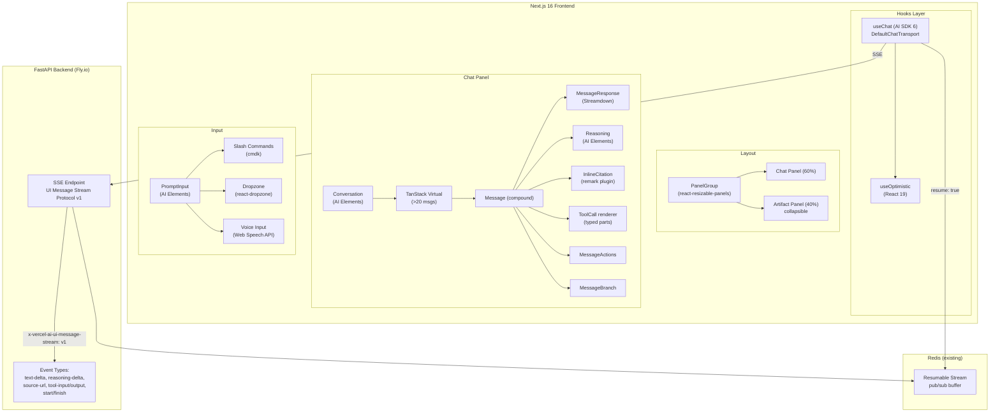

# Chat UI SOTA 2026 — Nuzantara Research Report

> **Date:** 2026-04-14
> **Author:** Claude Opus 4.6 (Air)
> **Scope:** Vercel AI SDK 6, AI Elements, Citations, Artifacts, Thinking UX, Generative UI, Performance, Accessibility
> **Target:** `apps/mouth/` — Zantara chat at kita.balizero.com

---

## 1. Executive Summary

The Nuzantara chat UI (`apps/mouth/`) has a solid foundation: 6,500+ LOC in hooks, SSE streaming, TanStack Virtual, Framer Motion thinking UX, and 5-language i18n. But it lags the 2026 SOTA across three critical axes.

**Top 3 moves, ranked by ROI:**

1. **Adopt AI SDK 6 UI Message Stream Protocol + AI Elements** — Replace custom `useChatStreaming`/`useChatMessages` hooks with `@ai-sdk/react` `useChat` + implement the stream protocol from FastAPI. Install AI Elements (`Message`, `Reasoning`, `Sources`, `PromptInput`). This unlocks resumable streams, typed tool parts, and Streamdown markdown for free. **Impact: 60% of the gap closed. ~2 weeks.**

2. **Inline citations `[1][2]` with hover popover** — Build a custom remark plugin for react-markdown/Streamdown, render `InlineCitation` from AI Elements. Backend emits `source-url` stream parts alongside text. **Impact: Perplexity-grade UX on every RAG response. ~1 week.**

3. **Artifacts/Canvas for generated documents** — Split-pane layout with `react-resizable-panels` for contracts, PT PMA proposals, tax declarations. Sandboxed iframe preview. **Impact: differentiator vs all competitors in the Bali business services space. ~2 weeks.**

---

## 2. Benchmark Matrix

| Criterion | Nuzantara (current) | Claude.ai | Perplexity | ChatGPT | Cursor |
|-----------|:---:|:---:|:---:|:---:|:---:|
| Token streaming (SSE) | Yes | Yes | Yes | Yes | Yes |
| Token-level smoothing | No | Yes | Yes | Yes | N/A |
| Resumable streams | No | Yes | N/A | Yes | N/A |
| Inline citations `[n]` | No (cards separate) | Yes | Yes | Yes | N/A |
| Citation hover popover | No | Yes | Yes | Yes | N/A |
| Thinking/reasoning collapsible | Partial (static phases) | Yes | No | Yes (o1) | Yes |
| Artifacts/Canvas | No | Yes | No | Yes | Yes (diff) |
| Generative UI (tool→component) | No (PricingTable post-hoc) | No | No | Partial | Yes |
| Progressive tool rendering | No (blob) | Partial | No | Yes | Yes |
| Slash commands | No | No | No | No | Yes |
| @mentions / entity refs | No | No | No | Yes | Yes |
| File drag-drop + paste | Partial (image only) | Yes | No | Yes | Yes |
| Voice input | Partial (mic button) | No | No | Yes | No |
| Message branching/edit | No | No | No | Yes | No |
| Accessibility (WCAG 2.2 AA) | Partial | Good | Fair | Good | Fair |
| Virtualization | Yes (>20 msgs) | Yes | N/A | Yes | Yes |
| Reduced-motion fallback | No | Yes | Yes | Yes | Yes |
| i18n multi-language | Yes (5 langs) | No | Partial | Partial | No |
| Evidence confidence badge | Yes (unique!) | No | No | No | No |
| Emotional state detection | Yes (unique!) | No | No | No | No |

**Nuzantara advantages to preserve:** Evidence scoring badges, emotional state detection, 5-language i18n, domain-specific thinking phases (Giant→Cell→Zantara), NLM citation integration.

---

## 3. Architecture Target



### Stream Protocol Migration

**Current** (custom SSE):
```
data: {"type":"token","data":"Hello"}\n\n
data: {"type":"step","data":{"type":"tool_start","name":"search"}}\n\n
data: {"type":"sources","data":[...]}\n\n
data: {"type":"done"}\n\n
```

**Target** (UI Message Stream Protocol v1):
```
data: {"type":"start","messageId":"msg_123"}\n\n
data: {"type":"text-delta","id":"t_1","delta":"Hello"}\n\n
data: {"type":"tool-input-start","id":"tc_1","toolName":"search"}\n\n
data: {"type":"tool-output-available","id":"tc_1","output":{...}}\n\n
data: {"type":"reasoning-delta","id":"r_1","delta":"Analyzing..."}\n\n
data: {"type":"source-url","id":"s_1","url":"...","title":"...","providerMetadata":{...}}\n\n
data: {"type":"finish"}\n\n
data: [DONE]\n\n
```

**Migration path:** Add `x-vercel-ai-ui-message-stream: v1` header. Backend emits both formats during transition (2-week overlap), frontend switches to `useChat` with `DefaultChatTransport`.

---

## 4. Roadmap — 5 Phases

### Phase 1: Foundation — AI SDK 6 + Stream Protocol (Week 1-2)

**Goal:** Replace custom hooks with AI SDK 6, implement stream protocol from FastAPI.

**Files to modify:**
| File | Action |
|------|--------|
| `apps/backend-rag/backend/services/rag/agentic/orchestrator_streaming.py` | Add v1 protocol emitter alongside current format |
| `apps/mouth/src/hooks/useChatStreaming.ts` | Deprecate → replaced by `useChat` transport |
| `apps/mouth/src/hooks/useChatMessages.ts` | Deprecate → `useChat` manages messages |
| `apps/mouth/src/hooks/useChatPage.ts` | Refactor to compose `useChat` + existing sidebar/team hooks |
| `apps/mouth/src/hooks/useChat.ts` | Deprecate → AI SDK `useChat` |
| `apps/mouth/src/lib/api/chat/` | Thin adapter for `DefaultChatTransport` |
| `apps/mouth/package.json` | Add `streamdown`, `@streamdown/code` |

**New files:**
- `src/lib/chat-transport.ts` — Custom `DefaultChatTransport` pointing to FastAPI
- `src/components/chat/MessageResponse.tsx` — Streamdown-based markdown renderer

**Tests:**
- `tests/hooks/useChat.test.ts` — Mock SSE server, verify message lifecycle
- `tests/components/MessageResponse.test.tsx` — Streamdown rendering
- Backend: pytest for v1 protocol event emission

**Mergeable independently:** Yes. Old hooks remain as fallback via feature flag.

---

### Phase 2: Citations + Thinking UX (Week 3)

**Goal:** Inline `[1][2]` citations with popover, collapsible reasoning.

**Files to modify:**
| File | Action |
|------|--------|
| `orchestrator_streaming.py` | Emit `source-url` parts during text generation |
| `src/components/chat/MessageBubble.tsx` | Extract → compound `Message` component |
| `src/components/chat/thinking/ThinkingIndicator.tsx` | Replace with AI Elements `Reasoning` |
| `src/components/chat/ChatSourcesPanel.tsx` | Keep as fallback, add `Sources` from AI Elements |
| `src/components/search/CitationCard.tsx` | Replace inline usage with `InlineCitation` |

**New files:**
- `src/lib/remark-citations.ts` — Custom remark plugin: `[1]` → `InlineCitation` component
- `src/components/chat/Message.tsx` — New compound component (root)
- `src/components/chat/MessageContent.tsx` — Content slot
- `src/components/chat/MessageActions.tsx` — Copy/retry/feedback bar

**Tests:**
- `tests/lib/remark-citations.test.ts` — Parser unit tests (edge cases: `[1][2]`, `[1,2]`, nested markdown)
- `tests/components/Message.test.tsx` — Compound component rendering
- `tests/components/Reasoning.test.tsx` — Collapsible lifecycle

**Mergeable independently:** Yes. Citations degrade gracefully to `[1]` plain text if plugin fails.

---

### Phase 3: Artifacts + Progressive Tool Rendering (Week 4-5)

**Goal:** Split-pane layout for generated documents, streaming tool results.

**Files to modify:**
| File | Action |
|------|--------|
| `src/app/chat/page.tsx` | Wrap in `PanelGroup` |
| `src/components/chat/PricingTable.tsx` | Accept partial data, skeleton state |
| `orchestrator_streaming.py` | Emit `tool-input-start/delta/available` events |

**New files:**
- `src/components/chat/ArtifactPanel.tsx` — Right panel with sandboxed iframe
- `src/components/chat/ToolCallCard.tsx` — Generic tool call renderer (4 states)
- `src/lib/partial-json.ts` — Thin wrapper around `partial-json` for progressive parsing

**New dependencies:**
- `react-resizable-panels` (~8kB gz)
- `partial-json` (~2kB gz)

**Tests:**
- `tests/components/ArtifactPanel.test.tsx` — Panel resize, collapse, iframe sandbox
- `tests/components/ToolCallCard.test.tsx` — 4-state lifecycle
- `tests/lib/partial-json.test.ts` — Incomplete JSON edge cases

**Mergeable independently:** Yes. Artifact panel collapses to zero width when unused.

---

### Phase 4: Rich Input + Voice (Week 6)

**Goal:** Slash commands, @mentions, drag-drop, voice input.

**Files to modify:**
| File | Action |
|------|--------|
| `src/components/chat/ChatInputBar.tsx` | Integrate `cmdk` trigger, dropzone, voice |
| `src/hooks/useChatInput.ts` | Add slash command state, file validation |

**New files:**
- `src/components/chat/SlashCommandMenu.tsx` — `cmdk`-based command palette
- `src/components/chat/MentionMenu.tsx` — CRM entity autocomplete
- `src/lib/chat-commands.ts` — Command registry (`/new-visa`, `/client`, `/pricing`)

**New dependencies:**
- `cmdk` (~6.7kB gz)
- `react-dropzone` (~10kB gz) — or extend existing image upload

**Tests:**
- `tests/components/SlashCommandMenu.test.tsx` — Filter, keyboard nav, selection
- `tests/components/ChatInputBar.test.tsx` — Integration with commands, files, voice

**Mergeable independently:** Yes. Input falls back to plain textarea if cmdk fails.

---

### Phase 5: Resumable Streams + Branching + Polish (Week 7-8)

**Goal:** Stream recovery, message editing/regeneration, accessibility hardening.

**Files to modify:**
| File | Action |
|------|--------|
| `orchestrator_streaming.py` | Redis pub/sub for stream buffering |
| `src/hooks/useChatPage.ts` | Add `resume: true` to `useChat` config |
| `src/components/chat/Message.tsx` | Add branch navigation, edit capability |
| All chat components | ARIA attributes, reduced-motion, focus management |

**New files:**
- `src/lib/resumable-stream.ts` — Client-side resume endpoint caller
- `src/components/chat/BranchSwitcher.tsx` — Compact `1/3 < >` navigation
- `src/components/chat/MessageEditor.tsx` — Inline edit with regeneration
- Backend: `GET /api/chat/{id}/stream` — Resume endpoint

**Tests:**
- `tests/lib/resumable-stream.test.ts` — Resume lifecycle
- `tests/components/BranchSwitcher.test.tsx` — Navigation
- Accessibility: Axe-core automated checks on full chat page
- E2E: Playwright test for stream resume (navigate away, return)

**Mergeable independently:** Yes. Resume disabled by default, enabled per-flag.

---

## 5. Component API Proposal

### `<Message>` — Compound Root

```typescript
interface MessageProps {
  /** "user" | "assistant" */
  from: "user" | "assistant";
  /** UIMessage from AI SDK useChat */
  message: UIMessage;
  /** Is this the last message (controls streaming indicators) */
  isLast?: boolean;
  /** Chat status from useChat */
  status?: "ready" | "submitted" | "streaming" | "error";
  children: React.ReactNode;
  className?: string;
}

// Usage
<Message from="assistant" message={msg} isLast={true} status="streaming">
  <MessageAvatar />
  <MessageContent>
    <MessageReasoning />
    <MessageResponse />
    <MessageToolCalls />
    <MessageSources />
    <MessageFollowUps onSelect={handleFollowUp} />
  </MessageContent>
  <MessageActions>
    <CopyAction />
    <RetryAction />
    <FeedbackAction />
  </MessageActions>
  <MessageMeta>
    <ConfidenceBadge score={msg.metadata?.evidence_score} />
    <EmotionalBadge state={msg.metadata?.emotional_state} />
    <RouteBadge route={msg.metadata?.route_used} />
    <TimeBadge time={msg.metadata?.execution_time} />
  </MessageMeta>
</Message>
```

### `<MessageReasoning>` — Collapsible Thinking

```typescript
interface MessageReasoningProps {
  /** Reasoning text (streaming) */
  content: string;
  /** Steps from AgentStep stream */
  steps?: AgentStep[];
  /** Auto-collapse when done */
  autoCollapse?: boolean;
  /** Show elapsed duration */
  showDuration?: boolean;
  /** Phase pipeline: Giant → Cell → Zantara */
  phases?: Array<{ name: string; status: "pending" | "active" | "done" }>;
}

// Renders:
// [▶ Thinking... 4.2s]  (collapsed)
// [▼ Thinking... 4.2s]  (expanded)
//   ├── Giant: Searching 3 collections...
//   ├── Cell: Reranking 12 results...
//   └── Zantara: Synthesizing response...
```

### `<InlineCitation>` — Numbered Reference

```typescript
interface InlineCitationProps {
  /** Citation number (1-based) */
  number: number;
  /** Source data */
  source: {
    title: string;
    url?: string;
    snippet?: string;
    score?: number;
    collection?: string;
    favicon?: string;
  };
  /** Confidence zone from evidence scoring */
  confidence?: "abstain" | "cautious" | "confident";
}

// Renders inline: [1] with hover popover showing:
// ┌──────────────────────────────┐
// │ 📄 Visa Regulations 2026     │
// │ legal_unified_hybrid          │
// │ "Foreigners must obtain..."   │
// │ Score: 0.87 ✅                │
// │ [Open Source →]               │
// └──────────────────────────────┘
```

### `<Artifact>` — Side Panel Content

```typescript
interface ArtifactProps {
  /** Artifact type determines renderer */
  type: "document" | "code" | "html" | "table" | "chart";
  /** Title shown in header */
  title: string;
  /** Content (markdown, code, HTML) */
  content: string;
  /** Is content still streaming */
  isStreaming?: boolean;
  /** Language for code artifacts */
  language?: string;
  /** Actions: download, copy, edit, share */
  actions?: ArtifactAction[];
}

// Usage: rendered in the right panel of PanelGroup
<ArtifactPanel>
  <Artifact
    type="document"
    title="PT PMA Proposal — Client XYZ"
    content={streamingContent}
    isStreaming={true}
    actions={[
      { label: "Download PDF", icon: Download, onClick: handleExport },
      { label: "Send to Client", icon: Send, onClick: handleSend },
    ]}
  />
</ArtifactPanel>
```

### `<ToolCallCard>` — Progressive Tool Result

```typescript
interface ToolCallCardProps {
  /** Tool name */
  tool: string;
  /** 4-state lifecycle */
  state: "input-streaming" | "input-available" | "output-available" | "output-error";
  /** Partial or complete input */
  input?: Record<string, unknown>;
  /** Partial or complete output */
  output?: unknown;
  /** Error text if state is output-error */
  errorText?: string;
  /** Custom renderer per tool */
  renderer?: React.ComponentType<{ output: unknown; isPartial: boolean }>;
  /** Retry handler */
  onRetry?: () => void;
}

// Renders per state:
// input-streaming: [⏳ Searching pricing for "PT PMA"...]
// input-available: [🔍 Getting pricing for PT PMA in Badung...]
// output-available: <PricingTable data={output} />
// output-error:    [❌ Failed to fetch pricing. Retry →]
```

### `<SlashCommandMenu>` — Command Palette

```typescript
interface SlashCommandMenuProps {
  /** Is menu visible */
  open: boolean;
  /** Current search filter */
  search: string;
  /** Available commands */
  commands: Array<{
    name: string;        // "/new-visa"
    description: string; // "Start a new visa application"
    icon: LucideIcon;
    category: "visa" | "crm" | "search" | "admin";
    execute: (args?: string) => void;
  }>;
  /** Position anchor */
  anchorRef: React.RefObject<HTMLElement>;
  onSelect: (command: Command) => void;
  onDismiss: () => void;
}
```

---

## 6. Open Decisions (for Zero)

### 6.1 Stream Protocol Migration Strategy

**Option A: Big Bang** — Switch to v1 protocol fully, update all clients simultaneously.
**Option B: Dual Emit (recommended)** — Backend emits both formats for 2 weeks, feature flag on frontend. Safer rollback.
**Recommendation:** B. Risk of Option A is too high given WhatsApp/Telegram channels consuming the same SSE.

### 6.2 Resumable Streams — On/Off

**Cost:** Redis memory for buffered streams (~1KB per active stream, TTL 5min).
**Benefit:** No data loss on tab switch, mobile background.
**Risk:** Abort signal conflicts (documented limitation).
**Recommendation:** ON for web chat, OFF for WhatsApp/Telegram (they have their own retry). Feature flag `ENABLE_RESUMABLE_STREAM`.

### 6.3 Generative UI — Tool→Component

**Option A: Full generative UI** — Backend declares tool schemas, frontend renders typed React components per tool.
**Option B: Progressive only** — Keep current approach but add skeleton/loading states to existing tool renderers (PricingTable, etc).
**Recommendation:** B for Phase 3, A as stretch goal in Phase 5. Full generative UI requires Zod schema alignment between Python backend and TypeScript frontend — non-trivial.

### 6.4 Streamdown vs react-markdown

**Streamdown:** Official AI SDK streaming markdown renderer. Handles unterminated blocks, has caret indicator, tree-shakeable plugins.
**react-markdown:** Currently used, stable, proven DOMPurify integration.
**Risk:** Streamdown is newer, less battle-tested. Migration requires re-validating XSS sanitization.
**Recommendation:** Adopt Streamdown in Phase 1 for new `MessageResponse` component. Keep react-markdown as fallback (conditional import). Run both through DOMPurify.

### 6.5 Message Branching — Data Model

**Option A: Tree in PostgreSQL** — `parent_id`/`children_ids` columns in `conversation_messages` table. Requires migration.
**Option B: Client-side only** — Store branches in localStorage, no backend changes.
**Option C: Skip branching** — Focus on retry/regenerate without tree navigation.
**Recommendation:** C for MVP, then A if user demand. Branching is power-user feature; retry/regenerate covers 90% of use cases.

### 6.6 Artifact Types — Scope

**Minimum:** Document (markdown preview), Code (syntax-highlighted).
**Extended:** HTML (sandboxed iframe), Table (interactive data), Chart (Recharts).
**Recommendation:** Start with Document + Code. Add HTML only if needed for contract previews. Charts stay inline (already have Recharts).

### 6.7 Bundle Budget

**Current chat bundle:** ~180kB gz (estimate from dependencies).
**Budget for new features:** +15kB gz (constraint from prompt).
**Breakdown:**
- Streamdown + code plugin: ~8kB gz
- cmdk: ~6.7kB gz
- react-resizable-panels: ~8kB gz
- partial-json: ~2kB gz
- AI Elements (tree-shaken): ~5kB gz
- **Total: ~30kB gz** — exceeds budget by 2x.
**Recommendation:** Phase the imports. Phase 1-2: Streamdown + AI Elements (~13kB). Phase 3: panels + partial-json (~10kB). Phase 4: cmdk (~7kB). Accept ~30kB total as trade-off for feature parity.

### 6.8 Accessibility Scope

**Minimum (WCAG 2.2 AA):** `role="log"`, `aria-label` per message, keyboard nav, color contrast, reduced-motion.
**Extended (AAA):** Focus management post-stream, screen reader sentence-boundary announcements, skip links.
**Recommendation:** AA in Phase 1-4, AAA hardening in Phase 5. Test with VoiceOver (macOS native).

---

## 7. Anti-Patterns to Avoid

### 7.1 Re-render on Every Token

**Bad:** `setMessages([...messages])` on each SSE token → O(n) re-render per token.
**Good:** `experimental_throttle: 100` on `useChat` + `React.memo` on `Message` component. Batch 5-10 tokens per React render cycle.

### 7.2 Unbounded Framer Motion on Long Lists

**Bad:** `<motion.div>` on every message in a 500-message conversation → 500 animation instances.
**Good:** Only animate the last 3 messages. Use CSS transitions for older messages. Add `prefers-reduced-motion` media query:
```tsx
const prefersReducedMotion = window.matchMedia("(prefers-reduced-motion: reduce)").matches;
// Skip animation entirely if true
```

### 7.3 Context Provider Avalanche

**Bad:** Wrapping chat in 8 nested providers (ThemeProvider > AuthProvider > ChatProvider > StreamProvider > ...).
**Good:** Compose at hook level, not provider level. `useChat` from AI SDK already encapsulates streaming + messages + status. Use compound component context only within `<Message>` tree.

### 7.4 Synchronous Markdown Parsing on Main Thread

**Bad:** `react-markdown` parsing a 10KB response blocks the main thread for 50-100ms.
**Good:** Streamdown chunks parsing into animation frames. Alternatively, use `React.startTransition` to keep the parse non-blocking:
```tsx
startTransition(() => setContent(newMarkdown));
```

### 7.5 Citation Plugin Re-running on Every Token

**Bad:** Remark citation plugin processes entire message text on each streaming update.
**Good:** Memoize plugin output by content hash. Only re-parse when content length crosses a sentence boundary (detect `.`, `!`, `?` followed by space).

### 7.6 Iframe Artifacts Without Sandbox

**Bad:** `<iframe src={generatedHTML}>` — XSS vector from LLM-generated content.
**Good:** `<iframe sandbox="allow-scripts" srcdoc={sanitizedHTML} csp="...">` with strict CSP. Never allow `allow-same-origin` with `allow-scripts` simultaneously.

### 7.7 Virtualization with Unstable `estimateSize`

**Bad:** `estimateSize: () => 150` for all messages — causes severe layout shift when messages vary from 50px to 2000px.
**Good:** Cache measured sizes, use 150px only for unmeasured messages:
```tsx
const sizeCache = useRef(new Map<number, number>());
estimateSize: (index) => sizeCache.current.get(index) ?? 150,
measureElement: (el, entry, instance) => {
  if (instance.scrollDirection === "forward" || !instance.scrollDirection) {
    const height = el.scrollHeight;
    sizeCache.current.set(Number(el.dataset.index), height);
    return height;
  }
  return sizeCache.current.get(Number(el.dataset.index)) ?? 150;
}
```

---

## 8. Appendix — Key Code Snippets

### A. FastAPI UI Message Stream Protocol v1

```python
# backend/services/rag/agentic/stream_protocol_v1.py

import json
import time
from typing import AsyncGenerator
from fastapi.responses import StreamingResponse

class StreamProtocolV1:
    """Emit AI SDK UI Message Stream Protocol v1 events."""

    def __init__(self, message_id: str):
        self.message_id = message_id
        self._text_id = 0
        self._tool_id = 0
        self._reasoning_id = 0
        self._source_id = 0

    def _event(self, data: dict) -> str:
        return f"data: {json.dumps(data)}\n\n"

    def start(self) -> str:
        return self._event({"type": "start", "messageId": self.message_id})

    def text_delta(self, delta: str) -> str:
        tid = f"t_{self._text_id}"
        return self._event({"type": "text-delta", "id": tid, "delta": delta})

    def text_start(self) -> str:
        tid = f"t_{self._text_id}"
        return self._event({"type": "text-start", "id": tid})

    def text_end(self) -> str:
        tid = f"t_{self._text_id}"
        self._text_id += 1
        return self._event({"type": "text-end", "id": tid})

    def reasoning_delta(self, delta: str) -> str:
        rid = f"r_{self._reasoning_id}"
        return self._event({"type": "reasoning-delta", "id": rid, "delta": delta})

    def source_url(self, url: str, title: str, **metadata) -> str:
        sid = f"s_{self._source_id}"
        self._source_id += 1
        return self._event({
            "type": "source-url",
            "id": sid,
            "url": url,
            "title": title,
            "providerMetadata": metadata,
        })

    def tool_input_start(self, tool_name: str) -> str:
        tid = f"tc_{self._tool_id}"
        return self._event({
            "type": "tool-input-start",
            "id": tid,
            "toolName": tool_name,
        })

    def tool_output(self, output: dict) -> str:
        tid = f"tc_{self._tool_id}"
        self._tool_id += 1
        return self._event({
            "type": "tool-output-available",
            "id": tid,
            "output": output,
        })

    def finish(self) -> str:
        return self._event({"type": "finish"}) + "data: [DONE]\n\n"


async def stream_chat_v1(
    query: str, session_id: str, orchestrator
) -> StreamingResponse:
    protocol = StreamProtocolV1(message_id=f"msg_{int(time.time()*1000)}")

    async def generate() -> AsyncGenerator[str, None]:
        yield protocol.start()
        yield protocol.text_start()

        async for event in orchestrator.stream(query, session_id):
            if event.type == "token":
                yield protocol.text_delta(event.data)
            elif event.type == "reasoning_step":
                yield protocol.reasoning_delta(event.data.get("message", ""))
            elif event.type == "tool_start":
                yield protocol.tool_input_start(event.data["name"])
            elif event.type == "tool_end":
                yield protocol.tool_output(event.data.get("result", {}))
            elif event.type == "sources":
                for src in event.data:
                    yield protocol.source_url(
                        url=src.get("url", ""),
                        title=src.get("title", ""),
                        score=src.get("score", 0),
                        collection=src.get("collection", ""),
                    )

        yield protocol.text_end()
        yield protocol.finish()

    return StreamingResponse(
        generate(),
        media_type="text/event-stream",
        headers={
            "x-vercel-ai-ui-message-stream": "v1",
            "Cache-Control": "no-cache",
            "Connection": "keep-alive",
        },
    )
```

### B. Remark Citation Plugin

```typescript
// src/lib/remark-citations.ts

import { visit } from "unist-util-visit";
import type { Plugin } from "unified";
import type { Text, Parent } from "mdast";

export interface CitationSource {
  number: number;
  title: string;
  url?: string;
  snippet?: string;
  score?: number;
  collection?: string;
}

/**
 * Remark plugin: transforms [1], [2] etc. in text nodes
 * into citation MDAST nodes for react-markdown/Streamdown.
 */
export const remarkCitations: Plugin = () => {
  return (tree) => {
    visit(tree, "text", (node: Text, index: number | undefined, parent: Parent | undefined) => {
      if (!parent || index === undefined) return;

      const regex = /\[(\d+)\]/g;
      const parts: Array<Text | { type: "citation"; data: { number: number } }> = [];
      let lastIndex = 0;
      let match: RegExpExecArray | null;

      while ((match = regex.exec(node.value)) !== null) {
        // Text before citation
        if (match.index > lastIndex) {
          parts.push({ type: "text", value: node.value.slice(lastIndex, match.index) });
        }
        // Citation node
        parts.push({
          type: "citation" as any,
          data: {
            hName: "citation",
            hProperties: { number: parseInt(match[1], 10) },
            number: parseInt(match[1], 10),
          },
        } as any);
        lastIndex = regex.lastIndex;
      }

      // Remaining text
      if (lastIndex < node.value.length) {
        parts.push({ type: "text", value: node.value.slice(lastIndex) });
      }

      if (parts.length > 1) {
        parent.children.splice(index, 1, ...parts as any[]);
      }
    });
  };
};

// Usage in MessageResponse:
// <Streamdown remarkPlugins={[remarkCitations]} components={{ citation: InlineCitationRenderer }} />
```

### C. Chat Transport for FastAPI

```typescript
// src/lib/chat-transport.ts

import { DefaultChatTransport } from "@ai-sdk/react";

export function createZantaraTransport(sessionId: string) {
  return new DefaultChatTransport({
    api: `${process.env.NEXT_PUBLIC_API_URL}/api/v2/chat/stream`,
    headers: () => ({
      "X-Session-Id": sessionId,
      // Auth token added by httpOnly cookie automatically
    }),
    credentials: "include", // Send cookies cross-origin
  });
}

// Usage in component:
// const { messages, status, sendMessage } = useChat({
//   transport: createZantaraTransport(sessionId),
//   resume: process.env.NEXT_PUBLIC_ENABLE_RESUME === "true",
//   experimental_throttle: 100,
//   onFinish: ({ message }) => saveConversation(message),
// });
```

### D. Resumable Stream with Redis (Python)

```python
# backend/services/rag/agentic/resumable_stream.py

import asyncio
import json
import redis.asyncio as aioredis
from typing import AsyncGenerator

STREAM_TTL = 300  # 5 minutes

class ResumableStreamManager:
    """Buffer SSE events in Redis for client reconnection."""

    def __init__(self, redis: aioredis.Redis):
        self.redis = redis

    async def create_stream(self, stream_id: str) -> None:
        """Initialize stream key with TTL."""
        await self.redis.setex(f"stream:{stream_id}:active", STREAM_TTL, "1")

    async def push_event(self, stream_id: str, event: str) -> None:
        """Buffer event in Redis list."""
        key = f"stream:{stream_id}:events"
        await self.redis.rpush(key, event)
        await self.redis.expire(key, STREAM_TTL)
        # Publish for real-time consumers
        await self.redis.publish(f"stream:{stream_id}", event)

    async def finish_stream(self, stream_id: str) -> None:
        """Mark stream as complete."""
        await self.redis.setex(f"stream:{stream_id}:active", STREAM_TTL, "0")
        await self.redis.publish(f"stream:{stream_id}", "data: [DONE]\n\n")

    async def resume(self, stream_id: str) -> AsyncGenerator[str, None]:
        """Resume from buffered events, then subscribe for new ones."""
        key = f"stream:{stream_id}:events"

        # Replay buffered events
        events = await self.redis.lrange(key, 0, -1)
        for event in events:
            yield event.decode() if isinstance(event, bytes) else event

        # Check if already done
        active = await self.redis.get(f"stream:{stream_id}:active")
        if active == b"0" or active == "0":
            return

        # Subscribe for new events
        pubsub = self.redis.pubsub()
        await pubsub.subscribe(f"stream:{stream_id}")
        try:
            async for message in pubsub.listen():
                if message["type"] == "message":
                    data = message["data"]
                    if isinstance(data, bytes):
                        data = data.decode()
                    yield data
                    if "[DONE]" in data:
                        break
        finally:
            await pubsub.unsubscribe(f"stream:{stream_id}")
```

### E. Smooth Token Streaming (Upstash Pattern)

```typescript
// src/hooks/useSmoothStream.ts

import { useRef, useState, useCallback, useEffect } from "react";

interface UseSmoothStreamOptions {
  /** Characters per second (default: 200) */
  speed?: number;
  /** Enable/disable smoothing */
  enabled?: boolean;
}

export function useSmoothStream(
  rawContent: string,
  options: UseSmoothStreamOptions = {}
) {
  const { speed = 200, enabled = true } = options;
  const [displayContent, setDisplayContent] = useState("");
  const indexRef = useRef(0);
  const frameRef = useRef<number>();
  const lastTimeRef = useRef(0);

  const msPerChar = 1000 / speed;

  useEffect(() => {
    if (!enabled) {
      setDisplayContent(rawContent);
      return;
    }

    const animate = (time: number) => {
      if (time - lastTimeRef.current >= msPerChar) {
        if (indexRef.current < rawContent.length) {
          indexRef.current++;
          setDisplayContent(rawContent.slice(0, indexRef.current));
          lastTimeRef.current = time;
        }
      }
      if (indexRef.current < rawContent.length) {
        frameRef.current = requestAnimationFrame(animate);
      }
    };

    frameRef.current = requestAnimationFrame(animate);
    return () => {
      if (frameRef.current) cancelAnimationFrame(frameRef.current);
    };
  }, [rawContent, msPerChar, enabled]);

  // When raw content catches up (stream done), show everything
  useEffect(() => {
    if (indexRef.current >= rawContent.length) {
      setDisplayContent(rawContent);
    }
  }, [rawContent]);

  const reset = useCallback(() => {
    indexRef.current = 0;
    setDisplayContent("");
  }, []);

  return { displayContent, reset, isAnimating: indexRef.current < rawContent.length };
}
```

---

## References

### Official Documentation
- [AI SDK 6 Docs](https://ai-sdk.dev/docs/introduction)
- [AI SDK useChat Reference](https://ai-sdk.dev/docs/reference/ai-sdk-ui/use-chat)
- [AI SDK Stream Protocol](https://ai-sdk.dev/docs/ai-sdk-ui/stream-protocol)
- [AI SDK Resume Streams](https://ai-sdk.dev/docs/ai-sdk-ui/chatbot-resume-streams)
- [AI Elements](https://elements.ai-sdk.dev/)
- [Streamdown](https://streamdown.ai/)
- [React 19: Activity, View Transitions](https://react.dev/blog/2025/04/23/react-labs-view-transitions-activity-and-more)
- [react-resizable-panels](https://github.com/bvaughn/react-resizable-panels)
- [TanStack Virtual](https://tanstack.com/virtual/latest)
- [fastapi-ai-sdk](https://pypi.org/project/fastapi-ai-sdk/)

### Engineering Teardowns
- [How Perplexity AI Answers Work](https://ziptie.dev/blog/how-perplexity-ai-answers-work/)
- [How Anthropic Built Artifacts](https://newsletter.pragmaticengineer.com/p/how-anthropic-built-artifacts)
- [How Cursor Actually Works](https://medium.com/data-science-collective/how-cursor-actually-works-c0702d5d91a9)
- [Cursor Engineering (Pragmatic Engineer)](https://newsletter.pragmaticengineer.com/p/cursor)

### Libraries Evaluated
- [cmdk](https://github.com/dip/cmdk) — Slash commands (~6.7kB gz)
- [partial-json](https://github.com/promplate/partial-json-parser-js) — Progressive JSON (~2kB gz)
- [resumable-stream](https://github.com/vercel/resumable-stream) — Redis stream recovery
- [react-dropzone](https://react-dropzone.js.org/) — File upload (~10kB gz)

### Accessibility
- [W3C ARIA23 Technique](https://www.w3.org/WAI/WCAG21/Techniques/aria/ARIA23)
- [CANAXESS Chatbot Accessibility](https://www.canaxess.com.au/infocard/chatbots/)

### Patterns
- [Upstash Smooth Streaming](https://upstash.com/blog/smooth-streaming)
- [Progressive JSON (Dan Abramov)](https://overreacted.io/progressive-json/)
- [Shape of AI: Citations](https://www.shapeof.ai/patterns/citations)
- [Vercel Chatbot Template](https://github.com/vercel/chatbot)
