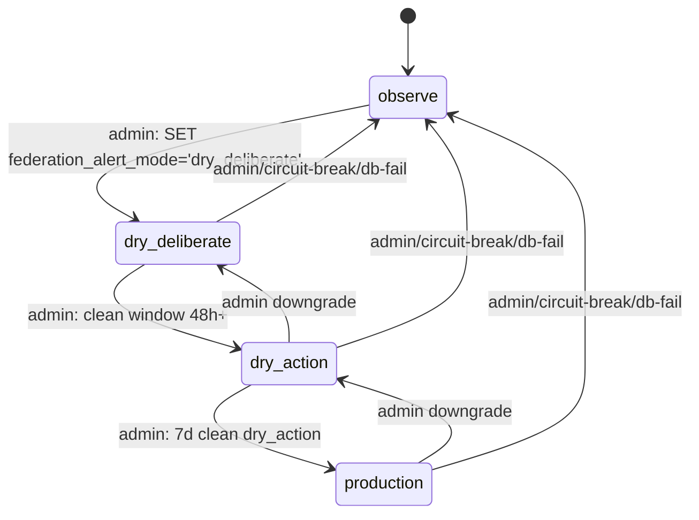
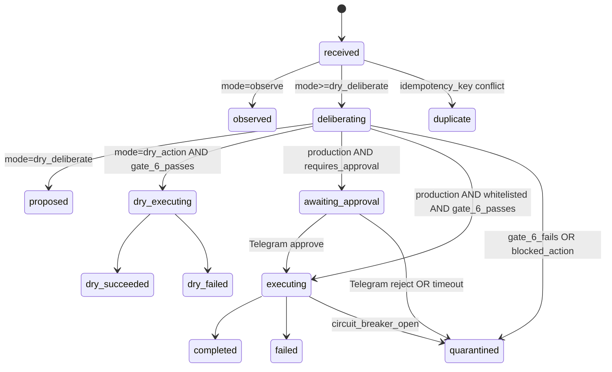

# Federation Alert Dispatcher — Spec (2026-04-30)

> Standalone Python daemon that turns Pro telegram alerts into proposed
> remediation actions through multi-LLM consensus, with sandbox-tested
> patches and Telegram approval gate.
>
> **Status**: design approved by 8-LLM consensus, awaiting implementation.
> **Source of truth**: this document. PRs link back here.

## TL;DR

- **Problem**: 15+ producers send Telegram alerts to Zero. Today: 0 → action.
  Zero reads, decides, acts manually.
- **Solution**: durable EventBus channel `federation_alert` + thin daemon
  that classifies, dispatches multi-LLM consensus, runs sandbox-tested fix,
  posts to Telegram with approval buttons. Zero clicks ✅ → auto-merge.
- **Reuse 4 existing components** (~70% of value):
  `ConsiglioOrchestrator` (4-LLM voting Gate 6), `Core Guardian Surgeon`
  (worktree+pytest+ruff sandbox), `Review Handler` (Telegram inline
  keyboards), `EventBus` (PG LISTEN/NOTIFY + Outbox).
- **Build new** (~25%): daemon, schema, 4 whitelist actions, callback
  prefix, audit trail.
- **Bootstrap**: 3 weeks observe → dry_deliberate → dry_action → production.
- **First PR-able when**: Spec approved + Pro/Air rebased on main.

## 8-LLM brainstorm sources (full audit trail)

| LLM                                                       | Pattern                  | Output                | Verdict                                               |
| --------------------------------------------------------- | ------------------------ | --------------------- | ----------------------------------------------------- |
| Claude Opus 4.7 (this)                                    | session coordinator      | sintesi 8-LLM         | —                                                     |
| Codex GPT-5.5 v1 (`codex exec --full-auto`)               | architect                | 3.4MB filesystem walk | foundation                                            |
| DeepSeek Reasoner v4 v1                                   | architect                | 21KB markdown         | LangGraph extension                                   |
| Gemini 3.1 Pro v1 (`gemini --yolo`)                       | architect                | 8.8KB markdown        | FastAPI+webhook                                       |
| NotebookLM oracle NB-1 (`nlm notebook query`)             | grounding                | 26 citations          | **partly hallucinated** (ADK+A2A claimed nonexistent) |
| DeepSeek Reasoner v4 v2                                   | challenger (adversarial) | 20KB                  | 8 race conditions concrete                            |
| Claude Opus 4.7 OAuth (`claude --print` separate session) | verifier                 | 16KB                  | **NB-1 corrections + 8 NEW blockers**                 |
| Codex GPT-5.5 final architect                             | implementable spec       | 2MB                   | **DDL + 4-mode SM + 3 PR + B1-B10 code**              |
| Gemini 2.5 Pro (cascade fallback after 3.1 429)           | SOTA matcher             | 49KB                  | HolmesGPT/Robusta/Keep adaptation                     |

**Failure recovery (regola NON-skip applied):**

- Exa Search 402 quota exceeded → fallback Brave Search (15 results delivered)
- Perplexity 401 quota exceeded → fallback Codex CLI deep research
- Gemini 3.1 Pro 429 RESOURCE_EXHAUSTED → cascade to `gemini-2.5-pro` (delivered)
- Aider not installed on Pro → substituted Claude OAuth + DeepSeek Challenger
  (better adversarial split than aider/codex parallel)
- NotebookLM `nlm chat` wrong syntax → fixed to `nlm notebook query` + 3
  notebooks tried in parallel (NB-Cell, NB-Innervation empty; NB-1 returned
  with 26 citations)
- 2 of 3 NotebookLM notebooks empty → claimed-but-not-loaded sources;
  partial result accepted, gaps filled by Claude OAuth file-by-file verify

**MOS rule** stored as `pattern` (importance 8): _"Quando un LLM/tool
fallisce in workflow multi-LLM, NON skippare. Studia come Claude CLI
gestisce quel failure (cascade Gemini 3.1→2.5, retry exponential backoff
con jitter, token rotation, --yolo skip confirmation, rate-limit honoring),
replica il pattern."_

## Verified ground truth — what already exists

File-by-file verified by Claude OAuth + grep on local repo (NOT relying on
NB-1 alone, which hallucinated `apps/federation/` ADK+A2A integration).

### ✅ FILES THAT EXIST — reuse, do NOT reinvent

| Path                                                                   | What it provides                                                                                                                                                                            | How we reuse                                                                                                  |
| ---------------------------------------------------------------------- | ------------------------------------------------------------------------------------------------------------------------------------------------------------------------------------------- | ------------------------------------------------------------------------------------------------------------- |
| `apps/backend-rag/backend/services/research/consiglio_orchestrator.py` | 4-LLM voting (Claude OAuth + Gemini CLI + DeepSeek API + NotebookLM MCP), Gate 6 ≥3/4 agreement default, fail-tolerant                                                                      | `await consiglio.deliberate(claims, context)` returns `ConsiglioResult` with `gate_6_passes` and `votes` dict |
| `apps/backend-rag/backend/services/events/event_bus.py`                | `emit_pg(channel, payload)` — PG LISTEN/NOTIFY with **automatic outbox.publish integration post-PR-#342** (line 230)                                                                        | Producers: `await bus.emit_pg("federation_alert", payload)`. Daemon: `LISTEN federation_alert` reconnect-safe |
| `apps/backend-rag/backend/services/events/outbox.py`                   | `events_outbox` table durability layer, `publish/acknowledge/replay_unconsumed/prune_consumed` helpers                                                                                      | Daemon: `replay_unconsumed()` on bootstrap to recover events lost during reconnect window                     |
| `apps/evaluator/core_guardian/surgeon.py`                              | `surgeon_run(task, target_file, ruff_code, dry_run=False, failed_diff=None)` → MODEL PROPOSES PYTHON VALIDATES, isolated git worktree `auto-fix/<code>-<ts>-<run_id>`, pytest+ruff post-fix | Action: call `surgeon_run(dry_run=True)` for dry_action mode, `dry_run=False` for production                  |
| `apps/backend-rag/backend/services/review/review_handler.py`           | Telegram inline keyboards approval gate, callback `warroom:<action>:<draft_id>`, SLA 4h soft / 12h soft / 48h expire                                                                        | Extend with `fad:<action>:<proposal_id>:<token8>` callback prefix                                             |
| `apps/backend-rag/backend/services/review/models.py`                   | `decode_callback()` parser for warroom prefix                                                                                                                                               | Add parallel `decode_fad_callback()`                                                                          |
| `apps/backend-rag/backend/app/routers/telegram_webhook.py`             | webhook router (currently `intel:*` prefix)                                                                                                                                                 | Add dispatch for `fad:*` prefix                                                                               |
| `scripts/ai-dispatch.sh`                                               | subprocess shellout to gemini/codex/claude/deepseek/nlm CLI with model cascade (3.1→2.5→2.5-flash for Gemini), token rotation, timeout                                                      | Daemon dispatches via `subprocess.run(["./scripts/ai-dispatch.sh", cmd, prompt])`                             |
| `scripts/circuit_breaker.py`                                           | CLOSED/OPEN/HALF_OPEN state machine                                                                                                                                                         | Daemon adds TERMINAL hard-stop logic in its own state (NB-1 claimed `_set_phase()` exists but it does NOT)    |

### ❌ FILES THAT DO NOT EXIST — NB-1 hallucinations

| Claimed by NB-1                                                           | Reality                                                                                  |
| ------------------------------------------------------------------------- | ---------------------------------------------------------------------------------------- |
| `apps/federation/orchestrator.py`                                         | DOES NOT EXIST. Only `scripts/federation_orchestrator.py` (LangGraph PoC, do NOT extend) |
| `apps/federation/a2a_service.py`                                          | DOES NOT EXIST                                                                           |
| Google ADK 1.27.2 + A2A Protocol SDK 0.3.25                               | NOT in codebase                                                                          |
| 8 agents on ports 8081-8088 (claude-code, gemini-search, ...)             | These don't run as A2A services. They are CLI shellouts via `ai-dispatch.sh`             |
| `dispatch_agents()` function                                              | DOES NOT EXIST                                                                           |
| `circuit_breaker.py::_set_phase()` TERMINAL state with `raise ValueError` | File only has CLOSED/OPEN/HALF_OPEN, no `_set_phase`, no TERMINAL, no ValueError raise   |

**Implication**: Daemon dispatches multi-LLM via `ai-dispatch.sh` subprocess
(simple, exists, works) — not via aspirational A2A layer.

## Architecture overview

```
┌─────────────────────────────────────────────────────────────────────────┐
│ 15+ PRODUCERS                                                           │
│ cell-organism · compliance-ops · daily-ops · heartbeat-check ·          │
│ fly-watcher · gap_scanner · WR2 supervisor · imigrasi-monitor ·         │
│ pajak-monitor · bi-exchange · intel-feed · vision-doc · ...             │
└────┬─────────────────────────────────────────────────────────┬──────────┘
     │ (today: only Telegram)                                  │ (NEW)
     ▼                                                         ▼
Telegram chat 1125336968                              EventBus.emit_pg(
  (UI mirror, kept as-is)                              "federation_alert", payload)
                                                       │
                                                       │ pg_notify + outbox row
                                                       ▼
                                          ┌──────────────────────────┐
                                          │ alert_dispatcher daemon  │
                                          │ (LaunchAgent, Pro)       │
                                          │                          │
                                          │ 1. LISTEN federation_alert
                                          │ 2. dedup + lease         │
                                          │ 3. classify (Qwen 3.5:9b)│
                                          │ 4. 4-mode state machine: │
                                          │    observe / dry_deliberate
                                          │    / dry_action / production
                                          └──┬─────────────┬─────────┘
                                             │             │
                  ┌──────────────────────────┘             └─────────────┐
                  ▼ (mode>=dry_deliberate)                               ▼ (mode>=production, whitelisted)
       ConsiglioV1.deliberate()                                surgeon_run(dry_run=mode<production)
       (apps/backend-rag/.../research/                         (apps/evaluator/core_guardian/
       consiglio_orchestrator.py)                              surgeon.py)
       4-LLM Gate 6 ≥3/4                                       isolated worktree + pytest + ruff
       │                                                         │
       │ vote{} + gate_6_passes                                  │ commit on auto-fix branch
       ▼                                                         ▼
       ┌──────────────────────────────────────────────────────────┐
       │ federation_alert_proposals table (NEW)                  │
       │ status SM: received → deliberating → proposed →         │
       │   awaiting_approval → executing → completed/quarantined │
       └──────────────────────┬──────────────────────────────────┘
                              ▼
                review_handler.send_review_request()
                (apps/backend-rag/.../review/review_handler.py)
                Telegram inline keyboard:
                  ✅ Approve   ❌ Reject   🔁 Defer
                callback: fad:<action>:<proposal_id>:<token8>
                              │
                ┌─────────────┴──────────────┐
                ▼ approve                    ▼ reject/timeout
        executing → completed         quarantined → audit only
        auto-merge PR if CI green
```

## DDL — `federation_alert_proposals` table

Migration `apps/backend-rag/backend/db/migrations_v2/148_federation_alert_proposals.sql`
(file number provisional; pick next available at PR time).

```sql
-- squawk-ignore: prefer-bigint-over-smallint
CREATE TABLE IF NOT EXISTS federation_alert_proposals (
    id BIGSERIAL PRIMARY KEY,
    proposal_id TEXT NOT NULL,
    run_id TEXT NOT NULL,
    idempotency_key TEXT NOT NULL,

    source_outbox_id BIGINT,
    source_channel TEXT NOT NULL DEFAULT 'federation_alert',
    source_ref TEXT,

    mode TEXT NOT NULL CHECK (mode IN (
        'observe', 'dry_deliberate', 'dry_action', 'production'
    )),
    status TEXT NOT NULL DEFAULT 'received' CHECK (status IN (
        'received', 'observed', 'deliberating', 'proposed',
        'dry_executing', 'dry_succeeded', 'dry_failed',
        'awaiting_approval', 'executing',
        'completed', 'failed', 'quarantined', 'duplicate'
    )),

    alert_type TEXT NOT NULL,
    severity TEXT NOT NULL DEFAULT 'medium' CHECK (severity IN (
        'info', 'low', 'medium', 'high', 'critical'
    )),
    risk_level TEXT NOT NULL DEFAULT 'L2' CHECK (risk_level IN (
        'L0', 'L1', 'L2', 'L3'
    )),

    requested_action TEXT CHECK (
        requested_action IS NULL OR requested_action IN (
            'cleanup_log',
            'ack_outbox_event',
            'quarantine_alert',
            'prune_consumed_outbox'
        )
    ),
    target_file TEXT,

    action_payload JSONB NOT NULL DEFAULT '{}'::jsonb,
    compact_payload JSONB NOT NULL DEFAULT '{}'::jsonb,
    full_payload JSONB NOT NULL DEFAULT '{}'::jsonb,
    dispatch_plan JSONB NOT NULL DEFAULT '{}'::jsonb,
    deliberation_result JSONB NOT NULL DEFAULT '{}'::jsonb,
    votes JSONB NOT NULL DEFAULT '{}'::jsonb,
    gate_6_passes BOOLEAN,

    requires_approval BOOLEAN NOT NULL DEFAULT FALSE,
    approval_token TEXT,
    telegram_chat_id TEXT,
    telegram_message_id BIGINT,
    approved_by TEXT,
    approved_at TIMESTAMPTZ,
    rejected_by TEXT,
    rejected_at TIMESTAMPTZ,

    action_idempotency_key TEXT,
    quarantine_token TEXT,
    quarantine_reason TEXT,
    quarantined_at TIMESTAMPTZ,

    lease_owner TEXT,
    lease_expires_at TIMESTAMPTZ,
    attempt_count INTEGER NOT NULL DEFAULT 0 CHECK (attempt_count >= 0),
    max_attempts INTEGER NOT NULL DEFAULT 3 CHECK (max_attempts BETWEEN 1 AND 10),
    next_attempt_at TIMESTAMPTZ NOT NULL DEFAULT NOW(),

    last_error TEXT,
    last_error_at TIMESTAMPTZ,
    artifact_uri TEXT,

    created_at TIMESTAMPTZ NOT NULL DEFAULT NOW(),
    updated_at TIMESTAMPTZ NOT NULL DEFAULT NOW(),
    completed_at TIMESTAMPTZ,

    UNIQUE (proposal_id),
    UNIQUE (run_id),
    UNIQUE (idempotency_key),
    UNIQUE (action_idempotency_key),
    UNIQUE (quarantine_token),

    CHECK (octet_length(compact_payload::text) < 500),
    CHECK (status <> 'awaiting_approval' OR
           (requires_approval AND approval_token IS NOT NULL)),
    CHECK (completed_at IS NULL OR status IN (
        'observed', 'dry_succeeded', 'dry_failed',
        'completed', 'failed', 'quarantined', 'duplicate'
    ))
);

-- squawk-ignore: require-concurrent-index-creation
CREATE INDEX IF NOT EXISTS idx_fad_status_next_attempt
ON federation_alert_proposals (status, next_attempt_at, created_at)
WHERE status IN (
    'received', 'deliberating', 'proposed',
    'dry_executing', 'awaiting_approval', 'executing'
);

-- squawk-ignore: require-concurrent-index-creation
CREATE INDEX IF NOT EXISTS idx_fad_source_outbox_id
ON federation_alert_proposals (source_outbox_id)
WHERE source_outbox_id IS NOT NULL;

-- squawk-ignore: require-concurrent-index-creation
CREATE INDEX IF NOT EXISTS idx_fad_mode_created_at
ON federation_alert_proposals (mode, created_at DESC);

-- squawk-ignore: require-concurrent-index-creation
CREATE INDEX IF NOT EXISTS idx_fad_lease_expires_at
ON federation_alert_proposals (lease_expires_at)
WHERE lease_expires_at IS NOT NULL;

INSERT INTO system_settings (key, value, updated_at)
VALUES ('federation_alert_mode', 'observe', NOW())
ON CONFLICT (key) DO NOTHING;

-- === ROLLBACK ===
DELETE FROM system_settings WHERE key = 'federation_alert_mode';
DROP INDEX IF EXISTS idx_fad_lease_expires_at;
DROP INDEX IF EXISTS idx_fad_mode_created_at;
DROP INDEX IF EXISTS idx_fad_source_outbox_id;
DROP INDEX IF EXISTS idx_fad_status_next_attempt;
DROP TABLE IF EXISTS federation_alert_proposals;
```

### Squawk lint reasoning

| Rule                                | Decision                                                                                           |
| ----------------------------------- | -------------------------------------------------------------------------------------------------- |
| `prefer-bigint-over-smallint`       | `BIGSERIAL` allowed with inline ignore (proposals can grow unbounded)                              |
| Enums                               | Use `TEXT CHECK`, NOT PostgreSQL enum types (avoid migration nightmares)                           |
| `require-concurrent-index-creation` | Inline ignore: table is brand-new and empty, lock contention impossible                            |
| `require-timeout-settings`          | Not applicable: brand-new empty table                                                              |
| Rollback                            | Required after `-- === ROLLBACK ===` marker (handled by `migration_manager._extract_rollback_sql`) |
| Notify size enforcement             | App-level check via `octet_length` constraint (8000B PG hard limit, 500B daemon target)            |

## 4-mode state machine



| Mode               | Persist proposal? | Run consiglio?            | Run surgeon?                                    | Telegram?                       |
| ------------------ | ----------------- | ------------------------- | ----------------------------------------------- | ------------------------------- |
| **observe**        | ✅                | ❌                        | ❌                                              | ⚠️ summary only                 |
| **dry_deliberate** | ✅                | ✅ (no cost beyond OAuth) | ❌                                              | ✅ proposal summary             |
| **dry_action**     | ✅                | ✅                        | `surgeon_run(dry_run=True)`                     | ✅ with `[SIMULAZIONE]`         |
| **production**     | ✅                | ✅                        | `surgeon_run(dry_run=False)` (whitelisted only) | ✅ with approval buttons (HITL) |

**Effective mode formula:**

```python
MODE_ORDER: dict[str, int] = {
    "observe": 0,
    "dry_deliberate": 1,
    "dry_action": 2,
    "production": 3,
}

def effective_mode(db_mode: str, env_mode: str | None) -> str:
    """Take the SAFER (lower) of DB and env. Env can only DOWNGRADE."""
    if env_mode is None:
        return db_mode
    return min((db_mode, env_mode), key=lambda m: MODE_ORDER[m])
```

## Proposal status machine



## Whitelist V1 (final, 4 actions)

After 8-LLM consensus and DeepSeek Challenger adversarial review, **only 4
actions safe enough for L2 autonomous in production mode**.

| Action                  | Scope                                                                                      | Safety bound                                                     | Idempotency key                                                           |
| ----------------------- | ------------------------------------------------------------------------------------------ | ---------------------------------------------------------------- | ------------------------------------------------------------------------- |
| `cleanup_log`           | `~/logs/**/*.log` only, exclude `.archives/`                                               | Aggregate retention: keep last 7d OR last 100MB whichever larger | `sha256("cleanup_log:v1:" + path + ":" + size_bucket + ":" + age_bucket)` |
| `ack_outbox_event`      | `events_outbox` row WHERE consumed_at IS NULL AND created_at < NOW() - INTERVAL '1 hour'   | One row per call, audit trail mandatory                          | `outbox_id` UNIQUE on the row itself                                      |
| `quarantine_alert`      | `federation_alert_proposals` SET status='quarantined'                                      | Suppresses duplicate fingerprint; does NOT disable producer      | `sha256("quarantine:v1:" + proposal_id + ":" + reason_code)`              |
| `prune_consumed_outbox` | `events_outbox` WHERE consumed_at IS NOT NULL AND consumed_at < NOW() - INTERVAL '30 days' | Batch ≤5000 rows, ORDER BY consumed_at ASC, single transaction   | `sha256("prune_consumed_outbox:v1:" + cutoff_date + ":" + batch_anchor)`  |

```python
BLOCKED_ACTIONS = {"cleanup_zombie_plist"}     # P0-3 threat model — 51/54 plist corruption 2026-04-29 unidentified producer
HITL_ONLY_ACTIONS = {"restart_agent"}          # organism restart loop amplification risk
ALLOWED_L2_ACTIONS = {
    "cleanup_log",
    "ack_outbox_event",
    "quarantine_alert",
    "prune_consumed_outbox",
}

def classify_action(action: str) -> ActionPolicy:
    if action in BLOCKED_ACTIONS:
        return ActionPolicy(blocked=True, reason="blocked by V1 safety policy")
    if action in HITL_ONLY_ACTIONS:
        return ActionPolicy(blocked=False, requires_approval=True)
    if action in ALLOWED_L2_ACTIONS:
        return ActionPolicy(blocked=False, requires_approval=False)
    return ActionPolicy(blocked=True, reason=f"unknown action: {action}")
```

### Why these 4 (and only these 4)

- **`cleanup_log`**: deterministic, file-system-only, reversible (ZFS/Time
  Machine snapshot if needed), bounded scope.
- **`ack_outbox_event`**: idempotent at row level (UNIQUE constraint on
  outbox_id), only marks consumed (no data destruction).
- **`quarantine_alert`**: pure database state change on dispatcher's own
  table, no external side effects.
- **`prune_consumed_outbox`**: only removes ALREADY-consumed rows >30d
  (replay history) — the consumed_at filter prevents data loss.

### Why NOT the others

- **`cleanup_zombie_plist`** (proposed by Codex/Gemini v1, REJECTED by
  Claude OAuth): replicates the threat model of P0-3 incident
  (2026-04-29: 51/54 plist files corrupted by unidentified producer).
  Hardening currently relies on `chmod 0444` + manual `chmod u+w` for any
  legitimate edit. An autonomous agent that writes plist = exactly the
  threat we're protecting against. Out of scope until the P0-3 producer
  is identified.
- **`restart_agent`** (proposed by all v1 LLMs, REJECTED by DeepSeek
  Challenger): `launchctl kickstart gui/501/<label>` on an agent already
  in restart loop can amplify the problem (cell-organism cascade, WR2
  supervisor reconnect storm). Demoted to HITL_ONLY even in production
  mode.

## Telegram callback contract

Format: `fad:<action>:<proposal_id>:<token8>`

```text
fad:approve:550e8400-e29b-41d4-a716-446655440000:a1b2c3d4
fad:reject:550e8400-e29b-41d4-a716-446655440000:a1b2c3d4
fad:defer:550e8400-e29b-41d4-a716-446655440000:a1b2c3d4
fad:mode:dry_action:t9z8y7w6                    # admin only
```

| Field           | Bytes | Description                                               |
| --------------- | ----- | --------------------------------------------------------- |
| `fad:`          | 4     | Prefix (avoid collision with `intel:` and `warroom:`)     |
| `<action>`      | ≤8    | `approve` / `reject` / `defer` / `mode`                   |
| `<proposal_id>` | 36    | UUID4 (matches federation_alert_proposals.proposal_id)    |
| `<token8>`      | 8     | First 8 chars of HMAC-SHA256(approval_token, proposal_id) |

Total: ≤62 bytes (Telegram limit: 64 bytes). One-time token comparison via
`hmac.compare_digest()` (timing-safe). Token is rotated on each proposal
(stored in `approval_token` column).

### Webhook router patch

```python
# apps/backend-rag/backend/app/routers/telegram_webhook.py

@router.post("/webhook/telegram")
async def handle_callback(request: Request) -> Response:
    payload = await request.json()
    callback_data = payload.get("callback_query", {}).get("data", "")

    if callback_data.startswith("intel:"):
        return await handle_intel_callback(callback_data)
    if callback_data.startswith("warroom:"):
        return await handle_warroom_callback(callback_data)
    if callback_data.startswith("fad:"):
        return await handle_fad_callback(callback_data, payload)
    # ... fallthrough
```

## Mitigation snippets — B1-B10 confirmed blockers

### B1: Subprocess dispatcher only (no aspirational A2A)

```python
async def dispatch_via_ai_dispatch(
    command: str, prompt: str, timeout_s: int = 120
) -> str:
    """Run scripts/ai-dispatch.sh subprocess. Strip ANTHROPIC_API_KEY."""
    proc = await asyncio.create_subprocess_exec(
        "scripts/ai-dispatch.sh", command, prompt,
        cwd=PROJECT_ROOT,
        stdout=asyncio.subprocess.PIPE,
        stderr=asyncio.subprocess.PIPE,
        env={k: v for k, v in os.environ.items() if k != "ANTHROPIC_API_KEY"},
    )
    try:
        stdout, stderr = await asyncio.wait_for(
            proc.communicate(), timeout=timeout_s
        )
    except asyncio.TimeoutError:
        proc.kill()
        await proc.wait()
        raise TimeoutError(f"ai-dispatch timeout: {command}") from None
    if proc.returncode != 0:
        raise RuntimeError(stderr.decode("utf-8", errors="replace")[:4000])
    return stdout.decode("utf-8", errors="replace")
```

### B2: Single producer call (no double-publish)

`emit_pg()` already includes `outbox.publish` post-PR-#342. Producers must
NOT call `outbox.publish` separately.

```python
# CORRECT (post-PR-#342):
await event_bus.emit_pg("federation_alert", payload)

# WRONG (causes double-publish in events_outbox):
await event_bus.emit_pg("federation_alert", payload)
await outbox_publish(conn, "federation_alert", payload)  # ❌ DUPLICATE
```

Producer side patch (illustrative — only `cell-organism` shown; pattern
repeats for the 14 others):

```python
# apps/cell/cell/sensors/cron_sensor.py (or organism main loop)

async def _emit_alert(self, alert: AlertReading) -> None:
    """Emit alert to BOTH Telegram (UI) AND federation_alert (durable)."""
    payload = {
        "v": 1,
        "proposal_id": str(uuid.uuid4()),
        "run_id": f"cell-{int(time.time())}",
        "idempotency_key": _hash(alert.fingerprint),
        "source": "cell-organism",
        "alert_type": alert.kind,
        "severity": alert.severity,
        "action_hint": alert.suggested_action,
    }
    assert _bytes_compact(payload) < 500  # B8 enforcement

    # 1. Durable channel (NEW)
    await self.event_bus.emit_pg("federation_alert", payload)

    # 2. Telegram UI mirror (UNCHANGED — keep existing call)
    await self.telegram.send_alert(_format_human(alert))
```

### B3: Block plist cleanup

```python
def classify_action(action: str) -> ActionPolicy:
    if action == "cleanup_zombie_plist":
        return ActionPolicy(
            blocked=True,
            reason="P0-3 threat model: plist mutation excluded from V1 "
                   "(producer of 2026-04-29 corruption still unidentified)"
        )
    return _default_policy(action)
```

### B4: Restart_agent requires approval

```python
def requires_approval(action: str, mode: str) -> bool:
    if action in HITL_ONLY_ACTIONS:  # = {"restart_agent"}
        return True  # ALWAYS, even in production
    if action not in ALLOWED_L2_ACTIONS:
        return True
    return mode != "production"
```

### B5: Target advisory lock (surgeon worktree race)

```python
import hashlib

def advisory_lock_id(key: str) -> int:
    """Map arbitrary key to 64-bit signed int for pg_try_advisory_lock."""
    digest = hashlib.sha256(key.encode("utf-8")).digest()[:8]
    return int.from_bytes(digest, "big", signed=True)

async def with_target_lock(
    conn: asyncpg.Connection,
    key: str,
    fn: Callable[[], Awaitable[T]]
) -> T:
    lock_id = advisory_lock_id(f"fad:v1:{key}")
    locked = await conn.fetchval(
        "SELECT pg_try_advisory_lock($1::bigint)", lock_id
    )
    if not locked:
        raise RetryLater(f"target locked: {key}")
    try:
        return await fn()
    finally:
        await conn.execute(
            "SELECT pg_advisory_unlock($1::bigint)", lock_id
        )

# Usage:
async with conn.transaction():
    await with_target_lock(
        conn,
        f"surgeon:{target_file}",
        lambda: surgeon_run(task, target_file, ruff_code, dry_run=...)
    )
```

### B6: Persist run_id state in DB (survive rolling deploy)

```python
async def create_proposal_from_alert(
    conn: asyncpg.Connection, alert: AlertInput
) -> ProposalRow:
    return await conn.fetchrow(
        """
        INSERT INTO federation_alert_proposals (
            proposal_id, run_id, idempotency_key, mode,
            alert_type, severity, requested_action,
            action_payload, compact_payload, full_payload
        ) VALUES ($1,$2,$3,$4,$5,$6,$7,$8,$9,$10)
        ON CONFLICT (idempotency_key) DO UPDATE
            SET updated_at = NOW()
        RETURNING *
        """,
        alert.proposal_id, alert.run_id, alert.idempotency_key,
        alert.mode, alert.alert_type, alert.severity,
        alert.requested_action,
        alert.action_payload, alert.compact_payload, alert.full_payload,
    )
```

`ON CONFLICT (idempotency_key)` is the duplicate-detection. If the same
alert fingerprint re-arrives (dedup window 1h), `status='duplicate'` and
no further processing.

### B7: Replay-then-prune at bootstrap

```python
async def daemon_bootstrap(conn: asyncpg.Connection, consumer_id: str) -> None:
    """On daemon startup: replay any unconsumed events, then prune old ones."""
    # Step 1: replay (recover events lost during reconnect window)
    await replay_unconsumed(
        conn,
        dispatch=lambda payload: enqueue_reference_payload(payload),
        channel="federation_alert",
        consumer_id=consumer_id,
        max_age_minutes=1440,   # 24h window
        batch_size=500,
    )

    # Step 2: prune (prevent unbounded growth)
    await conn.execute("""
        DELETE FROM events_outbox
        WHERE id IN (
            SELECT id FROM events_outbox
            WHERE consumed_at IS NOT NULL
              AND consumed_at < NOW() - INTERVAL '30 days'
            ORDER BY consumed_at
            LIMIT 5000
        )
    """)
```

### B8: pg_notify hard limit 8000B (NOT 8KB)

```python
MAX_NOTIFY_BYTES = 8000          # PostgreSQL hard limit
MAX_FAD_NOTIFY_BYTES = 500       # Daemon target (10× headroom)

def encode_notify_payload(payload: Mapping[str, object]) -> str:
    raw = json.dumps(payload, separators=(",", ":"), ensure_ascii=False)
    size = len(raw.encode("utf-8"))
    if size >= MAX_FAD_NOTIFY_BYTES:
        raise ValueError(
            f"federation_alert notify payload too large: {size}B "
            f"(max {MAX_FAD_NOTIFY_BYTES}). Use reference + DB fetch."
        )
    if size >= MAX_NOTIFY_BYTES:
        raise ValueError(f"pg_notify hard limit exceeded: {size}B")
    return raw
```

Schema: payload carries reference + minimal metadata. Full payload fetched
from DB by daemon on consumption:

```json
{
  "v": 1,
  "proposal_id": "550e8400-e29b-41d4-a716-446655440000",
  "run_id": "cell-1714437600",
  "idempotency_key": "sha256:a1b2c3...",
  "severity": "high",
  "action_hint": "cleanup_log",
  "_outbox_id": 12345
}
```

### B9: Consiglio hard timeout (deadlock prevention)

```python
async def deliberate_with_deadline(
    consiglio: ConsiglioV1,
    claims: list[str],
    context: str,
    deadline_s: int = 180
) -> DeliberationResult:
    """Wrap blocking ConsiglioV1.deliberate() with hard async timeout."""
    async def run_sync() -> DeliberationResult:
        return await asyncio.to_thread(
            consiglio.deliberate, claims, context
        )

    try:
        return await asyncio.wait_for(run_sync(), timeout=deadline_s)
    except asyncio.TimeoutError:
        logger.warning(
            "consiglio_deadline_exceeded", extra={"deadline_s": deadline_s}
        )
        return DeliberationResult(
            passed=False,
            gate_6_passes=False,
            votes={},
            errors={"deadline": f"exceeded {deadline_s}s"},
        )
```

If 2/4 LLMs are down (Gate 6 cannot pass), the timeout returns gracefully
instead of waiting forever. Proposal goes to `quarantined` status.

### B10: 4-mode flag with DB persistence + env override

```python
async def load_effective_mode(conn: asyncpg.Connection) -> str:
    db_mode = await conn.fetchval(
        "SELECT value FROM system_settings WHERE key = 'federation_alert_mode'"
    ) or "observe"
    env_mode = os.getenv("FEDERATION_ALERT_MODE")
    return effective_mode(db_mode, env_mode)
```

Mode transitions go through Telegram approval (`fad:mode:<new>:<token>`)
and require admin role. Circuit breaker can force `observe` mode (downgrade
only) on repeated failures.

## SOTA pattern reuse (Gemini 2.5 Pro analysis)

3 reference repos studied: **HolmesGPT** (Apache-2.0), **Robusta** (MIT),
**Keep** (MIT). Verdict: **NO fork** (all too K8s-tied) — instead **steal
3 specific patterns**:

### From HolmesGPT (`holmes/plugins/toolsets/*.yaml`, Apache-2.0)

YAML toolset format for whitelisted shell commands:

```yaml
# apps/alert-dispatcher/actions/toolsets/log_cleanup.yaml
name: cleanup_log
description: Clean up old log files in ~/logs/
prerequisites:
  - check: 'test -d $HOME/logs'
    expected: 0
permissions:
  fs_write_paths: ['$HOME/logs/**']
commands:
  - id: find_old_logs
    bash: "find $HOME/logs -name '*.log' -mtime +7 -size +0c -print"
  - id: prune
    bash: "find $HOME/logs -name '*.log' -mtime +7 -delete"
    requires: [find_old_logs]
```

License attribution: `# Adapted from HolmesGPT (Apache-2.0)` in file header.

### From Robusta (`playbooks/robusta_playbooks/*.py`, MIT)

`@action` decorator for typed Python actions:

```python
# apps/alert-dispatcher/actions/cleanup_log.py
from alert_dispatcher.action_registry import action

@action(
    name="cleanup_log",
    risk_level="L2",
    safety_bounds={"max_age_days": 7, "max_total_size_mb": 100},
)
async def cleanup_log_action(
    proposal: ProposalRow, dry_run: bool = False
) -> ActionResult:
    candidates = list(_find_old_logs(LOG_ROOT, max_age_days=7))
    if dry_run:
        return ActionResult(would_remove=candidates, removed=[])
    removed = await _remove_files(candidates)
    return ActionResult(would_remove=candidates, removed=removed)
```

License attribution: `# Pattern from Robusta (MIT)` in module docstring.

### From Keep (`keep/providers/`, MIT)

Provider abstraction for external integrations:

```python
# apps/alert-dispatcher/providers/__init__.py

class TelegramProvider(BaseProvider):
    """Telegram bot integration. Reads token from ~/.nuzantara-secrets.env."""

    async def send_proposal(
        self, chat_id: str, proposal: ProposalRow
    ) -> int:
        """Returns message_id."""
        ...

class PostgreSQLProvider(BaseProvider):
    """LISTEN/NOTIFY + outbox + advisory locks."""
    ...

class LocalShellProvider(BaseProvider):
    """Subprocess execution with timeout + sandboxing."""
    ...
```

License attribution: `# Pattern from Keep (MIT)` in providers/README.md.

## PR breakdown — 3 PRs

### PR #1 — Data + Event Spine

**Branch**: `feat/fad-pr1-data-spine`
**Risk**: low-medium (DB schema + EventBus channel registration)

**Files created:**

- `apps/backend-rag/backend/db/migrations_v2/148_federation_alert_proposals.sql` (DDL above)
- `apps/backend-rag/backend/services/federation_alerts/__init__.py`
- `apps/backend-rag/backend/services/federation_alerts/models.py` (Pydantic models)
- `apps/backend-rag/backend/services/federation_alerts/repository.py` (CRUD + idempotency)

**Files modified:**

- `apps/backend-rag/backend/services/events/event_bus.py` (add `federation_alert` to `PG_CHANNEL_MAP`)
- `apps/backend-rag/backend/services/events/outbox.py` (no functional change; just verify `validate_channel("federation_alert")` passes)

**Tests:**

- `backend/tests/services/federation_alerts/test_repository.py`:
  - Idempotency: same `idempotency_key` returns existing row
  - 500B compact_payload constraint enforcement
  - Status transitions valid
  - `replay_unconsumed` integration
- `backend/tests/db/migrations/test_148_federation_alert_proposals.py`:
  - Apply + rollback cleanly
  - All CHECK constraints fire correctly

**Deploy gate:**

- Squawk lint passes (with documented `-- squawk-ignore`)
- Migration apply on Fly post-deploy succeeds
- New PG channel visible in `EventBus.PG_CHANNEL_MAP`

### PR #2 — Daemon + Dispatcher

**Branch**: `feat/fad-pr2-daemon`
**Risk**: medium (subprocess management + LangGraph integration)
**Depends on**: PR #1 merged

**Files created:**

- `apps/backend-rag/backend/services/federation_alerts/daemon.py` (~250 LOC main loop)
- `apps/backend-rag/backend/services/federation_alerts/dispatcher.py` (~150 LOC ai-dispatch.sh wrapper)
- `apps/backend-rag/backend/services/federation_alerts/actions/__init__.py`
- `apps/backend-rag/backend/services/federation_alerts/actions/registry.py` (action registry, classify_action)
- `apps/backend-rag/backend/services/federation_alerts/actions/cleanup_log.py`
- `apps/backend-rag/backend/services/federation_alerts/actions/ack_outbox_event.py`
- `apps/backend-rag/backend/services/federation_alerts/actions/quarantine_alert.py`
- `apps/backend-rag/backend/services/federation_alerts/actions/prune_consumed_outbox.py`
- `apps/backend-rag/backend/services/federation_alerts/config.py`
- `apps/backend-rag/backend/services/federation_alerts/providers/telegram.py`
- `apps/backend-rag/backend/services/federation_alerts/providers/postgres.py`
- `apps/backend-rag/backend/services/federation_alerts/providers/local_shell.py`
- `apps/backend-rag/backend/scripts/federation_alert_daemon.py` (entry point)
- `infra/launchd/com.nuzantara.federation-alert-dispatcher.plist`

**Files modified:**

- `apps/backend-rag/backend/services/research/consiglio_orchestrator.py` (add `deliberate_with_deadline()` wrapper if not already)

**Tests:**

- `backend/tests/services/federation_alerts/test_daemon.py`:
  - Mode transitions (observe → dry_deliberate → dry_action → production)
  - LISTEN reconnect after PG drop
  - Lease + advisory lock
  - replay_unconsumed at bootstrap
- `backend/tests/services/federation_alerts/test_dispatcher.py`:
  - Subprocess timeout
  - ANTHROPIC_API_KEY stripped
  - Cascade Gemini 3.1 → 2.5
- `backend/tests/services/federation_alerts/actions/test_*.py`:
  - Each action: dry_run + production paths
  - Safety bounds enforcement
  - Idempotency key generation
- `backend/tests/services/federation_alerts/test_classifier.py`:
  - Whitelist routing
  - HITL_ONLY_ACTIONS escalate to approval

**Deploy gate:**

- Daemon starts in `observe` mode by default (DB seed)
- LaunchAgent loads on Pro reboot
- Manual smoke test: inject synthetic alert via `pg_notify`, verify JSONL audit
- 48h soak in `observe` mode before manual promotion

### PR #3 — Telegram approval gate

**Branch**: `feat/fad-pr3-telegram`
**Risk**: medium (callback parsing + token validation)
**Depends on**: PR #2 merged + 48h `observe` soak clean

**Files created:**

- `apps/backend-rag/backend/services/federation_alerts/approval.py` (token gen + verify)
- `apps/backend-rag/backend/services/federation_alerts/approval_models.py` (callback schema)

**Files modified:**

- `apps/backend-rag/backend/services/review/review_handler.py` (add `send_fad_review_request()`)
- `apps/backend-rag/backend/services/review/models.py` (add `decode_fad_callback()`)
- `apps/backend-rag/backend/app/routers/telegram_webhook.py` (add `fad:*` dispatch)

**Tests:**

- `backend/tests/services/federation_alerts/test_approval.py`:
  - Token HMAC compare (timing-safe)
  - Token rotation on each proposal
  - Replay rejection (token already used)
  - Approve / reject / defer / mode transitions
  - Race: approve arrives after timeout (rejected)
- `backend/tests/app/routers/test_telegram_webhook_fad.py`:
  - `fad:approve:...` dispatches to handler
  - `fad:mode:...` admin-only enforcement
  - Collision check vs `intel:*` and `warroom:*`

**Deploy gate:**

- Mode promoted DB-side: `observe → dry_deliberate` (Telegram only sends summaries)
- 48h soak clean → `dry_deliberate → dry_action`
- 7d soak clean → `dry_action → production` (HITL active for first L2 action)

## Bootstrap plan — 3 weeks

| Week | Mode                            | What runs                                         | Approval needed                         | Verification                                                         |
| ---- | ------------------------------- | ------------------------------------------------- | --------------------------------------- | -------------------------------------------------------------------- |
| 1    | `observe`                       | LISTEN + classifier + JSONL only                  | n/a                                     | Logs in `~/logs/alert-dispatcher/`; no false positives in classifier |
| 2    | `dry_deliberate`                | + ConsiglioV1.deliberate() (no cost beyond OAuth) | n/a                                     | Telegram receives proposal summaries; review Gate 6 outcomes         |
| 2.5  | `dry_action`                    | + surgeon_run(dry_run=True)                       | n/a                                     | Telegram receives `[SIMULAZIONE]` with would-be diff                 |
| 3    | `production` (whitelisted only) | + surgeon_run(dry_run=False)                      | Telegram approve for all whitelisted L2 | First L2 action approved by Zero on Telegram                         |

Promotion criteria between modes:

- 48h clean log (no daemon errors, no false-positive classification)
- ConsiglioV1 Gate 6 passes ≥80% of cases (or quarantine reasonable)
- Telegram delivery 100% success
- No race condition errors in JSONL

## Risk register — top 5 not yet covered

1. **CLI drift across Pro/Air/Fly**
   - Risk: dispatch fails or behaves differently
   - Mitigation: startup health probe runs `ai-dispatch.sh help` and validates expected commands. Fail closed to `observe` mode if probe fails.

2. **LLM/Telegram prompt leaks sensitive payload**
   - Risk: PII/secrets exposure (NPWP, NIB, passport, DB rows)
   - Mitigation: redact full_payload before LLM prompts and Telegram messages. DB full_payload access only by daemon owner role. Audit prompts (hash, not raw).

3. **Duplicate daemon instances**
   - Risk: two daemons on same Pro both processing same proposal_id
   - Mitigation: row-level lease (`lease_owner` + `lease_expires_at`) + Postgres advisory lock per proposal at action time.

4. **Callback replay or collision**
   - Risk: unauthorized approval/rejection via captured callback URL
   - Mitigation: one-time `approval_token` (rotated per proposal) + token hash compare via `hmac.compare_digest()` + terminal status guard (`completed`/`rejected`/`quarantined` rows reject any new callback).

5. **Migration runner / schema ledger mismatch**
   - Risk: deploy ordering bug (cf. PR #336/#339/#340 SQL v2 deploy-ordering scar)
   - Mitigation: PR #1 migration apply + rollback test against real
     `migration_manager` locally before deploy. Migration 148 follows the
     SQL v2 deploy-ordering pattern (post-deploy job re-runs against fresh image).

## Out of scope (future PRs)

- WR2 fact-extractor / fact-checker restoration (renaissance follow-up)
- `restart_agent` action (HITL_ONLY V1, may upgrade to L2 in V2 if no incidents)
- `cleanup_zombie_plist` action (BLOCKED in V1, requires P0-3 producer identification)
- LLM provider observability (Langfuse/LangSmith) — deferred to PR #4 if needed
- Air-side dispatcher (V1 = Pro-only daemon)
- Fly-side webhook ingress (V1 = local LISTEN/NOTIFY only)
- Code-fix actions (e.g., `apply_ruff_fix`, `regenerate_drive_token`) — V2

## Reference

- 8-LLM brainstorm artifacts:
  - `~/Desktop/nuzantara/research/ops/2026-04-30-fad-design/` (planned)
  - Codex final architect output: `pro:/tmp/c-brainstorm-results-v3/codex-final.txt` (2MB)
  - Claude OAuth verifier: `pro:/tmp/c-brainstorm-results-v2/claude-oauth.txt`
  - DeepSeek Challenger: `pro:/tmp/c-brainstorm-results-v2/deepseek-challenger.json`
  - NotebookLM NB-1 oracle: `pro:/tmp/c-brainstorm-results/nlm-nb1-arch.txt` (with hallucination warnings)
  - Gemini 2.5 Pro SOTA: `pro:/tmp/c-brainstorm-results-v3/gemini-sota-2.5pro.txt`
- MOS memories:
  - decision id 1965 (Renaissance summary)
  - decision id 1972+ (C-FASE1A/B/C brainstorm + verification)
  - pattern id 1971 (NON-skip rule for failed LLMs)
- Symbiosis Laws: `SYMBIOSIS.md` (event-driven, no Anthropic paid API, OAuth Claude only, etc.)
- Verified ground truth files:
  - `apps/backend-rag/backend/services/research/consiglio_orchestrator.py`
  - `apps/backend-rag/backend/services/events/{event_bus,outbox}.py`
  - `apps/evaluator/core_guardian/surgeon.py`
  - `apps/backend-rag/backend/services/review/{review_handler,models}.py`
  - `apps/backend-rag/backend/app/routers/telegram_webhook.py`
  - `scripts/{ai-dispatch.sh,circuit_breaker.py,federation_orchestrator.py}`
- Cicatrix scars:
  - 2026-04-29 P0-3 plist corruption (51/54 files) — informs `cleanup_zombie_plist` BLOCKED
  - 2026-04-26 SQL v2 deploy-ordering — informs Migration 148 deploy strategy
  - 2026-04-19 migration runner ROLLBACK section — informs `-- === ROLLBACK ===` marker convention
- AUTONOMOUS_OPS Level 2 active since 2026-04-21

## Approval needed

- [ ] Architecture approved by Zero
- [ ] Whitelist V1 (4 actions) approved
- [ ] Bootstrap plan 3 weeks approved
- [ ] PR #1 ready to start (migration + EventBus channel)
