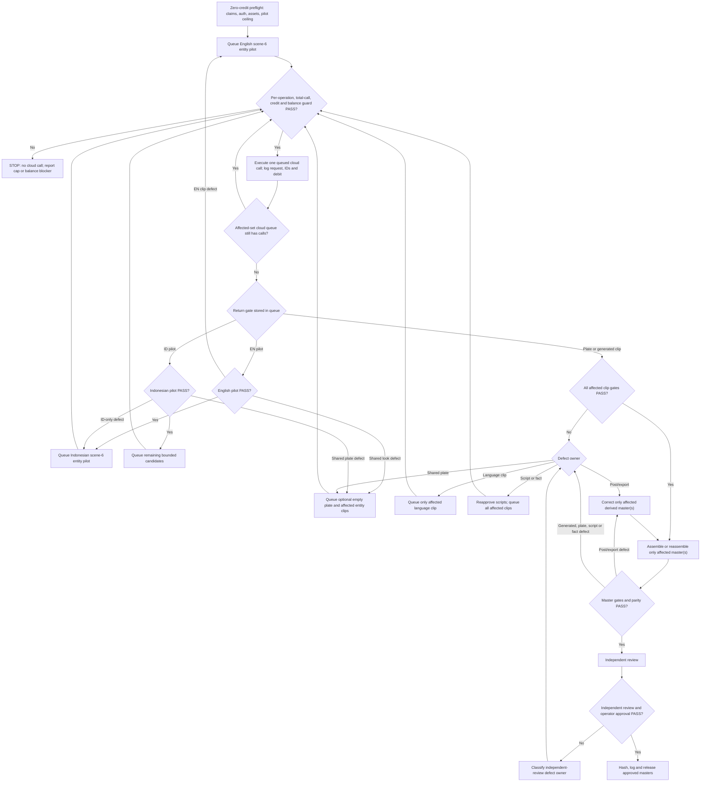

# Zantara visa-revenue bilingual social video — approved-design candidate

**Date:** 2026-07-11

**Branch:** `agent/air-m5/wr3/visa-revenue-video`

**Status:** awaiting operator approval of factual corrections; paid generation is also blocked on Flow re-authentication

**Source carousel:** `/Users/balizero/Desktop/2026-07-10-indonesia-visa-revenue-breaks-rp2-8-trillion-despite-global-4ca7b22b`

## Executive decision

Produce a 42-second, six-scene, vertical editorial film in two language masters:

1. Instagram Stories and Facebook Reel: Zantara speaks English, with burned-in
   English subtitles.
2. TikTok: Zantara speaks Bahasa Indonesia, with burned-in English subtitles.

The masters have creative parity: the same narrative, scene order, retained
duration, composition, editorial overlays, grade, transition map, music, and
ending. Separately generated performances may have different facial,
environmental, and camera micro-motion; literal frame-for-frame identity is not
promised.

The film uses the original approved Zantara identity and her canonical ivory
silk blouse/kebaya with restrained gold floral embroidery and gold earrings.
No jacket or alternative wardrobe is introduced.

“Perfect” means **zero known defects at delivery**. A master is deliverable only
when all factual, identity, speech, visual, audio, subtitle, technical, and
brand gates pass; the defect ledger has no open P0, P1, or P2 issue; and the
independent aesthetic review passes.

## Two gates before paid generation

### 1. Editorial correction gate

The carousel contains claims that conflict with the current official sources.
The video must follow official sources, not repeat those errors:

- Slides `05.png` and `08.png` identify `E33G` as an investor product and use
  `E33H` for remote workers. The current official list places investor visas in
  the `E28` family and identifies `E33G` as the remote-worker Second Home visa;
  `E33H` is not present in the current official list.
- Slide `07.png` says Permenkumham 22/2023 and 11/2024 set the PNBP structure.
  Those instruments govern visas and stay permits. The current core instrument
  for PNBP types and rates is PP 45/2024.
- Slide `06.png` uses truncated totals (`2.645T` and `2.815T`). Proper
  three-decimal rounding is `2.646T` and `2.816T`. To preserve the carousel's
  headline wording without overstating precision, the video uses
  `> IDR 2.815T` and the exact values remain in the audit ledger.
- “Visa extensions” is replaced by “stay-permit extensions.”

Antonello must approve this corrected claim ledger before any video credit is
spent. The carousel itself should be corrected before it and the video are
published as one campaign; changing the carousel files is outside this design
task unless separately authorized.

### 2. Flow authentication gate

The FlowKit service on Pro is alive and its extension socket is connected, but
Google authentication is stale:

- `/health`: HTTP 200, extension connected.
- `/api/flow/status`: connected and Flow key present.
- `/api/flow/credits`: upstream `401 UNAUTHENTICATED` in the response body.

No generation may start until the Flow page is refreshed and authenticated in
Chrome on Pro, the FlowKit extension is clicked, and `/api/flow/credits` returns
a real tier and balance. Before the first paid call, record the starting balance,
the operation price displayed by Flow when available, and an operator-approved
estimated pilot ceiling. The first call then establishes the actual debit for
that exact operation type; an unknown actual debit is never represented as a
preverified fact.

## Deliverables

- `master_meta_en.mp4` — 42 seconds; English speech and English subtitles;
  Instagram Stories and Facebook Reel.
- `master_tiktok_id.mp4` — 42 seconds; Indonesian speech and English subtitles.
- Separate English `.srt` files matching each master.
- A clean poster frame selected from scene 1 or scene 6.
- `generation-manifest.json` with prompts, Flow project/scene/render/media IDs,
  actual resolved model keys, reference assets, credit deltas, selection state,
  speech and trim timecodes, and SHA-256 hashes.
- `defect-ledger.csv` with issue ID, timecode, severity, owner layer,
  correction, affected language(s), render ID, and final status.
- Per-clip and per-master QA reports, including machine-readable `ffprobe`
  output.
- SHA-256 hashes for both final masters.
- One entry per generated asset in
  `research/marketing/flow-asset-log.csv`.

Publishing is manual and is not part of the automated workflow.

## Verified source ledger

Official sources override the carousel wherever they conflict:

- [Directorate General of Immigration H1 2026 release](https://sorong.imigrasi.go.id/di-tengah-isu-global-imigrasi-catatkan-kenaikan-pnbp-6-42-dari-sektor-visa-pada-semester-i-tahun-2026/)
- [Current official Indonesian visa index](https://www.imigrasi.go.id/wna/daftar-visa-indonesia)
- [Official E28A investor visa page](https://www.imigrasi.go.id/wna/daftar-visa-indonesia/E28A)
- [Official E33G remote-worker visa page](https://www.imigrasi.go.id/wna/daftar-visa-indonesia/E33G)
- [Official immigration PNBP fee schedule](https://www.imigrasi.go.id/biaya_imigrasi/index)
- [PP 45/2024 — PNBP types and rates](https://www.peraturan.go.id/id/pp-no-45-tahun-2024)
- [Permenkumham 22/2023 — visas and stay permits](https://www.peraturan.go.id/id/permenkumham-no-22-tahun-2023)
- [Permenkumham 11/2024 — amendment to 22/2023](https://www.peraturan.go.id/id/permenkumham-no-11-tahun-2024)

| Claim                          | Locked form                                                                                                                             |
| ------------------------------ | --------------------------------------------------------------------------------------------------------------------------------------- |
| Reporting period               | H1 2026 / first half of 2026, never full-year 2026                                                                                      |
| Visa issuance                  | 3,924,500 versus 4,209,465 in H1 2025; down 6.77%                                                                                       |
| Visa PNBP                      | IDR 2,815,639,500,000 versus IDR 2,645,712,900,000; up 6.42%                                                                            |
| Rounded display                | `3.92M`, `−6.77%`, `> IDR 2.815T`, `+6.42%`                                                                                             |
| Other immigration PNBP         | ITAS, ITAP, and stay-permit extensions also carry immigration PNBP charges; do not imply they are included in the cited visa-only total |
| Selective policy               | Economic value and security, rather than sheer volume                                                                                   |
| Investor product family        | E28 / E28A–E28G                                                                                                                         |
| Remote-worker product          | E33G                                                                                                                                    |
| PNBP type/rate instrument      | PP 45/2024                                                                                                                              |
| Visa/stay framework            | Permenkumham 22/2023, amended by 11/2024                                                                                                |
| Final editorial interpretation | A modernizing service, paid for by the people it serves                                                                                 |

Rules:

- Use “visa issuance,” not “visa approvals.”
- Never omit “H1” or “first half” from the opening claim.
- Do not imply that E28 or E33G caused the full revenue increase.
- Do not claim that PNBP is earmarked for or directly reinvested into
  Immigration.
- Treat the final line as Bali Zero's editorial interpretation, not a quoted
  government funding statement.
- Do not invent a quotation, decree, official insignia, office sign, or causal
  claim.
- All numerical and regulatory graphics are created in post; Flow never renders
  them.

## Original Zantara identity bible

### Canonical anchors

- `research/marketing/zantara-visual-dataset/v1/approved/anchors/zan_v1_a001_primary_3q_bust_anchor.png`
  — SHA-256 `9b6ecbfe8359d77b307bb5fe667119c569ccb0fa374ccfa69703526e61a57fcb`
- `research/marketing/zantara-visual-dataset/v1/approved/anchors/zan_v1_a002_primary_3q_face_closeup_anchor.png`
  — SHA-256 `e76490b9ddc8bf9cb8e24924f3f13f0304e99b6124c978a8a2a40bdc1b4bb5aa`
- `research/marketing/zantara-visual-dataset/v1/approved/anchors/zan_v1_a005_front_neutral_anchor.png`
  — SHA-256 `1d054bbf01a98f9bf34faf18cdc35a33f17b9b3fc19ff1a7f54719a4c7c71d84`
- `research/marketing/zantara-visual-dataset/v1/approved/anchors/zan_v1_a007_front_serious_anchor.png`
  — SHA-256 `6455cc8c393b587d752e167dd81794050c40bfa8bb9fb02eb783501f651ac026`

### Flow Character

- Name: `Zantara`
- Entity ID: `8f43b818-b717-4e49-ac44-b334817255da`
- Purpose: locks the approved face and server-side Zantara voice.

### Invariants

- The same Indonesian woman, apparent age, facial geometry, and skin tone.
- Long straight black hair with a centre part; brown almond-shaped eyes.
- Gold earrings and canonical ivory silk blouse/kebaya with restrained gold
  floral embroidery.
- Calm, precise, authoritative presence; never influencer-like, tourist-like,
  theatrical, or generic corporate stock.
- Zantara is the only visible person. No crowd, staff, duplicate, reflection
  duplicate, or background face.
- No generated logo, subtitle, label, number, signage, document, or readable UI.
- No false replica of a named government building and no official insignia.

The exterior is a believable modern Indonesian immigration-headquarters-style
high-rise, not a claimed replica. A naturally blue daytime sky is allowed as
photographic content; beach, palm, sunrise, sunset, resort, and digital-nomad
clichés are forbidden.

## Six-scene storyboard and final script

The sole promotable Character route produces eight-second source clips. Every
retained scene is therefore at most eight seconds and is eligible only when its
measured usable duration covers the complete retained duration, including the
required no-dialogue handles. The retained scene durations total exactly 42
seconds. Each selected take must keep the same video and native audio trim
points. Time-stretching, freeze-frame padding, duplicated frames, and synthetic
silence are forbidden; an insufficiently long take is rerendered.

### Scene 1 — The reversal (00:00–00:07.5, 7.5 seconds)

**Delivery:** direct to camera, medium close-up, locked camera, subtle push-in.

**Environment:** refined immigration data gallery with stone, glass, warm
architectural light, and blank surfaces.

**Action:** Zantara delivers the hook, then holds calm eye contact.

**English speech / Meta subtitle**

“In the first half of 2026, fewer visas were issued—yet visa revenue rose.”

**Indonesian speech, with phonetic year and initialism delivery**

“Paruh pertama dua ribu dua puluh enam: visa turun; pe-en-be-pe visa naik.”

**TikTok English subtitle**

“In the first half of 2026, fewer visas were issued—yet visa revenue rose.”

### Scene 2 — The numbers (00:07.5–00:15.5, 8 seconds)

**Delivery:** Zantara in three-quarter profile; natural speaking performance.
The mouth is not the dominant focal point but remains unobstructed and large
enough for manual phoneme and lip-sync review.

**Environment:** immaculate empty visa-processing hall with abstract e-gates
and soft daylight.

**Action:** slow lateral track; post graphics show `3.92M`, `−6.77%`,
`> IDR 2.815T`, and `+6.42%`.

**English speech / Meta subtitle**

“Visas issued: 3.9 million. Visa revenue passed IDR 2.8 trillion.”

**Indonesian speech, with phonetic number and initialism delivery**

“Visa: tiga koma sembilan juta. Pe-en-be-pe: di atas dua koma delapan triliun rupiah.”

**TikTok English subtitle**

“Visas issued: 3.9M. Visa revenue: > IDR 2.8T.”

Percentages remain in post graphics and are not spoken.

### Scene 3 — The wider PNBP system (00:15.5–00:22, 6.5 seconds)

**Delivery:** clean three-quarter profile with the complete facial oval and
mouth unobstructed at all fixed identity samples and throughout key speech
phonemes. The mouth is not the visual focal point; side-on, over-shoulder, or
face-obscuring framing is forbidden.

**Environment:** quiet service architecture with abstract permit-card shapes
and one restrained gold light path.

**Action:** Zantara observes the system; no hand close-up or fake document.

**English speech / Meta subtitle**

“ITAS, ITAP, and their extensions carry separate PNBP charges.”

**Indonesian speech**

“ITAS, ITAP, dan perpanjangannya dikenai PNBP tersendiri.”

**TikTok English subtitle**

“ITAS, ITAP, and their extensions carry separate PNBP charges.”

### Scene 4 — Selective policy (00:22–00:27, 5 seconds)

**Delivery:** direct to camera, medium shot, locked 50 mm look.

**Environment:** minimalist policy briefing room with two blank vertical light
planes.

**Action:** Zantara turns once toward camera and delivers the line without hand
gestures. Post graphics resolve to `ECONOMIC VALUE` and `SECURITY`.

**English speech / Meta subtitle**

“Economic value and security—not volume.”

**Indonesian speech**

“Nilai ekonomi dan keamanan, bukan jumlah.”

**TikTok English subtitle**

“Economic value and security—not volume.”

### Scene 5 — Products and framework (00:27–00:35, 8 seconds)

**Delivery:** slow walking three-quarter profile. The mouth is secondary but
remains unobstructed and large enough for manual phoneme and lip-sync review.

**Environment:** clean digital-processing corridor opening toward a contemporary
city-office view, without laptop, passport, tourist, or digital-nomad clichés.

**Action:** one slow walk. Codes and instruments appear only as post graphics.

**English speech / Meta subtitle**

“E28 is for investors. E33G is for remote workers. Official regulations govern the charges.”

**Indonesian speech, with phonetic code delivery**

“E dua delapan: investor. E tiga tiga ge: pekerja jarak jauh. Tarifnya diatur.”

**TikTok English subtitle**

“E28 is for investors. E33G is for remote workers. Official regulations govern the charges.”

**Post graphics**

- `E28 — INVESTORS`
- `E33G — REMOTE WORKERS`
- `PP 45/2024 — PNBP TYPES/RATES`
- `PERMENKUMHAM 22/2023 + 11/2024 — VISA/STAY FRAMEWORK`

### Scene 6 — Positive close (00:35–00:42, 7 seconds)

**Delivery:** direct to camera, calm half-smile, medium close-up.

**Environment:** Zantara outside a modern immigration-headquarters-style
high-rise on a splendid clear morning; clean blue sky, bright natural daylight,
restrained greenery, no crowd, traffic, or signage.

**Action:** a gentle stabilised pull-back reveals the architecture. The exact
Bali Zero logo, added only in post, holds for at least the final 1.5 seconds.

**English speech / Meta subtitle**

“A modernizing service, paid for by the people it serves.”

**Indonesian speech**

“Layanan berbenah, dibiayai masyarakat yang dilayaninya.”

**TikTok English subtitle**

“A modernizing service, paid for by the people it serves.”

Nothing follows except the short logo hold, the continuous music bed, and
natural exterior ambience. No CTA weakens the statement.

### Diagnostic timing preflight

The following Apple `say -r 165` measurements use Samantha (`en_US`) and
Damayanti (`id_ID`). They are conservative timing diagnostics, not substitutes
for the native Flow pilot. Every line fits its scene after the 0.25-second
pre-dialogue and 0.50-second post-dialogue handles; scene 6 also reserves the
final 1.5 seconds for the logo hold.

| Scene | Retained | Speech window | English diagnostic | Indonesian diagnostic |
| ----- | -------: | ------------: | -----------------: | --------------------: |
| 1     |    7.5 s |        6.75 s |             5.65 s |                5.61 s |
| 2     |    8.0 s |        7.25 s |             5.76 s |                6.78 s |
| 3     |    6.5 s |        5.75 s |             4.37 s |                4.86 s |
| 4     |    5.0 s |        4.25 s |             3.21 s |                3.52 s |
| 5     |    8.0 s |        7.25 s |             6.72 s |                6.54 s |
| 6     |    7.0 s |        4.75 s |             3.49 s |                4.12 s |

The native pilot must still prove natural cadence inside these windows. The
script is shortened or the scene allocation is reapproved before generation if
the actual Character delivery does not fit; speech is never accelerated in
post.

## Flow production architecture

### Primary lane: original Zantara Character entity

Adapt the proven Pro production at
`/Users/nuzantara/Desktop/bz-zantara-id-manifesto-20260707`:

- Endpoint: `/api/flow/generate-video-entities`.
- Entity: `8f43b818-b717-4e49-ac44-b334817255da`.
- Portrait aspect ratio and `PAYGATE_TIER_TIER1P5`.
- Native language-specific Zantara voice and lip sync generated inside each
  Flow clip; no external overdub.
- Optional empty environment/style reference plates passed as
  `reference_media_ids`. Do not pass a start image together with the Character
  entity; that combination is rejected by the current endpoint.

The current local model map resolves `reference_entity_2_video` to
`abra_r2v_8s`. Therefore the manifest and publication copy must not call this
Veo 3.1 unless the returned generation metadata proves that label. The current
portrait image-to-video route maps to
`veo_3_1_i2v_s_fast_portrait_ultra`, but it does not carry the locked Zantara
Character voice. It is visual-diagnostic only and can never be promoted into
either final master. The Character-entity lane is the sole promotable
production lane; persistent entity voice or identity failure is a hard stop.

### Pilot decision

1. Generate one entity-only English scene-6 Character pilot, without a
   reference plate.
2. Inspect the real model metadata, duration, dimensions, frame rate, codecs,
   audio stream, speech, identity, wardrobe, and lip sync.
3. If its environment composition is weak, optionally generate an empty scene-6
   plate through `/api/flow/generate-image`. That endpoint currently uses the
   `NANO_BANANA_PRO` selector, mapped in `models.json` to `GEM_PIX_2`; record
   both the map snapshot and returned metadata. Select a media ID from
   `data.media[].name` and pass it as `reference_media_ids` on the corrected
   entity pilot. This image call and pilot rerender consume their respective
   campaign caps.
4. Correct an English pilot failure only in the English pilot lane. Once it
   passes, generate the entity-only Indonesian scene-6 pilot with the selected
   environment treatment.
5. Correct an Indonesian delivery failure only in the Indonesian pilot lane.
   A shared reference-plate defect invalidates both languages of scene 6.
6. At most one portrait i2v call may compare visual composition from an
   approved Zantara anchor. It remains diagnostic and non-promotable because it
   does not provide the locked bilingual Character voice.
7. Continue only after both entity pilots pass. Each selected pilot counts as
   scene 6 candidate A; it is not an uncounted extra render.

### Prompt contract

Every production prompt must contain:

- Original Zantara Character identity and canonical wardrobe.
- Exactly one subject, one camera move, and one subject action.
- The exact spoken line, with phonetic Indonesian code delivery where needed.
- `After speaking, she remains composed with no further dialogue.`
- `Dialogue and specified room tone or ambience only. Music: none.`
- `Blank architectural surfaces; no subtitles, captions, labels, numbers,
readable text, generated logo, official insignia, or extra person.`

Use a project-specific preflight schema. Do **not** run
`scripts/wr3_prompt_normalizer.py` or the legacy 25-word/cost gate: those checks
cannot represent the identity, dialogue, audio, and scene requirements of this
production. Retain the applicable identity, one-speaker, safety, no-readable-
text, and banned-cliché checks.

## Bounded generation and correction loop

Every cloud-call queue record stores its defect owner, affected scope, operation
type, return gate, and remaining caps. Therefore a plate correction at the
Indonesian pilot stage queues both language clips, not only the Indonesian
clip. No image, entity, diagnostic i2v, retry, or upsampler call can bypass the
budget guard. Local assembly and review loops spend no Flow credits.

### Phase 0 — zero-credit preflight

1. Approve the corrected factual ledger and final scripts.
2. Re-authenticate Flow and verify the real tier and credit balance.
3. Snapshot `/Users/nuzantara/flowkit/agent/models.json` and record its hash.
4. Verify the Zantara entity, anchor hashes, logo, font, output directory, and
   asset log.
5. Rehearse every line at natural pace. Require at least 0.25 seconds with no
   dialogue before speech and 0.50 seconds with no dialogue after speech in the
   retained take; target 0.75 seconds after direct-to-camera lines. Clean,
   approved room tone or exterior ambience continues through these handles.
6. Smoke-test alpha-PNG subtitles, native-audio preservation, 1080×1920 export,
   loudness measurement, and mobile safe-zone templates.
7. Set the per-operation call caps and numeric credit ceiling defined below.
   Stop before whichever limit would be exceeded first.

### Phase 1 — optional environment look development

- The entity-only English scene-6 pilot comes first. Generate a plate only when
  composition needs correction; plates are not a mandatory precondition.
- Generate no more than two empty 9:16 environment/style reference calls per
  scene: maximum 12 image calls across the campaign.
- Use `/api/flow/generate-image`, whose current internal
  `NANO_BANANA_PRO` selector maps to `GEM_PIX_2`; record the map snapshot,
  returned metadata, credit delta, and selected `data.media[].name` value for
  `reference_media_ids`. Never embed Zantara in the plate.
- A reference plate contains no person, text, logo, government insignia, false
  signage, malformed architecture, or platform-unsafe composition.
- Only the scene plates genuinely needed by the Character lane are attached.
  The Character entity, not a person embedded in the plate, supplies Zantara.

### Phase 2 — video baseline

- Two Character-entity candidates per language per scene: 24 baseline video
  calls total.
- The selected English and Indonesian scene-6 pilots count as candidate A.
- One optional i2v visual-diagnostic call is the entire comparison allowance;
  it is never promotable.
- Scenes 1, 4, and 6 show visible speech and require strong lip sync.
- Scenes 2, 3, and 5 keep the speaking mouth secondary but unobstructed and
  sufficiently large for identity, phoneme, and lip-sync inspection, while
  preserving native Zantara audio.
- Each output is immediately downloaded, hashed, probed, logged, and placed in
  an immutable run directory. No render ID is overwritten.

### Phase 3 — targeted retries

- Maximum eight additional targeted Character renders across the entire
  campaign.
- Every failed or corrected pilot rerender consumes this same eight-call retry
  pool; there is no separate pilot retry allowance.
- There is no automatic “Quality” tranche: the current live mapping exposes no
  separate verified Quality model for this lane.
- No render beyond the 24 baseline calls, one optional comparison, and eight
  targeted retries is permitted in this run. If the cap is reached with a hard
  defect, stop and design a separately approved run with a new numeric budget.
- Persistent identity, anatomy, voice, or speech failure after shot
  simplification is a hard stop. Never promote the least-bad take.

### Cloud-operation and credit cap

| Operation                                              | Hard call cap | Cost variable |
| ------------------------------------------------------ | ------------: | ------------: |
| Empty environment image                                |            12 |     `C_image` |
| Character-entity video: 24 baseline plus eight retries |            32 |    `C_entity` |
| Diagnostic portrait i2v, never promotable              |             1 |       `C_i2v` |
| 1080p upsampler, only if validated                     |            12 |   `C_upscale` |
| **All cloud operations**                               |        **57** |             — |

Before the first paid call, record the displayed operation price where Flow
exposes it and approve a small pilot ceiling. The first call of each operation
type is included in its cap and establishes its actual credit delta before a
second call of that type. Before the remaining batch, the operator approves a
numeric worst-case ceiling:

`Cmax = 12 × C_image + 32 × C_entity + 1 × C_i2v + 12 × C_upscale`

or a lower numeric ceiling for the active subset when optional image, i2v, or
upsampler lanes remain unused. Record starting balance, balance after every
call, operation type, model route, and actual delta. Character entity and i2v
calls are never priced with one generic video estimate. Stop at the
per-operation cap, the 57-call overall cap, the approved credit ceiling, or
insufficient balance—
whichever occurs first. No automatic overage is allowed.

## Per-clip gate

Every clip is reviewed at normal speed, 0.5× speed, and frame-by-frame around
speech, hands, face movement, and every suspected transition. Five fixed sample
frames at 10%, 30%, 50%, 70%, and 90% are supporting evidence, not a substitute
for continuous review.

| Area                | Hard requirement                                                                                                                                                                                                                                                                |
| ------------------- | ------------------------------------------------------------------------------------------------------------------------------------------------------------------------------------------------------------------------------------------------------------------------------- |
| Editorial           | Exact agreement with the source ledger; no unsupported cause, product, regulation, quotation, or funding claim                                                                                                                                                                  |
| Identity automation | Direct-camera shots use frontal A007; three-quarter shots use angle-matched A002 and A007. The clip passes only if at least one applicable anchor has a clip mean of at least 0.60 and every sampled frame at least 0.55; all anchor/frame raw scores are retained              |
| Identity holistic   | Face, age, hair, skin, earrings, and canonical outfit match A001/A002/A005/A007; reviewer score 5/5; no duplicate or background person                                                                                                                                          |
| Face observability  | The complete visible facial oval and speaking mouth are unobstructed and large enough at all five fixed samples and key speech phonemes for identity and lip-sync inspection; otherwise rerender                                                                                |
| Identity target     | Direct-camera similarity of 0.80 is an advisory target until calibrated against approved moving footage; it is not misrepresented as an implemented hard check                                                                                                                  |
| Anatomy and texture | No visible eye, tooth, lip, finger, limb, hair, fabric, object, architecture, reflection, morphing, or duplication defect at 1×                                                                                                                                                 |
| Composition         | Intended shot and action; stable horizon; essential content inside the relevant platform collision map                                                                                                                                                                          |
| Light and colour    | Natural skin, controlled ivory fabric, no temporal flicker, no green/cyan cast, no clipped face or garment                                                                                                                                                                      |
| Speech              | Manual transcript equals the approved line with zero insertion, omission, substitution, or added speaker; no unapproved sound is present; ASR is diagnostic only                                                                                                                |
| Lip sync            | Manual frame-step review shows consonant/vowel closures within two source frames (`2 / source_fps` seconds; 83.3 ms at the current expected 24 fps); mouth is settled before and after speech. SyncNet is supporting evidence only if its installed version is first calibrated |
| Indonesian          | Native reviewer passes pronunciation, code pronunciation, naturalness, register, and meaning; average at least 4.7/5 and no category below 4.5                                                                                                                                  |
| Audio               | Correct single voice, clean room tone/ambience, no generated music, clipping, click, hum, warble, missing phoneme, or abrupt cut                                                                                                                                                |
| Technical           | Decodable portrait video and native audio; actual duration, dimensions, FPS, codec, sample rate, channels, colour metadata, and resolved model recorded with `ffprobe` and raw Flow response                                                                                    |
| Usable duration     | Measured source duration is at least the full retained scene duration, and the retained interval contains the required no-dialogue handles; no time-stretch, freeze frame, duplicated-frame padding, or synthetic-silence padding                                               |
| Handles             | Manifest records `speech_start`, `speech_end`, `trim_in`, and `trim_out`; retained edit has at least 0.25 s pre-speech and 0.50 s post-speech with clean approved ambience and no dialogue                                                                                      |

A high score in one category never compensates for failure in another.

## Defect severity and aesthetic rubric

- **P0 — release blocker:** factual/legal error, wrong person, identity collapse,
  corrupt or missing media, wrong language, unsafe/false government
  representation, or privacy/provenance violation.
- **P1 — visible or audible production defect:** anatomy, morphing, lip-sync,
  transcript, voice, audio seam, clipping, subtitle, timing, logo, or encoding
  defect visible/audible at normal consumption speed.
- **P2 — quality or brand defect:** composition, performance, continuity, grade,
  motion, ambience, typography, safe-zone, or brand-tone weakness noticeable in
  a deliberate review.

Two reviewers, one of whom did not author the prompts, score identity,
composition, light/colour, motion/continuity, performance, and brand tone. The
master requires an average of at least 4.7/5 with no category below 4.5 and zero
open P0/P1/P2 issue.

## Minimum-scope correction router

| Defect owner                       | Invalidated scope                                                            | Correction                                                                                                                                                                                                                                                  |
| ---------------------------------- | ---------------------------------------------------------------------------- | ----------------------------------------------------------------------------------------------------------------------------------------------------------------------------------------------------------------------------------------------------------- |
| Post/export                        | Affected derived master(s) only                                              | Correct graphics, subtitle, trim, grade, logo, music, loudness, or encode; re-export only the affected master(s) and rerun each complete master gate                                                                                                        |
| Language-specific clip             | That language and scene                                                      | Rerender only the affected clip; then invalidate every master derived from it                                                                                                                                                                               |
| Shared environment/reference plate | Both languages of that scene                                                 | Correct the plate and rerender both language clips for that scene                                                                                                                                                                                           |
| Script or factual ledger           | Both languages wherever the claim appears                                    | Correct both scripts/overlays and invalidate all affected clips and masters                                                                                                                                                                                 |
| Identity or wardrobe drift         | Affected generated clip; both languages only if caused by a shared reference | Reassert the Character entity, simplify movement/composition, and rerender; never inpaint a new face or disguise wardrobe drift in post                                                                                                                     |
| Anatomy defect                     | Affected generated clip                                                      | Remove the gesture, keep hands out of frame, simplify motion, and rerender                                                                                                                                                                                  |
| Generated text/logo/signage        | Affected generated clip or shared plate                                      | Remove text-bearing surfaces and rerender; never repair official-looking gibberish in post                                                                                                                                                                  |
| Constant measured A/V offset       | Affected clip                                                                | One documented constant audio PTS shift is allowed, with no speed change, resampling, time-stretch, duplicated frame, or synthetic padding; rerun duration, handles, transcript, and lip-sync gates, and rerender if offset still exceeds two source frames |
| Spoken-word error                  | Affected language clip                                                       | Rerender; never hide wrong speech behind correct subtitles                                                                                                                                                                                                  |

Selected clips and all derived artifacts are content-addressed. If a selected
clip hash changes, extracted audio, subtitle timings, graphics timings, preview,
master, QA report, and final hashes are regenerated; stale derivatives are
never reused.

## Dedicated bilingual assembly

Do not use `scripts/wr3_ffmpeg_wrapper.py`: its current path removes native clip
audio and substitutes an external voice track. Build a dedicated assembler
from the proven native-manifesto post lane with these rules:

1. Trim each selected clip's video and native audio together using the recorded
   in/out points.
2. Concatenate the six trimmed A/V segments to exactly
   `7.5 + 8 + 6.5 + 5 + 8 + 7 = 42` seconds.
3. Keep scene boundaries identical across masters within one source frame while
   allowing language-specific subtitle cue timing. Preserve the rational frame
   rate proven by the approved Character pilot across every selected clip and
   both masters; the current reference production is `24/1`. Do not convert the
   frame cadence merely to reach 30 fps.
4. Request dialogue plus scene ambience and no music from Flow. Add one
   continuous original or licensed music bed in post; never stack six generated
   music beds. Lock the music file path, licence note, and SHA-256 before
   assembly.
5. Render phrase-level English subtitle cards as alpha PNG overlays, preserving
   the native audio. Montserrat is mandatory; no silent fallback is allowed.
6. Split subtitles by meaning and breath. Maximum two lines, 32 characters per
   line where practical, maximum 17 characters per second, at least one-second
   display where speech permits, and no split inside a number, code, or unit.
7. Use only Bali Zero tokens in the design manifest:
   `color.bg.antracite`, `color.bg.black`, `color.text.white`,
   `color.accent.yellow`, and `color.status.red` only for genuine critical
   emphasis or the exact logo.
8. Use separate collision maps for Instagram Stories, Facebook Reel, and
   TikTok. Validate overlays against current native UI previews; do not rely on
   one universal rectangle.
9. If Flow output is below 1080×1920, first test the mapped
   `veo_3_1_upsampler_1080p` on one selected clip. Treat it as a video-only
   transform: discard any upsampler audio and remux the exact native audio from
   the selected source clip. `ffprobe` must show the exact same rational frame
   rate and frame count as the source; a frame-difference cadence scan must find
   no added, dropped, or duplicated frame. Start PTS must be preserved and end
   PTS/duration may differ by at most one source-frame period. Rerun the complete
   per-clip gate, including identity, speech, handles, and measured A/V offset.
   If any check fails, reject the upsampler and use deterministic local Lanczos
   on the selected video while preserving its native audio and timestamps.
   Every upsampler attempt consumes the 12-call upsampler cap.
10. Add the exact Bali Zero logo only in post, undistorted, with correct
    clearspace and at least a 1.5-second final hold.
11. Normalize each master to `−14.0 LUFS-I ±0.5`, true peak at or below
    `−1.0 dBTP`; cross-master loudness difference must be at most 0.5 LU.

### Locked post assets

- Canonical logo source on Air:
  `/Users/balizero/.agents/skills/bali-zero-brand/assets/logo.png`
  SHA-256 `2c60600b8bd1c0a331d5064ef090338023e189cbbcb3dc2fc9edf490596c95a5`.
  Phase 0 copies this exact file to
  `/Users/nuzantara/Desktop/bz-zantara-visa-revenue-20260711/assets/bali-zero-logo.png`
  on Pro and hard-fails unless the staged hash is identical.
- Montserrat variable font on Pro:
  `/Users/nuzantara/Library/Fonts/Montserrat[wght].ttf`
  SHA-256 `0f7b311b2f3279e4eef9b2f968bcdbab6e28f4daeb1f049f4f278a902bcd82f7`
- Music: unresolved at design time; must be original or licensed and locked by
  absolute path, licence note, and SHA-256 during Phase 0. Assembly hard-fails
  if this field remains empty.

## Master gate

| Gate            | Required result                                                                                                                                                                                                                                                                                                                                         |
| --------------- | ------------------------------------------------------------------------------------------------------------------------------------------------------------------------------------------------------------------------------------------------------------------------------------------------------------------------------------------------------- |
| Runtime         | 42.00 seconds ±0.10; boundaries within ±2 frames                                                                                                                                                                                                                                                                                                        |
| Script          | Exact approved speech and overlays; final line unchanged                                                                                                                                                                                                                                                                                                |
| Subtitles       | Exact English, phrase-level timing, maximum two lines, contrast at least 7:1, no face/logo/UI collision, maximum 17 CPS                                                                                                                                                                                                                                 |
| Audio           | `−14.0 LUFS-I ±0.5`, true peak ≤ `−1.0 dBTP`, speech clearly above music, no clipping/click/hum/warble/pump/seam                                                                                                                                                                                                                                        |
| Continuity      | Same Zantara identity and outfit; coherent architecture, grade, graphics, music, and transitions; no flash or black frame                                                                                                                                                                                                                               |
| Positive close  | Final seven seconds show the bright exterior and end only on the exact positive statement and logo hold                                                                                                                                                                                                                                                 |
| Creative parity | Same 42-second scene map, factual data, overlays, grade, transition map, music, and intent; generated micro-motion may differ                                                                                                                                                                                                                           |
| Encoding        | MP4, 1080×1920, 9:16, H.264 High 4.1, `yuv420p`, BT.709, progressive, SAR 1:1, CFR matching the approved Character pilot and identical across both masters (current expected rate `24/1`), no frame-rate conversion or cadence duplication, AAC-LC 48 kHz stereo, 192–256 kbps, video 8–12 Mbps, `faststart`, no rotation metadata, target below 100 MB |
| Defects         | Zero open P0/P1/P2; every hard gate PASS; aesthetic average ≥4.7/5 and no category <4.5                                                                                                                                                                                                                                                                 |

## Independent final review

1. Independent visual reviewer: identity, outfit, anatomy, camera, motion,
   light, architecture, transitions, and brand tone.
2. Audio reviewer: exact transcript, Zantara voice, lip sync, music ducking,
   loudness, and phone-speaker intelligibility.
3. Native Indonesian reviewer: pronunciation, naturalness, journalistic
   register, code delivery, and semantic fidelity.
4. Editorial reviewer: every claim and graphic against the official source
   ledger, not only the original carousel.
5. Antonello: identity, outfit, tone, exterior scene, positive close, and final
   approval.

After authorization, inspect private/draft uploads on each platform and review
the recompressed files on a real phone once with headphones, once through the
phone speaker, and once muted. At publishing time, verify the current Meta and
TikTok AI-disclosure controls and enable the platform-native disclosure where
required.

## Provenance and disclosure

- Preserve SynthID and do not deliberately strip provenance metadata.
- Record the actual model key returned for every render.
- If the selected assets are proven to use Veo 3.1, caption disclosure:
  `AI video assets generated via Veo 3.1 (Google Labs Flow).`
- Otherwise use the accurate neutral disclosure:
  `AI video assets generated with Google Labs Flow.`
- Keep all selected and rejected render IDs, prompts, hashes, and credit deltas
  in the manifest.

## Platform basis

- [Instagram Reels size and aspect-ratio guidance](https://www.facebook.com/help/instagram/1038071743007909?locale=en_GB)
- [Instagram Stories sticker guidance](https://www.facebook.com/help/instagram/192168966243613)
- [Meta Reels guidance](https://www.facebook.com/business/ads/facebook-instagram-reels-ads)
- [TikTok creative best practices](https://ads.tiktok.com/help/article/creative-best-practices?lang=en)

Platform rules and AI-disclosure controls are reverified at publication time;
these links do not replace a current in-app preview.

## Acceptance condition

The production is complete only when:

- Antonello approves the corrected claim ledger and scripts.
- The companion carousel is corrected before campaign publication.
- Flow is authenticated and the bounded credit plan is approved.
- Both language pilots prove the selected lane.
- Every selected clip passes its complete gate.
- Both 42-second masters pass independently and creative parity passes.
- The defect ledger contains zero open P0, P1, or P2 issue.
- Independent reviewers and Antonello sign off.
- Final hashes, asset log, source ledger, and provenance records are stored.

There is no `PASS-WITH-NOTES` for this production.
