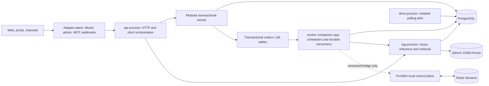

# Nuzantara Backend: Modular Kernel and Dedicated Worker Plane

This specification defines the next architecture step for Nuzantara. It is a
decision record and a set of falsifiable gates, not an implementation plan.
The design preserves the parts that currently work, removes duplicated runtime
ownership, and establishes evidence thresholds for any future service split.

## 0. Executive decision

**Decision: GO on incremental hardening; NO-GO on a microservice rewrite.**

Nuzantara will remain one monorepo and, initially, one backend code image. The
backend will be shaped into three explicit runtime planes:

1. a **modular transactional kernel** for authoritative business decisions;
2. a **dedicated worker plane** for durable background work;
3. an **adapter plane** for HTTP, Mouth, admin, MCP, and channel-specific I/O.

The existing `api`, `rag`, and `drive` Fly process groups remain. A `worker`
runtime is deployed in a companion Fly app from the exact same immutable image
digest and coordinated release. This small app boundary is required because
Fly app secrets are available to every Machine in one app; it gives the worker
a scoped PostgreSQL role without creating a separate codebase, image, or
business service. Long-running jobs are moved out of FastAPI lifespans one at a
time, behind ownership switches and rollback gates. PostgreSQL remains the
source of truth for cloud transactional jobs and domain events. Redis Streams
remains the local Pro/Mini control-plane bus. Kafka, Kubernetes,
database-per-service, repository splitting, and runtime microfrontends are
explicitly rejected for this stage.

No independent service is authorized by this spec. A capability may be
extracted only after it passes the extraction gate in section 14.

### 0.1 Panel outcome

The original draft received two `GO-WITH-CHANGES` verdicts and one adversarial
`NO-GO`: Fable 5 at 82% confidence, Gemini 3.1 Pro at 85%, and GLM 5.2 at 72%.
The direction survived; the original cutover contract did not. This reviewed
draft closes the accepted blockers by:

- installing fencing in legacy claim and side-effect paths fleet-wide and
  observing the compatible build before any ownership cutover;
- making rollback a new atomic ownership generation, not a flag reversal;
- replacing unsupported exactly-once claims with explicit provider capability,
  reconciliation, and `outcome_unknown` semantics;
- forbidding durable fan-out on the global-ack outbox;
- using a companion Fly app for enforceable process-level credentials;
- adding Fly-visible worker health, absolute resource budgets, and executable
  inventory gates.

The raw reviews and finding-by-finding disposition remain part of this decision
record. They approve only the historical bytes recorded by that panel. The spec
and execution plans have since been materially amended to make the rollout
executable; therefore the current implementation authority is **pending a fresh
hash-bound Fable 5, Gemini 3.1 Pro High, and GLM 5.2 review of one immutable
spec-and-plan packet**. The owner's active goal authorizes execution after that
gate passes, including the protected compatibility and receipt-activation
merges/deploys, exact-digest staging proof, ordered production cutovers, heavy
production verification, and later deletion release described by the
implementation and rollout plans.

## 1. Verified ground

All facts in this section were re-checked against repository state at commit
`cdaf6bb8553639498a0d333a01c1cc707844ac88` on 2026-07-17.

### 1.1 Current runtime topology

`apps/backend-rag/fly.toml` builds one Docker image and starts three process
groups:

| Process | Entrypoint                          | Current role                                     | Public HTTP             |
| ------- | ----------------------------------- | ------------------------------------------------ | ----------------------- |
| `api`   | `backend.app.main_api:app`          | light/public routers plus API-side schedulers    | yes                     |
| `rag`   | `backend.app.main_rag:app`          | heavy routers plus the full application lifespan | no, Fly private network |
| `drive` | `backend.workers.drive_poll_worker` | periodic Drive polling                           | no                      |

`api` and `rag` have distinct VM allocations. `api` and `rag` also have
separate `/data` mounts. They still share code, PostgreSQL, Qdrant, Redis,
deployment cadence, and most business concepts. The current system is therefore
a **process-partitioned modular monolith with distributed-monolith pressure**,
not a classical monolith and not a microservice system.

### 1.2 Routing has more than one source of operational truth

The repository already contains a 474-line `ROUTER_MANIFEST` with `api`/`rag`
metadata and parity tests. Runtime registration still lives in a separate
979-line `router_registration.py`, while `backend/app/rag_proxy.py` keeps an
independent `HEAVY_PREFIXES` tuple. Mouth adds a generic 434-line catch-all API
proxy, and `apps/mouth/src/proxy.ts` contains 506 lines of host/path policy.

This means the manifest currently **checks** duplicated declarations but does
not yet **generate** every runtime routing decision. The parity tests reduce
risk, but a route's placement is still represented in more than one artifact.

Verified lexical inventory, used only as a coupling indicator:

- 157 Python files under `backend/app/routers/`;
- 67 router files directly import `asyncpg` under the pinned lexical command;
- 106 router files contain SQL operation keywords;
- 31 first-level directories exist under `apps/`, while the root package lists
  seven workspaces.

The SQL counts are not a semantic audit: comments, helpers, and false positives
may be included. They are a ratchet baseline, not a claim that every match is a
violation.

The direct-import baseline is reproducible with:

```bash
LC_ALL=C rg -l '^\s*(from asyncpg(\.|\s)|import asyncpg(\s|$|,))' \
  apps/backend-rag/backend/app/routers --glob '*.py' | LC_ALL=C sort
```

At the verified commit it produces 67 paths and SHA-256
`4002789a56196bd8cdce5440c1c596191f4e349ae6a91cb7e9f3d8ca8d24991a`
when the newline-delimited output is hashed.

### 1.3 Web lifespans own durable background work

`main_api.py` starts the Notification Scheduler and multiple WhatsApp outbox
loops. `main_rag.py` uses the full lifespan in `app_factory.py`, which starts a
workflow queue worker and legal ingestion worker. `service_initializer.py`
contains additional schedulers and long-running tasks. Relevant file sizes are:

| File                                       | Lines |
| ------------------------------------------ | ----: |
| `backend/app/main_api.py`                  |   253 |
| `backend/app/setup/app_factory.py`         |   724 |
| `backend/app/setup/service_initializer.py` | 1,805 |

`fly.toml` already records why multiple Uvicorn workers duplicated background
loops and DB pools. The `drive` process proves that Nuzantara can isolate a
background workload without splitting the repository or code image. The next
step is to make that pattern systematic.

### 1.4 Messaging semantics are fragmented

Nuzantara currently has several valid but overlapping mechanisms:

- `backend/services/events/`: PostgreSQL `LISTEN/NOTIFY`, an
  `events_outbox` table, and in-process handler dispatch;
- `backend/services/bridge/outbox.py`: a separate pull/ack bridge outbox;
- specialized queues such as the WhatsApp and workflow outboxes;
- `infra/eventbus/`: Redis Streams consumer groups for the Pro/Mini local
  automation plane;
- request-scoped or in-process async tasks for non-durable work.

The cloud event outbox is at-least-once and asks handlers to deduplicate on
`_outbox_id`. Its row has one global `consumed_at`/`consumer_id`, so it models
single-consumer completion, not durable multi-subscriber fan-out. Reconnect
replay defaults to a 60-minute maximum age and acknowledges stale payloads to
suppress further replay.

The Redis subscriber recovers entries pending for the same consumer ID and has
a DLQ, but it does not currently call `XAUTOCLAIM` or `XCLAIM`; a message left
pending by a dead consumer therefore lacks an explicit cross-consumer reclaim
path.

### 1.5 Existing scars this design must preserve

The design treats these repository-documented failure classes as constraints:

- public routers registered in the wrong process and returning production 404;
- a guardrail or command appearing green because it never ran;
- multiple web workers duplicating schedulers and exhausting resources;
- cold-start failures caused by eager imports;
- workers present in code but not owned by a live runtime;
- stale checkout/runtime copies diverging from the authoritative source.

The architecture must make ownership and liveness observable, not merely
documented.

## 2. Goals and non-goals

### 2.1 Goals

1. Give every route, job, event, and datastore write one declared owner.
2. Keep authoritative business transactions inside explicit bounded modules.
3. Remove durable work from HTTP lifespans without a flag-day migration.
4. Make restarts, retries, replay, and duplicate delivery safe by contract.
5. Preserve lazy startup, current public API contracts, and the frozen
   `text-embedding-3-small` 1536-dimensional vector space.
6. Make a future service extraction a measured decision rather than a rewrite
   aspiration.
7. Keep Mouth, MCP, admin, and channel integrations as adapters rather than
   parallel business-logic layers.

### 2.2 Non-goals

- no Kafka, RabbitMQ, NATS, or Kubernetes;
- no database-per-service;
- no split repositories;
- no big-bang directory rewrite;
- no replacement of PostgreSQL, Qdrant, Redis, Fly.io, or Vercel;
- no embedding-model change or vector re-index;
- no runtime microfrontend federation;
- no automatic migration of every existing direct SQL call;
- no simultaneous activation of old and new scheduler owners;
- no production deployment authorized by architecture direction alone; the
  explicit active-goal authorization and falsifiable release gates in section
  20 govern implementation and rollout.

## 3. Architecture invariants

The following invariants are mandatory throughout migration.

### I1. One authoritative owner

At any instant, a route, periodic schedule, queue consumer, or side effect has
exactly one active runtime owner. Shadow mode may observe eligibility and emit
metrics, but it may not claim work or execute side effects.

For a durable workload, "owner" means the database-backed ownership grant for
one runtime profile and fencing generation, not one coroutine or one process.
The grant may permit the cataloged internal `concurrency`; job leases coordinate
those replicas. Telemetry distinguishes legitimate same-grant concurrency from
overlap between different owners or generations.

### I2. Transactional truth stays transactional

If a state change and its event must be atomic, both are written in one
PostgreSQL transaction. `NOTIFY` is a wake-up optimization; the durable row is
the source of truth.

### I3. Commands and events are different contracts

A command/job has one logical handler. A domain event may have many durable
subscribers. They must not share the same acknowledgement model.

### I4. Adapters do not own policy

HTTP routers, Mouth BFF routes, MCP tools/chains, webhooks, and channel adapters
may authenticate, validate, translate, and call application services. They may
not become an alternative system of record or make independent pricing,
eligibility, compliance, or case-state decisions.

### I5. New boundaries use ports, not shared internals

New or materially changed cross-module calls use typed application interfaces.
Direct imports of another module's repository, ORM model, or private service are
forbidden. Existing exceptions remain visible and are reduced by ratchet.

### I6. Failure is explicit

Every worker declares timeout, lease, retry budget, idempotency key, terminal
failure state, operator replay path, kill switch, and liveness signal.

### I7. PII follows data sovereignty

Events and jobs carry stable IDs and minimum necessary metadata. They do not
copy raw passports, KTPs, NPWP data, credentials, WhatsApp/OSINT bodies, or
document blobs into logs, reusable prompts, Redis Streams, or review artifacts.
Pro-local data remains on Pro; remote workers receive only an authorized,
redacted contract or a reference resolved inside the owning boundary.

## 4. Target topology



### 4.1 Runtime planes

| Plane                  | Owns                                                                                  | Must not own                                                                    |
| ---------------------- | ------------------------------------------------------------------------------------- | ------------------------------------------------------------------------------- |
| `api`                  | public HTTP, auth enforcement, request validation, short application calls, RAG proxy | perpetual loops, cron schedules, durable queue consumption                      |
| `rag`                  | heavy retrieval/inference HTTP endpoints, Qdrant access, bounded RAG orchestration    | business-system-of-record policy, perpetual schedulers, generic workflow queues |
| `worker` companion app | schedules, durable commands, outbox dispatch, retries, DLQ/replay, job telemetry      | public HTTP, user-session state, duplicated domain policy                       |
| `drive`                | current Drive polling workload during migration                                       | unrelated jobs; it is not a generic dumping ground                              |
| Pro/Mini local         | sovereign local automation and Redis Streams control plane                            | cloud transactional truth or replicas of client PII                             |

The `worker` app uses the same immutable image digest and coordinated release as
`api` and `rag`, but a distinct Fly app identity and secret set. It has no
public service. This creates fault, resource, and credential isolation without
paying for a separate repository, image pipeline, or business-service contract.
Separate images or deploy cadences are considered only through the extraction
gate.

## 5. Modular transactional kernel

### 5.1 Initial bounded contexts

The initial boundaries are conceptual and enforced for new/change work before
any mass file move.

| Context                | Authoritative responsibility                                                       | Examples of outputs                            |
| ---------------------- | ---------------------------------------------------------------------------------- | ---------------------------------------------- |
| Identity & Access      | identities, sessions, roles, tenant/client authorization                           | authorization decisions, actor IDs             |
| CRM & Practices        | client/account/practice lifecycle and case ownership                               | practice state, assignments, deadlines         |
| Compliance & Journey   | regulatory obligations, gates, evidence state, escalation                          | obligation/gate decisions, journey transitions |
| Pricing & Catalog      | authoritative product/visa/service identity and price resolution via `PricingTool` | quote inputs, price/version references         |
| Portal & Notifications | portal-facing read models and notification intent                                  | portal projections, notification commands      |

RAG, ingestion, messaging, automation, and analytics are capabilities around
the kernel. They may advise or execute, but they do not silently overwrite an
authoritative decision owned by a kernel context.

The implementation vocabulary has two independent, non-interchangeable axes:
`BusinessContext`/`business_context` identifies bounded business and data
ownership, while `RuntimeOwner`/`runtime_owner` identifies a process eligible
to execute a workload (`api`, `rag`, `worker`, or `drive`). Route and table
catalogs use `business_context`; workload grants, expected-instance census
rows, heartbeats, claims, leases, and ownership compare-and-set operations use
`runtime_owner`. Table write eligibility is a separate executable
`writer_bindings` policy and never a second business-ownership axis. No
compatibility alias between these axes is permitted.

### 5.2 Dependency direction

For new or materially changed code, dependency direction is:

```text
adapter/API -> application service -> domain policy -> repository port
                                              infrastructure adapter -> PG/Qdrant/external API
```

The following are forbidden in new or materially changed code:

- a router directly constructing SQL or opening an `asyncpg` connection;
- one bounded context writing another context's tables;
- Mouth, MCP, or a webhook duplicating kernel validation or price logic;
- a worker importing a router to reach business logic;
- a domain policy importing FastAPI, Fly, Vercel, or channel-specific types.

The 67 direct-`asyncpg` router files produced by the pinned command in section
1.2 are the initial lexical baseline. Phase 0 checks in the generated path list
and hash. The ratchet rule is `new_count <= baseline`, with an exception file
requiring a named owner, reason, and expiry. This spec does not demand a
one-shot cleanup.

### 5.3 Shared database without shared ownership

PostgreSQL remains one operational database. Logical ownership is introduced
before physical separation:

- every mutable table is assigned one owning bounded context;
- cross-context writes go through an application service or command;
- cross-context reads prefer a typed query port or purpose-built read model;
- transactions stay inside one context unless an existing atomic business
  invariant requires a documented composition service;
- schema migrations identify the owning context and compatibility window.

The inventory is executable. Every non-system table has exactly one
`TableOwnership` record with `table_name`, `business_context`, a non-empty
sorted set of discriminated `writer_bindings`, a non-empty sorted set of
`migration_sources`, and an optional dated legacy exception. Every binding
has a stable, unique `binding_id`; the tuple is sorted by that ID. Every
binding owns a non-empty `operation_interfaces` map from operation name to a
non-empty sorted set of interface references. A Python reference is an
absolute `module:symbol`; a migration-defined callable is
`sql:<schema>.<function>`. No other reference grammar is accepted. An
operation/interface pair must belong to exactly one binding. A writer binding
is exactly one of:

- `static`: exactly one `runtime_owner`; candidate lists and workload fields are
  forbidden. An ordinary table has exactly one static binding covering its
  complete write surface. A migrated table may retain a narrowly named static
  producer/admin binding (for example `enqueue`) while its claim/effect
  transitions use a separate grant-fenced binding.
- `grant-fenced`: one or more workload bindings. Each binding names a cataloged
  workload, an explicit non-empty sorted `candidate_runtime_owners` set, and an
  operation-to-allowed-ownership-mode map. The candidate set is eligibility,
  not authority: each state-changing call must read the live
  `OwnershipGrant`, require an exact workload, `runtime_owner`, generation and
  permitted mode match, and fail closed when the grant store is unavailable.
  `off` and `shadow` never permit a mutation; a new claim/schedule requires
  `active`; only a claim already carrying the same owner and generation may use
  an explicitly cataloged `active|draining` late-effect or reconciliation
  operation. `operation_modes` and `operation_interfaces` must have identical
  sorted key sets.
- `heartbeat-evidence`: an exact `workload_candidates` map from each workload
  to its non-empty sorted candidate set whose only operation is
  `heartbeat-upsert` and whose only write interface is the self-identity
  heartbeat upsert. It requires a matching expected-instance census row and
  may write only build/liveness evidence. It cannot change a grant, census,
  audit, job, claim, schedule, or side effect. This exception is necessary so
  a reviewed target candidate can prove compatibility before it becomes the
  active grant; it conveys no work authority.

Within one table, an interface reference may not appear in two different
bindings, even under different operation names. A shared mutable table used by
multiple workloads therefore exposes one workload-specific mutation wrapper
per grant-fenced binding. Each wrapper hard-codes its workload and operation,
performs the exact live-grant check, and owns the mutation transaction. A
caller-selected workload passed to one generic writer is forbidden; common
helpers behind the wrappers must be pure/read-only and are not cataloged as
write authority. This rule applies to the shared effect-ledger projection and
attempt tables introduced later: workflow, legal, notification, and WhatsApp
receive distinct wrapper symbols rather than sharing one generic writer symbol.

The canonical catalog shape is therefore fixed rather than inferred:

```json
{
  "table_name": "<qualified-table>",
  "business_context": "<BusinessContext>",
  "writer_bindings": [
    {
      "binding_id": "<stable-id>",
      "kind": "static",
      "runtime_owner": "<RuntimeOwner>",
      "operation_interfaces": {
        "<operation>": ["<interface-reference>"]
      }
    },
    {
      "binding_id": "<stable-id>",
      "kind": "grant-fenced",
      "workload_name": "<catalog-workload>",
      "candidate_runtime_owners": ["<RuntimeOwner>"],
      "operation_modes": { "<operation>": ["active"] },
      "operation_interfaces": {
        "<operation>": ["<interface-reference>"]
      }
    },
    {
      "binding_id": "<stable-id>",
      "kind": "heartbeat-evidence",
      "workload_candidates": { "<catalog-workload>": ["<RuntimeOwner>"] },
      "operation_interfaces": {
        "heartbeat-upsert": ["<interface-reference>"]
      }
    }
  ],
  "migration_sources": ["<repo-relative-sql-path>"],
  "legacy_exception": null
}
```

The three displayed binding variants describe the union schema; a real table
contains only the binding instances required for its complete write surface.
Fields belonging to another variant are invalid. The operation set of a
binding is exactly the sorted key set of `operation_interfaces`; for a
`grant-fenced` binding it must also equal the key set of `operation_modes`.

The grant, expected-instance census, and ownership-audit tables are bootstrap
control-plane authority. Their mutations use the `static` policy and narrow,
protected, audited CAS/register/retire interfaces; making them grant-fenced by
the grant they create would be a self-authorization cycle. The heartbeat table
uses `heartbeat-evidence`. Migrated job/state tables use `grant-fenced` for the
workload transitions introduced by the migration while preserving explicitly
cataloged static producers where needed. Thus no table has an unbounded
multiwriter policy, no producer is accidentally blocked by a consumer grant,
and no static writer claim is used to pretend that both an old and candidate
runtime own a migrated workload.

The manifest checker validates this tagged schema, rejects overlapping or
unclassified operation/interface pairs, resolves every interface, and compares
each grant binding's candidate set exactly with the corresponding
`WorkloadSpec.candidate_runtime_owners`. Migration lint requires a per-table
ownership annotation block for every `CREATE TABLE` and ownership-affecting
`ALTER TABLE`; the block must reproduce the matching catalog policy. Schema
introspection fails CI when a table is missing, duplicated, assigned to an
unknown business context, contains mixed binding fields, has overlapping or
missing write coverage, has an empty/wildcard candidate set, references an
unknown workload/interface, or has policy/catalog drift. Source ratchets reject
writes outside the exact binding that owns the operation and reject a declared
grant-fenced interface that bypasses the shared grant-authority check. This is
authorization, not documentation: a catalog candidate cannot perform a fenced
operation unless its runtime evidence satisfies that binding at the moment of
the operation.

## 6. Canonical route topology

`ROUTER_MANIFEST` becomes executable configuration rather than a parallel
inventory. Each route entry must be able to derive:

- module and router attribute;
- process group (`api`, `rag`, or both);
- public/internal exposure;
- proxy target and exact path-match semantics;
- auth class;
- streaming flag and timeout class;
- optional feature condition;
- owning bounded context.

The migration keeps the public `include_routers()`,
`include_light_routers()`, and `include_heavy_routers()` functions for backward
compatibility, but they read only the catalog. `HEAVY_PREFIXES` is generated
from the same catalog or replaced by catalog lookup. No hand-maintained copy is
allowed.

Mouth's catch-all remains a transport adapter. It does not receive a second
copy of route ownership. A generated, checked-in topology snapshot may be used
for cross-language documentation and contract tests, but Python runtime
behavior remains derived from the canonical catalog.

Required mutation test: adding a synthetic `rag` route to the catalog must make
it appear in heavy registration and API proxy selection without editing any
other route list. Removing the entry must make both disappear.

## 7. Dedicated worker plane

### 7.1 Worker catalog

A canonical worker catalog declares for every durable workload:

| Field                      | Meaning                                                                                                                                                     |
| -------------------------- | ----------------------------------------------------------------------------------------------------------------------------------------------------------- |
| `name`                     | stable worker identity                                                                                                                                      |
| `business_context`         | bounded business/data owner                                                                                                                                 |
| `runtime_owner`            | process currently granted execution                                                                                                                         |
| `candidate_runtime_owners` | explicit bounded processes eligible across a cutover                                                                                                        |
| `runtime_profile`          | `cloud-worker`, `drive`, or `local-pro-mini`                                                                                                                |
| `queue_or_schedule`        | durable queue/table or schedule definition                                                                                                                  |
| `concurrency`              | allowed parallelism                                                                                                                                         |
| `lease_seconds`            | claim expiry                                                                                                                                                |
| `retry_policy`             | attempts, backoff, retryable errors                                                                                                                         |
| `kill_switch`              | workload-specific switch                                                                                                                                    |
| `heartbeat_slo`            | liveness expectation                                                                                                                                        |
| `side_effect_class`        | none, reversible, or irreversible                                                                                                                           |
| `delivery_semantics`       | provider-idempotent, reconcilable, or non-reconcilable                                                                                                      |
| `database_grant_profile`   | required tables, operations, and stored procedures                                                                                                          |
| `provider_secret_symbols`  | sorted unique provider-runtime injection names required by the selected workload adapter; credentials and opaque provider IDs are allowed, values never are |
| `pii_class`                | allowed payload classification                                                                                                                              |

The catalog is not a generic dependency injection framework. It is a small,
auditable ownership registry used by startup, health, tests, and operations.
`provider_secret_symbols` is the protected provider-runtime injection allowlist,
not a claim that every value is intrinsically secret. It contains only names
matching `^[A-Z][A-Z0-9_]*$`; it may be empty, but it may not contain
duplicates, assignments, URIs, whitespace, secret material, or resolved values.
Credentials and operational identifiers such as a provider phone-number ID are
both transported through the same protected, redacted capability path so the
effective symbol set can be hashed and reconciled exactly. Phase 2 derives the
worker allowlist from these names and rejects any selected adapter whose
transitive `os.getenv`/settings dependency is absent or any injected symbol not
declared.

For this compatibility release, `notification_scheduler` is pinned to an
explicitly injected SendGrid adapter and declares exactly the sorted symbols
`EFFECT_KEY_HMAC_SECRET_V1,SENDGRID_API_KEY`; worker mode may not call the legacy
SMTP/auto-detect provider factory. A non-SendGrid legacy source configuration
blocks cutover until a separately cataloged, reviewed profile exists. The HMAC
is only for privacy-preserving stable effect identity, never provider
idempotency or proof of delivery. `wa_outbox` declares exactly
`WHATSAPP_API_TOKEN,WHATSAPP_PHONE_NUMBER_ID`; webhook-only
`WHATSAPP_APP_SECRET` is not part of the outbound adapter. Values exist only in
the environment/secret manager and never in a catalog, fixture, snapshot, log,
or review packet.

### 7.2 Initial ownership migration

| Workload              | Current owner     | Target owner                  | Cutover rule                                              |
| --------------------- | ----------------- | ----------------------------- | --------------------------------------------------------- |
| Drive polling         | `drive` process   | remain `drive`                | no move in first cycle                                    |
| Workflow queue        | full/RAG lifespan | `worker`                      | first pilot; existing SKIP LOCKED semantics retained      |
| Legal ingestion queue | full/RAG lifespan | `worker`                      | after pilot restart/replay gate passes                    |
| Notification schedule | API lifespan      | `worker`                      | after schedule dedupe and timezone tests pass             |
| WhatsApp outbox       | API lifespan      | `worker`                      | after per-thread ordering and send-idempotency tests pass |
| Other lifespan loops  | mixed             | catalog decision per workload | inventory and classify before movement                    |

Each workload supports `off`, `shadow`, `draining`, and `active` ownership
modes:

- `off`: does not inspect or claim work;
- `shadow`: computes eligibility and metrics only; no claim, mutation, external
  call, or notification;
- `draining`: accepts no new claim or scheduled run; the current grant remains
  authoritative only for already leased work and its effect reconciliation;
- `active`: the sole side-effecting owner.

Configuration validation fails startup if more than one process is declared
`active` for the same workload. Configuration is necessary but not sufficient:
an old process may survive a deploy or hold stale configuration. A small
PostgreSQL ownership table is authoritative and stores, per workload, the
current `runtime_owner`, monotonically increasing fencing generation, mode,
minimum compatible build, and update audit. Claiming work or creating a
schedule run performs a compare-and-set against that row and persists
`claim_runtime_owner` plus the generation on the claim. Runtimes fetch the
current grant dynamically; a generation is never a startup-only environment
value.

The database, not only application code, rejects unfenced state transitions.
Each migrated domain table uses a narrow claim function or an equivalent
trigger/constraint that requires the current workload owner and generation when
moving work into a claimed or running state. Compatibility migrations are
additive, but once enforcement is armed, an older SQL statement that omits the
grant fields fails before it can claim. This database guard is mandatory where
a pre-compatibility binary could otherwise ignore the ownership table.

The claim guard is **not** armed merely because its migration exists. Arming is
itself a gated ownership transition. Its source of truth is an authoritative
expected-instance census imported from the current deployment/process
inventory, including desired counts and process identity; runtime
self-registration is heartbeat evidence, not census evidence. The compatible
fresh-heartbeat set must equal the complete expected set. A missing expected
instance, a vanished pre-compatible replica, a desired-count mismatch, or a
stale/old heartbeat fails closed. Removing an expected instance requires an
audited, versioned retirement operation tied to deployment evidence; silence
or heartbeat expiry never retires it. This prevents a legitimate active owner
on pre-compatibility SQL from disappearing from the proof or being locked out
during a rolling release. The same census/build-floor evidence is required
again at every cutover and guard re-arm.

Fencing must exist on both sides before migration. A compatibility release adds
the ownership and kill-switch checkpoint to the **existing** workflow, legal,
notification, and WhatsApp claim paths while they still own the work. It is
deployed fleet-wide and observed for the complete declared compatibility
interval before the worker can become active; a second binary release is not
required when the same reviewed merged digest contains both dormant paths.
Cutover is blocked until the authoritative expected census equals the fresh
heartbeat set and every member reports a build at or above that compatibility
floor. A cached or pre-compatibility release is not allowed to coexist with
cutover; the stale-owner test exercises the legacy execution path from the
compatibility release, not only the new runner.

Cutover atomically assigns the new owner and increments the generation. A stale
owner then fails its next claim and the late side-effect checkpoint even if its
process remains alive. The old owner is disabled before the new owner can claim
work. Ownership transitions are database transactions with audited
compare-and-set preconditions; static flags cannot override the database grant.

### 7.3 Job contract

Commands use a versioned envelope with at least:

```text
job_id, job_type, schema_version, subject_ref,
correlation_id, causation_id, idempotency_key,
created_at, not_before, attempt, ownership_generation, trace_context
```

Payloads contain references and minimum necessary metadata. A durable job has
states `pending`, `running`, `retry_wait`, `succeeded`, `dead`, and `cancelled`.
Claiming uses `FOR UPDATE SKIP LOCKED` or an equivalent compare-and-swap update,
with `lease_owner` and `lease_expires_at`. A crashed lease is reclaimable.

Retries use bounded exponential backoff with jitter. The handler classifies
errors as retryable or terminal. Exhausted jobs enter a queryable DLQ with
sanitized failure metadata. Operator replay creates an audited new attempt; it
does not erase the failed record.

Idempotency is enforced at the side-effect boundary, not only in the queue. A
handler creates a unique deterministic `effect_key` ledger row before an
external attempt and performs a late database check of its claim lease,
current owner, and fencing generation immediately before the call. The
`effect_key` derives from stable business identity and effect purpose; it never
derives from a queue row, polling/retry instant, attempt number, claim token,
runtime owner, or ownership generation. This closes concurrent stale-owner
calls; it cannot cancel an HTTP request already in flight.

Exactly-once delivery is therefore **not** promised for an arbitrary external
provider. Every irreversible handler declares and tests one of these contracts:

| Contract              | Retry after ambiguous response                                      | Completion rule                                             |
| --------------------- | ------------------------------------------------------------------- | ----------------------------------------------------------- |
| `provider-idempotent` | reuse the same provider-supported key                               | provider confirms one effect for that key                   |
| `reconcilable`        | only after querying the provider or destination by stable reference | reconciliation confirms sent/not-sent before retry          |
| `non-reconcilable`    | never automatically                                                 | mark `outcome_unknown`; require audited operator resolution |

The notification scheduler has an exact contract because its current SMTP and
SendGrid adapters provide neither a provider idempotency key nor a lookup by
stable effect reference. Its email capability is `non-reconcilable`. The
logical schedule run is `(notification_scheduler,
originating_scheduled_for_utc)`, where the originating daily business instant
is persisted and normalized to UTC rather than replaced by a later hourly
poll/retry time. The external effect identity is canonical versioned data
containing that origin, purpose `email:<alert_type>`, and the business recipient
reference `client:<client_id>`. It is persisted only as
`notification:v1:<HMAC-SHA-256>` using the cataloged symbolic secret
`EFFECT_KEY_HMAC_SECRET_V1`; raw recipient identity, email address, To/BCC,
subject/body, randomized content, alert row ID, and ownership/attempt fields
are not key material in storage, logs, metrics, or evidence. The To/BCC envelope
is frozen and versioned separately so a retry cannot silently change the
recipient. Scheduler execution, request-facing send-pending, and admin retry
share the same claim/effect fence. Provider `confirmed` maps to ledger
`confirmed`, `definite_failure` to `failed`, and timeout, cancellation,
post-dispatch crash, or any other ambiguous result to `outcome_unknown` with no
automatic resend.

The side-effect ledger separates stable effect identity from attempt history.
One projection row keyed by the generation-independent `effect_key` records
`prepared`, `attempting`, `confirmed`, `failed`, or `outcome_unknown`; every
begin, confirmation, failure, reconciliation, and resolution is also appended
to an immutable attempt/audit table with attempt ID, owner, generation, claim
token, lease, expected state, and resulting state. Ownership generation and
attempt identity never become part of the stable effect key.

If these ledger tables are shared by several workloads, each workload reaches
them through its own cataloged mutation wrapper and grant-fenced binding. The
wrappers may share pure serialization/state-machine helpers, but not a generic
SQL-writing entrypoint or a caller-supplied workload selector. This preserves
exact per-workload authority while retaining one physical ledger schema.

`begin_attempt` is the final dispatch fence, not a check followed by a later
write. In one transaction it locks, in fixed order, the authoritative workload
grant, the workload-specific domain claim/run, and the stable effect row; it
then validates current owner, generation, claim token, unexpired lease, effect
state, delivery contract, and absence of a concurrent attempt before appending
the attempt and returning permission to dispatch. `finish_attempt` and
reconciliation require the exact expected attempt and state. A stale owner
cannot pass a late read and race another generation into dispatch.

A unique projection row prevents concurrent automatic attempts, but it is not
treated as proof that an effect happened. A crash or timeout after dispatch and
before confirmation enters `outcome_unknown` unless provider idempotency or
reconciliation resolves it. This explicitly trades an automatic duplicate for
visible uncertainty; no generic SEND→RECORD→ACK sequence is described as
exactly-once.

Cutover cannot advance while either generation has a live claim lease, an
unadopted or uncancelled pending schedule run, a `prepared` intent, a retryable
`failed` effect, an `attempting` effect, or a delivery-semantics-blocking
`outcome_unknown`. It waits at least the declared maximum provider-call timeout
plus clock margin. A non-reconcilable ambiguous effect blocks activation until
an audited operator resolution; lease expiry alone never authorizes activation
or an automatic retry.

This contract does **not** require every workload to share one generic table.
Existing domain queues may retain their tables when they already encode useful
constraints such as WhatsApp thread ordering. They implement a shared claim,
lease, retry, telemetry, and fencing protocol through adapters. A generic job
table is allowed only for truly generic commands; it must not erase domain
invariants into an untyped JSON queue.

Periodic schedules use a generation-independent deterministic run key such as
`(workload_name, scheduled_for)`. The ownership generation is stored as a
mutable claim attribute, never as part of logical-run identity. A unique
constraint or equivalent idempotency ledger therefore prevents both a
restarted scheduler and a new owner after cutover or rollback from enqueuing
the same logical run twice. Before ownership changes, pending unclaimed runs
are adopted under the new grant in the cutover transaction or explicitly
cancelled with an audit record; they are never duplicated under a new key.

## 8. Event architecture

### 8.1 Two buses, two explicit purposes

| Plane                | Technology                                  | Purpose                                           | Source of truth                            |
| -------------------- | ------------------------------------------- | ------------------------------------------------- | ------------------------------------------ |
| cloud business plane | PostgreSQL outbox + `LISTEN/NOTIFY` wake-up | transactional domain events and commands          | PostgreSQL rows                            |
| local control plane  | Redis Streams                               | Pro/Mini daemons, research and automation signals | Redis stream within its retention contract |

The shared concept is a versioned envelope, not a shared physical broker.
Bridges are explicit consumers/producers with schema conversion, correlation,
PII classification, retries, and health metrics.

### 8.2 Domain-event fan-out

A domain event is immutable. It includes:

```text
event_id, event_type, schema_version, aggregate_type, aggregate_id,
occurred_at, correlation_id, causation_id, producer, trace_context, payload
```

Durable fan-out requires acknowledgement per subscription, for example a
receipt keyed by `(event_id, subscription_name)` or a durable subscription
offset. The existing global `events_outbox.consumed_at` is retained only for
channels formally declared single-consumer. It is not reused for new fan-out
events.

Until per-subscription receipts exist, a checked catalog and CI rule reject a
second durable subscriber for any channel backed by global acknowledgement.
The runtime dispatcher and `subscribe()` registration path also consume that
catalog at startup and registration time and fail closed on an uncataloged
durable subscription. No naming convention, dynamic registration, or
in-process handler list may bypass this guard. Adding durable fan-out is
blocked, not implemented optimistically on the current row.

Receipt installation and receipt authority are separate releases. The first
release adds an idempotent dual-read/dual-write bridge but keeps global
`consumed_at` authoritative and keeps the one-subscriber guard. It snapshots an
event-ID high watermark: already consumed rows create terminal receipts only
for the legacy subscriber, unconsumed rows create pending legacy receipts, and
subscribers introduced later start strictly after their audited activation
boundary. Backfill never replays consumed history to a new subscriber and is
resumable across crashes on either side of the dual write. A second protected
release remains bridge-compatible during rolling overlap and may activate
receipt authority only after the authoritative expected RAG census equals the
fresh activation-build heartbeat set, the old/new binary matrix is green, the
backfill/reconciliation checkpoint is complete, and an audited CAS binds the
catalog hash plus subscriber boundaries. Once a post-boundary fan-out event is
admitted, an old binary cannot be restored until fan-out publication stops and
every named receipt is drained/reconciled back to bridge-safe state.

Each event type has an owner, schema version, compatibility policy, allowed PII
class, subscriber list, retention, and replay window. Unknown schema versions
fail closed into a DLQ rather than being guessed.

Replay age is a per-event policy and must be at least the business recovery SLO.
A durable or irreversible event that exceeds its replay window moves to a
queryable quarantine/DLQ with an alert; it is never acknowledged merely to
suppress replay. The current 60-minute selection window and stale-payload
acknowledgement are legacy behavior to remove before the event plane is called
restart-safe.

### 8.3 Redis recovery

Redis Streams consumers keep explicit consumer groups, idempotency, delivery
attempt limits, and DLQ behavior. They must additionally reclaim abandoned
pending entries using `XAUTOCLAIM` or `XCLAIM` after a configured idle period.
One designated reclaimer per consumer group performs the sweep, or consumers
use a leader lock and randomized jitter; every replica does not aggressively
scan the same pending list. If the durable idempotency check is unavailable,
irreversible handlers fail closed instead of treating the event as unseen. A
crash-and-replacement-consumer test is required in Phase 0 before the local
event bus is treated as restart-safe.

### 8.4 No broker escalation by anticipation

PostgreSQL remains the cloud broker while measured throughput, lock contention,
retention, and replay latency remain within SLO. A new broker is considered
only if database evidence shows the outbox workload harming transactional
traffic and partitioning/indexing/worker tuning cannot meet the SLO.

## 9. Adapter plane

### 9.1 Mouth and admin

Mouth may terminate browser concerns such as cookies, CSRF, streaming, and
redirect behavior. It calls versioned backend APIs and does not implement
compliance, pricing, client-state, or authorization policy independently.
Admin surfaces follow the same rule.

### 9.2 MCP and workflow chains

MCP tools are typed adapters over application services. Deterministic chains
may compose tools, but they may not bypass kernel authorization, write tables
directly, or become a second workflow database. A chain's durable execution is
a worker job with the same lease/idempotency contract as any other command.

### 9.3 Contract source

HTTP and adapter schemas come from one versioned contract source: OpenAPI and/or
the existing shared schema package. Contract tests verify that Mouth and MCP
fixtures remain compatible with the deployed API. Hand-copied request/response
types are ratcheted down rather than expanded.

## 10. Observability and operations

Every HTTP request, job, domain event, and bridge hop propagates a correlation
ID and trace context. The minimum production signals are:

- queue depth and oldest pending age by job type;
- claims, successes, retries, dead jobs, and lease reclaims;
- schedule drift and duplicate-owner configuration failures;
- event publish-to-consume latency by subscription;
- DLQ size and oldest entry;
- worker heartbeat age, build SHA, and active catalog;
- route catalog hash on `api` and `rag`;
- startup/readiness duration and process memory;
- proxy error/timeout rate by target;
- PII-redaction violations as fail-closed security events.

`/health/ready` remains a fast HTTP readiness signal. Worker liveness is a
separate heartbeat/readiness record; a healthy API must not hide a dead worker.
The worker entrypoint also serves a minimal internal-only HTTP probe on
`0.0.0.0:9091`. A Fly top-level process health check calls `/ready`; no
`[http_service]` or public service is attached. `/ready` is green only when the
event loop, worker database connection, catalog hash, and database grant audit
for every active workload are current.

Fly top-level checks are appropriate for non-public processes but do not affect
request routing. Therefore CI treats the platform check plus the database
heartbeat for the deployed build SHA as an explicit promotion gate: failure
stops rollout promotion and keeps every workload `off`. Alerts are based on
behavior (no heartbeat, growing age, failed probe), not the presence of a
process or file.

## 11. Security and data governance

1. Auth remains fail-closed at the public boundary.
2. The companion worker app receives a dedicated PostgreSQL role containing
   only the union of grants declared by its active workload catalog. It does not
   receive the API/RAG `DATABASE_URL`. Startup and CI compare effective grants
   with the catalog; excess or missing grants fail closed. Provider secrets are
   limited to activated workloads. Because Fly app secrets are exposed to every
   Machine in an app, this credential boundary is the reason for a companion
   app rather than another process group in the existing app.
3. Job/event logs are structured and redacted; raw payload dumping is banned.
4. Pro-local WhatsApp/OSINT data is never replicated to Air or cloud workers.
5. A remote job that needs sovereign data carries an opaque reference; the
   authorized Pro-local worker resolves it locally.
6. Secrets remain environment/secret-manager values and never appear in
   envelopes, DLQs, topology snapshots, or review artifacts.
7. Pricing always resolves through `PricingTool`; no adapter or worker caches
   an independent price truth.

## 12. Migration sequence

### Phase 0 — Baseline and close live recovery gaps

- freeze current route snapshots, process startup metrics, queue depths, and
  worker ownership;
- commit the pinned direct-import path list, count, and hash from section 1.2;
- create executable route, worker, event, side-effect-capability, and
  table-ownership inventories;
- classify every existing lifespan task as request-scoped, best-effort async,
  durable command, schedule, or orphan;
- add a liveness probe that fails when a declared active workload has no live
  owner;
- add cross-consumer Redis pending-entry reclaim and pass G6;
- replace durable-event stale ack/drop with cataloged replay windows and
  quarantine/DLQ behavior.

Exit: every current durable loop has one named runtime owner and a bounded
candidate set; every mutable table has exactly one checked business owner and
one executable tagged writer-bindings policy; the local Redis bus passes crash
recovery; and no declared durable event is silently acknowledged because it
aged past a global window.

### Phase 1 — Make catalogs authoritative

- make runtime router mounting and RAG proxy selection derive from the route
  catalog;
- introduce the worker catalog, PostgreSQL ownership table, fencing generation,
  and configuration conflict check;
- add fencing and kill-switch checkpoints to the existing workflow, legal,
  notification, and WhatsApp claim/effect paths while they remain the owners;
- prove the authoritative expected-instance census, compatible heartbeat-set
  equality, audited retirement, and database claim-guard arm/disarm mechanics
  against disposable PostgreSQL while every live-environment guard remains
  unarmed;
- enforce the event-catalog rule at CI and in the runtime dispatcher and
  `subscribe()` path so a second durable subscriber on a global-ack channel
  fails closed;
- add compatibility snapshots and mutation tests;
- retain current behavior and process placement.

Exit: no route or worker placement needs a second hand-maintained list; the
compatibility candidate contains dynamic database fencing for every live
legacy owner; disposable guard mechanics pass against the complete census;
and no live-environment deploy, arm, or ownership move has occurred.

### Phase 2 — Prove the inert private worker contract before merge

- reconcile the checked infrastructure governance before creating the app:
  replace stale fixed-app-count statements with a current inventory plus the
  approved companion target, and record that Qdrant is external where that is
  the deployed reality;
- define two private live-staging targets, `nuzantara-rag-staging` for the
  legacy API/RAG owner topology and `nuzantara-worker-staging` for the companion,
  both consuming the exact immutable production artifact digest without a
  rebuild or mutable tag;
- make the primary app the sole migration runner in each environment. Its
  protected chain is pre-deploy -> old-image compatibility apply -> deploy with
  fresh-image `release_command` apply plus schema audit before promotion ->
  post-deploy SQL-v2 -> Python migrations -> explicit fresh-image schema audit
  -> health -> digest export. The worker has no `release_command`;
- define and test the companion deployment contract with no public service,
  an internal `:9091/ready` probe, heartbeat/build/catalog/grant telemetry,
  scoped PostgreSQL role, and every workload defaulting to `off`;
- make the deployment contract, readiness behavior, catalog/grant checks, and
  side-effect-free `shadow` semantics CI promotion gates using injected
  fixtures and disposable services before any live staging mutation;
- enforce that the base entrypoint does not eagerly import `app_factory`, any
  router, Qdrant clients, or inference models; workload adapters load lazily;
- measure startup, memory, DB connections, and schedule drift against these
  initial hard ceilings on Pro/CI: one 1 GB VM profile, readiness within 60
  seconds, RSS no more than 750 MiB at steady state or 850 MiB peak in a
  30-minute workflow shadow cycle, and at most eight worker DB connections.

Exit: the G13/G14 implementation, injected-failure suites, and Pro/CI resource
profile pass; the reviewed companion contract is incapable of claims or side
effects while `off`/`shadow`; and no live staging or production companion has
been created or mutated. Exact merged-digest staging proof is deferred to the
final protected rollout.

### Phase 3 — Move durable consumers one by one

Implement the workflow queue first, then legal ingestion. Before merge, for
each move:

1. prove the compatibility-floor algorithm against an authoritative injected
   census and heartbeat fixture;
2. complete the side-effect capability row for the workload and satisfy G15;
3. execute the cutover transaction and drain protocol in section 13 against
   deterministic and disposable-database fixtures;
4. inject restart, timeout, duplicate-delivery, stale-owner, and DB reconnect
   failures;
5. verify forward and reverse transitions without mutating a live environment;
6. reject staging and production targets from pre-merge execution paths.

Exit: code/CI/disposable-database restart, replay, rollback, and ambiguity gates
pass; no simulated job has two ownership generations; every ambiguous external
effect is resolved or explicitly blocks progress; and all live staging
activation/observation is deferred to the exact merged-digest rollout.

### Phase 4 — Remove API-side schedulers

Implement and rehearse Notification Scheduler and WhatsApp outbox adapters in
deterministic/disposable fixtures only after their domain-specific schedule,
ordering, and provider-capability tests pass. A non-reconcilable handler cannot
move while G15 depends on an automatic retry. Keep compatible legacy lifespan
wiring in the compatibility release; delete it only through a later protected
release after all production rollback windows close.

Compatibility checkpoint: both adapters pass pre-merge forward/reverse fixture
gates and the legacy lifespan paths remain dormant-capable rollback wiring.
The checkpoint permits Phase 5 but is not final Phase 4 closure. Deletion-
release exit: after exact-digest staging, production proof, rollback windows,
and the later protected deletion release, `api` and `rag` lifespans own none of
the four migrated durable loops.

### Phase 5 — Normalize events and enforce module boundaries

- introduce per-subscription event receipts behind a Release-A global-ack
  bridge, with deterministic backfill and old/new overlap tests;
- admit fan-out only through the separately protected Release-B build-floor,
  catalog-hash, activation-boundary, and backfill gate;
- unify envelope/version/ownership registries without merging the two physical
  buses;
- ratchet direct router SQL and cross-context writes down on touched code.

Exit: every new cross-process interaction has a versioned, observable,
replayable contract.

### Final protected production rollout

All Phases 0-5 and their independent panels remain on one feature branch.
Protected Release A applies additive schema and runs the existing API/RAG
legacy owners from the reviewed merged digest while every guard is unarmed and
event delivery remains `legacy-global-bridge`. Its rolling overlap admits only
the legacy subscriber and treats receipts as a repairable projection. The
existing protected main-push workflow performs that primary-app compatibility
deploy; it does not create the separate production companion app. At this
boundary, verified absence of `nuzantara-worker` (or an unchanged previously
approved inert instance) is part of the proof: the plan must not claim companion
readiness, heartbeat, or `off` state from a Machine that was never deployed.

After that deploy, the protected staging workflow deploys the exact same
recorded digest to both private `nuzantara-rag-staging` and
`nuzantara-worker-staging`; the staging primary retains the legacy API/RAG
owners and is the sole staging migration runner, while the companion starts
all-off with a distinct least-privilege database role. The workflow then admits
only the next workload's cataloged test capabilities. A separate protected
live-control workflow arms guards and performs one censused drain, barrier,
activation, reverse, re-cutover, and disarm command per admission row. Direct
CLI, SQL, Fly mutation, rebuild, mutable tag, or competing staging deploy path
is forbidden. Staging proves every forward/reverse drill and full observation
cycle behind an independent Release-A gate. A focused protected Release B then
deploys the receipt-activation binary to production still in bridge mode,
deploys that exact digest to staging, and proves the full census/build-floor,
backfill, activation-boundary, independent replay, reversal, and re-activation
contract behind a fresh panel. Only after production receipt activation and its
observation window pass may the environment-protected production bootstrap
deploy that same Release-B digest to the named private companion app
`nuzantara-worker`. It starts with every worker workload `off`,
guards unarmed, only the base control-plane PostgreSQL credential/grants needed
for readiness and heartbeat, and no workload provider capability. Production
then verifies that companion's private readiness and digest-bound heartbeat,
adds one workload's scoped capability at a time, and performs strict drain ->
lease/effect barrier -> newer-generation activation in the fixed order
workflow, legal, notification, WhatsApp. Each workload completes forward
observation, production-safe reverse proof, re-cutover, and post-proof before
the next receives capability. The bootstrap never rebuilds or redeploys the
primary app. Only after all four rollback windows close may a separate
protected deletion release remove dormant lifespan wiring. That later release
first proves an old/new API-worker compatibility matrix, then deploys its new
digest to the primary through protected main. The protected production worker
workflow must subsequently roll the existing companion to that exact deletion
digest while preserving active grants, ownership generations, modes, and claim
continuity. Final closure requires primary/worker digest equality. A partial
worker update restores the prior companion digest and rolls the primary back to
the previous Release-B receipt-compatible image without reversing ownership or
crossing the recorded receipt activation boundary unsafely.

## 13. Cutover and rollback

Cutover is per workload, never global.

1. Load the authoritative expected-instance/deployment census and verify its
   complete desired set equals the fresh compatible old-owner heartbeat set;
   an absent, stale, retired-without-audit, or pre-compatible instance blocks.
2. Set the new owner to `shadow`; verify zero claims and zero side effects.
3. Compare-and-set the current grant from `active` to `draining`; the old owner
   may finish leased work but cannot claim or schedule anything new.
4. Under the coordinator's locked inventory, wait for leases to finish and for
   the declared maximum provider-call timeout plus clock margin. Require zero
   live lease, unadopted/uncancelled pending run, `prepared`, retryable
   `failed`, or `attempting` effect. Resolve every delivery-semantics-blocking
   `outcome_unknown`; lease expiry alone is insufficient. Prepare transactional
   adoption or audited cancellation under the generation-independent run key.
5. In one database transaction, verify the expected old generation, increment
   it, assign the worker as owner, adopt or cancel the inventoried pending runs,
   and set the new grant `active`.
6. Confirm the worker read the new grant dynamically, queue age decreases, and
   duplicate/ambiguous-effect counters remain inside the declared contract.

Rollback is a reverse cutover, not a static flag reversal. The worker grant
first enters `draining` and satisfies the same lease/effect barrier. One
database transaction then increments the generation again and assigns the
legacy runtime as `active`. The legacy path reads that new generation from the
database, claims a canary job, and completes it within the workload SLO before
rollback is declared successful. Schema additions remain additive; old
columns, tables, code paths, and grants are not removed during the rollback
window. No transition permits grants for two owners or generations.

## 14. Independent-service extraction gate

Process isolation is the default solution. A capability may receive its own
image, deploy cadence, or datastore only when **all** gates below pass with at
least 30 days of production evidence:

1. **Bounded ownership:** one context owns its data and public contract; direct
   cross-context writes are zero.
2. **Independent pressure:** scaling, latency, availability, security, or fault
   isolation needs differ materially from the kernel and have breached a
   defined SLO at least twice.
3. **Contract readiness:** versioned APIs/events, idempotency, compatibility,
   and consumer contract tests already exist in-process.
4. **Process solution exhausted:** tuning or a separate same-image runtime
   cannot meet the SLO at lower operational cost.
5. **Operational owner:** deploy, observability, incident, backup, migration,
   and rollback runbooks have a named owner and tested path.
6. **Failure containment:** the capability can be unavailable without corrupting
   kernel transactions; degraded behavior is explicit.

RAG is the most plausible future candidate because it already has distinct
resource and latency characteristics. This is a hypothesis, not authorization.

## 15. Falsifiable acceptance gates

### G1 — Route topology has one source

A mutation test adds one synthetic heavy route to the catalog. Heavy mounting
and API proxy selection both change without editing any other route list. A
repository check fails if `HEAVY_PREFIXES` or equivalent manual duplicates are
introduced.

### G2 — Durable workloads have one owner

Starting a configuration with two active owners for one workload fails before
either can claim work. Run the actual legacy claim path from the compatibility
release, retain a stale local grant across cutover, and verify that it cannot
enqueue, claim, or pass the late side-effect fence. Then run the
pre-compatibility pilot claim SQL, which does not send owner/generation, and
verify the database guard rejects its state transition. The promotion gate also
rejects the old build. Delete a pre-compatible replica's heartbeat without an
audited census retirement and verify arming still fails; then perform the
versioned retirement against deployment evidence and verify the expected/fresh
sets converge. Desired-count mismatch also fails. Production telemetry reports
zero intervals with grants for different owners or generations; cataloged
concurrency inside one grant is not a violation.

### G3 — Lease recovery works

Kill a worker after claim and before acknowledgement. A replacement cannot
claim before lease expiry and can reclaim after expiry. A provider-idempotent
or reconcilable handler confirms one logical effect. A non-reconcilable handler
makes no automatic second attempt and exposes `outcome_unknown` for resolution.

### G4 — Restart does not lose queued work

Restart `worker`, PostgreSQL connectivity, and the RAG dependency during a
mixed workload. Every accepted job ends as succeeded, retry-wait, dead, or
cancelled; none disappears or remains indefinitely running.

### G5 — Fan-out acknowledges independently

Before activation, prove all four old/new producer-consumer combinations on the
additive receipt schema, deterministic consumed/unconsumed-row backfill, and
every dual-write/checkpoint crash point; global acknowledgement remains
authoritative and a second subscriber still fails. After the complete activation
build floor, backfill, catalog-hash, and boundary gate passes, publish one domain
event to two durable subscriptions. One subscriber may succeed while the other
crashes; the successful receipt remains complete and the failed subscription
replays independently. A direct runtime `subscribe()` attempt that bypasses the
catalog must fail startup or registration instead of using global
`consumed_at`.

### G6 — Redis abandoned work is reclaimed

Kill consumer A with an unacked Redis entry, start consumer B, wait past the
idle threshold, and verify the designated reclaimer lets B reclaim or DLQ it
through `XAUTOCLAIM`/`XCLAIM`. Simulate an unavailable idempotency store and
verify an irreversible handler fails closed. Phase 0 passes the repository reclaim contract and produces the protected authoritative-runtime handoff; full G6 becomes green only after the exact protected-merged SHA is allowlist-synced to the authoritative Pro `~/scripts/eventbus` runtime, its three LaunchAgents restart successfully, smoke proof passes, and the rollback manifest is retained during production-rollout Task 2.

### G7 — Module-boundary ratchet does not regress

The exact command in section 1.2 produces 67 sorted paths with the recorded
SHA-256 at the verified commit and is checked into the repository. It never
increases unless an explicit expiring exception is approved. Changed routers
must use an application service; a separate semantic test covers the touched
behavior.

### G8 — Adapters remain contract-compatible

OpenAPI/shared-schema contract tests cover Mouth and MCP consumers. A breaking
backend fixture change fails before deploy unless introduced through an
explicit versioned compatibility window.

### G9 — Runtime regression stays bounded

Compared with the Phase 0 baseline, each **runtime-observable release
checkpoint** keeps API/RAG startup time, steady-state memory, DB connection
count, and HTTP error rate within 10% unless an owner approves a measured
exception. Here a migration step means one authoritative deployment checkpoint
at which the running process/schema pair can be measured; it does not mean each
individual DDL file inside one atomic protected migration chain. For this
release, migrations 246–250 form one authoritative compatibility-chain
checkpoint, followed by a fresh G9 comparison after each workload forward
cutover, reverse cutover, and final re-cutover. A partial migration stage is
never reported as a green checkpoint. Worker resource use is reported
separately and must also pass the absolute Phase 2 limits: 1 GB VM, readiness
within 60 seconds, at most 750 MiB steady/850 MiB peak RSS, and at most eight DB
connections.

### G10 — PII boundary fails closed

Fixture events/jobs containing prohibited raw PII are rejected before publish,
and logs/DLQ snapshots contain only redacted fields or opaque references.

### G11 — Liveness is behavioral

Stop the active worker process while leaving its files and configuration in
place. The Fly top-level check, database heartbeat, and oldest-job probe fail or
alert within their declared SLO. A dead worker cannot report green merely
because API readiness is green.

### G12 — Rollback is demonstrated

Before merge, execute active-worker cutover and rollback only in an isolated
disposable fixture. After protected merge, repeat it in staging against the
exact merged digest before production is eligible. Rollback must increment the
generation, assign the legacy owner dynamically, and prove that owner claims
and completes a canary within the workload SLO. Evidence must show no cross-generation
overlap and no lost claim; external effects obey G15 rather than an unsupported
universal exactly-once claim. For a schedule-class fixture, enqueue a future
run, cut over before it becomes due, and prove the new generation executes
exactly one logical run and produces at most one business-identity effect;
repeat the same scenario across reverse-cutover rollback.

### G13 — Worker deployment health is gated

Before merge, CI proves the companion manifest has no public service and tests
the top-level `:9091/ready` behavior plus build-SHA heartbeat contract through
injected failures. After protected merge, deploy that exact merged digest to
staging; the real readiness check and database heartbeat must pass before any
workload leaves `off`. Kill its event loop while leaving the probe process
alive and verify readiness fails.

### G14 — Worker footprint is isolated

An import test proves the base entrypoint does not eagerly load `app_factory`,
routers, Qdrant clients, or inference models. A 30-minute workflow shadow
profile on Pro/CI passes every absolute G9 budget before merge; the exact merged
digest repeats the profile in staging before production. Failure at either
gate blocks promotion; raising a limit requires a recorded spec amendment, not
a silent VM resize.

### G15 — External ambiguity is explicit

For every irreversible pilot handler, kill the old owner after its provider
request leaves the process but before a response is recorded. The replacement
must either reuse a provider-enforced key, reconcile before retry, or produce
one `outcome_unknown` requiring audited resolution. It must never blindly send
again. Cutover remains blocked while an old-generation effect is `attempting`
or while either side has a live lease, an unadopted pending run, `prepared`,
retryable `failed`, or delivery-semantics-blocking `outcome_unknown` state.

### G16 — Table ownership is complete

Compare PostgreSQL schema introspection with the checked ownership manifest.
Every non-system mutable table has exactly one valid context and one complete,
non-overlapping set of tagged writer bindings with resolved interfaces. An
ordinary static table has exactly one runtime; a migrated table may retain a
named static producer binding while its consumer transitions use exact
grant-fenced workload bindings, bounded candidate sets, and operation/mode
rules whose keys exactly match the operation-to-interface map. A catalog
candidate still fails unless the mutation-time `OwnershipGrant` exactly
matches workload, runtime owner, generation, and allowed mode. Heartbeat
evidence has only its restricted self-upsert surface. The gate provisions a
disposable PostgreSQL schema, applies the real migration chain, introspects
actual tables/views and `sql:<schema>.<function>` references, and compares that
result with the manifest and per-table migration annotations; a static fixture
is bootstrap evidence and cannot satisfy the gate. A fixture migration that
creates or alters an unassigned table, a source write that bypasses its exact
operation/interface binding, a wildcard/unbounded candidate set, a policy
variant containing fields from another variant, raw bootstrap-control DML, or
an expired legacy exception fails CI.

### G17 — Durable event age is visible

Seed a durable event older than its replay window and reconnect the subscriber.
The event appears in quarantine/DLQ with an alert and remains auditable; it is
not globally acknowledged as a stale skip. A best-effort event may expire only
when its catalog explicitly allows that behavior.

## 16. Risks and mitigations

| Risk                                                | Consequence                        | Mitigation                                                                                                       |
| --------------------------------------------------- | ---------------------------------- | ---------------------------------------------------------------------------------------------------------------- |
| catalogs become documentation only                  | drift returns                      | startup consumes catalogs; mutation and liveness tests prove behavior                                            |
| same-image worker still imports too much            | slow/expensive worker              | lazy entrypoint plus absolute G9/G14 limits                                                                      |
| generic worker framework becomes a platform project | delivery stalls                    | small catalog/runner; migrate one existing queue before adding abstractions                                      |
| external outcome is ambiguous after timeout         | duplicate or missing client action | capability matrix, late fence, reconciliation, or fail to `outcome_unknown` without auto-retry                   |
| fan-out migration changes event behavior            | missed/duplicate handlers          | Release-A dual-write/backfill plus old/new matrix; Release-B build-floor/catalog-boundary gate before G5 fan-out |
| stale durable event is acknowledged away            | silent work loss                   | per-event replay SLO and quarantine/DLQ under G17                                                                |
| shadow mode accidentally mutates                    | duplicate side effects             | shadow API exposes no claim or effect capability; mutation attempts fail tests                                   |
| direct SQL ratchet is gamed                         | coupling moves rather than shrinks | lexical floor plus semantic review of touched modules and table ownership                                        |
| worker outage is hidden by healthy API              | silent backlog                     | separate heartbeat and oldest-pending-age alerts                                                                 |
| companion app deploys a different image             | release skew                       | immutable digest equality and build-SHA promotion gate                                                           |
| worker credentials drift broader                    | cross-context writes               | dedicated app role and effective-grant audit                                                                     |
| boundary work delays product work                   | architecture tax                   | touched-code rule; no mass rewrite; stop after measurable gates are met                                          |
| service extraction happens prematurely              | distributed-monolith cost          | mandatory 30-day extraction gate and owner sign-off                                                              |

## 17. Alternatives considered

### A. Keep the current topology unchanged — rejected

Parity tests help routes, but web lifespans still own durable work and messaging
semantics remain fragmented. This preserves known ownership and liveness risks.

### B. Pure modular monolith with no worker process — rejected

Module boundaries improve code but do not isolate schedulers, retries, memory,
or failure domains from HTTP serving.

### C. Immediate microservice decomposition — rejected

The current shared data model, direct router SQL, single-owner operations, and
adapter duplication would produce a distributed monolith with more failure
modes and no demonstrated scaling benefit.

### D. Event-first rewrite or Kafka adoption — rejected

Current volume does not justify new broker operations. Correct command/event
semantics, ownership, and replay are prerequisites regardless of broker.

### E. Worker as another process group in the existing Fly app — rejected

This would preserve one deployment target and still provide a separate Machine,
but Fly app secrets are available to every Machine in that app. The worker
could not receive an enforceably narrower database credential. A companion app
using the same digest and release is the smaller honest security boundary.

### F. Serverless function per job — deferred

Some future stateless tasks may fit, but current workloads include long-running
RAG calls, shared DB leases, sovereign local data, and ordered side effects.
The worker plane creates a stable contract before runtime-specific optimization.

## 18. Decision log

| ID  | Decision                                                                            | Status                |
| --- | ----------------------------------------------------------------------------------- | --------------------- |
| D1  | Keep one monorepo and one backend image during hardening                            | accepted              |
| D2  | Add a same-image, same-release companion Fly `worker` app                           | accepted for planning |
| D3  | Keep authoritative business policy in a modular transactional kernel                | accepted              |
| D4  | Derive route mounting and proxy placement from one catalog                          | accepted              |
| D5  | Separate single-handler commands from multi-subscriber domain events                | accepted              |
| D6  | Use PostgreSQL for cloud transactional work and Redis Streams for local control     | accepted              |
| D7  | Retain `drive` as a dedicated workload during the first migration                   | accepted              |
| D8  | Prohibit concurrent active owners during cutover                                    | accepted              |
| D9  | Require the 30-day extraction gate before an independent service                    | accepted              |
| D10 | Reject Kafka/Kubernetes/database-per-service/split repos/runtime microfrontends now | accepted              |

## 19. Review protocol and provenance

The original draft was submitted to an asymmetric three-model council:

- **Fable 5:** architecture judge; tests coherence, reversibility, and whether
  the decision is smaller than the problem;
- **Gemini 3.1 Pro:** constructive systems reviewer; tries to make the design
  deployable and operationally complete;
- **GLM 5.2:** adversarial refuter; assumes the design is defective and seeks a
  concrete failure that should block it.

Raw reviews and the orchestrator disposition are stored under
`docs/superpowers/reviews/2026-07-17-backend-modular-kernel-worker-plane/`.
The panel is advisory: findings are accepted or rejected on evidence, not vote
count. The authoritative artifacts are:

- [Fable 5 raw review](../reviews/2026-07-17-backend-modular-kernel-worker-plane/01-fable-5-architecture-judge.md);
- [Gemini 3.1 Pro raw review](../reviews/2026-07-17-backend-modular-kernel-worker-plane/02-gemini-3.1-pro-constructive.md);
- [GLM 5.2 raw review](../reviews/2026-07-17-backend-modular-kernel-worker-plane/03-glm-5.2-adversarial.md);
- [orchestrator synthesis and disposition](../reviews/2026-07-17-backend-modular-kernel-worker-plane/99-synthesis.md).

The owner retains the final approval gate. That gate was exercised by the
active goal authorizing implementation through all phases, protected merge,
deployment, heavy production proof, and the later rollback-path deletion
release, provided scope, digest, provider capability, destructive behavior,
target environments, and rollback policy remain exactly as reviewed.

## 20. Approval boundary

The active goal in Codex task
`019f6f94-4863-7f62-acc7-16bc5a706f74` authorizes the implementation plan and
execution of Phases 0-5 on one feature branch, a protected compatibility
merge/deploy, exact merged-digest staging proof, ordered per-workload
production cutovers, heavy
production testing, and a later protected deletion release after all rollback
windows close. Every later phase and production transition still requires its
preceding falsifiable exit gates and independent panel to pass. No additional
operator pause is inserted for unchanged in-scope work. A new approval is
required only for a changed workload scope, target app/environment, image
digest, provider capability, destructive migration behavior, service
extraction, or rollback policy.
