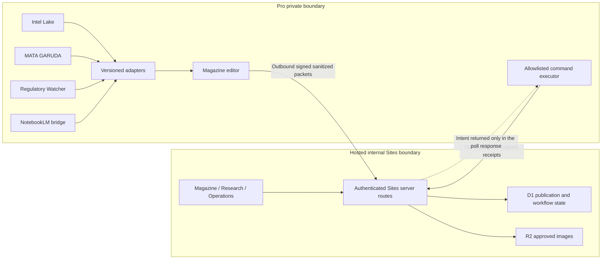

# Design: Bali Zero Magazine — Internal Federated Intelligence Site

**Date:** 2026-07-18  
**Status:** Design approved in conversation; specification awaiting operator review. Implementation is blocked until this document is approved.  
**Branch:** `agent/air-m5/docs/sites-bali-zero-magazine-spec`  
**Primary surface:** OpenAI Sites capability path  
**Working title:** Bali Zero Magazine

## 1. Decision

Build an internal, automatically published Bali Zero intelligence product with three first-class rooms:

1. **Magazine** — an editorial front page and immutable daily editions.
2. **Research** — provenance-first search across sanitized intelligence, with NotebookLM synthesis kept separate from verified evidence.
3. **Operations** — collector health, coverage, publication state, and three narrowly allowlisted operational actions.

The selected visual direction is **Front Page Editorial**: one dominant morning dossier, a dispatch rail, domain sections, and a restrained breaking strip. Existing intelligence systems remain independent systems of record. The Magazine is a publication and observability projection, not a replacement for Intel Lake, MATA GARUDA, Regulatory Watcher, NotebookLM, Qdrant, or the knowledge graph.

Phase 1 is private and fully automatic. A later public edition requires a separate editorial-release gate and a separate public projection; it is not part of this design.

## 2. Goals and non-goals

### Goals

- Publish a new WITA morning edition automatically after the configured collector readiness window.
- Evaluate qualifying high-impact signals for breaking publication during the day.
- Present one coherent editorial product instead of several stitched-together dashboards.
- Preserve source lineage, confidence, verification time, corrections, and asset provenance.
- Make system freshness and partial coverage visible rather than silently implying completeness.
- Let authorized operators retry a failed collector, regenerate the current edition, or quarantine a story.
- Keep raw OSINT, client PII, credentials, internal paths, prompts, and NotebookLM identifiers off the hosted Site.
- Add future collectors through a versioned adapter contract without redesigning the product.

### Non-goals

- Replacing the canonical source systems or their schemas.
- Sending raw MATA GARUDA streams, Intel Lake `raw_payload`, client documents, or private NotebookLM content to Sites.
- Providing arbitrary shell commands, LaunchAgent controls, database writes, or free-form operational parameters from the browser.
- Treating NotebookLM synthesis as evidence or allowing it to change verification status.
- Publishing publicly, enabling search-engine indexing, or creating a public user-registration system in Phase 1.
- Building a new general-purpose CMS, vector store, or knowledge graph inside Sites.
- Reusing `apps/zantara-media` as the editorial engine; it remains a media-indexing and DLP reuse point.

## 3. Grounded starting point

The current checkout already contains useful primitives, but no single safe publication surface:

| System                       | Verified reusable capability                                                                                    | Boundary for this product                                                                                                                                              |
| ---------------------------- | --------------------------------------------------------------------------------------------------------------- | ---------------------------------------------------------------------------------------------------------------------------------------------------------------------- |
| Intel Lake                   | `intel_items` canonical URL records, append-only observations, routing state, and authenticated pipeline health | Never export `raw_payload`, audit IPs, errors, probe records, producer credentials, or NotebookLM UUIDs; production projections must exclude `is_probe_sandbox = true` |
| MATA GARUDA                  | Redis-stream envelopes, classifiers/workers, local knowledge state, alerts, and health tools                    | Raw streams, local SQLite, snippets, and OSINT remain Pro-local                                                                                                        |
| Bali Zero Regulatory Watcher | Daily delta JSON, unreachable-source reporting, eventbus publication, and Intel Lake enqueue                    | Normalize schema drift before export; do not export verbatim excerpts by default                                                                                       |
| NotebookLM bridge            | HMAC-authenticated query and health endpoints on Pro                                                            | The hosted Site never calls the bridge directly and never receives notebook UUIDs                                                                                      |
| Zantara Media                | Indonesian PII/DLP checks, media hashing, and asset-indexing patterns                                           | Reuse DLP and provenance concepts, not its storage as a Magazine source of truth                                                                                       |
| Admin dashboard cockpit      | Hardcoded intent allowlists and append-oriented audit concepts                                                  | Do not copy local PIN auth or browser-to-Pro command execution into Sites                                                                                              |

Relevant current files include:

- `apps/backend-rag/backend/services/intel/intel_lake_service.py`
- `apps/backend-rag/backend/app/routers/intel_observability.py`
- `apps/backend-rag/backend/db/migrations_v2/168_intel_lake_schema.sql`
- `apps/backend-rag/backend/db/migrations_v2/187_probe_sandbox_isolation.sql`
- `apps/mata-garuda/mata_garuda/config.py`
- `apps/mata-garuda/mata_garuda/bridge/envelope.py`
- `infra/launchagents/wrappers/regulatory-watcher-run.sh`
- `apps/nlm-bridge/main.py`
- `apps/zantara-media/zantara_media/security/dlp.py`
- `apps/admin-dashboard-local/app/api/cockpit/intent/create/route.ts`

This is a code-grounded baseline, not a claim that every declared collector is currently healthy. The Operations room must distinguish declared configuration, last verified success, stale state, and degraded state.

## 4. Product information architecture

### Primary routes

| Route                           | Purpose                                                                    |
| ------------------------------- | -------------------------------------------------------------------------- |
| `/`                             | Current Front Page Editorial edition                                       |
| `/editions`                     | Edition archive by WITA date                                               |
| `/editions/:editionId`          | Immutable edition snapshot                                                 |
| `/stories/:slug`                | Current story version, evidence, provenance, and update history            |
| `/research`                     | Search, filters, timeline, comparison, and Notebook Insight jobs           |
| `/operations`                   | Collector health, coverage, queues, publication state, and allowed actions |
| `/operations/intents/:intentId` | Intent status, executor receipt, and audit trail                           |

All routes are private, authenticated, and emitted with `noindex, nofollow` metadata in Phase 1.

### Homepage hierarchy

1. Bali Zero Magazine masthead, edition date in WITA, and last verified update.
2. Breaking strip, rendered only when at least one eligible high/critical story is active.
3. **The Morning File** hero with image, title, deck, and “Why it matters to Bali Zero.”
4. Dispatch rail with three to five concise verified developments.
5. Domain sections:
   - Immigration
   - Company & Investment
   - Tax
   - Property
   - Regulation & Compliance
   - Indonesia & AI
6. **The Detail Everyone Missed** curiosity module.
7. Watch signals, visually separated from verified publication.
8. Coverage and freshness footer showing partial, delayed, or degraded inputs.

The first viewport must feel like a publication, not generic dashboard chrome. Operations metrics do not leak into the editorial hero.

### Story page

Every story exposes:

- title, deck, section, severity, and current lifecycle state;
- concise summary and “Why it matters” analysis;
- event time, first-seen time, verification time, and publication time;
- evidence references with root-source lineage;
- contributing systems without internal identifiers;
- confidence and coverage labels;
- image provenance and alt text;
- append-only amendment, supersession, correction, or quarantine history.

Facts and analysis are visually separated. “Notebook Insight” is rendered in its own labeled panel and cannot be presented as verified evidence.

## 5. Visual and language system

### Selected direction

**Front Page Editorial** is locked. The layout uses a large dossier, narrow dispatch rail, and modular sections below. Desktop is editorial-grid first; mobile becomes a clear single-column reading sequence without changing content priority.

### Bali Zero brand constraints

- Primary background: `#2C2F38` antracite.
- Secondary background: `#000000`.
- Body text: `#FFFFFF`.
- Data/evidence accent: `#F4C430`.
- Critical status and logo accent: `#C8102E`, used sparingly.
- Montserrat 700/800 as the main family, with the approved fallbacks.
- No emoji, pastel palette, generic hospitality language, or decorative dashboard gradients.
- Headlines are editorial and specific; legal citations and concrete numbers outrank marketing phrasing.
- Hero imagery follows the existing cinematic editorial direction while respecting asset rights.

English is the Phase 1 editorial language. Official Indonesian regulatory terms remain unchanged and receive an English assist on first occurrence unless they belong to the established always-untranslated lexicon. The data model stores a language code so additional language renderings can be added without changing story identity.

## 6. Architecture

### 6.1 Two products, one contract

Create two new project surfaces:

- `apps/bali-zero-magazine-editor` — Pro-local Python orchestration, adapters, verification, ranking, editorial composition, DLP, asset selection, exporter, and command executor.
- `apps/bali-zero-magazine` — the OpenAI Sites application using the capability path, workspace authentication, D1 structured persistence, and R2 approved media storage.

The editor owns ingestion from private systems and generation of sanitized publication packets. Sites owns authenticated presentation, durable publication history, research jobs/results, and the intent queue. Neither becomes the source of truth for the underlying intelligence.

### 6.2 Topology



The last arrow is logical response data on an outbound poll initiated by Pro. Sites never opens an inbound connection to Pro and never queries a private database, Redis stream, filesystem, or NotebookLM bridge.

This diagram is the preferred direct path, but it is valid only after the Phase 0 platform capability gates pass. Application HMAC authenticates a request after it reaches the application route; it does not prove that the Sites dispatcher will admit a non-human Pro request through a workspace access policy. If that exact path cannot be demonstrated, the direct arrows are invalid and implementation stops before real-data integration.

### 6.3 Data plane and command plane

The earlier concept of a purely read-only API is refined into two separate planes:

**Data plane**

- Pro adapters read canonical systems locally.
- The editor produces an allowlisted, schema-validated, DLP-cleared packet.
- Pro pushes the packet outbound to a Sites ingestion route.
- Sites validates signature, timestamp, nonce, schema, size, and field allowlist before D1/R2 persistence.
- The browser reads only Sites-owned projections.

**Command plane**

- An authorized user submits one of three fixed intents to a Sites server route.
- Sites validates platform identity, role, origin, CSRF token, idempotency key, rate limit, parameter schema, and intent expiry.
- The intent is persisted in D1; no secret is exposed to the browser.
- Pro-bound intents are claimed by a Pro-local executor that polls outbound using machine authentication, validates the allowlist again, executes the fixed local action, and uploads a signed receipt.
- A `story.quarantine.set` request with `desired_quarantined = true` is Sites-bound and becomes one append-only visibility event in D1.
- A request with `desired_quarantined = false` is Pro-gated: the executor reruns current evidence, DLP, and asset-rights gates and uploads a signed release attestation before Sites may append the visible event. A failed or expired attestation leaves the story quarantined.
- Arbitrary command names, LaunchAgent labels, shell arguments, paths, or environment values are rejected.

This resolves the security contradiction between read-only publication data and limited operational control.

## 7. Sites platform choices

Use the Sites **capability path**, not the one-shot path, because the product is multi-route and requires authentication, persistence, external ingestion, and operational workflows.

### Phase 0 platform capability gates

Before building adapters or publishing real data, initialize the minimal target Sites scaffold, probe schema, D1 binding, and R2 binding, then deploy an inert version and record two deployed-runtime results:

1. **Workspace-access gate:** configure either `custom` access for the approved Bali Zero users/groups, which is preferred, or `workspace_all` only when the entire active workspace is the intended audience. Verify the resolved access mode, users/groups, and policy revision with `get_site`. `deploy_private_site_version` is valid only for a verified owner-only probe and does not satisfy the internal team-access gate. Because the team Site is shared beyond the current caller, its saved version uses `deploy_site_version` only after explicit operator approval at deployment time. Public access is not an acceptable fallback for Phase 1.
2. **Machine-ingress gate:** under that exact workspace policy, Pro must reach three inert push, poll, and receipt routes without an interactive browser session. Every request must pass the Sites dispatcher with `OAI-Sites-Authorization: Bearer <siwc_bypass_bearer_token>` and then pass application HMAC verification. The test distinguishes dispatcher rejection, HMAC rejection, and success so that one credential is never mistaken for the other.

Failure of either gate is a hard stop. The only permitted architectural fallback is a separate machine-ingress broker: the user-facing Site remains workspace-restricted; Pro and the Sites server call the broker server-to-server; the browser never calls it; and it accepts only the same sanitized, versioned envelopes and fixed intents. Selecting or adding that broker requires a follow-on ADR covering hosting, authentication, persistence ownership, threat model, and failure recovery. The implementation may not make the Site public, broaden the approved workspace audience, or assume an undocumented dispatcher bypass.

### Authentication

- Restrict the hosted Site with the exact `custom` or `workspace_all` access policy and revision proven by the Phase 0 gate.
- Read `oai-authenticated-user-email` only in server-side code.
- Do not create app-owned OAuth, passwords, or a public registration flow.
- Map normalized user email to a pseudonymous actor key with a server-held HMAC secret; persist the actor key, not raw email, in audit events.
- Default every authenticated workspace member to Reader. Analyst and Operator are granted only by a versioned, server-held runtime allowlist; the raw allowlist is never sent to the browser or persisted in D1.
- Evaluate the runtime role allowlist on every request, record only actor key, effective role, and role-config version in audit events, and expose no role-grant mutation route. Self-granting is impossible. After an allowlist update becomes active, revocation takes effect on the next request.
- Treat platform sign-in as authentication, not authorization; every protected route and action performs its own role check.
- Treat machine admission and application authentication as separate layers. The SIWC bypass bearer admits an identity-less request through the Sites dispatcher; a rotating application HMAC key authorizes its exact machine route and payload. Neither credential is accepted by browser routes.
- Canonical HMAC input covers HTTP method, normalized path, content type, SHA-256 body digest, timestamp, nonce, key ID, and audience. Verification uses the raw received bytes, a bounded time window, constant-time comparison, and a D1 nonce insert with uniqueness enforcement.
- HMAC rotation allows a bounded current/next overlap. SIWC bypass rotation immediately invalidates the old token, so Operations first pauses and drains the Pro push/poll workers, rotates once, updates the Pro secret store without logging the value, runs inert probes, and resumes only after all three pass.

### Response caching

- Every authenticated HTML response and protected JSON route reads identity and authorization dynamically and emits `Cache-Control: private, no-store` in Phase 1.
- Magazine and story responses also evaluate the latest visibility sequence on every request; no static generation or stale shared response may bypass quarantine.
- Role changes, visibility events, and release attestations invalidate any explicitly introduced tagged server cache before the mutation returns success. User-specific responses are never placed in a shared cache.
- Editorial media is served only through an authenticated route that rechecks the asset rights/status overlay and every active story visibility association on each request. It emits `Cache-Control: private, no-store`, `X-Content-Type-Options: nosniff`, and `Cross-Origin-Resource-Policy: same-origin`; raw R2 keys and direct public URLs are never exposed.
- Only immutable fingerprinted application assets that contain no publication, identity, role, or visibility data may use long-lived public caching. A data-free application shell may be cached only if deployed tests prove it cannot reveal stale protected content.

### Persistence

Set logical D1 and R2 bindings in `.openai/hosting.json`:

- D1 stores structured publication, lineage, run, research, intent, receipt, nonce, and audit state.
- R2 stores only approved image bytes and generated social-preview media.
- Browser storage is limited to non-authoritative preferences such as dismissed notices or density choice.

No raw source document or raw OSINT blob is stored in D1 or R2.

### Publication commit protocol

D1 and R2 are separate stores; the design does not claim a cross-store transaction. Publication uses an explicit visibility protocol:

1. Pro uploads each approved asset through `AssetUploadV1` before sending the edition manifest. Sites validates the declared digest and media metadata against the raw bytes, then writes directly to an immutable private key such as `assets/sha256/<digest>.<ext>`.
2. An existing asset key is accepted only when stored digest metadata and byte count match. A new write is read-back verified before its D1 asset row can become `verified`; hash or metadata disagreement fails closed.
3. Pro sends the signed `EditionPacketV1` morning manifest or standalone `StoryPacketV1` Breaking packet, declaring an immutable packet ID, publication target, expected pointer revision(s), story versions, placements where applicable, claim/evidence links, and the exact verified asset digests. The manifest never carries image bytes.
4. Sites writes story versions, claims, evidence links, edition entries, breaking entries, and asset-reference metadata as `staging` rows under one packet ID. Replays with the same packet ID and manifest hash return the existing staging result; a hash mismatch fails closed.
5. Finalization runs one D1 batch with a visibility contract: every referenced staged row must match the packet and pass validation; publication rows change to `published`, while verified asset rows remain `verified` and their asset-reference rows become `published`; target pointer(s) advance only by compare-and-swap; and the batch reports success only when all expected row counts and pointer updates match. No individual story, claim, evidence, placement, or asset-reference row is readable through a publication route before this batch succeeds.
6. For a morning `EditionPacketV1`, the batch advances the current-edition pointer from the declared expected revision, publishes the edition and all referenced entries/versions/claims/evidence links, advances each `stories.current_version` pointer from its declared expected version, and atomically replaces the active-Breaking pointer from its declared expected revision using the packet's carry-forward or newly qualified Breaking entries. For a standalone `StoryPacketV1` Breaking target, the same batch publishes its story graph and `breaking_entries`, advances `stories.current_version`, and advances the active-Breaking pointer from the declared expected Breaking revision; no edition row is required. A conflict updates zero pointers and leaves the complete packet staged for reconciliation.
7. Live readers resolve only current-edition, current-story, and active-Breaking pointers, then require the pointed rows and all transitive claim/evidence/placement references to be `published`. `/stories/:slug` never queries the newest row; it follows `stories.current_version` and applies the visibility overlay. `/editions/:editionId` resolves the immutable published edition revision named by the URL, not the current-edition pointer, while applying current visibility and rights overlays. Incomplete D1 rows and unreferenced R2 objects are invisible. Media access additionally requires a currently allowed rights/status overlay and active visible association, so an immutable historical manifest never defeats later quarantine or rights revocation.
8. A bounded maintenance route deletes expired staging rows and unreferenced content-addressed R2 objects only after a retention window. The Pro maintenance worker invokes it through outbound dual-authenticated requests on a fixed schedule; it is not dependent on an unproven Sites cron. Deletion never targets an object referenced by a retained manifest, and rights-revoked bytes follow the approved legal-retention policy while remaining unservable.

D1 statements that must succeed together use prepared `batch([...])` operations, but deployed fault-injection and concurrency tests must verify the runtime's rollback behavior. Correctness still relies on pointer-last visibility and compare-and-swap, not on an assumed D1/R2 atomic commit.

## 8. Versioned projection contracts

All Pro-to-Sites payloads use JSON Schema with `additionalProperties: false`. Unknown fields fail closed instead of being silently persisted.

### 8.1 Collector run projection

`CollectorRunProjectionV1` contains only:

```json
{
  "schema_version": "collector-run.v1",
  "run_id": "stable-public-run-id",
  "system_id": "intel-lake",
  "collector_id": "routing",
  "started_at": "2026-07-18T00:00:00Z",
  "completed_at": "2026-07-18T00:05:00Z",
  "status": "healthy",
  "items_seen": 42,
  "items_eligible": 7,
  "source_count": 18,
  "unreachable_source_count": 2,
  "watermark": "opaque-nonsecret-value",
  "verified_at": "2026-07-18T00:05:02Z"
}
```

Allowed system health states are `healthy`, `delayed`, `degraded`, `unavailable`, and `unknown`. Content freshness is separate: `fresh`, `delayed`, or `archived`.

### 8.2 Story publication packet

`StoryPacketV1` is a standalone versioned publication packet for `publication_target = breaking`, with expected active-Breaking and story current-version revisions. Morning edition stories are embedded in `EditionPacketV1`, not sent as separate edition-entry packets. It contains:

- stable `story_id` and monotonically increasing `version`;
- slug, language, domain, severity, lifecycle state, and timestamps;
- title, deck, summary, why-it-matters, and optional curiosity text;
- deterministic score components, not private chain-of-thought;
- immutable `ClaimV1` records plus sanitized evidence references and resolved root-source lineage;
- contributing public system IDs;
- coverage and confidence labels;
- optional approved asset metadata;
- adapter, ruleset, and schema versions.

For `publication_target = breaking`, Sites uses the same staging/finalization visibility contract as a morning edition: packet-scoped story version, claim, evidence, and asset-reference rows become readable only through the successful D1 batch that advances the story pointer and active-Breaking pointer. The 10-minute Breaking objective is measured from qualification to that pointer commit, not from candidate creation or asset upload.

Explicit denylist fields include `raw_payload`, `verbatim_excerpt`, source-body HTML, internal path, filename, IP address, chat ID, credential, prompt, model chain-of-thought, NotebookLM UUID, client identifier, passport, KTP, NPWP, and arbitrary metadata dictionaries.

Every material factual or numeric assertion in the title, deck, summary, why-it-matters copy, and curiosity text is represented by an immutable claim:

```json
{
  "claim_id": "stable-claim-id",
  "claim_kind": "fact",
  "normalized_text": "Normalized plain-text assertion",
  "numeric_value": null,
  "numeric_unit": null,
  "as_of": "2026-07-18",
  "evidence_ids": ["stable-evidence-id"],
  "breaking_gate": "official-primary"
}
```

`claim_kind` is `fact`, `numeric`, or `analysis`. A numeric claim also carries a normalized decimal value, unit/currency, and `as_of` when applicable. Analysis is visibly labeled and may cite supporting evidence, but it cannot smuggle an unmapped factual premise. Claim IDs are stable within a story version, evidence IDs must exist in the same accepted packet or an immutable prior record, and an empty evidence set on a factual/numeric claim rejects publication. Breaking quorum is evaluated for every material factual/numeric claim, not merely once for the story; `breaking_gate` records the satisfied rule and source set.

### 8.3 Asset upload contract

`AssetUploadV1` is a dedicated dual-authenticated raw-byte request, not JSON or base64 inside an edition packet. Signed request metadata declares schema version, packet ID, asset ID, SHA-256 digest, byte count, MIME type, width, height, capture/generation time, and rights status. Sites derives the content-addressed R2 key from the verified digest and decoded format; the client cannot choose an arbitrary storage path. The HMAC canonical input includes the raw-body digest and all security-relevant headers.

Initial versioned limits are 12 MiB per asset, 20 assets per edition packet, and 8,192 pixels on either dimension, with an independent decoded-pixel ceiling. Only non-animated JPEG, PNG, and WebP are accepted. Sites verifies magic bytes, decoder result, MIME, dimensions, digest, and size; it rejects SVG, HTML, XML, scripts, polyglots, malformed or animated media, and mismatched extensions. Changing limits or formats requires a schema/ruleset revision and negative fixtures.

### 8.4 Edition publication manifest

`EditionPacketV1` is a JSON manifest with `additionalProperties: false` containing:

- `schema_version`, immutable `packet_id`, and editor/ruleset versions; the signed request envelope declares the SHA-256 of the exact raw manifest bytes;
- WITA edition date, monotonically increasing edition revision, expected current revision, and edition kind;
- expected active-Breaking pointer revision for the atomic morning carry-forward replacement;
- `publication_state = building`, proposed `coverage_state`, readiness cutoff, verified time, and collector-run manifest IDs;
  - complete sanitized immutable story-version projections (including claims and evidence references), their expected current-version pointers, editorial placement/order, domain section, and Breaking carry-forward links;
- every referenced claim ID, evidence ID, and asset digest; and
- coverage gaps and sanitized reader-facing notices.

Only `publication_state = building` is accepted on ingress; Sites alone transitions it to `published` after verification. Finalization fails if any referenced story version, claim, evidence record, or verified asset is missing, denied, mismatched, or quarantined.

### 8.5 Source lineage

A root source is the originating work or primary document, not the collector, mirror, republisher, or URL that exposed it. For an official document, `root_source_id` derives from issuing authority, document type/number, version, and issue date. For journalism or research, it derives from resolved original publisher, original publication time, normalized title/byline, and a content fingerprint. Canonical URLs are locators, not proof of independence.

Each evidence record also carries sanitized upstream/dependency lineage and a syndication-group fingerprint. Mirrors, wire copies, summaries that depend on one original report, and separately published pages with substantially identical origin/content collapse to one root source. When origin resolution or dependence is ambiguous, the evidence may support a story but does not count toward the two-source Breaking gate. The stored independence verdict includes the ruleset version and a machine-readable reason.

An evidence reference may contain a public canonical URL, publisher, document citation, publication time, retrieval time, source type, and a short editor-authored evidence note. It does not contain a copied raw excerpt by default.

## 9. Durable publication model

The D1 logical model contains:

| Entity                                | Purpose                                                                     |
| ------------------------------------- | --------------------------------------------------------------------------- |
| `source_systems`                      | Registry, expected cadence, required/optional readiness, and current health |
| `collector_runs`                      | Sanitized run manifests and coverage                                        |
| `stories`                             | Stable identity and pointer to current visible version                      |
| `story_versions`                      | Immutable editorial versions                                                |
| `story_visibility_events`             | Per-story sequenced quarantine/release overlay and authoritative audit      |
| `release_attestations`                | Short-lived signed Pro gate results required before restoring visibility    |
| `evidence_refs`                       | Deduplicated sanitized root-source references                               |
| `story_claims` / `story_evidence`     | Immutable version-specific claims and their evidence links                  |
| `editions`                            | Immutable WITA snapshots with separate publication and coverage states      |
| `edition_entries`                     | Story/version placement and editorial order                                 |
| `breaking_pointer`                    | Current active-Breaking revision and expected CAS head                      |
| `breaking_entries`                    | Story/version placement in the active-Breaking surface                      |
| `assets`                              | R2 key, rights, source, hash, dimensions, alt text, and status              |
| `asset_status_events`                 | Append-only rights, DLP, quarantine, replacement, and serving overlay       |
| `research_jobs` / `research_results`  | Sanitized asynchronous research requests and labeled results                |
| `ops_intents` / `ops_receipts`        | Allowlisted command lifecycle and Pro-executor or Sites-server receipts     |
| `ingest_nonces`                       | Replay prevention                                                           |
| `audit_events` / `audit_stream_heads` | Per-stream sequenced, hash-chained security and publication events          |
| `audit_anchor_receipts`               | Pro-signed external checkpoints for independently detectable D1 tampering   |

### Story lifecycle

```text
candidate -> verified -> eligible -> published
     |          |           |           |
     +------> quarantined <--+-----------+
                                         |
                              amended or superseded
```

- Lifecycle transitions are append-only events.
- A published version is never overwritten.
- An amendment creates a new version and preserves the prior one.
- Supersession links the new story/version to the displaced one.
- Quarantine is reversible only after the current story version, evidence bundle, and asset set pass fresh release gates. A quarantine event immediately excludes a story from active placements and overlays its historical pages without mutating or erasing the underlying story or edition snapshot.

### Edition lifecycle

Edition dimensions are independent:

- `publication_state`: `building`, `published`, `superseded`, or `failed`;
- `coverage_state`: `complete` or `partial`;
- `edition_kind`: `standard` or `quiet`; and
- `freshness_state`: `fresh`, `delayed`, or `stale`.

A partial edition is therefore `publication_state = published` plus `coverage_state = partial`; it is never a competing lifecycle state. A quiet edition can be complete or partial. A published edition is immutable. Regeneration creates a new edition revision and marks the prior revision superseded; existing URLs continue to resolve to their historical snapshot.

### Audit integrity and external anchoring

Audit chaining is per aggregate stream rather than one global mutable head. Every event has `stream_id`, monotonically increasing `stream_seq`, canonical event bytes, `previous_event_hash`, and `event_hash`; `(stream_id, stream_seq)` is unique. Event hashing is byte-exact:

1. `payload_bytes` is the UTF-8 RFC 8785 JSON Canonicalization Scheme encoding of the schema-validated event payload, excluding all chain fields.
2. `stream_id_bytes` is the UTF-8 encoding of the NFC-normalized stream ID.
3. `previous_hash_bytes` is the prior raw 32-byte event hash, or 32 zero bytes for sequence 1.
4. `event_preimage` is `ASCII("BZM-AUDIT-EVENT-V1") || 0x00 || U32BE(len(stream_id_bytes)) || stream_id_bytes || U64BE(stream_seq) || previous_hash_bytes || U64BE(len(payload_bytes)) || payload_bytes`.
5. `event_hash_bytes = SHA256(event_preimage)`. D1 stores event and previous hashes as exactly 64 lowercase hexadecimal characters; hashing always decodes them back to raw 32-byte values.

Appending uses compare-and-swap on `audit_stream_heads`, so concurrent writers cannot fork a stream. Story visibility events are canonical audit events in the story-visibility stream and carry the same sequence/hash fields; the visibility projection and stream-head update commit in one tested D1 batch.

A D1-only chain cannot reveal a privileged writer that rewrites the chain and recomputes its head. A Pro-local audit-anchor worker therefore polls outbound at least every five minutes and after security-sensitive Pro interactions, verifies all new sequences/hashes, and appends each observed stream head to a durable local append-only ledger. Its receipt contract is also byte-exact:

- The signed body is RFC 8785 canonical JSON with exactly `schema_version = "audit-anchor.v1"`, `anchor_id`, `stream_id`, `stream_seq` as an unsigned decimal string, `event_hash` as 64 lowercase hex, `previous_anchor_hash` as 64 lowercase hex or 64 zeroes at genesis, `observed_at` as UTC RFC 3339 with exactly three fractional digits and `Z`, and `key_id`.
- `anchor_body_bytes` is the UTF-8 encoding of that canonical JSON. Ed25519 signs `ASCII("BZM-AUDIT-ANCHOR-V1") || 0x00 || U64BE(len(anchor_body_bytes)) || anchor_body_bytes` with a Pro-only private key. `signature` is the raw 64-byte signature encoded as unpadded base64url.
- `anchor_hash` is lowercase-hex SHA-256 over `ASCII("BZM-AUDIT-ANCHOR-RECORD-V1") || 0x00 || U64BE(len(anchor_body_bytes)) || anchor_body_bytes || raw_signature_bytes`; it becomes the next receipt's `previous_anchor_hash` in the Pro ledger.

Sites stores the versioned Ed25519 public verification key, key ID, receipt, and anchor hash without replacing prior receipts. A malformed signature/encoding or a head that conflicts with a prior Pro anchor is a critical incident and blocks affected Operations mutations and publication promotion. Operations displays anchor age; no design claim calls D1 alone tamper-proof.

## 10. Automatic editorial pipeline

### Morning edition

1. Adapters emit collector manifests and sanitized candidate records.
2. The readiness coordinator waits for configured required collectors or the WITA hard cutoff.
3. Non-critical missing inputs produce `partial` coverage; a failed editorial core fails closed.
4. Canonicalization clusters candidate records by document identity, event identity, and root-source lineage.
5. Deterministic rules assign verification eligibility and score impact, novelty, confidence, recency, and cross-system corroboration.
6. The LLM composer may write headline, deck, summary, why-it-matters, and curiosity copy from the eligible evidence packet.
7. The LLM cannot raise confidence, change lifecycle state, create a source, or make an ineligible story publishable.
8. Schema, citation, numeric consistency, DLP, brand, language, and asset gates run after composition.
9. The editor uploads any new `AssetUploadV1` bytes, then sends one signed `EditionPacketV1` manifest that references only verified asset digests.
10. Sites stages the revision, verifies every story/claim/evidence/asset reference, and changes the current front page pointer through compare-and-swap only after the full manifest succeeds.

If all sources complete with no material changes, the system may publish a quiet edition that explicitly reports “No verified material change detected.” It must not invent a hero story to satisfy the layout.

### Breaking stream

A breaking candidate is evaluated whenever a new relevant event arrives. It may publish automatically only when:

1. impact is `high` or `critical`; and
2. either a verified official primary source exists, or at least two independent root sources agree; and
3. every material factual/numeric claim independently satisfies the applicable source gate; and
4. the story passes DLP, schema, lineage, numeric, and editorial checks.

For claims that a regulation is legally issued, effective, amended, or revoked, the official primary document is mandatory. Two secondary reports may create a labeled developing signal, but not a verified legal-effect Breaking item.

NotebookLM output never counts toward source independence and never authorizes publication.

Breaking versions share the stable story ID with the next morning edition. The next edition deterministically reconciles active Breaking items instead of creating duplicates.

## 11. Ranking and editorial composition

Eligibility is deterministic. Ranking uses configurable, versioned factors:

- operational impact on Bali Zero service lines;
- evidence quality and independence;
- novelty compared with the current story graph;
- recency and effective date;
- cross-system corroboration;
- explicit editorial relevance rules.

Exact weights belong in a versioned configuration and require fixture tests before change. The UI displays interpretable labels, not an unexplained synthetic score.

The editorial composer receives only sanitized evidence packets. Factual sentences and numbers must map to immutable `ClaimV1` and evidence IDs. Unsupported claims fail the publication gate. Imported and LLM-authored strings are untrusted data, never executable markup. If every authorized composer is unavailable or produces invalid output, the current valid edition remains active and Operations reports the failure.

## 12. Images and media provenance

The media resolver uses this order:

1. approved internal asset with verified rights and a passing DLP scan;
2. official/public asset with documented license or usage basis;
3. sanctioned Pro-side generated editorial image using a non-sensitive prompt;
4. intentional typographic fallback.

Every asset records:

- origin and source URL where applicable;
- license or generated status;
- consent/usage status where relevant;
- SHA-256 hash and perceptual-dedup result;
- dimensions, MIME type, alt text, and capture/generation time;
- story/version association and quarantine state.

The hero may not silently reuse an anchor or another story image. Intentional reuse must be declared. If an asset loses rights, fails DLP, or is quarantined, all active placements cascade to the typographic fallback until a replacement passes.

R2 remains private. Asset bytes pass the `AssetUploadV1` magic-byte, decoder, MIME, size, dimension, animation, and digest checks before storage. SVG, HTML, XML, and other active formats are never accepted as editorial media. The authenticated delivery route evaluates current rights, DLP, asset-status, and story-visibility overlays before reading R2; a historical manifest reference alone never authorizes delivery. Rights revocation/quarantine invalidates any permitted server cache and makes the bytes unservable on the next request.

Phase 1 targets one strong hero plus limited section imagery. It does not generate decorative images for every dispatch.

## 13. Research room

### Search modes

- **Stories** — published briefings and their versions.
- **Evidence** — sanitized source references.
- **Timeline** — ordered story and evidence events.
- **Compare** — side-by-side sources, story versions, or interpretations.
- **Notebook Insight** — asynchronous NotebookLM synthesis in a separately labeled result.

Filters include domain, source system, issuing authority, date, evidence type, confidence, lifecycle state, and language.

Phase 1 search accepts selected facets, stable public topic/entity IDs, and sanitized index tokens. Arbitrary free-form text is rejected at the Sites boundary; enabling it later requires a separate privacy review and an explicit DLP design.

### Notebook Insight flow

1. The analyst selects a public topic/entity from the sanitized Sites index and one closed request template such as explain, compare, or timeline.
2. The Sites server validates the stable IDs, role, and policy; it stores no free-form question and never receives a notebook UUID.
3. The Pro executor polls outbound, resolves the topic locally, selects the notebook through the registry, and constructs the actual NotebookLM question inside the Pro boundary.
4. The local bridge returns citations and synthesis; the Pro executor applies DLP and schema gates before upload.
5. Sites stores the accepted result as `notebook_insight`, separate from evidence and verification state.

Client-specific research, document analysis, and queries containing personal identifiers remain on existing Pro-local tools and are explicitly out of scope for Sites.

## 14. Operations room

### Read view

Operations displays:

- current health and expected cadence for each collector;
- last attempted run, last verified success, current lag, and next expected window;
- items seen, eligible, quarantined, and published;
- unreachable-source counts and coverage gaps;
- morning edition build state and active Breaking state;
- recent sanitized failures and incident timeline;
- pending, claimed, succeeded, failed, expired, `cancelled_revoked`, `outcome_unknown`, manual-review, and reconciled operational intents; and
- per-stream audit-anchor age plus any D1/Pro checkpoint mismatch.

Declared configuration and verified runtime state are separate fields. A green exit code without a fresh artifact or receipt cannot produce a healthy status.

### Allowed actions

| Intent                 | Minimum role | Parameters                                                                          | Execution rule                                                           |
| ---------------------- | ------------ | ----------------------------------------------------------------------------------- | ------------------------------------------------------------------------ |
| `collector.retry`      | Operator     | Stable allowlisted collector ID, failed run ID, idempotency key, allowlisted reason | Pro maps ID to a fixed local action; no label/path/argument from browser |
| `edition.regenerate`   | Operator     | Current edition revision, idempotency key, allowlisted reason                       | Creates a new revision; never overwrites the published revision          |
| `story.quarantine.set` | Analyst      | Story ID/version, expected visibility sequence, desired boolean, reason, intent ID  | Quarantine is immediate; release requires signed current Pro attestation |

Every action requires a confirmation preview and an allowlisted reason code. Rate limits apply per pseudonymous actor and intent type. The intent stores actor key, accepted effective role, and `authz_policy_version`, never raw email.

Pro-bound intents use explicit at-least-once delivery semantics. Each D1 row contains immutable payload hash, idempotency key, actor key, authorization-policy version, attempt limit, expiry, claim token, fencing token, heartbeat time, and lease deadline. Before returning a claim, Sites re-evaluates the stored actor key against the current server-held role allowlist. If the actor has been removed or no longer holds the required role, Sites appends `cancelled_revoked` and does not return the intent. A policy-version change alone triggers re-evaluation rather than blind cancellation.

A poll conditionally claims only an authorized pending intent or one whose prior lease expired, has not expired, and remains below its attempt limit; success requires exactly one affected row. The active executor heartbeats within a bounded execution window, and the last heartbeat immediately before an irreversible effect must receive a current authorization confirmation. Revocation before that confirmation cancels execution; revocation after a completed effect cannot erase the receipt. A receipt must echo the current fencing token, claim token, payload hash, and confirmed authorization-policy version.

Before any local effect, the Pro executor acquires a durable local execution-journal record keyed by idempotency key. The journal has a unique action key, owner/fencing token, heartbeat, action-specific phase, and result. A replacement D1 claimant cannot start the action while the journal owner is live. Every effectful local entry point checks the current fence immediately before its irreversible transition. After a crash, the next claimant probes action-specific state: it uploads a missing receipt for a known completed result, resumes a documented safe phase, or records terminal automated state `outcome_unknown`. It never blindly replays an unknown effect. This is at-least-once intent delivery with fenced, journaled effect execution, not a claim of distributed exactly-once semantics. Expired intents are never started.

`outcome_unknown` immediately blocks further automated execution, opens a visible manual-review incident, and alerts Operations. The operator investigates through existing Pro-local diagnostics; the Site exposes no new arbitrary command. A later Pro-signed reconciliation receipt may close the incident as `reconciled_succeeded` or `reconciled_failed` with evidence metadata, but cannot rerun the original effect. During staffed WITA hours, the initial objective is operator acknowledgment within 30 minutes; age and acknowledgment state remain visible until reconciliation.

Quarantine uses a per-story visibility sequence, not only the story version. The server performs one conditional append that assigns `visibility_seq = expected_visibility_seq + 1` only when the current maximum sequence and current story version match, with unique constraints on `(story_id, visibility_seq)` and `intent_id`. The new event is simultaneously the visibility decision, canonical story audit-stream event, and receipt; it includes the stream sequence and hash fields defined in Section 9. Opposing concurrent requests that share an expected sequence cannot both succeed.

Restoring visibility additionally requires an unexpired Pro-signed release attestation bound to story ID/version, expected visibility sequence, evidence-bundle version, asset hashes, gate-ruleset version, and intent ID. Pro issues it only after fresh evidence, DLP, and rights gates pass; changed content or assets require a new story version first. Sites consumes each attestation once when appending the release event. A failed, stale, mismatched, or replayed attestation leaves the story quarantined.

No “run command,” “kill process,” arbitrary retry, database edit, prompt edit, or secret-management action exists.

## 15. Roles and authorization matrix

| Capability                                      | Reader | Analyst | Operator |
| ----------------------------------------------- | -----: | ------: | -------: |
| Read Magazine and story history                 |    Yes |     Yes |      Yes |
| Search sanitized Research corpus                |    Yes |     Yes |      Yes |
| Submit public-intelligence Notebook Insight job |     No |     Yes |      Yes |
| Quarantine/unquarantine story                   |     No |     Yes |      Yes |
| Retry collector                                 |     No |      No |      Yes |
| Regenerate edition                              |     No |      No |      Yes |
| View security audit detail                      |     No |      No |      Yes |

Authorization is enforced on the Sites server and rechecked by the Pro executor for Pro-bound command intents, including release requests. Immediate quarantine is enforced through the sequence-checked append-only event insert; release also requires the signed Pro attestation. Client-side buttons are convenience only and never the security boundary.

## 16. Security and privacy invariants

1. Sites never initiates a connection to Pro.
2. Pro sends only schema-allowlisted, DLP-cleared projections through outbound HTTPS.
3. Browser bundles contain no ingestion secret, executor secret, role map, notebook ID, source credential, or internal URL.
4. Machine requests require both the SIWC bypass bearer at the Sites dispatcher and the raw-byte application HMAC over method, path, content type, body digest, timestamp, nonce, key ID, and audience; each layer has audited rotation and replay controls.
5. User mutations require same-origin checks, CSRF protection, identity, RBAC, rate limits, idempotency, and append-only audit.
6. Raw rejected ingestion bodies and rejected research-job payloads are not logged or persisted.
7. Intel Lake probe-sandbox rows are excluded before aggregation and rejected if marked as production input.
8. Unknown JSON fields, unknown systems, unknown collectors, and unknown intents fail closed.
9. Client PII and raw OSINT never leave the Pro boundary. Raw workspace email is never written to application-controlled D1, R2, logs, analytics, or browser payloads; the Sites platform may process its authentication header under the platform's own policy before server code pseudonymizes it.
10. The public-source URL renderer uses safe outbound link attributes and never server-fetches an arbitrary user-provided URL.
11. Authenticated, role-sensitive, and visibility-sensitive responses are dynamic and private `no-store`; a shared cache cannot preserve revoked access or quarantined content.
12. A release event cannot make a story visible without a fresh, one-time Pro attestation bound to the exact story, evidence, assets, visibility head, and ruleset.
13. Collector, source, and LLM text is treated as untrusted plain text. Controlled formatting, if enabled, is parsed into a fixed allowlist and sanitized; arbitrary HTML, inline event handlers, unsafe URL schemes, and raw HTML rendering are forbidden.
14. Editorial media is authenticated, private `no-store`, decoder-validated passive raster content. Current rights, DLP, quarantine, and story-visibility overlays are checked on every delivery.
15. Audit events use canonical per-stream hashes, serialized sequence/head compare-and-swap, and Pro-local signed checkpoints; D1 by itself is not represented as tamper-proof.

The initial Content Security Policy is deny-by-default: `default-src 'self'`, `object-src 'none'`, `base-uri 'none'`, `frame-ancestors 'none'`, `form-action 'self'`, and explicit self-only script, style, image, font, and connection sources except for origins proven necessary by the Sites runtime. It permits neither `unsafe-eval` nor arbitrary remote media. Public evidence links allow only normalized `https:` destinations and render with `rel="noopener noreferrer"`; response media includes `nosniff` and same-origin resource policy.

## 17. Failure behavior

| Failure                                        | Required behavior                                                                |
| ---------------------------------------------- | -------------------------------------------------------------------------------- |
| Optional collector late                        | Publish `publication_state = published`, `coverage_state = partial`, with banner |
| Required collector unavailable before cutoff   | Follow registry policy; fail closed when minimum coverage is unmet               |
| Editorial composer invalid/unavailable         | Keep last valid edition; surface degraded editor state                           |
| Workspace access or machine-ingress gate fails | Stop before real-data integration; do not broaden access or assume a bypass      |
| Ingestion signature/schema/DLP failure         | Reject before publication visibility; store metadata-only event, alert Ops       |
| Duplicate/replayed packet                      | Return idempotent existing result; never duplicate story or edition              |
| R2 upload or D1 finalization interrupted       | Leave staging invisible; reconcile safely, keep prior current pointer            |
| Asset unavailable, rights-revoked, quarantined | Deny media delivery and use approved typographic fallback on the next request    |
| NotebookLM unavailable                         | Research job becomes degraded/failed; publication remains unaffected             |
| Sites cannot reach D1/R2                       | Show only a data-free shell/error state if safe; never render cached publication |
| Pro executor offline                           | Intent remains pending until expiry; never execute late without reauthorization  |
| Actor loses required role before effect        | Append `cancelled_revoked`; do not return/continue the pending intent            |
| Lease expires while prior executor is alive    | Local journal blocks duplicate effect; reconcile fence and heartbeat             |
| Crash leaves effect state unknowable           | Set `outcome_unknown`; block retry, alert, and open manual review                |
| Release gates or attestation validation fail   | Keep story quarantined; expose sanitized failure state                           |
| Audit head conflicts with Pro checkpoint       | Critical incident; block affected promotion/mutation and preserve evidence       |
| SIWC bypass rotation probe fails               | Keep Pro workers paused; old token is invalid and no blind retry is attempted    |
| Conflicting evidence                           | Quarantine or label developing; never auto-resolve via LLM prose                 |

The latest valid edition is always distinguishable from a fresh edition through its visible verification timestamp and coverage state.

## 18. Observability and service objectives

### Initial objectives

- Morning edition is published within 15 minutes of required collector completion or configured cutoff.
- A qualified Breaking story is published within 10 minutes of qualification.
- Zero published factual claims without at least one mapped evidence reference.
- Zero accepted packets containing denied PII or raw-data fields.
- Every current page exposes verification time and coverage state.
- Every operational intent reaches success, failure, expiry, or explicit `outcome_unknown`; no intent remains ambiguously executing, and unknown outcomes enter manual review immediately.
- During staffed WITA hours, `outcome_unknown` is acknowledged within 30 minutes.
- Healthy Operations reports no Pro audit checkpoint older than five minutes.

### Required telemetry

- adapter run and packet IDs;
- DLP and schema gate outcomes without rejected body content;
- story lifecycle transitions and edition revisions;
- ingestion latency and idempotency outcome;
- collector freshness and coverage;
- research job age and executor receipts;
- intent claim, execution, retry, expiry, unknown-outcome age, manual-review acknowledgment, reconciliation, and audit-chain integrity;
- per-stream audit head, Pro-anchor age, checkpoint conflicts, and anchor receipt status; and
- asset provenance, current serving eligibility, and quarantine/rights cascade outcome.

## 19. Testing strategy

### Contract and unit tests

- JSON Schema fixtures for every adapter and packet version.
- `AssetUploadV1`, `StoryPacketV1`, `ClaimV1`, and `EditionPacketV1` cross-reference, limit, hash, and finalize fixtures.
- Unknown-field, denied-field, oversize, malformed timestamp, and replay rejection.
- Intel Lake `is_probe_sandbox` exclusion.
- Regulatory Watcher schema normalization, including missing or drifted fields.
- Root-source independence, mirrors/wire-copy/dependency collapse, content fingerprints, and ambiguous-origin failure to count toward quorum.
- Story/edition idempotency, immutable version transitions, and `published + partial` coverage semantics.
- Breaking eligibility per material claim, including the official-primary rule for legal effect.
- Ranking fixture stability and ruleset versioning.
- Factual/numeric claim-to-evidence mapping, missing/unknown evidence rejection, and analysis-with-hidden-factual-premise rejection.
- Indonesian PII/DLP fixtures and non-logging behavior.
- RBAC, CSRF, origin, rate-limit, expiry, nonce, and idempotency tests.
- Runtime role allowlist, Reader default, self-grant rejection, and revocation tests.
- Pending/claimed intent cancellation when the actor loses the required role, including last pre-effect authorization confirmation.
- Dynamic/private `no-store` responses plus visibility and role cache-invalidation tests.
- Plain-text escaping, sanitizer allowlist, CSP, HTTPS-only evidence links, and stored-XSS fixtures from every imported text field.
- Asset magic-byte/decoder/MIME/size/dimension/animation checks with SVG, HTML, polyglot, extension-mismatch, and decompression-bomb rejection.
- Authenticated media delivery, raw-key denial, and next-request denial after rights revocation or story quarantine.
- Dual machine authentication, canonical raw-byte HMAC, nonce uniqueness, bounded timestamp, HMAC overlap, and coordinated SIWC immediate-rotation tests.
- Command allowlist and browser-parameter rejection.
- Conditional claim, heartbeat, lease expiry, local journal/fencing, attempt cap, and receipt-only crash recovery.
- Unknown-effect crash, retry prohibition, manual-review acknowledgment, and signed reconciliation receipt.
- Visibility-sequence compare-and-swap, opposing concurrency, replay, and quarantine append.
- Per-stream audit sequence/head concurrency, canonical hashing, Pro checkpoint anchoring, D1 rewrite detection, and checkpoint-conflict blocking.
- Release-attestation freshness, binding, single use, gate failure, and changed-story/asset rejection.
- Content-addressed R2 write/read-back, hash mismatch, private unreferenced object, pointer compare-and-swap, and orphan reconciliation.
- Fixed-schedule dual-authenticated maintenance invocation, retention boundary, and referenced-object deletion refusal.
- Asset hash, rights, dedup, and quarantine cascade.

### Integration tests

- Sanitized adapter packet from each source family into a local Sites persistence fixture.
- Full morning flow: manifests -> candidates -> edition packet -> current homepage.
- Breaking flow: qualifying event -> stable story ID -> next-edition reconciliation.
- Notebook Insight job: Sites queue -> Pro poll -> local notebook routing -> sanitized result.
- Pro-bound command flow: authenticated intent -> outbound Pro claim -> journal/fence -> fixed action -> signed receipt.
- Immediate quarantine flow: authenticated intent -> sequence-CAS visibility event -> event receipt.
- Release flow: authenticated intent -> Pro gate rerun -> signed attestation -> sequence-CAS release event.
- Partial coverage, composer outage, D1 failure, R2 failure, pointer conflict, executor outage, and replay recovery.
- `publication_state = published` with `coverage_state = partial`, and `publication_state = published` with `edition_kind = quiet`, without lifecycle ambiguity.

### Deployed platform tests

- `custom` or `workspace_all` policy resolution via `get_site`, with exact intended membership and no public fallback.
- Authenticated human access and rejection outside the resolved workspace policy.
- Pro machine push, poll, receipt, asset, and maintenance probes under the same policy, including missing/invalid SIWC bearer, dispatcher success plus invalid HMAC, and dual-authenticated success.
- D1 batch rollback observation, compare-and-swap concurrency, lease/journal contention, and visibility-head contention.
- Cached-response probes proving role revocation and quarantine are visible on the next request.
- Header probes for `noindex`, CSP, private `no-store`, `nosniff`, same-origin media, and absence of protected data from a cacheable shell.
- R2 upload interruption before and after D1 staging, proving that incomplete packets never become current.
- SLO drills measuring morning publication, Breaking qualification-to-publication, audit anchoring, and unknown-outcome acknowledgment.

### UI and accessibility tests

- Magazine, story, research, and operations routes at desktop and mobile widths.
- Keyboard navigation, focus order, semantic headings, alt text, and non-color-only status cues.
- Empty, quiet-edition, partial, delayed, degraded, quarantined, archived, and outcome-unknown/manual-review states.
- Authorization-specific rendering for Reader, Analyst, and Operator.
- Production build and Sites-hosted smoke test before internal release.

## 20. Rollout sequence

### Phase 0 — Sites capability proof

- Initialize the minimal target Sites scaffold, probe schema, D1 binding, and R2 binding before any deployed test.
- Configure the intended `custom` or `workspace_all` policy, verify its exact revision/membership with `get_site`, save an inert version, and request explicit operator approval before the shared production deployment.
- Prove authenticated human access and dual-authenticated machine push/poll/receipt reachability through the dispatcher.
- Exercise D1 batch, compare-and-swap, and content-addressed R2 visibility behavior in the deployed runtime.
- On failure, stop and write the machine-ingress broker ADR before changing persistence ownership or connectivity.

### Phase A — Contracts and workspace-restricted shell

- Expand the Phase 0 target scaffold into `apps/bali-zero-magazine`; do not create a second Sites project.
- Configure the runtime role allowlist, private `no-store` routes and media, CSP/noindex metadata, and brand shell.
- Implement schemas, migrations, fixture data, and read-only edition rendering.
- Implement `apps/bali-zero-magazine-editor` skeleton with adapter interfaces and DLP boundary.

### Phase B — Real sanitized data and automatic Magazine

- Connect Intel Lake, Regulatory Watcher, and MATA GARUDA adapters locally on Pro.
- Add collector readiness, root-source lineage, deduplication, ranking, composer gates, and outbound ingestion.
- Add media resolver, separate asset uploads, claim-level evidence gates, and immutable morning/breaking publication.
- Run shadow editions until coverage and evidence gates are stable; then enable the workspace-restricted current-edition pointer.

### Phase C — Research

- Add D1 search modes over sanitized publication data.
- Add asynchronous Notebook Insight jobs through the outbound Pro poller.
- Validate DLP boundary and result separation before enabling Analysts.

### Phase D — Operations actions

- Enable immediate quarantine first with visibility-sequence concurrency tests.
- Add the Pro execution journal, fencing, heartbeat, and receipt reconciliation; enable release only after signed-attestation gate tests pass.
- Add actor-revocation enforcement and the Pro-local audit-anchor/maintenance workers before enabling Pro-bound effects.
- Enable edition regeneration, then collector retry.
- Require passing adversarial security tests and authoritative receipts for each action before enabling the next.

### Phase E — Internal hardening

- Run degraded-source and stale-edition drills.
- Pass retention/orphan cleanup, audit-chain fork/rewrite detection, Pro-anchor freshness, next-request role revocation/quarantine/media denial, SIWC/HMAC key rotation, stored-XSS/media validation, and image-rights cascade drills.
- Demonstrate the 15-minute morning and 10-minute Breaking objectives across a seven-day shadow window or an equivalent deterministic replay set, and the five-minute audit-anchor plus 30-minute staffed unknown-outcome acknowledgment objectives in fault injection.
- Verify `noindex`, CSP, private `no-store`, `nosniff`, same-origin media, intended workspace membership, and zero protected data in cacheable responses on the deployed version.
- Keep the Site internal. A public edition requires a new design decision and release gate.

## 21. Design review resolutions

An adversarial review blocked the first draft concept until these issues were resolved:

1. **Read-only contradiction:** resolved with separate data and command planes.
2. **“Internal” is not authentication:** resolved with Sites workspace access policy plus server-side RBAC on every request.
3. **Browser signing risk:** resolved by keeping machine secrets server-side and using D1 intents consumed by a Pro-initiated outbound poller.
4. **Raw-system access:** resolved by outbound-only, allowlisted projections from Pro.
5. **False source independence:** resolved with root-source lineage rather than collector counts.
6. **Silent overwrites:** resolved with immutable story versions, edition revisions, and append-only lifecycle events.
7. **NotebookLM authority leak:** resolved by storing Notebook Insight separately and forbidding verification mutation.
8. **Image rights and silent reuse:** resolved with rights metadata, hashes, explicit reuse, and quarantine cascade.
9. **Internal-access semantics:** resolved by verifying `custom` or `workspace_all` membership with `get_site`; owner-only private deployment is explicitly not treated as team access, and public fallback is prohibited.
10. **Machine-ingress assumption:** resolved with separate SIWC dispatcher bearer and raw-body application HMAC plus deployed push/poll/receipt probes; failure requires a separate broker ADR rather than an undocumented bypass.
11. **D1/R2 atomicity:** resolved with private content-addressed assets, invisible staging metadata, pointer-last compare-and-swap, and orphan reconciliation.
12. **At-least-once execution:** resolved with conditional leases plus a durable Pro-local journal, fencing tokens, heartbeats, action-state probes, and receipt-only recovery.
13. **Quarantine concurrency:** resolved with a per-story visibility sequence and a unique conditional append, so opposing intents cannot share a successful head.
14. **Role bootstrap:** resolved with Reader-by-default workspace access and a server-held versioned Analyst/Operator allowlist with no web mutation path.
15. **Unsafe unquarantine:** resolved by requiring a fresh, single-use Pro release attestation bound to the exact story, evidence, assets, visibility sequence, and gate ruleset.
16. **Stale authorization/visibility cache:** resolved with dynamic private `no-store` responses and mandatory invalidation for any future tagged cache.
17. **Edition-state contradiction:** resolved with independent publication, coverage, edition-kind, and freshness dimensions; partial means `published + partial`.
18. **Claim-level provenance:** resolved with immutable `ClaimV1` records and per-material-claim Breaking quorum.
19. **Stored active content:** resolved with plain-text/sanitized rendering, deny-by-default CSP, passive-raster validation, and authenticated rights-aware media delivery.
20. **Audit rewrite/fork risk:** resolved with per-stream compare-and-swap chains and independent Pro-local signed checkpoints; D1 alone is not called tamper-proof.
21. **False independence through mirrors:** resolved with original-work dependency lineage, content fingerprints, syndication collapse, and fail-closed ambiguous origin.
22. **Stale pending authorization:** resolved by re-evaluating the actor on claim and immediately before irreversible effect.

## 22. Acceptance criteria

The design is implemented only when all of the following are true:

- The homepage matches the approved Front Page Editorial hierarchy and Bali Zero brand constraints.
- Magazine, Research, and Operations are authenticated routes in one internal Sites product.
- The deployed runtime proves the intended `custom` or `workspace_all` membership and dual-authenticated Pro machine push/poll/receipt access under that exact policy before any real-data integration.
- No hosted route can access a private Pro service directly.
- At least Intel Lake, MATA GARUDA, Regulatory Watcher, and NotebookLM-derived insight are represented through their correct boundaries.
- The morning edition and Breaking pipeline meet their evidence and lifecycle rules, including `publication_state = published` with partial coverage and with quiet edition kind.
- Every story and asset has visible provenance; every material factual/numeric claim maps to immutable evidence and passes its own Breaking source gate.
- Root-source independence prevents duplicated syndication from satisfying the two-source gate.
- Regulatory legal-effect Breaking requires an official primary document.
- Partial and stale states are explicit, and the last valid edition remains available on failure.
- Reader, Analyst, and Operator permissions pass server-side authorization tests.
- Analyst and Operator grants come only from the versioned server-held allowlist; raw emails never reach application-controlled D1, R2, logs, analytics, or browser payloads, and no self-grant route exists.
- Interrupted R2/D1 publication never changes the current pointer; compare-and-swap conflicts cannot overwrite a newer edition.
- Pro-bound commands pass overlapping-executor, stale-fence, heartbeat-loss, and crash-after-action tests through the durable local journal.
- An unknowable effect becomes visible `outcome_unknown`, cannot auto-retry, and closes only through a signed reconciliation receipt.
- A pending or claimed action whose actor loses authority is cancelled before effect; the last pre-effect authorization confirmation is covered by tests.
- Opposing quarantine intents cannot both advance one visibility head, and release remains blocked without a fresh single-use Pro attestation.
- Role revocation and quarantine become visible on the next request; protected content and role decisions never survive in shared cache.
- Rights revocation or story quarantine denies editorial media on the next request; raw R2 keys, SVG/HTML, and active media are never deliverable.
- Imported/LLM text passes stored-XSS fixtures, and deployed CSP/link/header probes pass without unsafe remote content.
- Only the three approved intents exist, with replay protection, expiry, idempotency, audit, and an authoritative server or signed executor receipt.
- DLP fixtures demonstrate that client PII and denied raw fields do not reach D1, R2, logs, or browser payloads.
- Concurrent audit appends cannot fork a stream; a D1 rewrite conflicting with a Pro-local signed checkpoint is detected and blocks the affected mutation/promotion.
- Retention/orphan cleanup, SIWC/HMAC rotation, image-rights cascade, noindex/private-cache headers, 15-minute morning, 10-minute Breaking, five-minute audit-anchor, and 30-minute staffed acknowledgment gates pass.
- The Sites production build succeeds and the workspace-restricted hosted smoke test passes after explicit operator deployment approval.

## 23. Spec gate

No implementation starts until the operator reviews and approves this versioned specification. After approval, produce a separate implementation plan with atomic tasks, exact file ownership, tests, and deployment gates.
