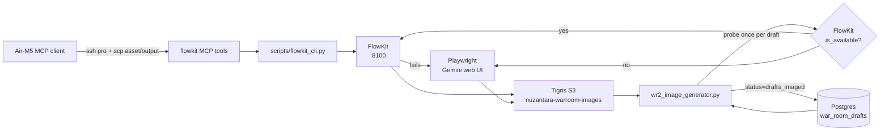

# WR2 Image Generator — FlowKit Integration

> **Status**: Shipped Sprint 1.6 W3, 2026-05-03; MCP bridge extended
> 2026-07-05 for image, upload-image, and `/api/flow/generate-video`.
> FlowKit remains the **secondary backend** for WR2 images, opt-in via
> `WR2_IMAGE_BACKEND=auto`. The MCP/CLI bridge is the local operator path for
> hero stills and Veo i2v video, including Air-M5 usage through Pro over SSH.

## Why FlowKit

The empirical POC on 2026-05-03 (Antonello's Ultra account, see memory
`discovery_flowkit_poc_test_2026_05_03.md`) verified that FlowKit gives a
direct HTTP path to the same `GEM_PIX_2` (Nano Banana Pro) model that the
Playwright path drives via the Gemini web UI. Concrete numbers:

| Path | Latency / image | Credit cost | Setup overhead |
|---|---|---|---|
| Playwright (existing) | 30-90 s | 0 (web UI quota) | persistent Chrome profile, hover-reveal selectors |
| FlowKit image | 5-15 s | **0** (FREE for `PAYGATE_TIER_TWO`) | local agent on Pro `:8100` + Chrome extension |
| FlowKit video | async, usually minutes | Veo/Flow credits | explicit start image + `PAYGATE_TIER_TIER1P5` |

Same model, same image quality, **5-10× faster**, same $0 marginal cost.
The slow path is preserved because FlowKit's bearer token expires every
~45 min (extension auto-refreshes on Flow tab activity, but if the tab
sits idle the next call returns `NO_FLOW_KEY` until refresh).

## Architecture



The dispatch is per-slide but the FlowKit availability probe is **once per
draft** — we don't re-probe between slides because (a) it's wasteful and
(b) we want consistent backend choice within a single dispatch carousel.

## Env-var matrix

| Env var | Default | Purpose |
|---|---|---|
| `WR2_IMAGE_BACKEND` | `auto` | `auto` = FlowKit first, fall back to Playwright. `flowkit` = FlowKit only, raise `BackendUnavailableError` if down. `playwright` = legacy Playwright only. |
| `WR2_FLOWKIT_BASE_URL` | `http://127.0.0.1:8100` | FlowKit local agent endpoint. |
| `WR2_FLOWKIT_TIMEOUT_S` | `60` | HTTP timeout for individual FlowKit calls. |
| `WR2_FLOWKIT_MATERIAL` | `realistic` | FlowKit project material/style preset. `realistic` matches the WR2 brand bar (editorial photo aesthetic). |
| `WR2_FLOWKIT_LANGUAGE` | `en` | Project language hint. |
| `FLOWKIT_BASE_URL` | `http://127.0.0.1:8100` | CLI/MCP bridge endpoint, evaluated on Pro. |
| `FLOWKIT_PAYGATE_TIER` | `PAYGATE_TIER_TIER1P5` | Default CLI/MCP tier for Ultra video models. |
| `FLOWKIT_VIDEO_TIMEOUT_S` | `240` | CLI/MCP video polling timeout when `--dest` is requested. |

The existing Playwright vars (`WR2_GEMINI_PROFILE_DIR`, `WR2_IMAGE_TIMEOUT_PER_SLIDE`,
`WR2_IMAGE_MAX_RETRIES`, `WR2_IMAGE_VLM_VALIDATION` etc.) are unchanged
and still apply to the Playwright path. **`WR2_IMAGE_VLM_VALIDATION`
applies to BOTH backends** — Nano Banana Pro can also produce off-prompt
outputs and the WR2 brand bar is the same regardless of producer.

## Trigger conditions for fallback

The `auto` backend falls back to Playwright on ANY of:

1. FlowKit local agent (`:8100`) not reachable (TCP connection refused, timeout).
2. `/health` returns `extension_connected: false` (Chrome extension not loaded
   or service worker idle).
3. `/api/flow/credits` returns `NO_FLOW_KEY` (bearer token expired or
   never captured) — surfaced as HTTP 401 OR 200+detail-envelope.
4. `/api/flow/generate-image` returns 5xx, malformed JSON, or
   `detail: "MODEL_ACCESS_DENIED"` (region-blocked / model not in tier).
5. Signed CDN download fails (URL expired past 30-min TTL, or Tigris
   network issue between Pro and the CDN).
6. Local read of the downloaded PNG produces zero bytes.
7. VLM alignment validation rejects the FlowKit output (off-prompt
   stock-style content) — same threshold as Playwright (`WR2_IMAGE_MIN_ALIGN_SCORE=0.5`).
8. Video generation is requested without `start_image_media_id` or
   `start_image_path`. The bridge must not assume an `AVATAR`/photo DB row.

In `flowkit`-only mode the same conditions instead surface as an error in
the per-slide tuple (`(slide_number, None, error_msg)`) — there is no
Playwright fallback. The draft is marked `image_failed` if every slide
errors.

## Operational runbook

### Start FlowKit on Pro (manual, one-time per session)

```bash
# 1. Boot the local agent (assumes setup per the skill doc)
cd ~/flowkit
source venv/bin/activate
python -m agent.main &  # listens on :8100 (HTTP) + :9222 (extension WS)

# 2. Open the Flow tab and pin the extension (one-time per Chrome restart)
open "https://labs.google/fx/tools/flow"
# → Click the FlowKit extension icon (puzzle 🧩 → pin → click)

# 3. Verify
curl -s http://127.0.0.1:8100/health \
  | python3 -c "import json,sys;d=json.load(sys.stdin);print('connected:',d['extension_connected'])"
# connected: True

curl -s http://127.0.0.1:8100/api/flow/credits | python3 -m json.tool | head -10
# Should NOT be NO_FLOW_KEY or UNAUTHENTICATED.
```

If `extension_connected: true` but `/api/flow/credits` returns 401
`UNAUTHENTICATED`, the extension websocket is alive but the Flow bearer token
is stale. Refresh `https://labs.google/fx/tools/flow` on Pro and click the
FlowKit extension icon again.

### Operator bridge from Pro or Air-M5

Use the repo CLI for direct checks on Pro:

```bash
ssh pro 'cd ~/Desktop/nuzantara && apps/backend-rag/.venv/bin/python scripts/flowkit_cli.py health'
```

For Air-M5, use the MCP tools. They copy the current CLI bridge to
`/tmp/nuz-flowkit-bridge/flowkit_cli.py` on Pro, execute it there, stage local
raster assets with `scp`, and copy generated output back to the M5 destination:

```python
await flowkit_health()
await flowkit_resolve_asset("/Users/balizero/Desktop/logo/zer.jpg")
await flowkit_generate_image(
    prompt="Bali Zero editorial immigration hero, photo-realistic, no text",
    dest_path="/Users/balizero/Desktop/wr2-hero.png",
)
await flowkit_generate_video(
    prompt="0-8s: slow editorial push-in, warm Bali office light, natural movement, no text",
    start_image_path="/Users/balizero/Desktop/logo/zer.jpg",
    dest_path="/Users/balizero/Desktop/wr2-hero.mp4",
    paygate_tier="PAYGATE_TIER_TIER1P5",
)
```

For video, one of `start_image_media_id` or `start_image_path` is mandatory.
If the operator already uploaded an image, reuse the returned `media_id`; if
the source is a local M5 photo, pass its M5 path and let the MCP bridge stage it
to Pro. SVG avatar placeholders are not valid start images for Flow video.

### Verify the WR2 cron picks up FlowKit

```bash
# Run wr2_image_generator.py manually with a known draft in 'drafts' status:
cd ~/Desktop/nuzantara
DATABASE_URL=postgresql://localhost/nuzantara_local \
  WR2_IMAGE_BACKEND=auto \
  apps/backend-rag/.venv/bin/python scripts/wr2_image_generator.py --draft-id <UUID>

# Look for these log lines:
#   FlowKit available — using as primary backend (PAYGATE_TIER_TWO)
#   [slide N] generating via FlowKit (Nano Banana Pro)
#   [slide N] FlowKit ok (8.3s, 1234567 bytes)
#   [slide N] uploading to Tigris
#   [slide N] uploaded → https://...
```

If FlowKit is down you should see instead:

```
FlowKit unavailable — using Playwright backend
[slide N] generating image (overall 1, primary attempt 1/3)
```

### Failure modes (none of which require operator action)

| Symptom | What's happening | Action |
|---|---|---|
| `FlowKit /health unreachable` (DEBUG-level log) | Local agent not running. | None — auto path falls back to Playwright. Restart agent next time you boot Chrome. |
| `FlowKit token not captured (NO_FLOW_KEY)` or `UNAUTHENTICATED` | Bearer expired or not captured. `extension_connected: true` is not enough. | Refresh `labs.google/fx/tools/flow` on Pro and click the FlowKit extension icon. |
| `missing_asset` from MCP/CLI video | No start frame was passed, or the expected photo path does not exist on Pro/M5. | Pass `start_image_path` or upload first and pass `start_image_media_id`; do not rely on `AVATAR`. |
| `FlowKit generate-image/video ... MODEL_ACCESS_DENIED` | Account/tier/model mismatch or region block. | Check `/api/flow/credits` and `~/flowkit/agent/models.json`; Ultra video needs `PAYGATE_TIER_TIER1P5` mapping to `veo_3_1_i2v_s_fast_portrait_ultra`. |
| `flowkit VLM rejected (score=0.4 < 0.5)` | FlowKit output didn't match prompt (off-brand) | None — auto path falls back to Playwright; flowkit-only path returns error and slide is marked failed. |

## What does NOT change

This integration is purely additive:

- The Playwright path (`_gen_one_image`, `_gen_one_image_raw`,
  `_build_prompt_variants`) is **byte-identical** to before.
- The launchd plist (`infra/launchagents/com.balizero.wr2.image-generator.plist`)
  is **unchanged** — no new env var is set there, so production cron
  defaults to `WR2_IMAGE_BACKEND=auto` and silently uses Playwright until
  FlowKit is set up on Pro.
- DB schema, status transitions (`drafts/drafts_checked` →
  `drafts_imaged`/`image_failed`), `slides_json` shape, Tigris bucket and
  key naming convention are all unchanged.
- VLM alignment validation, retry loop, prompt variant fallback all apply
  to the Playwright path identically.

The only observable behavior difference when FlowKit IS available:
hero-slide generation drops from ~30-90s/image to ~5-15s/image, and the
`council_debate_json` `image_generated_at` timestamp closes on the draft
~3-7 minutes earlier on a 4-hero carousel.

## Anthropic SDK compliance

FlowKit's `agent/services/video_reviewer.py` has a lazy-import path that
uses the Anthropic SDK if `ANTHROPIC_API_KEY` is set. The Bali Zero setup
procedure (per the skill doc) **strips `anthropic` from
`requirements.txt`** during install, and we never call the video reviewer
from this integration — we only use `/api/flow/generate-image` and
`/api/flow/credits`. Defense in depth: even if a future FlowKit patch adds
`import anthropic` at module top, pip install will fail on the missing
package, which is the desired outcome under Golden Rule #13.

The reference implementation in `scripts/wr2_flowkit_client.py` uses only
`httpx` — no Anthropic SDK, no LLM calls.

## References

- Skill: `~/.claude/skills/nuzantara-flowkit-flow-generation.md`
- Memory: `discovery_flowkit_poc_test_2026_05_03.md`
- POC repo: `github.com/crisng95/flowkit` (MIT, OSS)
- Existing pipeline: [`wr2_image_generator.py`](../../scripts/wr2_image_generator.py)
- Sibling docs: [`docs/wr2/SUPERVISOR.md`](SUPERVISOR.md)
