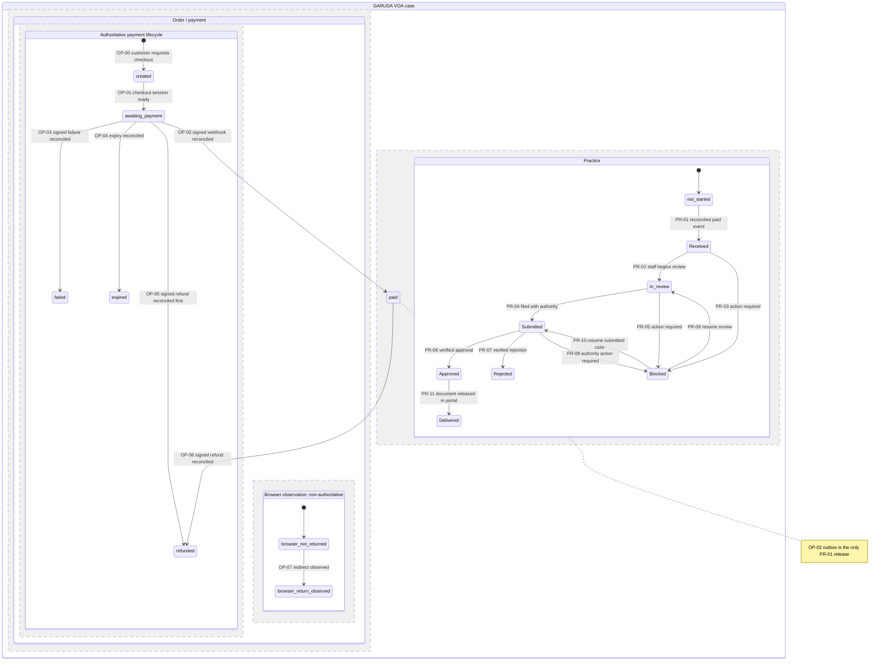

# GARUDA VOA state machine

## Global guards

| ID     | Invariant                                                                                                                                                                                                                                                                                                             |
| ------ | --------------------------------------------------------------------------------------------------------------------------------------------------------------------------------------------------------------------------------------------------------------------------------------------------------------------- |
| SM-G01 | No public-surface row is persisted unless one unambiguous active signed retention-policy row authorizes the row type. Missing, unsigned, ambiguous, or expired authority fails closed before the write.                                                                                                               |
| SM-G02 | Public result URLs have the form `/visa/voa/<opaque-id>`. The opaque identifier has at least 128 effective random bits from a CSPRNG, is neither sequential nor payload-derived, and is not an authorization credential.                                                                                              |
| SM-G03 | Personal data, opaque result identifiers, payment references, and document identifiers do not appear in URLs other than the opaque path token, logs, metrics labels, email links other than the required result URL, or journal prose.                                                                                |
| SM-G04 | A customer-visible price is one all-inclusive value obtained from `apps/backend-rag/backend/services/garuda_flow/pricing.py:price_for_case`. No fee, PNBP, government-cost, or component split is exposed.                                                                                                            |
| SM-G05 | `G-FRESHNESS-FAIL-CLOSED`: stale or unverifiable rules or price truth sheets block evaluation persistence, checkout creation, and quotation. The response is `DECLINE`, contains no price or deadline, and offers the grounded WhatsApp handoff.                                                                      |
| SM-G06 | The only public Safe Clock checkpoint is `apps/backend-rag/backend/services/garuda_flow/constants.py:PUBLISHED_FILING_DEADLINE_DAYS`. Internal checkpoint names, dates, and escalation offsets are never serialized to a customer surface.                                                                            |
| SM-G07 | Every accepted authoritative order or practice transition is compare-and-set against its source state and appends an immutable journal event in the same transaction. A transactional outbox carries customer email and downstream work. The OP-07 browser observation has no authoritative journal or outbox effect. |
| SM-G08 | Duplicate delivery of the same command or provider event returns the previously committed result and emits no second state change, journal event, email, practice, or charge request.                                                                                                                                 |
| SM-G09 | `G-PAID-BY-WEBHOOK-ONLY`: only OP-02 may enter `paid`, after signature verification, inbox deduplication, exact reconciliation, and journal append. Browser redirect, client code, staff, and timers have no paid authority.                                                                                          |
| SM-G10 | `G-OCR-LOCAL`: raw document OCR is local-first. Cloud reinforcement, if invoked, receives only redacted material after an enforceable egress gate; it never replaces the local path or receives raw personal data.                                                                                                    |

## Authoritative composition

`In_review` is rendered to customers as `In review`. `not_started` and the browser-observation states are never tracker labels. Payment and practice are separate authorities: practice transitions cannot mutate payment state, and refund transitions do not silently rewind practice state.

## Order / payment transitions

| ID    | From → to                                        | Trigger                                                                                    | Actor                                        | Guard                                                                                                                                                                                                                             | Atomic side effects                                                                                                                                                      | Retry idempotent                                                                              |
| ----- | ------------------------------------------------ | ------------------------------------------------------------------------------------------ | -------------------------------------------- | --------------------------------------------------------------------------------------------------------------------------------------------------------------------------------------------------------------------------------- | ------------------------------------------------------------------------------------------------------------------------------------------------------------------------ | --------------------------------------------------------------------------------------------- |
| OP-00 | `∅ → created`                                    | Customer confirms the reviewed intake and requests checkout                                | customer                                     | Authenticated account; review complete; active signed retention authority; fresh signed rule and price truth sheets; one all-inclusive catalogue value; customer idempotency key unused or already bound to the identical command | Write order; append `order.created`; retain the key/result; no payment email                                                                                             | Yes — customer idempotency key                                                                |
| OP-01 | `created → awaiting_payment`                     | Provider checkout session is created                                                       | system                                       | Same order and amount; provider session is not already bound; no customer-visible component prices                                                                                                                                | Write state and provider-session binding; append `payment.awaiting`; outbox checkout-ready email once                                                                    | Yes — order plus provider-session identity                                                    |
| OP-02 | `awaiting_payment → paid`                        | Provider reports a successful charge                                                       | provider webhook                             | Signature verified; event inbox insert/dedup succeeds; provider event is reconciled to the exact order and all-inclusive amount; journal append and state write commit together                                                   | Write `paid`; append provider event and `payment.paid`; outbox payment email; enqueue exactly one PR-01 release                                                          | Yes — provider event ID plus provider charge ID. **This is the only transition into `paid`.** |
| OP-03 | `awaiting_payment → failed`                      | Provider reports terminal payment failure                                                  | provider webhook                             | Signature verified; inbox deduped; event reconciles to this order and is terminal under the grounded provider taxonomy                                                                                                            | Write `failed`; append `payment.failed`; outbox failure email with retry-as-new-checkout action                                                                          | Yes — provider event ID                                                                       |
| OP-04 | `awaiting_payment → expired`                     | Checkout validity expires and provider status reconciliation confirms no successful charge | system                                       | Grounded provider expiry rule reached; reconciliation found no accepted payment; no unresolved signed event                                                                                                                       | Write `expired`; append `payment.expired`; outbox expiry email                                                                                                           | Yes — order plus expiry epoch                                                                 |
| OP-05 | `awaiting_payment → refunded`                    | A valid refund webhook arrives before its related paid event                               | provider webhook                             | Signature verified; inbox deduped; refund reconciles to the order and charge; no prior terminal state                                                                                                                             | Write terminal `refunded`; append `payment.refunded_out_of_order`; outbox refund email; alert reconciliation queue; do not release practice                              | Yes — provider event ID plus refund ID                                                        |
| OP-06 | `paid → refunded`                                | Provider reports a completed refund                                                        | provider webhook                             | Signature verified; inbox deduped; refund reconciles to the paid charge; no prior refund                                                                                                                                          | Write `refunded`; append `payment.refunded`; outbox refund email; alert staff if practice is not `not_started`; do not auto-rewind practice                              | Yes — provider event ID plus refund ID                                                        |
| OP-07 | `browser_not_returned → browser_return_observed` | Customer browser follows provider return URL                                               | customer                                     | Return correlates to the creator-bound session; redirect payload is treated as untrusted observation                                                                                                                              | Write observation only; append no authoritative payment event; send no email; release no practice                                                                        | Yes — return nonce; repeat is a no-op                                                         |
| OP-08 | `paid → paid` (no state transition)              | A distinct second successful charge is reconciled                                          | provider webhook                             | Valid signature; distinct provider charge ID; same order; event not previously consumed                                                                                                                                           | Keep `paid`; append `payment.duplicate_charge_detected`; open one remediation/refund case; page staff; send one customer acknowledgement; never create a second practice | Yes — provider event ID plus second charge ID                                                 |
| OP-09 | any state → same state (no state transition)     | Exact command or webhook retry                                                             | customer / provider webhook / staff / system | The idempotency identity and canonical payload hash match the committed event                                                                                                                                                     | Return the committed outcome; inbox may record first receipt only; no duplicate journal, email, state write, charge request, or practice                                 | Yes — mandatory                                                                               |

## Practice transitions

| ID    | From → to                                    | Trigger                                                        | Actor                     | Guard                                                                                                                                      | Atomic side effects                                                                                           | Retry idempotent                                       |
| ----- | -------------------------------------------- | -------------------------------------------------------------- | ------------------------- | ------------------------------------------------------------------------------------------------------------------------------------------ | ------------------------------------------------------------------------------------------------------------- | ------------------------------------------------------ |
| PR-01 | `not_started → Received`                     | OP-02 committed and its outbox event is consumed               | system                    | Authoritative order is `paid`; source is a reconciled signed webhook; no practice exists for the order                                     | Write practice and tracker state; append `practice.received`; outbox `Received` email once                    | Yes — paid journal event ID                            |
| PR-02 | `Received → In review`                       | Staff accepts the work item                                    | staff                     | Staff authorization; required intake is readable; current state matches                                                                    | Write state; append `practice.in_review`; outbox `In review` email once                                       | Yes — staff command ID                                 |
| PR-03 | `Received → Blocked`                         | Staff identifies a customer action required before review      | staff                     | Grounded customer-safe block reason and next action; private staff note is stored separately; resume target is `In review`                 | Write state, safe reason, and resume target; append `practice.blocked`; outbox action-required email once     | Yes — staff command ID                                 |
| PR-04 | `In review → Submitted`                      | Staff records completed filing                                 | staff                     | Filing evidence verified; published customer deadline, if shown, is only the D-7 checkpoint                                                | Write state; append `practice.submitted`; outbox `Submitted` email once                                       | Yes — staff command ID plus filing evidence identity   |
| PR-05 | `In review → Blocked`                        | Staff requires corrected or additional customer material       | staff                     | Grounded safe reason and next action; resume target is `In review`; no internal checkpoint leaks                                           | Write state, safe reason, and resume target; append `practice.blocked`; outbox action-required email once     | Yes — staff command ID                                 |
| PR-06 | `Submitted → Approved`                       | Staff records verified authority approval                      | staff                     | Approval evidence verified and bound to this practice                                                                                      | Write state; append `practice.approved`; outbox `Approved` email once                                         | Yes — staff command ID plus decision evidence identity |
| PR-07 | `Submitted → Rejected`                       | Staff records verified authority rejection                     | staff                     | Rejection evidence verified; customer-safe reason and grounded alternative handoff exist; private authority notes are not customer-visible | Write terminal state and safe reason; append `practice.rejected`; outbox rejection-with-assistance email once | Yes — staff command ID plus decision evidence identity |
| PR-08 | `Submitted → Blocked`                        | Staff records an authority request for customer action         | staff                     | Grounded safe reason and next action; resume target is `Submitted`; no private authority note leaks                                        | Write state, safe reason, and resume target; append `practice.blocked`; outbox action-required email once     | Yes — staff command ID                                 |
| PR-09 | `Blocked → In review`                        | Staff verifies the requested customer action                   | staff                     | Stored resume target is `In review`; blocking requirement is satisfied                                                                     | Clear active block; write state; append `practice.resumed`; outbox `In review` email once                     | Yes — staff command ID plus resolved block ID          |
| PR-10 | `Blocked → Submitted`                        | Staff verifies the requested post-filing action                | staff                     | Stored resume target is `Submitted`; blocking requirement is satisfied                                                                     | Clear active block; write state; append `practice.resumed`; outbox `Submitted` email once                     | Yes — staff command ID plus resolved block ID          |
| PR-11 | `Approved → Delivered`                       | Approved visa artifact is released in the authenticated portal | staff                     | Artifact integrity and practice binding verified; creator-bound account is authorized; opaque path identifier alone grants no access       | Write terminal state and delivery receipt; append `practice.delivered`; outbox `Delivered` email once         | Yes — staff command ID plus artifact digest            |
| PR-12 | any state → same state (no state transition) | Exact staff, customer-action, or outbox retry                  | customer / staff / system | Idempotency identity and canonical payload hash match the committed event                                                                  | Return committed outcome; no duplicate journal, state write, email, or portal artifact                        | Yes — mandatory                                        |

## Retry-idempotent transition set

`OP-00`, `OP-01`, `OP-02`, `OP-03`, `OP-04`, `OP-05`, `OP-06`, `OP-07`, `OP-08`, `OP-09`, `PR-01`, `PR-02`, `PR-03`, `PR-04`, `PR-05`, `PR-06`, `PR-07`, `PR-08`, `PR-09`, `PR-10`, `PR-11`, and `PR-12` MUST be idempotent under delivery, command, outbox, worker, or client retry.

## Forbidden order / payment transitions

Self-state retries are OP-09 no-ops, not transitions. Every non-self edge below is forbidden and must append a security/reconciliation rejection without mutating state or emailing a false state change.

| Source             | Forbidden destinations                                       |
| ------------------ | ------------------------------------------------------------ |
| `created`          | `paid`, `refunded`, `failed`, `expired`                      |
| `awaiting_payment` | `created`                                                    |
| `paid`             | `created`, `awaiting_payment`, `failed`, `expired`           |
| `refunded`         | `created`, `awaiting_payment`, `paid`, `failed`, `expired`   |
| `failed`           | `created`, `awaiting_payment`, `paid`, `refunded`, `expired` |
| `expired`          | `created`, `awaiting_payment`, `paid`, `refunded`, `failed`  |

The following inputs are also forbidden transitions:

| ID     | Forbidden input                                                                                                                   | Required result                                                                                                        |
| ------ | --------------------------------------------------------------------------------------------------------------------------------- | ---------------------------------------------------------------------------------------------------------------------- |
| OP-F01 | Browser return, browser JavaScript, client callback, staff command, polling response, or system timer attempts any state → `paid` | Reject; no payment state write, journal `paid` event, email, or practice release.                                      |
| OP-F02 | Webhook signature is missing or invalid                                                                                           | Reject before inbox reconciliation; append only a non-sensitive security counter/event; no business-state mutation.    |
| OP-F03 | Signed webhook cannot reconcile to exactly one order, amount, currency, and provider charge                                       | Quarantine for staff; no business-state mutation.                                                                      |
| OP-F04 | `refunded → paid` from a late valid paid webhook                                                                                  | Inbox-dedup and append `payment.late_paid_after_refund`; keep `refunded`; page reconciliation; never release practice. |
| OP-F05 | `failed → paid` or `expired → paid` from a late event                                                                             | Quarantine and page reconciliation; keep terminal state; require a new order or a grounded compensating procedure.     |
| OP-F06 | Same idempotency key with a different canonical payload                                                                           | Conflict; no provider call, write, email, or journal business event.                                                   |
| OP-F07 | Missing, stale, ambiguous, or unsigned retention/rule/price authority                                                             | Decline to persist or sell; no order, quote, or checkout; grounded WhatsApp handoff.                                   |

## Forbidden practice transitions

Self-state retries are PR-12 no-ops, not transitions. Every non-self edge below is forbidden.

| Source        | Forbidden destinations                                                                                                                        |
| ------------- | --------------------------------------------------------------------------------------------------------------------------------------------- |
| `not_started` | `In review`, `Submitted`, `Approved`, `Delivered`, `Blocked`, `Rejected`                                                                      |
| `Received`    | `not_started`, `Submitted`, `Approved`, `Delivered`, `Rejected`                                                                               |
| `In review`   | `not_started`, `Received`, `Approved`, `Delivered`, `Rejected`                                                                                |
| `Submitted`   | `not_started`, `Received`, `In review`, `Delivered`                                                                                           |
| `Approved`    | `not_started`, `Received`, `In review`, `Submitted`, `Blocked`, `Rejected`                                                                    |
| `Delivered`   | `not_started`, `Received`, `In review`, `Submitted`, `Approved`, `Blocked`, `Rejected`                                                        |
| `Blocked`     | `not_started`, `Received`, `Approved`, `Delivered`, `Rejected`; also `In review` or `Submitted` when it differs from the stored resume target |
| `Rejected`    | `not_started`, `Received`, `In review`, `Submitted`, `Approved`, `Delivered`, `Blocked`                                                       |

| ID     | Forbidden input                                                                                                                     | Required result                                                                               |
| ------ | ----------------------------------------------------------------------------------------------------------------------------------- | --------------------------------------------------------------------------------------------- |
| PR-F01 | Order is not authoritatively `paid`, or `paid` lacks the OP-02 evidence chain                                                       | No practice creation or tracker/email output.                                                 |
| PR-F02 | Practice transition attempts to mutate payment state                                                                                | Reject both mutations; payment remains under the payment machine.                             |
| PR-F03 | Payment refund attempts to rewind or delete practice automatically                                                                  | Keep practice state; alert staff for an explicit governed decision.                           |
| PR-F04 | Customer-facing tracker or email contains a private staff note, document contents, personal data, or internal Safe Clock checkpoint | Reject publication; retain the prior customer-visible state.                                  |
| PR-F05 | Opaque URL identifier is presented without creator-bound authorization                                                              | Return the non-enumerating unauthorized/not-found contract; disclose no practice or artifact. |

## Unresolved grounding gates

- `TODO(ground): approve the complete eligibility.py:DeclineCode → alternative PricingTool product-key and localized WhatsApp-copy mapping.`
- `TODO(ground): approve magic-link lifetime and the single-use token authority.`
- `TODO(ground): approve provider event taxonomy, checkout-expiry authority, and compensating procedure for late paid events after failed or expired.`
- `TODO(ground): approve customer-safe blocked/rejected reason codes and staff-only reason schema.`
- `TODO(ground): confirm whether the signed retention-policy requirement means cryptographic signature in addition to the approved append-only policy authority established by migrations 264/266/268.`
