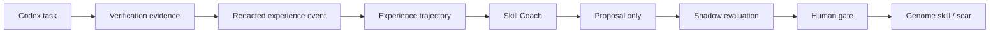

# Codex 5.5 XHigh Configuration Architecture - Nuzantara

Date: 2026-06-16
Scope: Codex desktop/CLI configuration, Nuzantara agent operating model, Symbiosis/Genome/Cell integration.
Status: Final research spec with first operational controls armed.

## Executive Decision

Do not make Codex "bigger" by loading more prompt, hooks, and plugins at startup.

The strongest architecture is:

1. Keep Codex 5.5 xhigh as the high-agency reasoning cell.
2. Keep startup context small and clean.
3. Move operational intelligence into on-demand skills, profiles, MCP tools, and Genome/Skill Coach feedback.
4. Treat successful Codex work as experience that can become a Nuzantara skill proposal.
5. Keep noisy hooks out of the user surface.

The target is not "Codex replaces Claude Code" and not "Hermes replaces the organism".
The target is: Codex becomes a disciplined Nuzantara cell that can work, verify, and feed learnings back into Symbiosis/Genome.

## Grounding Sources

Official Codex sources consulted:

- Codex configuration reference: https://developers.openai.com/codex/config-reference
- Codex advanced configuration and profiles: https://developers.openai.com/codex/config-advanced
- Codex best practices: https://developers.openai.com/codex/learn/best-practices
- Codex AGENTS.md behavior: https://developers.openai.com/codex/guides/agents-md
- Codex hooks: https://developers.openai.com/codex/hooks
- Codex skills: https://developers.openai.com/codex/skills
- Codex plugins: https://developers.openai.com/codex/plugins
- Codex subagents: https://developers.openai.com/codex/subagents
- Codex import from other agents: https://developers.openai.com/codex/import

Official Claude Code sources consulted:

- Claude Code skills: https://code.claude.com/docs/en/skills
- Claude Code memory: https://code.claude.com/docs/en/memory
- Claude Code settings: https://docs.anthropic.com/en/docs/claude-code/settings
- Claude Code hooks: https://docs.anthropic.com/en/docs/claude-code/hooks

Local Nuzantara sources consulted:

- `/Users/balizero/.codex/config.toml`
- `/Users/balizero/.codex/*.config.toml`
- `/Users/balizero/.codex/hooks.json`
- `/Users/balizero/.claude/settings.json`
- `/Users/balizero/Desktop/nuzantara/AGENTS.md`
- `/Users/balizero/Desktop/nuzantara/SYMBIOSIS.md`
- `/Users/balizero/Desktop/nuzantara/VADEMECUM.md`
- `research/operations/2026-05-21-codex-best-config-audit.md`
- `research/operations/2026-06-04-codex-orchestrator-map.md`
- `research/operations/2026-06-06-sota-agentic-dev-workflow.md`
- `research/operations/2026-06-09-dev-ai-stack-additions-4llm-panel.md`
- `agent-library/learn/README.md`

No local secrets are reproduced in this document.

## Current State

Codex local state is already powerful:

- Base model: `gpt-5.5`
- Reasoning effort: `xhigh`
- Verbosity: low
- Auto compact token limit: 140k
- Sandbox: danger-full-access
- Approval policy: never
- Enabled capabilities include hooks, memories, plugins, apps, browser, computer use, multi-agent, and workspace dependencies.
- User profiles already exist: `cheap`, `standard`, `spark`, `power`, `max`.

The important problem is not lack of power.
The problem is control surface and startup load.

Observed noise/control issues:

- Current Codex session shows skill-description compression because too many plugin skills are visible in the 2 percent skill context budget.
- User explicitly rejected noisy SessionStart/UserPromptSubmit/Stop output.
- SessionStart/UserPromptSubmit/Stop are now disabled in both Codex and Claude user hook configs.
- The old global Codex `AGENTS.md` is stale relative to Air-M5 thin-client reality and model naming.
- The project `.codex/` directory is local and not versioned, so repository architecture cannot depend on it as source of truth.

Observed good state:

- Repo `AGENTS.md` contains the corrected Law 2 boundary.
- `SYMBIOSIS.md` already defines the organism model: successes produce skills, failures produce scars.
- `VADEMECUM.md` already defines Cell/Genome patterns for agents.
- `agent-library/learn` already implements the safe half of learning: propose-only, shadow-first, human-gated.
- Skill Coach already exists as the right ingestion/evolution organ.

## Key Finding

The best Hermes idea is not "more tools".
It is "competence accumulation".

For Nuzantara this maps cleanly:



This keeps Codex operationally powerful while letting Nuzantara own memory, learning, and governance.

## Architecture Principles

### 1. Short Startup, Deep On Demand

Codex should not load the entire organism into startup context.

Startup context should answer:

- Where am I?
- What safety boundary applies?
- What source of truth should I read next?
- Which profile am I using?
- Which organ owns this work?

Everything else should be pulled on demand through:

- AGENTS hierarchy
- Skills
- MCP tools
- Repo docs
- Genome/Skill Coach
- Official web/docs when information is fresh or external

### 2. Profiles, Not One Monster Config

Codex profiles are the right place to encode operating modes.

Recommended profile families:

| Profile | Purpose | Default surface |
| --- | --- | --- |
| `nuzantara-core` | Normal high-quality coding and architecture work | GPT-5.5 xhigh, low verbosity, large compaction, project docs raised |
| `nuzantara-research` | Deep research, review, architecture synthesis | GPT-5.5 xhigh, medium verbosity, clean CLI by default |
| `nuzantara-operator` | Local machine operations with full trust | Current full-access behavior, explicit use only |
| `nuzantara-creative` | Canva/presentation/content work | Creative plugins visible, lower code pressure |
| `nuzantara-business` | Gmail/calendar/Drive/sheets work | Business connectors visible, no repo mutation by default |

This avoids one permanently overloaded session.

### 3. Hook Output Must Be Quiet

Hooks can guard, enrich, and route.
Hooks must not narrate unless there is an actionable block.

Allowed:

- Silent validation
- Deterministic JSON-valid block
- Short `statusMessage` only when useful
- PostToolUse event capture into local files/queues

Disallowed:

- Long SessionStart dumps
- Repeated Stop warnings when user is not asking about git state
- Invalid hook JSON
- Hook output that looks like assistant output

User-facing rule:

> Codex output is the assistant output. Hook output is machine telemetry and must stay out of the conversational surface unless it blocks action.

### 4. AGENTS.md Becomes A Router

Official Codex behavior combines global AGENTS plus project AGENTS chain, with a default project document byte budget.

Current risk:

- The global user AGENTS is large and stale.
- The project AGENTS is very large and may exceed the default document budget.
- Important late-file rules can be truncated.

Target:

- `~/.codex/AGENTS.md`: personal/router layer, max roughly 120 lines.
- Repo root `AGENTS.md`: project constitution, still concise.
- Directory-level AGENTS files: local rules for `apps/backend-rag`, `apps/mouth`, `agent-library`, `research`.
- Long reference material moves to linked docs.

Stopgap:

- Raise `project_doc_max_bytes` in Nuzantara profiles to 65536 so current repo rules are not silently truncated.

Final target:

- Shrink root docs so the raised byte budget is a safety net, not a crutch.

### 5. Skills Are The Operational Cortex

Codex skills are progressive disclosure: the list is visible, full instructions load only when selected.

The current warning means the visible catalog is too broad.

Target:

- Keep local Nuzantara skills concise and high-signal.
- Avoid enabling all broad plugin skills in the default high-agency coding session.
- Use profile-specific plugin surfaces for research, creative, business, and security work.
- Turn repeated successful workflows into Nuzantara-owned skills, not ad-hoc prompt bloat.

Nuzantara skill acceptance criteria:

- Clear trigger
- Short description
- Exact tool boundaries
- Law 2 redaction rule
- Verification command or observable evidence
- Failure mode and fallback
- Metrics

### 6. Codex Is A Cell, Not The Genome

Codex should not own long-term identity, governance, or organism memory.

Codex should:

- Execute tasks.
- Verify observable results.
- Emit clean experience summaries.
- Propose learnings.
- Call Genome/Skill Coach when the work pattern repeats.

Symbiosis/Genome should:

- Store durable skills and scars.
- Govern inheritance.
- Silence stale skills.
- Share safe operational knowledge through `cell:skills`.
- Prevent raw client/OSINT leakage.

This is exactly the Hermes principle, but implemented inside Nuzantara's existing organs.

## Law 2 For Codex

Correct Law 2 is not "no LLM may ever see context".

Correct Law 2 is:

> For every LLM in the system, do not transcribe or persist client PII/OSINT in cleartext in outputs, memories, skills, logs, reports, alerts, prompts saved for reuse, or shared artifacts. Use IDs, hashes, placeholders, or redaction. Raw OSINT mirror remains Pro-bound.

Implication:

- Codex can reason over authorized operational context.
- Codex must not leak raw identifiers into durable artifacts.
- Skill Coach must ingest redacted trajectories, not raw transcripts.
- Research/spec docs must talk about process and architecture, not client facts.

## Recommended Codex Profiles

Two opt-in profile files were created outside the repo:

- `/Users/balizero/.codex/nuzantara-core.config.toml`
- `/Users/balizero/.codex/nuzantara-research.config.toml`

They are intentionally conservative:

- They do not modify the default profile.
- They do not copy secrets.
- They do not alter plugin credentials.
- They raise `project_doc_max_bytes` as a stopgap for the large current Nuzantara AGENTS chain.
- They disable broad plugins by default because the current plugin marketplace cache emits noisy warnings in `codex exec`.

Suggested usage:

```bash
codex --profile nuzantara-core
codex --profile nuzantara-research
```

For non-interactive smoke tests, suppress Rust warning noise:

```bash
RUST_LOG=error codex exec --profile nuzantara-core --sandbox read-only --ephemeral "Reply exactly: OK"
```

Verified on 2026-06-17:

- `nuzantara-core` loads `gpt-5.5`, `xhigh`, `plugins=false`, `plugin_hooks=false`.
- `nuzantara-research` loads `gpt-5.5`, `xhigh`, `plugins=false`, `plugin_hooks=false`.
- Plugin hook dumps disappeared after disabling broad plugins.
- Local skill YAML load errors disappeared after quoting three local skill descriptions.
- Remaining CLI banner is Codex native output, not a hook failure.

Operational artifacts added on 2026-06-17:

- Health checker: `scripts/ops/codex_config_health.py`
- Health checker tests: `tests/scripts/test_codex_config_health.py`
- Profile runbook: `docs/runbooks/codex-nuzantara-profiles.md`
- Local wrappers: `/Users/balizero/.local/bin/codex-nz-core` and `/Users/balizero/.local/bin/codex-nz-research`

## Implementation Plan

### P0 - Already Done

- Disable noisy SessionStart/UserPromptSubmit/Stop hook classes in user configs.
- Keep Stop hook noise out of the user-facing loop.
- Keep current base Codex 5.5 xhigh capability.

### P1 - This Spec

- Capture final architecture decision in repo research.
- Add opt-in Codex profiles for Nuzantara work.
- Do not mutate the live default.

### P2 - Global Codex AGENTS Cleanup

Replace `/Users/balizero/.codex/AGENTS.md` with a compact router.

Recommended sections:

1. Machine and language.
2. Read project AGENTS first.
3. Law 2 output boundary.
4. Worktree discipline.
5. No hook noise.
6. Use profiles.
7. Use skills on demand.
8. Verify before claiming completion.

Remove from global AGENTS:

- Stale Air decommissioning language.
- Claude-specific model names as Codex routing.
- Large project internals that belong in repo docs.
- Long API/provider policy detail that can live in linked references.

### P3 - Project AGENTS Split

Keep root repo AGENTS authoritative but shorter.

Candidate split:

- `AGENTS.md`: constitution and routing.
- `apps/backend-rag/AGENTS.md`: backend rules.
- `apps/mouth/AGENTS.md`: frontend rules.
- `agent-library/AGENTS.md`: skills/scars/learn rules.
- `research/AGENTS.md`: spec/research format.

### P4 - Codex Experience Bridge

Add a Codex-to-Skill-Coach bridge:

1. Detect task completion with verification evidence.
2. Produce a redacted trajectory record.
3. Store in the existing experience database or proposal input directory.
4. Let Skill Coach generate proposals.
5. Keep all application propose-only until shadow metrics pass.

Minimum trajectory schema:

```json
{
  "agent": "codex",
  "machine": "Air-M5|Pro|Mini",
  "repo": "nuzantara",
  "task_id": "string",
  "timestamp": "ISO-8601",
  "organ": "backend-rag|mouth|agent-library|ops|research",
  "actions": ["redacted summary"],
  "verification": ["command or observable evidence"],
  "files_touched": ["repo-relative paths"],
  "law2_status": "redacted|not_applicable",
  "outcome": "success|failed|blocked",
  "candidate_learning": "short reusable lesson"
}
```

### P5 - Profile Health Check

Add a non-invasive health check script:

- Parse TOML profiles.
- Confirm hooks are valid JSON.
- Confirm SessionStart/UserPromptSubmit/Stop remain disabled unless explicitly requested.
- Count visible skill directories.
- Report if project AGENTS exceeds configured byte budget.
- Report whether `.codex/` project config is untracked local state.

Initial implementation: `scripts/ops/codex_config_health.py`.

## Verification Metrics

The architecture is successful only if metrics improve.

Primary metrics:

- Startup hook noise: target 0 user-visible non-blocking dumps.
- Invalid hook JSON events: target 0.
- Skill catalog warning frequency: target near 0 in default/core profile.
- Time to first useful action: lower than current overloaded startup.
- Verification-before-completion rate: target 100 percent for code changes.
- Successful trajectories captured: count per week.
- Skill Coach proposal precision after shadow review: rising trend.

Secondary metrics:

- Number of tasks completed without opening irrelevant plugin surfaces.
- Number of repeated workflows converted to skills.
- Number of stale skills silenced by Genome.
- Number of PII/OSINT redaction violations: target 0.

## Decision

Adopt Codex 5.5 xhigh as a Nuzantara cell with profile-based operating modes.

Do not turn Codex into a giant always-loaded brain.
Do not clone Claude Code configuration blindly.
Do not import Hermes as a replacement.

Use the best pattern from both Claude Code and Hermes:

- Claude Code gives skill discipline, hook guardrails, and repo worktree habits.
- Hermes gives the competence-accumulation mental model.
- Symbiosis/Genome/Cell gives the organism-level ownership layer.

Final target:

> Codex executes. Skill Coach learns. Genome remembers. Symbiosis governs.
