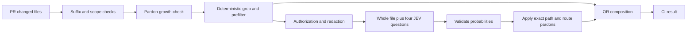

# JEV for faster coding and lower frontier-token consumption

## Decision

**Keep the existing JEV guard, make its measurements honest, then test JEV as a selector of coding context and skills. Do not put it on every tool call, and do not replace the coding agent or its independent verifier.**

The infrastructure is real, but its present purpose is policy enforcement. The repository has one non-test JEV consumer: the paid-endpoint entity lint in CI. None of the proposed memory, skill, task-routing or context-selection lanes is currently connected to JEV in the inspected source. There is no measured reduction in coding tokens or task completion time attributable to JEV yet.

The best first experiment is a small repository-only context selector. Compare three arms: today's workflow, deterministic retrieval with a compact packet, and that same retrieval plus JEV ranking. Keep JEV only if its **incremental** contribution improves accepted coding outcomes per token or per minute. This prevents attributing ordinary `rg`, output limiting and smaller prompts to the model.

## 1. Scope, provenance and what was measured

The audit covers JEV's implementation, its proposed applications, and the coding workflow mechanisms it could improve. It is not a complete audit of every Nuzantara product or daemon.

The analysis uses a dedicated worktree at `29aff5050d`, matching the Pro checkout observed at session start. The interactive M5 checkout was at `c975b22a64`; it lacked newer pardon changes. Implementation findings were reconciled against the newer worktree. No runtime code, credentials, hooks, CI settings, branch protections, or model assignments were changed.

Evidence classes in this report:

- **Current source:** freshly read implementation at the recorded commit.
- **Current runtime:** GitHub state, targeted tests and the live JEV probe run during this audit.
- **Historical:** earlier dossiers and receipts, useful as plans/history rather than current measurements.
- **External evidence:** primary documentation, original research and original benchmark repositories, consulted September 24.
- **Proposal:** an experiment or design recommendation, not a shipped feature or a promised saving.

Current verification:

| Observation | Result and limit |
|---|---|
| Targeted suites on Pro | **314 passed in 17.70s**: entity lint, client pin, vendor fence, catE trigger parity and ban-prose lint. Used the existing repository venv; system Python initially lacked pytest. |
| GitHub main protection | `catE-sovereignty-lint` is now one of **14 required contexts**. This supersedes the September 21 pack's non-required observation. |
| Latest inspected PR run | [Run 35969015315](https://github.com/Bali-Zero/Teman2/actions/runs/35969015315), head `31131948252ab4ddfe35dc1e540d9c87c3b15dbe`, success. Entity step: one file in scope, one reported judged, zero violations/pardons. The counter alone cannot prove a valid model response. |
| Other inspected executions | Push run `35968582757` and merge-group run `35967646231`, head `29aff5050d`, success. The model step deliberately skips these events. |
| Credential configuration | Repository secret name present, updated September 21; M5 secret-file assignment present. No values displayed. Pro/Mini key loading was not re-probed; prior receipts are historical. |
| Installed hook search | No JEV endpoint/client/model references in eligible files under `.claude/hooks` and `.codex/hooks`: 67 files on M5, 71 on Pro, 46 on Mini. This is a bounded text search, not an inventory of every process or indirect wrapper. |
| Fresh vendor probe | 55 repository synthetic cases; **55 complete four-question responses**, 55 HTTP attempts, no missing/partial results. Details below. |

The fresh probe is stronger evidence of availability than a key-presence check. It is still not an end-to-end test of CI enumeration, filtering, composition or pardon behavior.

The tests ran from `/Users/nuzantara/Desktop/nuzantara` on Pro using its existing `.venv/bin/python`, with `PYTHONDONTWRITEBYTECODE=1`, `-m pytest -q -p no:cacheprovider`, and the five paths `scripts/test_lint_paid_llm_entity.py`, `scripts/tests/test_typesafe_client_pin.py`, `scripts/tests/test_vendor_authorization_fence.py`, `scripts/tests/test_cate_trigger_parity.py`, and `scripts/tests/test_lint_ban_prose.py`. The Pro head remained `29aff5050d` when rechecked after the run. Report-path validation found all 13 explicitly referenced repository paths present; the probe JSON parsed and its 55-complete-response assertion passed.

## 2. What JEV actually does here

TypeSafe System One provides typed classification: `Noul` for a yes/no probability, `Choice` for a finite option set, and `Score` for ordered levels. It does not generate source code, explanations, summaries or arbitrary patches. It can select identifiers; ordinary code must assemble the selected text. [Coding-agent boundary](https://docs.typesafe.ai/introduction/coding-agents), [API](https://docs.typesafe.ai/api).

Official terms currently document `jev-1.13.0`, **$0.042 per million input tokens**, free output tokens, 64k total request tokens, and 32k for state plus longest question. The documented 1,200 requests/minute and 250k tokens/second are mutable service limits, not independently verified account entitlements. Pinning the model is appropriate; moving aliases are unsuitable for calibrated gates. [Models and pricing](https://docs.typesafe.ai/models).

The current request path is:

Files are processed sequentially. A single file's four route questions share one request. JEV can add an unpardoned finding; it cannot clear a deterministic grep finding. Silence contributes no opinion and preserves the deterministic result. The semantic layer is therefore degradable, even though the aggregate CI context is required.

Source anchors at the recorded commit:

| Surface | Evidence |
|---|---|
| Model and endpoint pin | `scripts/typesafe_client.py:47-56` |
| Authorization and its limitations | `scripts/typesafe_client.py:100-108`; `infra/vendor-authorizations/authorized_endpoints.json:5-8` |
| HTTP request, retries and response handling | `scripts/typesafe_client.py:194-244` |
| Four questions, threshold 0.80 | `scripts/lint_paid_llm_entity.py:188-268` |
| Whole-file state | `scripts/lint_paid_llm_entity.py:271-298` |
| Pardon registry and OR composition | `scripts/lint_paid_llm_entity.py:307-471` |
| File loop and reporting | `scripts/lint_paid_llm_entity.py:494-587` |
| CI invocation and PR-only model execution | `.github/workflows/catE-sovereignty-lint.yml:279-302` |
| Repository-only vendor authorization | `docs/rules/RULINGS.md:159-169` |

The existing `scripts/lint/lint_ban_prose.py` is deterministic. It is related policy machinery, not another JEV integration.

## 3. Implementation versus all previously proposed lanes

The two September 20 dossiers remain useful design inventories, but they are not deployment records.

| Coding lane | Current state | Value for this objective |
|---|---|---|
| C1: paid-endpoint entity judgment | Implemented, armed, required CI context; new pardon registry exists | Avoids some policy rework; direct frontier-token savings unmeasured |
| C2: PreToolUse command judgment | Proposed; live HOME propagation still a separate deployment concern | High invocation count and latency risk; low priority |
| C3: semantic `Bites:` judgment | Proposed; labeled semantic corpus missing | Could reduce review loops; smaller opportunity than context selection |
| C4: CI failure triage | Proposed; needs diagnosed examples | Useful if it chooses the next diagnostic action correctly |
| C5: gear suggestion | Proposed, no JEV consumer | Advisory only; deterministic floors and seat assignments remain binding |
| C6: subagent report quality | Proposed | May catch empty handoffs; first use deterministic required fields |
| C7: memory reranking | Proposed; lexical recall engine already exists | Promising only after candidate recall improves; HOME memory is outside current vendor authorization |
| C8 / L8: skill suggestion | Proposed | Good low-blast-radius pilot using repository-owned skill metadata |

The general dossier's L1 WhatsApp intent, L2 product RAG reranking, L3 KBLI classification, L4 RAG passage gating, L5 citation checks, L6 WhatsApp guardrails, L7 editorial ranking and L9 intake classification also remain **JEV proposals**, not located JEV consumers. Product capabilities may already exist through other implementations. These lanes do not directly optimize coding, and several need non-repository material outside the current authorization. They should not displace the coding experiment.

The authorization history is explicit: September 21 initially closed the vendor; `-bis` authorized typed judgments over repository content; `-ter` armed the CI finding. “Total authorization” in historical conversation does not authorize exporting HOME memories, raw task transcripts, CRM rows or OSINT through a new caller.

## 4. Fresh benchmark and what it proves

The existing corpus contains 26 guilt cases and 29 innocence cases; 23 guilt cases are marked as missed by grep. The audit used the existing questions, redactor and pinned client with **one attempt per case** and a five-second request timeout. This differs from production's retry policy intentionally, to bound the audit. No benchmark text or response body was saved; the retained artifact contains aggregate metrics and synthetic case identifiers.

| Metric | September 24 measurement |
|---|---:|
| Complete responses | 55 / 55 |
| JEV guilt detections at 0.80 | 21 / 26 = **80.8%** |
| Detections among grep misses | 19 / 23 = **82.6%** |
| False alarms | 0 / 29 |
| Sequential wall time | **45.218 seconds** |
| Request latency, p50 / p95 | **811.30 / 919.07 ms** |
| Reported input tokens | **52,988** |
| Estimated vendor cost | **$0.002225496**, about 0.22 US cents |

Cost is arithmetic using the published price, not a billing-invoice reconciliation. These are M5-to-service wall times, including transport and local handling, not pure model execution latency. The client requested the pinned version; the probe did not retain the response's resolved-model field.

The model missed raw HTTP/shell routes and one canonical case caught by grep. The headline rates reproduce the September 21 receipt. From the fixture labels, three grep detections plus 19 model-only detections imply 22/26 composed coverage; that is a derived figure, not a measured execution of the full CI path.

Approximate 95% Wilson intervals are **62.1–91.5%** for 21/26 and **62.9–93.0%** for 19/23. These describe finite-sample uncertainty under sampling assumptions; they do not fix the corpus's deliberate enrichment for grep misses. Repeating the same pinned-model corpus demonstrates stability, not independent validation or production recall.

Zero false alarms on 29 curated examples does not establish a production false-positive rate. Even under ideal independent representative sampling, zero events in 29 gives an approximately 9.8% one-sided 95% upper bound. Here the corpus is synthetic and partly author-designed, so the representativeness assumption is absent.

All 55 cases match the existing prefilter. The corpus therefore says nothing about its real selectivity or how often it avoids a request. Lower thresholds catch additional examples, but choosing one using the same corpus would be test-set tuning. No threshold change is recommended from this run.

Artifact: `research/operations/2026-09-24-jev-coding-live-probe.json`.

## 5. Existing optimization mechanisms to reuse

The workflow already contains much of the deterministic foundation. Replacing it with a new orchestration system would duplicate work.

| Existing mechanism | What it already provides | Appropriate JEV addition |
|---|---|---|
| MOS recall | BM25 × recency × importance; six results, 1,500-byte output cap; threshold tuned on 12 scenarios | Rerank a wider eligible shortlist after proving retrieval recall; do not assume reranking recovers unseen candidates |
| Prompt recall hook | Quiet gating and compact query construction | Optional suggestions on eligible repository-derived tasks, not a network call on every prompt |
| Output hygiene guard | Deterministic output-shape controls, 24 KiB read ceiling, stated <50 ms budget | Keep this local and deterministic; JEV should not replace a cheap size check |
| `seat_build.sh` | Context-window eligibility, task-size estimate and effort constraints | A future recommendation inside the already permitted seat set |
| `change_map.py` | Path-aware CI selection with conservative unknown handling | Optional prioritization of feedback, never removal of required checks based on model confidence |
| Codex context bridge | Actual token-event accounting and structured rollover/verification receipts | Measure usage through existing counters; JEV must not invent token counts or replace continuation state |
| Skills and MCP discovery | Existing catalogs and on-demand tools | Select relevant entries while preserving explicit requests and mandatory rules |

Anchors: `scripts/memory/mos_recall_sessionstart.py:39-44,282-315`; `scripts/memory/mos_recall_userprompt.py:125-157`; `.claude/settings.json:30,44`; `infra/claude-hooks/output_hygiene_guard.py:1-39`; `scripts/seat_build.sh:248-283`; `scripts/ci/change_map.py:1-14`. The installed M5 context bridge was separately read at `/Users/balizero/.codex/hooks/nuzantara-context/context_bridge.py:170-192`; this is an observed HOME implementation, not a claim about every host's installation.

The project settings register recall hooks. Registration is not a fresh proof that every desktop/CLI session executes them. The audit did not collect a live recall transcript.

The August token audit reported heavy reasoning and ceremony overhead. Those percentages are historical and must not be presented as September's usage mix. Some boot documents have already changed substantially: current worktree sizes are AGENTS 18,105 bytes, CLAUDE 8,308, cicatrix index 2,462, and modus 79,732. These are byte counts, **not token counts or proof that all four are injected every turn**. Reducing broad reads remains useful, but the savings require actual token-event measurements.

## 6. Gaps that matter before expanding JEV

**P0 — Measurement and latency control.** `asked=True` is set before a valid response and then counted as “judged.” Network/malformed-response silence can look like successful clean judgment. Distinguish attempted, answered, schema-valid, abstained and failed; retain numeric usage, requested/resolved model, latency, retries and selection outcome. A failed optional selector must return the deterministic baseline, visibly identified as fallback.

The current client has three attempts, 25-second per-open timeout and 0.8/1.6-second retry sleeps. Three full timeout periods plus sleeps are roughly 77.4 seconds per file; this is not a strict total deadline. Sequential files can multiply the delay. Do not inherit this profile in interactive hooks. Use a separate bounded interactive policy with a total deadline and a shared retry budget; late suggestions are discarded. Start by testing a 1.2–1.5 second optional deadline against the measured network path, not declaring it a universal requirement.

That initial deadline is informed only by approximately 1k-token synthetic inputs. Profile whole-file and 30–50-candidate payloads separately by input-size band before choosing their deadlines. Treat fallback rate as a primary diagnostic: frequent timeouts make C behave like B and do not establish that semantic selection has no value. The current client has no local token-limit check or chunking; if the service rejects an oversized file, the optional semantic layer can disappear into the same no-opinion path. Record oversize input separately and define an explicit policy before extending the client.

**P1 — Reuse and cache.** There is no content-addressed result cache, request deduplication, input-token budget or circuit breaker in the current path. Cache exact typed judgments under model version + rubric version + normalized state hash + relevant content/dependency revisions. Policy decisions additionally depend on the applicable policy version; pardon composition must be recomputed using the current registry. Similar wording is not enough for a cache hit. Deduplicate calls within a task before adding concurrency.

**P1 — Context boundaries.** The lint sends a whole file without expanding local imports. A wrapper's endpoint may exist in another file, or the prefilter may never see a suspicious word. The coding dossier proposed imported-source context, but the current implementation does not provide it. For code selection, deterministic symbol/dependency retrieval is therefore essential. Passing larger source dumps alone does not fix this weakness.

**P1 — Future pardons.** The registry is implemented and currently empty. Entries bind to exact path and route with provenance fields, but not to a content hash or expiration. Future changed code at that path could inherit an exception. Before routine use, consider content binding and expiry, while retaining the rule that grep cannot be pardoned. This is a prospective risk, not an observed bypass with the empty list.

**P1 — Eligibility and data scope.** The client checks authorization shape and endpoint, but does not validate a target file per request. Its `paths:["**"]` means the caller must still enforce repository origin. New selectors should verify tracked/allowed repository provenance before any external call. The existing redactor strips credential-shaped values, emails and DSN credentials; it is not a general client-data detector. HOME recall and raw user tasks require a separate authorization decision or a genuinely repository-only input path.

**P2 — Documentation drift.** Workflow/ruling comments still say no pardon exists; the benchmark header says 39 while the fixture has 55; the older evidence says catE is not required. Fix these in a scoped follow-up. Historical receipts should remain historical, with a current status pointer rather than being silently rewritten.

## 7. Best practices from primary research, with transfer limits

### Retrieve and select; preserve the evidence needed to act

Anthropic's context-engineering guidance favors small, relevant context and just-in-time retrieval using paths and identifiers. Aider provides a concrete code implementation: a symbol/dependency repository map ranked under a token budget, normally around 1k tokens. This supports building the shortlist deterministically before spending JEV calls. Neither source demonstrates that JEV improves this repository. [Context engineering](https://www.anthropic.com/engineering/effective-context-engineering-for-ai-agents), [Aider repository map](https://aider.chat/docs/repomap.html).

SWE-Pruner reports 23–54% token reductions on coding-agent evaluations using task-aware line selection. Its later Pro variant reports up to 39% savings using an internal pruning head on open-weight backbones. These are evidence that task-aware selection can work, not percentages to promise here. The internal-head approach is not a drop-in feature for subscription Claude/Codex sessions, and JEV has not been shown to reproduce either result. [SWE-Pruner](https://arxiv.org/abs/2601.16746), [SWE-Pruner Pro](https://arxiv.org/abs/2607.18213).

For our pilot, select coherent functions, interfaces and document sections, not arbitrary token deletion. Preserve exact errors, user-referenced symbols, applicable rules and directly affected contracts. Every selected excerpt carries its path, line range and source hash; every omitted candidate remains recoverable.

### Reduce tool output before adding another model

Anthropic documents deferred tool discovery and programmatic execution that keeps intermediate data outside the language-model context. Its internal demonstrations report 85% lower tool-loading overhead and 37% fewer tokens for a programmatic workflow; these are specific experiments, not coding-wide results. The architectural lesson is sufficient: filter, aggregate and validate in code, then return compact results. [Advanced tool use](https://www.anthropic.com/engineering/advanced-tool-use), [MCP code execution](https://www.anthropic.com/engineering/code-execution-with-mcp).

The existing orchestration can already batch independent reads and return selected fields. JEV should handle ambiguous semantic selection after those cheap operations. Do not adopt a paid Anthropic API route to copy a cookbook; the local contract permits Claude OAuth CLI use, and the pattern does not require the banned endpoint.

### Batch related questions, preserve the stable prompt prefix

TypeSafe's 13-question batching example reports 12.2× lower cost and 10× lower latency on one document with Jev 1.12. Its comparison uses sequential single-question requests; concurrent singles would change the latency comparison. Batch questions that need the same relevant state, but do not combine unrelated files into a noisy monolithic prompt. [Parallel questions](https://docs.typesafe.ai/cookbooks/parallel_questions).

The skill cookbook reduced wrong loads from 16.8% to 7.3% and needless loads from 9.8% to 4.0% on 488 synthetic, easier-than-real, single-turn requests with Jev 1.12 and Haiku 4.5. It retained the entire skill roster and appended advice after the stable prefix. This supports a suggestion pilot, but **does not demonstrate fewer roster tokens** or the same effect on current frontier agents. Measure skill-body loads and avoid breaking useful prefix caching. [Skill suggestion](https://docs.typesafe.ai/cookbooks/skill_suggestion).

### Calibrate the actual task and allow abstention

Official confidence describes concentration of a probability distribution, not a verified probability that a coding decision is correct. Noul has no separate confidence field. TypeSafe documents weaknesses in arithmetic, multihop reasoning, distracting context and adversarial state. Typed output prevents arbitrary output values; it does not prevent confidently wrong decisions. [Confidence](https://docs.typesafe.ai/confidence), [Jev limitations](https://docs.typesafe.ai/model-jaggedness/jev-1.13).

Independent results are mixed. An original 300-example benchmark reports 91% accuracy on AG News and 87% on Banking77 but 48% on Emotion; its risk thresholds were evaluated on their fitting slices. A separate 60-case tool-risk study reports 91.7% overall and 71.4% on ambiguous cases. These are useful counterexamples to blanket reliability claims, but too small or domain-specific to calibrate our selector. [Classification benchmark](https://github.com/AbdelStark/jev-benchmarks), [Tool-risk benchmark](https://github.com/themsquared/jev-benchmark).

Measure risk versus coverage: how often an automatic selection is accepted, and how often it is wrong among accepted decisions. Keep calibration and evaluation tasks separate, with temporal/repository splits to avoid leakage. A no-match/uncertain result should retain baseline retrieval or ask the coder to expand. [SelectiveNet](https://proceedings.mlr.press/v97/geifman19a.html).

### Route only when escalation economics and quality support it

RouteLLM and FrugalGPT demonstrate learned routing/cascades on their datasets. Their method—measure quality, cost and escalation together—is applicable. Their headline savings are not transferable to flat subscription quotas or this coding fleet. A generic “easy” score does not establish that a smaller model will solve a task. [RouteLLM](https://arxiv.org/abs/2406.18665), [FrugalGPT](https://arxiv.org/abs/2305.05176).

Use JEV to suggest an allowed seat only after outcome labels exist. Mandatory independent verification, mission colour, assigned role and hot-zone floors remain deterministic. A cheap-model attempt followed by JEV and then a frontier retry may cost more time than starting with the frontier model.

Google's agent-scaling study similarly finds architecture-dependent gains and losses, rather than a universal benefit from more agents. Delegate independent bounded reading or implementation units; count child tokens and coordinator synthesis in the same task budget. [Agent scaling study](https://research.google/blog/towards-a-science-of-scaling-agent-systems-when-and-why-agent-systems-work/).

## 8. Recommended experiment sequence

| Order | Work package | Consumer and acceptance evidence |
|---|---|---|
| 0 | Instrument existing JEV usage and capture coding baselines | Current client/lint plus existing token receipts; answered versus attempted is observable, total task tokens and elapsed time are available |
| 1 | Repository context selection | An optional helper/tool returns compact source packets before the coder's broad reads; paired tasks show fewer frontier tokens without lost required evidence or worse outcomes |
| 1b | Repository skill suggestion | A task-bound suggestion chooses 1–3 eligible skills; explicit requests and mandatory instructions bypass filtering; measure actual bodies loaded |
| 2 | Failure/runbook routing | Structured, sanitized failure metadata selects existing diagnostic material; measure time to first correct action and total repair time, not category accuracy alone |
| 3 | C6 report checks and C3 Bites assistance | Deterministic structural checks first, JEV only for ambiguous task-specific relevance; measure avoided rework |
| 4 | Seat/effort suggestions | Restrict to authorized seats and role constraints; compare total attempts, escalations, success and wall time |
| Deferred | HOME memory reranking; per-tool command adjudication; product lanes | Separate input authorization or deployment work, higher latency/blast radius, or weak connection to coding-token objective |

This order deliberately differs from the September 20 security-first sequence. C1 already exists; the owner's current objective is coding throughput.

### Proposed context-selector contract

Use the existing typed client concept and retrieval utilities; no new service or vector database is needed for the first experiment.

1. Derive an eligible task description from an approved repository task/spec. Do not send arbitrary chat history or HOME memory.
2. Collect candidates using explicit paths, changed files, `rg`, symbols/imports and existing repository indexes. Start with 30–50 compact candidate descriptions, not 50 whole files.
3. Include directly referenced files, mandatory instructions, failing assertions and relevant interfaces unconditionally. A low score cannot remove them.
4. Ask scoped candidate-relevance questions in one or a few bounded batches. Instructions must name the candidate field: question keys themselves are not shown to the underlying model, according to the API documentation.
5. Code assembles exact source excerpts from returned IDs, subject to a frontier packet budget. Start by evaluating 4–8k token packets; this is a test parameter, not a universal optimum.
6. Append optional suggestions after stable instructions. Keep a local manifest of omitted candidates and a tool to expand any of them. JEV does not write the summary or invent file references.
7. On uncertainty, timeout or invalid output, return deterministic retrieval. Cache exact results and measure cache hits separately from network calls.

Deliver the first pilot as an **explicit optional context-selection tool/helper**, called once at the start of an eligible coding task and again only after a material scope change. The returned packet should replace the initial broad exploration reads; measure subsequent read volume to verify that replacement actually occurs. Do not introduce automatic per-tool hook injection in this first experiment.

The full installed skill roster cannot necessarily be hidden by an ordinary hook. A suggestion can prevent unnecessary body loads while leaving metadata overhead unchanged. Any claim of boot-token reduction requires checking the actual host's context-construction interface.

### Evaluation design

Start with 30–50 paired tasks for diagnosis, then expand across enough independent tasks and strata to support the chosen quality margin. Include bug fixes, bounded features, tests, refactors and configuration work; ambiguous tasks, cross-file dependencies and no-relevant-candidate cases are essential. Author labels independently of the selector. Freeze task, repository revision, questions, model and policy. Use isolated worktrees; never let one arm read another arm's solution.

**Entry condition:** verify actual per-task token receipts for every coding model used in the pilot, including child-agent aggregation. The observed M5 Codex bridge alone does not establish Claude or fleet-wide telemetry. Restrict initial evaluation to a seat with verified accounting if the others lack it. Repository-spec tasks are the initial eligible population; report their share of actual coding activity and do not extrapolate results to free-form interactive work.

Compare:

- **A:** current workflow.
- **B:** deterministic shortlist ranked by explicit path/symbol matches, dependency proximity and lexical relevance, with stable tie-breaking, compact output and packet budget. Match C's candidate pool and protected evidence; this must be a strong retrieval baseline, not arbitrary file order.
- **C:** B plus JEV selection.

Randomize order and record warm/cold cache conditions. Report both per-task distributions and aggregates. A's versus C's improvement is total workflow improvement; B versus C isolates JEV's contribution.

A practical first pass runs each arm once per task, then repeats a preselected representative subset three times per arm to estimate run-to-run variation. If that variation dominates the observed difference, expand repetitions or declare the result inconclusive. Pre-register one primary B-versus-C metric—recommended: total frontier input tokens per verified successful task—with verified success/rework and p95 elapsed time as guardrails. Reasoning/output tokens remain separately reported.

An untested alternative is a small model already covered by an authorized subscription, or a local reranker on Pro/Mini. Either could supply semantic selection; local processing also avoids this vendor's outbound-data boundary. The first A/B/C pilot tests whether JEV adds value, not whether JEV is the best possible selector. Compare a suitable challenger before making it the long-term default; do not install or train a new model on M5 for this purpose.

Record frontier uncached input, cached input, output/reasoning tokens where exposed, child usage, JEV input, HTTP attempts, cache hits, abstentions, wall time p50/p95, verified task success, defect/rework rate and context re-expansion. Missing telemetry is unknown, never zero. Subscription quota percentages are separate from billable API dollars.

Suggested pilot targets—not established effects—are at least 15–20% lower frontier input, or, in a separately designated latency experiment, 10% faster median completion, without degraded verified outcomes or a material p95 latency regression. Choose one primary objective before evaluation rather than accepting whichever improves afterwards. Report uncertainty intervals. A small pilot with no observed regression is not statistical proof of non-inferiority.

Stop the rollout for a missed protected instruction, materially incomplete context that causes a defect, or repeated deadline violations. Distinguish a demonstrated regression from an inconclusive B-versus-C comparison. An inconclusive result retains B and does not deploy C; it does not prove JEV useless. A is retained as the reference and B as the fallback. Mandatory tests and the independent verifier remain in all three arms.

## 9. Economics and latency

At the documented price, 1,000 input tokens cost $0.000042; 10,000 cost $0.00042; 100,000 judgments of 1,000 tokens cost $4.20. These are API arithmetic scenarios, not projected traffic or subscription savings.

The fresh probe averaged about 963 input tokens per judgment. Its 0.81-second median matters more than the dollar charge: 100 sequential uncached calls at that latency would add approximately 81 seconds before any benefit. This is why batching, cache hits and avoiding redundant calls come before ubiquitous hooks.

For an optional selector:

`net time saved = avoided frontier/tool/rework time - selection/network/re-expansion time`

`net spend saved = avoided frontier spend - JEV spend - extra retrieval/rework spend`

For a small-model cascade:

`expected cost = small-model cost + JEV cost + escalation_rate × frontier cost + rework cost`

Measure both formulas over **accepted tasks**, including failed attempts. Cached input and reasoning tokens have different cost and latency effects. Removing 10k cached prefix tokens is not equivalent to avoiding 10k reasoning tokens, and API list prices cannot quantify flat-plan quota recovery.

## 10. Meta-pattern

The recurring mistake is equating a available capability with a realized saving: a client exists, a key is set, CI is green, a probability is high, or a vendor benchmark is impressive—and the workflow benefit is then assumed.

The cure is a short causal chain: **eligible input → valid typed response → changed consumer behavior → less total work → equally good or better accepted outcome**. Record evidence at each link. The current CI layer reaches consumer behavior, while coding optimization has not yet been measured at all.

The strongest use of JEV is deciding what expensive work can be avoided. Calling it on work that code already decides cheaply simply adds another step.

## 11. Operator-only decisions

No further operator action was needed to conduct this repository-only analysis and bounded probe under the existing authorization.

Before implementation rollout, business choices remain: the acceptable quality margin, the target metric (quota, dollars, latency or throughput), and authorization for any non-repository material. Existing mission-role and release ownership rules apply to implementation. This report does not authorize replacing final gates, changing model assignments, expanding vendor data scope or deploying hooks.

## 12. Completion and next concrete mandate

The audit, external research, current-source reconciliation, targeted tests and bounded live probe are complete. The recommended next mandate is **instrumentation plus a repository-only context-selection pilot with A/B/C evaluation**. Success means a measured improvement over deterministic compact retrieval, not merely a working JEV call.

An independent fresh Claude OAuth CLI session, resolved model `claude-opus-5-5`, reviewed the draft with xhigh effort and returned **PASS WITH CAVEATS**. It reviewed reasoning and internal consistency without tools, so it did not independently re-fetch citations or rerun code. Its six observations were incorporated: detection-rate intervals, size-banded latency/fallback analysis, an inconclusive outcome branch, a stronger baseline and alternative selector, an explicit delivery mechanism and population boundary, and verified token telemetry as an entry condition. The review's shorthand “worst case” for retry latency was not adopted: there is no strict overall deadline today.

Operational checklist for that mandate:

- [ ] Versioned evaluation tasks and independent outcome labels.
- [ ] Current baseline token/latency receipts, including child work and rework.
- [ ] Distinct attempted/valid/abstained/failed telemetry.
- [ ] Repository provenance check and protected-context list.
- [ ] Exact-result cache, bounded deadline and deterministic fallback.
- [ ] Paired A/B/C evaluation with cache conditions recorded.
- [ ] Decision based on task success, tokens, latency and uncertainty.
- [ ] Independent review and live consumer proof before wider rollout.
