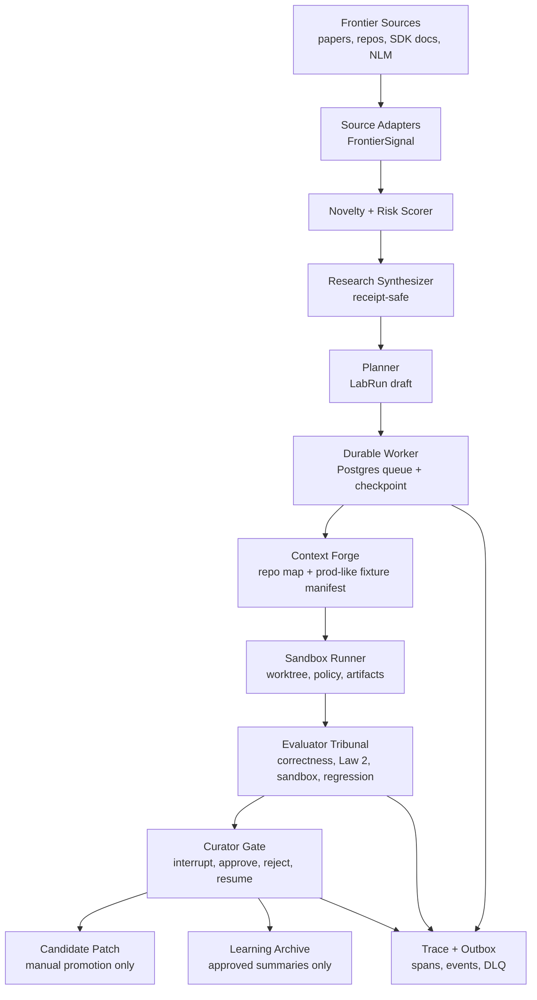
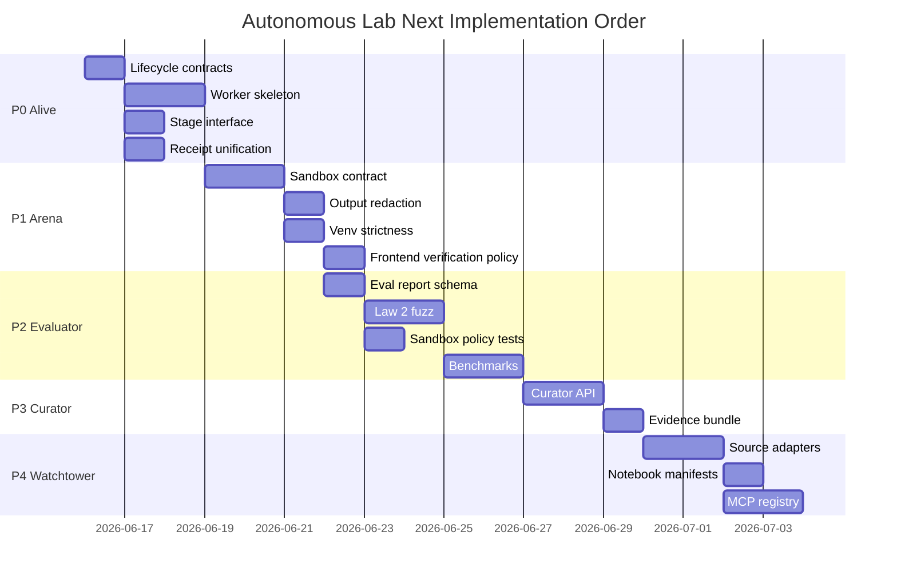

# Autonomous Lab SOTA Next Steps Plan

Date: 2026-06-16
Machine: Pro (`nuzantara@Nuzantara`)
Worktree: `.worktrees/ops-autonomous-lab-watchtower`
Source review: `2026-06-16-sota-coding-workflow-review.md`

## North Star

The Autonomous Lab should become a protected research-to-code organism:

1. watches frontier AI/software research;
2. extracts implementation candidates;
3. reconstructs a prod-like but sanitized context;
4. runs experiments in isolated worktrees/sandboxes;
5. evaluates every candidate before believing it;
6. pauses at a curator gate;
7. promotes only decision-grade outputs;
8. learns from approved trajectories without leaking raw data.

The coherent synthesis from Gemini, Codex, Ollama, and Opus Mythos is:

> The Lab must stop being a beautiful receipt machine and become an evaluated,
> checkpointed, sandboxed state machine.

The spell is simple: `state + sandbox + evaluator + curator`.

## Operating Invariants

These are not optional.

1. Law 2 first.
   - No raw OSINT, PII, notebook body text, stdout, stderr, prompts, or tool
     results persisted in cleartext.
   - External IDs are hashed by default.

2. Zero production autonomy.
   - No deploy, merge, push, migration, production write, Google Workspace
     write, or NotebookLM reshuffle without explicit operator approval.

3. Durable before daemon.
   - No H24 scheduler until the worker loop, heartbeat, reclaim, sandbox,
     evaluator, and curator gate exist.

4. Evaluation is the core loop.
   - A proposal is not a result.
   - A patch is not a result.
   - Only an evaluator report plus curator decision can become a result.

5. Reuse first.
   - Steal patterns from LangGraph, Temporal, Aider, SWE-agent, OpenHands,
     E2B/Vercel/Modal/Firecracker, DSPy GEPA, Reflexion/Voyager/DGM, and MCP.
   - Do not import a large framework until the local contract is clear.

## Target Shape



## Execution Sequence

### Parallel Visual App Track

Every backend phase must ship with a matching visual surface in
`apps/admin-dashboard/app/autonomous-lab/`.

Rules:

1. A backend state that cannot be seen in the UI is not operationally real yet.
2. A UI state that is not backed by a typed contract is a sketch, not a system.
3. The UI follows the same gates as the backend: no raw data, no auto-promotion,
   no hidden execution, no production write shortcuts.
4. Static UI is allowed only as a contract preview; each static slot must name
   the backend artifact that will later hydrate it.

UI phase map:

- Phase 0: static control room, stage vocabulary, twin-track backend/UI plan.
- Phase 1: sandbox policy and command-output evidence panels.
- Phase 2: evaluator score matrix and Law 2 leak-fuzz status.
- Phase 3: curator decision queue and compact evidence bundle.
- Phase 4: watchtower source registry and novelty/risk feed.
- Phase 5: repo-map and prod-like context manifest explorer.
- Phase 6: approved trajectory archive and failure taxonomy.

### Phase 0 - Stabilize the Skeleton

Goal: turn the current draft-only system into a durable, non-dangerous worker
that can run through a full lifecycle with no real code mutation.

Exit metric:

- One queued lab run can be claimed, checkpointed through no-op stage nodes,
  paused at curator gate, resumed/rejected, and fully audited through receipts,
  outbox events, and tests.

#### Step 0.1 - Canonical Lifecycle Contract

Files likely touched:

- `apps/backend-rag/backend/services/autonomous_lab/runtime_contracts.py`
- `apps/backend-rag/backend/services/autonomous_lab/state_store.py`
- `apps/backend-rag/backend/tests/unit/services/autonomous_lab/test_runtime_contracts.py`

Implement:

- `LabStageName`: watch, intake, normalize, compose, reconstruct, experiment,
  verify, curate, archive.
- `LabStageStatus`: pending, running, paused, succeeded, failed, skipped.
- `LabCheckpoint`: run_id, stage, status, fingerprint, created_at, payload.
- `LabArtifactManifest`: artifact_id, kind, path_or_ref, sha256, data_class,
  retention_policy.
- `CuratorDecision`: approve, reject, request_changes, cancel.

Tests:

- Serialization is receipt-safe.
- External IDs are hashed.
- Unknown stage/status values fail closed.

#### Step 0.2 - Worker Skeleton

Files likely touched:

- `apps/backend-rag/backend/services/autonomous_lab/worker.py`
- `apps/backend-rag/backend/services/autonomous_lab/state_store.py`
- `apps/backend-rag/backend/tests/unit/services/autonomous_lab/test_worker.py`

Implement:

- `AutonomousLabWorker.tick()`.
- Claim one queued run with `FOR UPDATE SKIP LOCKED`.
- Write heartbeat.
- Execute stage adapters in order.
- Write stage checkpoints.
- Emit outbox events.
- Stop at curator gate.
- Mark failed with sanitized error reference on exception.

Tests:

- Claims exactly one run.
- Does not claim on Air-M5 execution placement.
- Heartbeat updates are written.
- Failure does not leak raw exception content.
- Idempotent retry resumes from last checkpoint.

#### Step 0.3 - Stage Node Interface

Files likely touched:

- `apps/backend-rag/backend/services/autonomous_lab/stages.py`
- `apps/backend-rag/backend/services/autonomous_lab/orchestrator.py`
- `apps/backend-rag/backend/tests/unit/services/autonomous_lab/test_stages.py`

Implement:

- `LabStageNode` protocol with `run(input) -> StageResult`.
- First no-op nodes for draft, review, reconstruct, verify-plan, curate-pause.
- Stage nodes must declare input data class, output data class, and risk class.

Tests:

- Stage output is receipt-safe.
- Stages cannot emit blocked command verbs.
- Curate stage pauses, not succeeds.

#### Step 0.4 - Receipt Persistence Unification

Files likely touched:

- `apps/backend-rag/backend/services/autonomous_lab/planner.py`
- `apps/backend-rag/backend/services/autonomous_lab/receipt_store.py`
- `scripts/autonomous_lab_draft.py`
- `apps/backend-rag/backend/tests/unit/services/autonomous_lab/test_receipt_store.py`

Implement:

- Deprecate or wrap `planner.write_receipt()`.
- Route all receipt persistence through `AutonomousLabReceiptStore`.
- Add one canonical receipt writer for CLI, router, and worker.

Tests:

- Direct planner receipt write path no longer bypasses receipt-store checks.
- Raw/content/prompt/stdout/stderr keys are refused.
- Atomic write behavior remains intact.

### Phase 1 - Build the Safety Arena

Goal: allow experiments only inside a bounded runner contract, still starting
with local worktrees before any remote sandbox provider.

Exit metric:

- A lab run can prepare an isolated worktree/sandbox manifest, execute only a
  safe verification command with timeout and redacted output, and produce an
  artifact manifest.

#### Step 1.1 - Sandbox Runner Contract

Files likely touched:

- `apps/backend-rag/backend/services/autonomous_lab/sandbox_runner.py`
- `apps/backend-rag/backend/services/autonomous_lab/command_policy.py`
- `apps/backend-rag/backend/tests/unit/services/autonomous_lab/test_sandbox_runner.py`

Implement:

- `SandboxPolicy`: timeout, memory_mb, cpu_count, network, mounts,
  allowed_env_keys, secret_policy, cleanup_policy.
- `SandboxRunRequest`: run_id, stage, command_plan, worktree_ref, policy.
- `SandboxRunResult`: returncode, redacted_stdout_ref, redacted_stderr_ref,
  artifacts, policy_fingerprint.
- `DryRunSandboxRunner`.
- `LocalWorktreeSandboxRunner` with timeout and no shell.

Tests:

- No command runs without a policy.
- Timeout kills the process.
- Env values are never persisted.
- Stdout/stderr redaction happens before storage.

#### Step 1.2 - Command Output Redaction

Files likely touched:

- `apps/backend-rag/backend/services/autonomous_lab/receipt_safety.py`
- `scripts/autonomous_lab_run.py`
- `apps/backend-rag/backend/tests/unit/services/autonomous_lab/test_receipt_safety.py`
- `apps/backend-rag/backend/tests/unit/services/autonomous_lab/test_run_cli.py`

Implement:

- `receipt_safe_command_output(value, source="stdout|stderr")`.
- Secret assignment redaction.
- URL query redaction.
- Email/phone/client-like token masking.
- Hash-only mode for non-test runs.

Tests:

- Known secret/token patterns are removed.
- Long output truncation happens after redaction.
- CLI never returns raw stdout/stderr in persisted receipt mode.

#### Step 1.3 - Virtualenv Strictness

Files likely touched:

- `apps/backend-rag/backend/services/autonomous_lab/command_policy.py`
- `apps/backend-rag/backend/tests/unit/services/autonomous_lab/test_run_cli.py`

Implement:

- Remove fallback to system `pytest`.
- If `.venv/bin/pytest` is missing, return a refused/blocked verification plan
  with a clear receipt-safe reason.

Tests:

- Missing venv fails closed.
- Existing venv uses exact path.

#### Step 1.4 - Frontend Verification Policy

Files likely touched:

- `apps/backend-rag/backend/services/autonomous_lab/command_policy.py`
- `apps/backend-rag/backend/tests/unit/services/autonomous_lab/test_planner.py`

Implement:

- Either add a real allowlisted frontend lint/test plan or stop emitting
  `cd apps/mouth && npm run lint`.
- Prefer explicit `CommandExecutionPlan` entries rather than string commands.

Tests:

- Planner never emits an unexecutable command.
- Unsupported target paths become blocked verification findings, not fake plans.

### Phase 2 - Make the Evaluator the Throne

Goal: every experiment is judged by explicit metrics before it reaches the
operator.

Exit metric:

- A run produces an `EvaluationReport` that can fail a candidate even when tests
  pass.

#### Step 2.1 - Evaluation Report Schema

Files likely touched:

- `apps/backend-rag/backend/services/autonomous_lab/evaluator.py`
- `apps/backend-rag/backend/tests/unit/services/autonomous_lab/test_evaluator.py`

Implement:

- `EvaluationDimension`: correctness, regression, Law 2, sandbox_integrity,
  maintainability, cost, latency, novelty.
- `EvaluationScore`: pass, warn, fail, abstain.
- `EvaluationReport`: dimensions, blockers, evidence_refs, recommendation.

Tests:

- Any Law 2 fail forces overall fail.
- Sandbox integrity fail forces overall fail.
- Missing evidence returns abstain.

#### Step 2.2 - Law 2 Leak Fuzz Harness

Files likely touched:

- `apps/backend-rag/backend/tests/unit/services/autonomous_lab/test_law2_fuzz.py`
- `apps/backend-rag/backend/services/autonomous_lab/receipt_safety.py`

Implement:

- Fuzz strings for API keys, bearer tokens, signed URLs, emails, phone-like
  values, client names, raw notebook-looking snippets, and SQL-looking rows.
- Push them through planner, receipt store, state store sanitizer, runner
  output sanitizer, evaluator report, and outbox payload sanitizer.

Tests:

- No raw fuzz token appears in any receipt-safe output.

#### Step 2.3 - Sandbox Escape and Policy Tests

Files likely touched:

- `apps/backend-rag/backend/tests/unit/services/autonomous_lab/test_sandbox_policy.py`

Implement:

- Attempts to write outside allowed root.
- Attempts to set forbidden env keys.
- Attempts to use network when policy is closed.
- Attempts to run blocked verbs hidden behind allowed strings.

Tests:

- All fail closed with receipt-safe blocker codes.

#### Step 2.4 - Candidate Behavior Benchmarks

Files likely touched:

- `research/operations/autonomous-lab/benchmarks/`
- `apps/backend-rag/backend/tests/unit/services/autonomous_lab/test_benchmark_runner.py`

Implement:

- Tiny benchmark suite for safe lab-internal tasks.
- Golden expected output.
- Metric deltas.
- Failure taxonomy.

Tests:

- Benchmark failures block promotion.
- Benchmark summaries are receipt-safe.

### Phase 3 - Curator Gate and Dashboard

Goal: make manual promotion a real workflow, not a string.

Exit metric:

- Operator can inspect a compact evidence bundle, approve/reject/request
  changes, and resume the run without exposing raw data.

#### Step 3.1 - Curator API

Files likely touched:

- `apps/backend-rag/backend/app/routers/autonomous_lab.py`
- `apps/backend-rag/backend/services/autonomous_lab/state_store.py`
- `apps/backend-rag/backend/tests/unit/services/autonomous_lab/test_router.py`

Implement:

- `GET /autonomous-lab/runs/{run_id}`.
- `GET /autonomous-lab/runs/{run_id}/events`.
- `POST /autonomous-lab/runs/{run_id}/decision`.
- `POST /autonomous-lab/runs/{run_id}/cancel`.

Tests:

- Decisions are idempotent.
- Only paused runs accept curator decisions.
- Decision notes are sanitized.

#### Step 3.2 - Evidence Bundle

Files likely touched:

- `apps/backend-rag/backend/services/autonomous_lab/curator_bundle.py`
- `apps/backend-rag/backend/tests/unit/services/autonomous_lab/test_curator_bundle.py`

Implement:

- Compact run summary.
- Source fingerprints and citations.
- Stage timeline.
- Sandbox policy.
- Evaluation report.
- Artifact manifest.
- Explicit blockers.

Tests:

- Bundle contains no raw material text.
- Missing evidence is visible as missing, not silently omitted.

#### Step 3.3 - Minimal Ops View

Files likely touched:

- Backend router first; UI only after API is useful.
- Optional later: `apps/admin-dashboard/` or `apps/mouth/` route.

Implement:

- Start with JSON endpoints.
- Add UI only after lifecycle and bundle are stable.

Tests:

- API contract tests first.
- Frontend tests later if UI is added.

### Phase 4 - Watchtower and Source Registry

Goal: make "studia senza sosta" real, but bounded.

Exit metric:

- A scheduled or manually triggered watch pass can ingest source metadata,
  score novelty, and produce candidate experiments without raw content leakage.

#### Step 4.1 - Source Adapter Interface

Files likely touched:

- `apps/backend-rag/backend/services/autonomous_lab/source_adapters.py`
- `apps/backend-rag/backend/tests/unit/services/autonomous_lab/test_source_adapters.py`

Implement:

- `FrontierSignal`: source_kind, public_ref, title_fingerprint, observed_at,
  novelty_score, license_hint, risk_class, implementation_hint.
- Adapters are metadata-first and receipt-safe.

Tests:

- Adapter output is safe by construction.
- No adapter can persist raw source body.

#### Step 4.2 - NotebookLM Manifests

Files likely touched:

- `research/operations/autonomous-lab/notebooks.yml`
- `apps/backend-rag/backend/services/autonomous_lab/planner.py`

Implement:

- Move hardcoded notebook routing into a manifest.
- Include notebook role, source count snapshot, write policy, split policy,
  and curation status.

Tests:

- Manifest parsing validates source caps.
- Overflow routing is deterministic.

#### Step 4.3 - MCP Tool Registry

Files likely touched:

- `apps/backend-rag/backend/services/autonomous_lab/tool_registry.py`
- `apps/backend-rag/backend/tests/unit/services/autonomous_lab/test_tool_registry.py`

Implement:

- Tool name, provider, auth scope, machine placement, allowed data class,
  output data class, write capability, network capability, receipt policy.

Tests:

- Unknown tools fail closed.
- Write-capable tools require curator approval.
- Pro-only tools cannot run on Air-M5.

### Phase 5 - Repo Map and Prod-Like Context Forge

Goal: let the Lab understand Nuzantara code like Aider/SWE-agent without
copying raw operational data.

Exit metric:

- A target path produces a sanitized context manifest with symbol map, import
  graph, tests, runtime commands, fixtures, and constraints.

#### Step 5.1 - Repo Map Builder

Files likely touched:

- `apps/backend-rag/backend/services/autonomous_lab/repo_map.py`
- `apps/backend-rag/backend/tests/unit/services/autonomous_lab/test_repo_map.py`

Implement:

- File ownership hints.
- Python import graph.
- Router/service/test proximity.
- Optional tree-sitter later.

Tests:

- Target path maps to likely tests.
- Generated map is bounded and deterministic.

#### Step 5.2 - Prod-Like Fixture Manifest

Files likely touched:

- `apps/backend-rag/backend/services/autonomous_lab/context_manifest.py`
- `apps/backend-rag/backend/tests/unit/services/autonomous_lab/test_context_manifest.py`

Implement:

- Env-key allowlist with no values.
- Fixture shape, not fixture content.
- Runtime command path.
- External service boundary.
- Data class and redaction policy.

Tests:

- Secret values are rejected.
- OSINT/PII raw sample attempts fail closed.

### Phase 6 - Learning Without Self-Poisoning

Goal: let the Lab improve from approved experience while preventing runaway
self-modification.

Exit metric:

- Approved experiments create reusable technique summaries; rejected and failed
  experiments create failure taxonomy entries; nothing self-promotes.

#### Step 6.1 - Trajectory Archive

Files likely touched:

- `apps/backend-rag/backend/services/autonomous_lab/trajectory_archive.py`
- `apps/backend-rag/backend/tests/unit/services/autonomous_lab/test_trajectory_archive.py`

Implement:

- Store sanitized trajectory summaries.
- Link run_id, evaluation report, curator decision, technique tags.
- No raw prompts, raw output, raw notebook text, or raw client data.

Tests:

- Only approved summaries enter reusable library.
- Rejected summaries stay quarantine-only.

#### Step 6.2 - GEPA-Style Optimization Lane

Files likely touched:

- `research/operations/autonomous-lab/benchmarks/`
- `apps/backend-rag/backend/services/autonomous_lab/workflow_optimizer.py`

Implement:

- Offline proposer/evaluator loop on safe benchmark tasks.
- Candidate prompt/workflow variants.
- Evaluator score comparison.
- Manual promotion only.

Tests:

- Optimizer cannot mutate live planner policy.
- Any regression blocks candidate.

## Dependency Order



## First Patch Batch

Do this first, in order, before touching any daemon.

1. Add `runtime_contracts.py`.
2. Add `worker.py` with dry-run stage execution.
3. Add `stages.py` with no-op nodes.
4. Add tests for claim, heartbeat, pause, fail, resume.
5. Route receipt writes through `receipt_store.py`.
6. Make `command_policy.py` fail closed when `.venv/bin/pytest` is missing.
7. Add command output redaction helper.
8. Add `sandbox_runner.py` contract with dry-run and local timeout runner.
9. Add `evaluator.py` schema with hard Law 2/sandbox fail rules.
10. Add router endpoints for run status and curator decision.

Definition of done for the first batch:

- `pytest backend/tests/unit/services/autonomous_lab -q` passes.
- `git diff --check` passes.
- A fake queued run reaches `paused_for_curator`.
- No raw fuzz token appears in any persisted receipt/outbox/eval payload.
- No command executes without a sandbox policy.

## Later Backend Shape

```text
backend/services/autonomous_lab/
  command_policy.py
  context_manifest.py
  curator_bundle.py
  evaluator.py
  operational_plan.py
  orchestrator.py
  planner.py
  receipt_safety.py
  receipt_store.py
  repo_map.py
  runtime_contracts.py
  sandbox_runner.py
  source_adapters.py
  stages.py
  state_store.py
  tool_registry.py
  trajectory_archive.py
  worker.py
```

## Risk Register

| Risk | Why it matters | Control |
| --- | --- | --- |
| Phantom safety | Plans and receipts look safe even when execution is not isolated | Sandbox contract plus evaluator-first gate |
| Raw leakage | stdout, IDs, prompts, or notebook snippets can become receipts | Default hashing, redaction, fuzz tests |
| Split brain | Pro/Mini/Air roles can execute same run incorrectly | Placement policy plus worker claim rules |
| Dead worker | Queue exists but no consumer actually progresses runs | Heartbeat, reclaim, DLQ, stuck-run tests |
| Over-frameworking | Importing a giant agent stack before local contract is clear | Local protocols first, provider adapters later |
| Auto-promotion drift | Learning archive changes future behavior silently | Curator-gated trajectory archive only |

## No-Go Gates

Stop and do not continue to next phase if any of these happen:

1. A receipt stores raw external text, token, URL secret, stdout, stderr, or PII.
2. A worker can run on the wrong machine role.
3. A command can execute without a sandbox policy.
4. An evaluator report can pass while Law 2 or sandbox integrity fails.
5. A curator decision can be bypassed.
6. A notebook/source adapter can write to an external workspace without approval.
7. A deploy/merge/push command appears in any generated command plan.

## The Wizard Version

The Lab is not a bot. It is a forge.

- The watchtower sees.
- The forge shapes hypotheses.
- The arena tests them under glass.
- The tribunal judges them with numbers.
- The curator opens or closes the gate.
- The archive remembers only what survived.

Build the arena before summoning stronger agents. Then stronger agents become
tools inside the circle, not weather outside it.
