# Research OS v1.0.0 — Execution Control Room

**Program state:** `prepared_not_dispatched`
**Frozen architecture:** [`research-os/v1.0.0`](../../specs/evidence-to-action-freeze-2026-08-15/README.md)
**Execution-plan date:** 2026-08-15 WITA
**Authoritative runtime:** Pro
**Control surface:** Air-M5
**Campaign topology:** Pro execution + Air-M5 control; Mini-Pro2 `OUT_OF_CAMPAIGN`
**Execution amendment:** 2026-08-23 — control plane substituted, builder concurrency 2

This directory turns the frozen architecture into an executable program without changing the freeze itself. It separates work that can be prepared in parallel from shared integration points that must remain serial.

At creation time:

- no implementation packet has been dispatched from this control room;
- no migration has been applied;
- no production flag, service, scheduler, route, publisher, or render job has been changed;
- no retirement candidate has been disabled or removed;
- the existing freeze remains the semantic authority.

## Control-room artifacts

- [`SESSION-BOARD.md`](./SESSION-BOARD.md) — packet readiness, critical path, logical fleet slots, parallel batches, leases, and review flow.
- [`WAVE-0-DISPATCH.md`](./WAVE-0-DISPATCH.md) — the first launch queue and exact admission rules.
- [`RETIREMENT-REGISTER.md`](./RETIREMENT-REGISTER.md) — candidate inventory and the instrument → shadow → disable → observe → remove protocol.
- [`parallel execution plan`](../../../../docs/superpowers/plans/2026-08-15-research-os-parallel-execution.md) — task-by-task program plan.
- [`DISPATCH-MANIFEST.md`](../../specs/evidence-to-action-freeze-2026-08-15/DISPATCH-MANIFEST.md) — immutable envelope instantiated separately for every child session.
- [`DEPENDENCY-DAG.md`](../../specs/evidence-to-action-freeze-2026-08-15/DEPENDENCY-DAG.md) — canonical packet dependencies and migration reservations.

## Operating model

```mermaid
flowchart LR
    O["Operator + Conductor on Air-M5"] --> C["Pro-only campaign capacity and collision check"]
    C --> P["Parallel preparation lanes"]
    C --> B["Parallel bounded builders"]
    P --> G["Dependency gate"]
    B --> R["Independent reviewer"]
    R --> G
    G --> I["One serial integrator"]
    I --> S["Shadow and reconciliation"]
    S --> A["Separate owner-authorized canary"]
    A --> T["Retirement evidence"]
    T --> D["One-target disable"]
    D --> W["Observation window"]
    W --> X["Separate later removal"]
```



The Conductor is a role, not another background service. It controls scope, order, dependency truth, operator decisions, and the integration queue. Builders implement bounded packets. Reviewers independently test them. Neither a builder nor a reviewer may create real-world authority merely by returning `PASS`.

## Five hard rules

1. **The freeze is immutable during execution.** If evidence contradicts it, stop and raise a versioned freeze-change proposal.
2. **Preparation is broad; mutation is narrow.** Discovery, fixtures, baselines, and interface prototypes may fan out early. Canonical writes, shared registries, migrations, and live effects wait for their declared dependencies.
3. **The migration train is serial:** `270 → 271 → 272 → 273 → 274 → 275 → 276`. Schema preparation may run in parallel, but integration and application may not.
4. **Generator is not grader.** Every implementation branch receives an independent review; G1–G4 also receive a final on-disk empirical gate from the fleet's designated judge.
5. **Retirement is not deletion.** A legacy path is first instrumented, shadowed, proven replaceable, disabled behind a reversible control, observed for a complete window, and only then considered for a separate removal change.

## Campaign topology amendment: Pro + Air only

The operator has removed Mini-Pro2 from this execution campaign. This is a campaign-scoped placement decision, not a global machine retirement and not a semantic change to the frozen Research OS architecture.

- Pro is the only execution, registry, lease, builder, protected-processing, review-runtime, and integration authority.
- Air-M5 remains the lightweight operator/Conductor surface and may host public, minimized, or read-only review work within its existing boundary.
- Mini-Pro2 is `OUT_OF_CAMPAIGN`: it receives no campaign ref, worktree, branch, lease, builder, reviewer, batch, inference, integration, or retirement-effect assignment.
- Mini-Pro2 reachability, capacity, worktree inventory, and local Redis state are not S00 bootstrap inputs and do not block this campaign.
- The generic fleet inventory may still list Mini-Pro2 for other Nuzantara work. The Research OS controller must filter it out before admission and must reject any attempt to place campaign work there.
- Existing H24 services, stores, daemons, and retained Mini-hosted systems are untouched. Their continued operation or later retirement remains governed by their own contracts and authority gates.
- No campaign branch is fetched, checked out, synchronized, or executed on Mini-Pro2. If Mini later becomes reachable, it remains quarantined from this campaign unless a separately reviewed successor control-room decision explicitly re-admits it.
- An independently reviewed successor of this Control Room must contain this amendment before S00 may rely on it.

The participating topology is therefore closed and explicit: `authority_host=Pro`, `control_surface=Air-M5`, `excluded_nodes=[Mini-Pro2]`. Unknown state on a participating component remains fail-closed. An excluded node is not treated as spare capacity and is not probed as an authority dependency.

## Execution amendment 2026-08-23: control-plane substitution and concurrency

Two operator rulings amend how this control room executes. Neither rewrites the frozen architecture; both are recorded here as the current execution-governing text.

### Amendment A1 — S00 bootstrap substituted by the existing control plane

The S00-only bootstrap exception defined below is not exercised. Session S00 as specified there — a Pro-authoritative run registry, immutable `campaign_root_sha` lineage, fail-closed branch-bound scope sidecars, a hash-bound `INTEGRATION-MANIFEST.schema.json`, and campaign lease-backend fingerprinting — was never finished: it exists only as an unfinished checkpoint on a Pro branch, `scripts/research_os_campaign.py`, roughly 8.5k lines, last commit `3cdd1ae90` ("checkpoint unfinished wave zero control primitive"). The operator has ruled that this program runs on the control plane this repository already operates in production, instead of waiting for S00 to complete.

What actually happens instead of each S00 control — stated as what the existing mechanism does, and what it does not do. An independent refuter (Codex, read-only, 2026-08-23) attacked an earlier draft of this table for overclaiming; the "does not cover" column is the result, verified against the named files at `origin/main` = `03998cf90`.

| S00 control | What runs instead | What that does NOT cover |
|---|---|---|
| Pro-authoritative single-writer run registry + placement | `scripts/agent_start.py` (Agent Worktree Broker, SOTA L1 2026-05-24): creates one branch, one worktree under `.worktrees/<lane>-<task-id>/`, and per-worktree metadata (task, lane, branch, host, time, TTL, PID, base branch, path) | packet state, campaign identity, four-field lineage, dependency graph, builder-cap accounting, and the append-only integration-checkpoint chain. It is a worktree broker, not a campaign registry. |
| Campaign lease universe + backend fingerprint, fail-closed | the existing Redis lease registry (`agent_lock:<resource>`) and its `pre-commit lease-check` hook | **fail-closed behaviour.** `docs/runbooks/redis-lease-registry.md` §"Redis is down → commits pass through silently with WARN" makes this deliberately fail-OPEN: with Redis unreachable the hook exits 0 and the commit proceeds. There is also no campaign keyspace and no backend fingerprint — the client defaults to `127.0.0.1:6379` from the environment. A dead Redis is indistinguishable from an uncontended lane. |
| Serial integrator `I1` + hash-bound, single-use integration manifest | the GitHub merge queue, `CODEOWNERS`, and the required CI gates | the per-merge authorization contract: leases bound to the merge, a review receipt, an expiry, expected merge-tree/result hashes, a destination checkpoint, and an isolated program integration branch. The queue serializes merges; it does not authorize one specific merge once. |
| Per-packet dispatch discipline | `CLAUDE.md` "Agent PR Contract" rules 1-8, notably rule 8 (three reds on the same cause ⇒ the packet SUSPENDS) | machine enforcement. These are rules a session follows, checked by a reviewer. |
| Evidence/receipt discipline | the existing evidence packs, `scripts/evidence_pack_lint.py`, `.github/workflows/harness-floor.yml` | campaign-scoped receipts. The floor/ceiling is computed per PR diff, with no notion of a packet or a wave. |

This is a substitution of mechanism and an explicit reduction in guarantees. Concretely, this campaign runs without:

- **the four-field immutable lineage binding** (`campaign_root_sha` / `dispatch_base_sha` / `source_repository` / `source_base_sha`). Its replacement is a hand-written `base: <sha>` line in the claim commit and every PR body. **Read the fresh-base caveat**: `scripts/agent_start.py` branches from `origin/<base>` after a fetch, but on fetch failure it deliberately falls back to the LOCAL ref with a warning (Law 6 — disconnection is a normal state, not a fault). A lane can therefore start from a stale base while believing it started from the tip, and on a machine whose checkout is held deliberately behind, it will. The dispatching session must read the broker's warning, and the recorded `base:` SHA must be compared against `git rev-parse origin/main` before the lane is trusted as current.
- **fail-closed branch-bound scope sidecars.** File scope is declared in the dispatch prompt and checked by the reviewer. That is post-hoc rejection after the edit exists, not prevention before mutation — an out-of-scope change is caught at review or not at all.
- **atomic collision-check-plus-worktree-creation.** The check and the create are separate steps and a concurrent lane can land between them.
- **a hash-bound, single-use integration manifest per merge.**
- **control-plane enforcement of the builder cap.** Amendment A2's cap of two is Conductor and operator convention: nothing counts active builders, and nothing refuses a third. It holds only as long as the humans and sessions dispatching lanes honour it.
- **any sanctioned dispatch path for the external-repository lanes P01 and P07.** `agent_start.py` takes `--lane` and `--task-id` and operates on the monorepo that owns the script; it has no repository argument, and §H2 accordingly carries no `Lane:` value. Those two packets are therefore dispatched by hand: take a recoverable immutable snapshot of `/Users/nuzantara/Desktop/OSINT-Nexus`, record its id alongside the monorepo `base:` SHA, and never `reset`, `stash`, `clean`, or overwrite the live checkout. This is the weakest seam in the substitution and it sits on the packet with the highest consequence.

The Conductor's independent review gate and the CI required-checks are what stand in for these — they detect after the fact what the S00 controls would have prevented before it, and they cannot supply atomic admission, lease-backend identity, or single-use merge authorization at all. This is an accepted, recorded risk, re-evaluated when Packet 04 lands.

This amendment overrides `SESSION-BOARD.md` line 73 ("No packet is dispatched through a dry-run/direct-broker workaround"): under this amendment, the agent-worktree broker is the sanctioned dispatch path. It overrides `WAVE-0-DISPATCH.md` line 39 ("Until S00 passes, Wave 0 remains blocked"): Wave 0 dispatch does not wait for S00.

Every packet-protocol step below, and in `SESSION-BOARD.md` and `WAVE-0-DISPATCH.md`, that binds `campaign_root_sha` / `dispatch_base_sha` / `source_base_sha` reads, under this amendment, as: the dispatch records the exact `origin/main` SHA the lane's worktree was cut from, and the reviewer verifies the lane's diff against that SHA.

### Amendment A2 — builder concurrency on Pro is two, not four

Operator ruling, 2026-08-23. Measured 2026-08-20..22, four concurrent builders produced 195 merged PRs in three days, of which roughly ten carried business value, and 27 of the 200 commits that landed existed only to correct a claim made by a previous commit. The program-wide builder cap is therefore two, not four: a third eligible builder stays queued and enters only when a slot clears. The `B1–B2` combined preparation ceiling is unchanged: one active slot across both.

## S00-only bootstrap exception

The normal packet protocol below depends on controls that Session S00 must first create. Exactly one bounded bootstrap exception is therefore permitted, for S00 only:

1. bind the exact independently reviewed control-room commit as `control_room_sha` and make it visible to Pro through an immutable feature ref;
2. reverify the current Pro source relationship and critical tooling hashes; if the reviewed commit is not a safe source base, an interactive operator-controlled integrator creates one conflict-free bootstrap-composition commit from an operator-approved immutable Pro source ref plus the exact reviewed control-room change, and an independent reviewer approves that exact composed SHA before S00 edits begin;
3. record that final reviewed immutable SHA as `s00_base_sha`, create one dedicated Pro S00 worktree from it, and prove `HEAD == s00_base_sha` before and after acquiring the existing Pro path/repository leases;
4. create an immutable, branch-bound bootstrap scope receipt containing `control_room_sha`, `s00_base_sha`, source repository/ref, exact owned paths, Pro authority identity, lease-backend fingerprint, expiry, and the default zero-live-effect ceiling;
5. use direct Pro-authoritative worktree, path, registry, and lease inventory for the bootstrap collision check, then recheck the same participating Pro/Air campaign resources after worktree creation; fail closed on any unavailable, mismatched, local-only, or fail-open participating authority component;
6. run S00 as the only program session: no packet builder, reviewer repair, integration, migration, deployment, scheduler/service/flag change, publication, protected-data movement, or paid effect may run concurrently;
7. commit the S00 candidate first, independently review its exact SHA and artifact hashes, and route every repair through a successor commit and fresh review.

During this exception, the pre-S00 generic fleet command is diagnostic only and is not an authority gate. If it exits nonzero solely because it probes excluded Mini-Pro2, record `excluded_node_ignored` and continue with the direct Pro-authoritative bootstrap inventory. Any failure or unknown state involving Pro, the Air-M5 control surface, the exact owned paths, the Pro lease backend, or the immutable source remains a hard stop. The exception terminates when the final reviewed S00 SHA becomes `campaign_root_sha` and creates the normal Pro-authoritative registry, sidecars, placement controls, and dedicated integration-manifest contract. It cannot be reused by a packet or live effect. If the immutable Pro source identity or bootstrap receipt cannot be produced, the campaign remains blocked.

## Normal packet session start protocol

After reviewed S00 has terminated the bootstrap exception, before any child session edits a file: (Superseded by the 2026-08-23 execution amendment in `README.md` — Amendment A1: S00 was never built, so this is not exercised.) What a lane does today is Amendment A1's short sequence: broker worktree, recorded `base:` SHA, existing path leases, merge queue.

1. refresh the authoritative Pro head, the Pro/Air participating topology, and baseline; do not probe Mini-Pro2 as a campaign dependency;
2. confirm the single-writer Pro run registry, the campaign lease, and the exact Pro Redis/backend fingerprint; Air-M5 and Mini-local registries or lease universes are invalid;
3. confirm the immutable `campaign_root_sha`, the exact monorepo control-plane `dispatch_base_sha` selected from the append-only integration-checkpoint chain, the `source_repository`, and its immutable `source_base_sha`;
4. run the campaign-capacity and collision probe over participating Pro/Air resources only; a generic fleet result must be filtered by the reviewed topology policy;
5. select the highest-priority eligible entry from `SESSION-BOARD.md` without exceeding two active builders;
6. instantiate and hash one immutable Dispatch Manifest from the frozen template;
7. acquire every exact path/shared-resource lease;
8. create one dedicated worktree from an immutable ref in `source_repository` resolving to the exact `source_base_sha`; monorepo lanes require `source_base_sha == dispatch_base_sha`, while an external-repository lane binds its separately approved source SHA and keeps `dispatch_base_sha` as control-plane lineage;
9. verify worktree `HEAD == source_base_sha`, repository identity, metadata, scope sidecar, and participating-topology collisions again; P01/P07 remain blocked until an immutable operator-approved OSINT-Nexus source ref exists;
10. record baseline, fixtures, rollback point, flags, cost ceiling, and hard stops;
11. begin implementation only after the session accepts the exact manifest.

The default side-effect ceiling is:

```yaml
filesystem: isolated_worktree_write
database: disposable_test_only
network: public_read_only
external_messages: none
publication: none
deployment: none
production_flags: none
scheduler: none
service_control: none
secret_rotation: none
paid_usage: none
```

Any higher ceiling requires a successor manifest plus an exact, unexpired, effect-specific authority chain. Technical review establishes eligibility only.

## Program state versus packet state

The control room uses a coordinator-only `program_state`; it does not replace the frozen `DispatchStateReceipt` contract.

| Program state | Meaning | Allowed next move |
|---|---|---|
| `queued_preparation` | Dependencies do not permit implementation, but bounded discovery/fixtures are useful | Dispatch a preparation-only manifest |
| `ready_to_dispatch` | Dependencies, ownership, capacity, and baseline are current | Create worktree and immutable manifest |
| `active` | One accepted implementation session owns the packet | Implement only declared files |
| `review_ready` | Builder has stopped with committed evidence | Independent reviewer reruns critical checks |
| `integration_queued` | Review passed, shared integration still pending | Serial integrator preserves the reviewed SHA in a conflict-free merge and tests |
| `shadow` | Integrated candidate is observing with side effects disabled | Reconcile preregistered windows |
| `owner_gate` | Technical gates passed; a consequential effect still needs authority | Wait for the exact operator decision |
| `complete` | Packet exit criteria and required receipts are satisfied | Unlock dependants |
| `failed` | A hard stop or reviewer failure occurred | Repair through a successor dispatch |
| `superseded` | Scope or baseline changed materially | Issue a new immutable manifest revision |

## Integration and review receipts

Every completed builder handoff contains:

- exact `campaign_root_sha`, monorepo `dispatch_base_sha`, `source_repository`, `source_base_sha`, reviewed source commit, and final source commit;
- exact changed paths;
- deterministic, adversarial, security, and privacy results;
- golden-set and metric references where applicable;
- feature-flag values and migration state;
- observed side effects, normally an empty list;
- unresolved gaps;
- rollback proof;
- the independent review verdict and receipt reference;
- `next_authorized_step: none` unless a separate dispatch exists.

The serial integrator rejects:

- unreviewed branches;
- unexplained file-scope growth;
- stale baselines or manifest hashes;
- migration-number drift;
- unresolved shared-file collisions;
- self-grading;
- tests that label fixture success as live readiness;
- any undocumented outward side effect.

The integrator is a distinct interactive Claude/operator-controlled role with its own hash-bound integration manifest; no external builder or reviewer seat may act as I1. Reviewed S00 must create and validate the dedicated `INTEGRATION-MANIFEST.schema.json` successor contract before I1 exists. (Superseded by the 2026-08-23 execution amendment in `README.md` — Amendment A1: S00 was never built, so this is not exercised.) There is no `INTEGRATION-MANIFEST.schema.json` and no I1 session: integration is the merge queue, and the whole per-merge authorization contract described in the rest of this paragraph is one of the four guarantees Amendment A1 records as NOT replaced. The ordinary frozen Dispatch Manifest remains merge-forbidden. One integration manifest authorizes only one exact conflict-free merge of one reviewed source SHA into one named isolated integration branch in the same `source_repository`; it binds the control-plane checkpoint, repository-specific destination checkpoint, leases, review receipt, expected tree/result hashes, expiry, tests, and prohibitions on `main`, rewriting, conflict repair, deployment, production migration, service control, publication, paid use, and all live effects. I1 preserves the reviewed source identity and emits a separate repository result SHA plus a monorepo control-plane integration receipt/checkpoint. If integration requires a rebase, conflict edit, or any rewritten source commit, the candidate returns through a successor repair dispatch and independent review before integration.

## Immediate launch boundary

The first executable queue is defined in [`WAVE-0-DISPATCH.md`](./WAVE-0-DISPATCH.md). It prioritizes the critical path:

1. Packet 04 canonical contracts;
2. Packet 01 NEXUS containment Tasks 1–6;
3. Packet 03 WR3/FlowKit zero-spend readiness;
4. Packet 05 and 06 preparation lanes on Pro, with at most one preparation lane active beside the hot-path lanes — note this line described four concurrent builders under the original cap; under Amendment A2 (2026-08-23) the total across hot-path plus preparation is two;
5. Packet 02, 07, 08, 12, 14, 17, and 18 preparation in the overflow queue.

Nothing in this directory authorizes execution of those entries. Dispatch begins only after this control-room branch receives independent review and the Conductor records a current capacity/baseline receipt.

## Adversarial review

Seat: **Codex** (`codex exec --sandbox read-only`, `model_reasoning_effort=high`), 2026-08-23. Generator ≠ grader: the amendment was drafted by a Sonnet 5 implementer and gated by the Opus 5 Conductor, both Anthropic-family; the refuter is a different family and was given the diff plus read access, with the instruction to default to "defective" and to answer NOTHING FOUND rather than invent findings. A first attempt on Kimi K3 exceeded seven minutes under contention and was abandoned rather than reported as clean.

**Verdict returned: DEFECTIVE, 15 findings.** All 15 were disposed of before this landed; none was waved through. The four load-bearing ones were re-verified by the Conductor against the actual files, not accepted on the refuter's word:

| Finding | Verified how | Disposition |
|---|---|---|
| The Redis lease registry is **fail-open**, so it cannot replace a fail-closed campaign lease universe | `docs/runbooks/redis-lease-registry.md:121` — "Redis is down → commits pass through silently with WARN", hook exits 0 | CONFIRMED. The substitution table now states it, and the "does not cover" column says a dead Redis is indistinguishable from an uncontended lane. |
| `agent_start.py` falls back to the **local** base branch when `git fetch` fails, so "cut from a fresh `origin/main` tip" can be false | `scripts/agent_start.py:909-923` — deliberate offline fallback with a warning (Law 6) | CONFIRMED. A1 now carries the caveat and requires the recorded `base:` SHA to be compared against `git rev-parse origin/main`. |
| The broker cannot dispatch the **external-repository** lanes P01/P07 — it has no repository argument | `grep add_argument scripts/agent_start.py` — only `--lane`, `--task-id`, and lifecycle flags; §H2 carries no `Lane:` value | CONFIRMED. A1 now names this as the weakest seam and specifies the hand dispatch: recoverable immutable snapshot first, never touch the live checkout. |
| The launch boundary still described **four** concurrent builders after A2 cut the cap to two | `README.md:209` — "one preparation lane active beside the three hot-path lanes" | CONFIRMED and corrected. |

The remaining eleven were unsuperseded S00 sentences (five), overclaims in the substitution table (three), understated loss of enforcement — including the fact that the two-builder cap is convention with nothing counting builders (three). Each is either corrected or now carries an inline supersession marker. The refuter's central charge was that the table asserted replacements the named mechanisms cannot provide; that table was rewritten around a "what that does NOT cover" column as a direct result.
