# Research OS v1.0.0 — Execution Control Room

**Program state:** `prepared_not_dispatched`
**Frozen architecture:** [`research-os/v1.0.0`](../../specs/evidence-to-action-freeze-2026-08-15/README.md)
**Execution-plan date:** 2026-08-15 WITA
**Authoritative runtime:** Pro
**Control surface:** Air-M5

This directory turns the frozen architecture into an executable program without changing the freeze itself. It separates work that can be prepared in parallel from shared integration points that must remain serial.

At creation time:

- no implementation packet has been dispatched from this control room;
- no migration has been applied;
- no production flag, service, scheduler, route, publisher, or render job has been changed;
- no retirement candidate has been disabled or removed;
- the existing freeze remains the semantic authority.

## Control-room artifacts

- [`SESSION-BOARD.md`](./SESSION-BOARD.md) — packet readiness, critical path, logical fleet slots, parallel batches, leases, and review flow.
- [`WAVE-0-DISPATCH.md`](./WAVE-0-DISPATCH.md) — the first launch queue and exact admission rules.
- [`RETIREMENT-REGISTER.md`](./RETIREMENT-REGISTER.md) — candidate inventory and the instrument → shadow → disable → observe → remove protocol.
- [`parallel execution plan`](../../../../docs/superpowers/plans/2026-08-15-research-os-parallel-execution.md) — task-by-task program plan.
- [`DISPATCH-MANIFEST.md`](../../specs/evidence-to-action-freeze-2026-08-15/DISPATCH-MANIFEST.md) — immutable envelope instantiated separately for every child session.
- [`DEPENDENCY-DAG.md`](../../specs/evidence-to-action-freeze-2026-08-15/DEPENDENCY-DAG.md) — canonical packet dependencies and migration reservations.

## Operating model

```mermaid
flowchart LR
    O["Operator + Conductor on Air-M5"] --> C["Capacity and collision check"]
    C --> P["Parallel preparation lanes"]
    C --> B["Parallel bounded builders"]
    P --> G["Dependency gate"]
    B --> R["Independent reviewer"]
    R --> G
    G --> I["One serial integrator"]
    I --> S["Shadow and reconciliation"]
    S --> A["Separate owner-authorized canary"]
    A --> T["Retirement evidence"]
    T --> D["One-target disable"]
    D --> W["Observation window"]
    W --> X["Separate later removal"]
```



The Conductor is a role, not another background service. It controls scope, order, dependency truth, operator decisions, and the integration queue. Builders implement bounded packets. Reviewers independently test them. Neither a builder nor a reviewer may create real-world authority merely by returning `PASS`.

## Five hard rules

1. **The freeze is immutable during execution.** If evidence contradicts it, stop and raise a versioned freeze-change proposal.
2. **Preparation is broad; mutation is narrow.** Discovery, fixtures, baselines, and interface prototypes may fan out early. Canonical writes, shared registries, migrations, and live effects wait for their declared dependencies.
3. **The migration train is serial:** `270 → 271 → 272 → 273 → 274 → 275 → 276`. Schema preparation may run in parallel, but integration and application may not.
4. **Generator is not grader.** Every implementation branch receives an independent review; G1–G4 also receive a final on-disk empirical gate from the fleet's designated judge.
5. **Retirement is not deletion.** A legacy path is first instrumented, shadowed, proven replaceable, disabled behind a reversible control, observed for a complete window, and only then considered for a separate removal change.

## Session start protocol

Before any child session edits a file:

1. refresh the authoritative Pro head, live topology, and baseline;
2. confirm the single-writer Pro run registry, the campaign lease, and the exact Pro Redis/backend fingerprint; Air-M5 and Mini-local registries or lease universes are invalid;
3. confirm the immutable `campaign_root_sha` and the exact immutable `dispatch_base_sha` selected from the append-only integration-checkpoint chain;
4. run the fleet-capacity and collision probe;
5. select the highest-priority eligible entry from `SESSION-BOARD.md` without exceeding four active builders;
6. instantiate and hash one immutable Dispatch Manifest from the frozen template;
7. acquire every exact path/shared-resource lease;
8. create one dedicated worktree from an immutable ref resolving to the exact `dispatch_base_sha`;
9. verify worktree `HEAD`, metadata, scope sidecar, and fleet collisions again;
10. record baseline, fixtures, rollback point, flags, cost ceiling, and hard stops;
11. begin implementation only after the session accepts the exact manifest.

The default side-effect ceiling is:

```yaml
filesystem: isolated_worktree_write
database: disposable_test_only
network: public_read_only
external_messages: none
publication: none
deployment: none
production_flags: none
scheduler: none
service_control: none
secret_rotation: none
paid_usage: none
```

Any higher ceiling requires a successor manifest plus an exact, unexpired, effect-specific authority chain. Technical review establishes eligibility only.

## Program state versus packet state

The control room uses a coordinator-only `program_state`; it does not replace the frozen `DispatchStateReceipt` contract.

| Program state | Meaning | Allowed next move |
|---|---|---|
| `queued_preparation` | Dependencies do not permit implementation, but bounded discovery/fixtures are useful | Dispatch a preparation-only manifest |
| `ready_to_dispatch` | Dependencies, ownership, capacity, and baseline are current | Create worktree and immutable manifest |
| `active` | One accepted implementation session owns the packet | Implement only declared files |
| `review_ready` | Builder has stopped with committed evidence | Independent reviewer reruns critical checks |
| `integration_queued` | Review passed, shared integration still pending | Serial integrator preserves the reviewed SHA in a conflict-free merge and tests |
| `shadow` | Integrated candidate is observing with side effects disabled | Reconcile preregistered windows |
| `owner_gate` | Technical gates passed; a consequential effect still needs authority | Wait for the exact operator decision |
| `complete` | Packet exit criteria and required receipts are satisfied | Unlock dependants |
| `failed` | A hard stop or reviewer failure occurred | Repair through a successor dispatch |
| `superseded` | Scope or baseline changed materially | Issue a new immutable manifest revision |

## Integration and review receipts

Every completed builder handoff contains:

- exact `campaign_root_sha`, `dispatch_base_sha`, reviewed source commit, and final source commit;
- exact changed paths;
- deterministic, adversarial, security, and privacy results;
- golden-set and metric references where applicable;
- feature-flag values and migration state;
- observed side effects, normally an empty list;
- unresolved gaps;
- rollback proof;
- the independent review verdict and receipt reference;
- `next_authorized_step: none` unless a separate dispatch exists.

The serial integrator rejects:

- unreviewed branches;
- unexplained file-scope growth;
- stale baselines or manifest hashes;
- migration-number drift;
- unresolved shared-file collisions;
- self-grading;
- tests that label fixture success as live readiness;
- any undocumented outward side effect.

The integrator is a distinct interactive Claude/operator-controlled role with its own hash-bound integration manifest; no external builder or reviewer seat may act as I1. I1 accepts one exact reviewed source SHA at a time into the isolated program integration branch. It preserves that SHA through a conflict-free merge and emits a separate integration-checkpoint SHA and receipt. If integration requires a rebase, conflict edit, or any rewritten source commit, the candidate returns through a successor repair dispatch and independent review before integration.

## Immediate launch boundary

The first executable queue is defined in [`WAVE-0-DISPATCH.md`](./WAVE-0-DISPATCH.md). It prioritizes the critical path:

1. Packet 04 canonical contracts;
2. Packet 01 NEXUS containment Tasks 1–6;
3. Packet 03 WR3/FlowKit zero-spend readiness;
4. Packet 05 and 06 preparation lanes when Mini-Pro2 capacity is available;
5. Packet 02, 07, 08, 12, 14, 17, and 18 preparation in the overflow queue.

Nothing in this directory authorizes execution of those entries. Dispatch begins only after this control-room branch receives independent review and the Conductor records a current capacity/baseline receipt.
