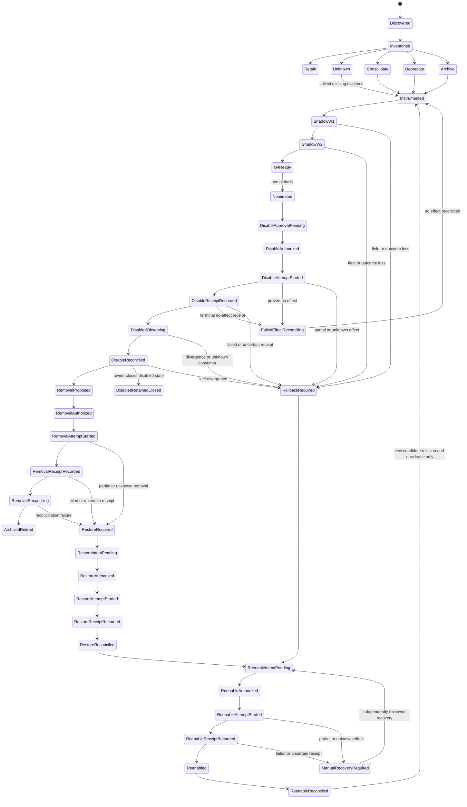

# Research OS v1.0.0 — Controlled Retirement Register

**Registry revision:** `research-os/retirement-register-v1.0.0`
**Program state:** `inventory_design_only`
**Owner:** operator + Conductor
**Execution authority:** none
**Governing packet:** [`16-controlled-retirement.md`](../../specs/evidence-to-action-freeze-2026-08-15/work-packets/16-controlled-retirement.md)

This register organizes candidates; it does not approve a disable or removal. At this revision no candidate is nominated, no flag has changed, no LaunchAgent has been unloaded, no queue has been drained, and no file or data has been deleted.

## 1. Retirement doctrine

The objective is not fewer files. It is fewer competing truths, fewer silent failure paths, and a smaller operational surface while preserving evidence, rollback, and distinct security boundaries.

One child dispatch handles one candidate and one phase. A disable and a removal are always separate effects, with separate hashes, intents, approvals, attempts, receipts, outcomes, reviewers, and rollback evidence.

Time alone never advances a candidate. `UNKNOWN` cannot be nominated. `RETAIN` is a valid terminal classification. `ArchivedRetired` preserves required history and evidence; it never means erasing provenance.

Nomination atomically acquires one program-wide exclusive `active_candidate_id` retirement lease. While it is held, no second candidate may advance beyond inventory. The lease is released only after all outcomes reconcile at one terminal close: `ArchivedRetired`, `DisabledRetainedClosed`, or `ReenableReconciled`. It is not released at `DisableReconciled`, during a removal proposal, or anywhere in a failed/restore/re-enable path. Choosing `DisabledRetainedClosed` means the owner intentionally retains the reversible disabled state and closes this candidate revision; any later removal is a new candidate revision/effect that must reacquire the global lease and repeat current evidence and authority gates.

## 2. Mandatory evidence for every candidate

Before nomination, the candidate record must contain:

- exact producer, consumer, scheduler, route, queue/table/file, owner, and external-use inventory;
- current live-use counters, including unknown-consumer and rejected-type counters;
- replacement owner and exact canonical contract;
- field-by-field, count, hash, state, latency, and side-effect parity;
- two complete operating windows or the stricter window below;
- zero unexplained stranded, silently acknowledged, dead-lettered, or duplicate-effect messages;
- bounded replay, outage, late-arrival, and duplicate-side-effect tests;
- an archive/data-retention decision and immutable pre-disable snapshot;
- a reversible flag or selector that does not destroy state;
- a tested rollback from the disabled state;
- an independent reviewer receipt and G4-compatible outcome evidence;
- one exact disable `ActionIntent` and one unexpired effect-specific owner `ApprovalReceipt`.

Removal adds all of the above again against the disabled-observation evidence. The approval for disable can never authorize removal.

**Inherited Packet 16 entry gate:** every Packet `P01–P15` and `P17–P23` must be complete and G4 must be valid before any Packet 16 session, nomination, disable, or metadata retirement. Earlier read-only audits and instrumentation designs are preparation evidence only. The table's prerequisite column contains additional candidate-specific gates; it never weakens this inherited entry gate.

## 3. Candidate inventory

The observations below were refreshed read-only on 2026-08-15 WITA and must be reverified in the target dispatch. Counts and loaded-process state are evidence pointers, not timeless facts.

| ID | Candidate | Current classification | Replacement / purpose | Additional candidate-specific prerequisites | Control needed | Minimum proof window | Risk / order |
|---|---|---|---|---|---|---|---|
| `R01` | Legacy MATA NotebookLM whole-KB scan function | `UNKNOWN`, likely `ARCHIVE` | current stream-mode feeder while it remains needed | 30-day call/import telemetry | invocation sentinel; no disable yet | 30 days zero use plus two 7-day sentinel cycles | low/medium; nominate only after zero use is proved |
| `R02` | Legacy MATA whole-cell runner | `UNKNOWN`, likely `ARCHIVE` | dedicated current cell/sentinel entry points | 30-day import/manual-run telemetry | invocation sentinel; documented manual fallback | 30 days zero use plus two 7-day sentinel cycles | medium; archive only after R01-independent absence proof |
| `R03` | MATA WR2 `intel.research_dossier` publisher write path only | `DEPRECATE`, live and functionally stranded | P05 canonical MATA adapter → Intel Lake → Conductor/Kita Action Inbox | P05, P12/P18 consumer path and P14 evidence | add fail-closed `MATA_WR2_DOSSIER_WRITE_ENABLED`; excludes `bridge.nerve`, adaptive/shared consumers, plist unload, stream deletion and cursor movement | two 7-day windows plus retained-stream replay and weekly consumer scan | medium/high; first runtime disable candidate |
| `R04` | Intel NotebookLM pusher HOME/repository implementation fork | `CONSOLIDATE`, live | one repo-controlled, hash-attested deployed pusher | P05 implementation and deployment-parity evidence | `INTEL_NB_PUSHER_IMPL={home,repo}` selector; repo shadow/no-write first | two 7-day windows including auth refresh, real push and failure/quarantine | high; prerequisite before R06 |
| `R05` | Duplicate/hardcoded NotebookLM routing registries | `CONSOLIDATE`, live | P17 canonical registry and routing adapter | P17, P05 and exact domain route parity | `NOTEBOOK_REGISTRY_V2_SHADOW`, then target-by-target selector | two 7-day windows across all domains, rollover, probe and not-found cases | high; prerequisite before R06 |
| `R06` | MATA NotebookLM feeder writer duplicate of Intel Lake feed | `DEPRECATE`, live | single canonical Intel Lake pusher fed by canonical MATA events | R04, R05, P05, P17 and P14 evidence | add `MATA_NLM_FEED_WRITE_ENABLED`; keep MATA read/compare/telemetry shadow active | two 7-day windows, source/content-hash parity and outage case | high; after R03/R04/R05 |
| `R07` | Parallel/raw MATA queues after canonical Intel migration | `UNKNOWN` by queue; classify individually | P05 canonical `IntelEvent` outbox and registered consumers | P05 parity, every consumer migrated and P14 evidence | one producer/consumer flag per exact stream; preserve replay cursor/data | W1 and W2 each cover the maximum of producer cadence, longest known consumer cadence and sample floor; unknown/monthly consumer means at least two non-overlapping 30-day windows | high; never retire as a bulk queue family |
| `R08` | Misleading `auto_publish` / `auto_approved` labels | `DEPRECATE` at semantic-adapter level | P02 truthful `ContentObject` state projection | P02, P09 compatibility and P14 evidence | `PUBLICATION_LEGACY_LABELS_ENABLED`; canonical adapter and dual write/read remain active | two windows, each at least the longer of 100 candidates or 14 daily runs | medium; labels before physical history store |
| `R09` | `published_articles.json` legacy read/write dependency | `RETAIN` now; possible late `DEPRECATE` | P02/P09 canonical durable publication history, dedup ledger and writer | R08, P02/P09 parity, complete reader/writer inventory, complete history import and P14 evidence | `PUBLISHED_HISTORY_READ_SOURCE=legacy|canonical`, `PUBLISHED_HISTORY_LEGACY_FALLBACK_ENABLED`, and `PUBLISHED_HISTORY_WRITE_TARGET=legacy|dual|canonical`; immutable legacy snapshot | W1 and W2 each cover `max(100 candidates, 14 daily runs)`, non-overlapping, then a new full window after each effect, plus full replay, replacement outage and tested restore | critical; read cutover, fallback-off, writer-off and physical archive are four separate effects near-last |
| `R10` | Standalone owner decision cockpit/pipeline | `UNKNOWN`, likely eventual `CONSOLIDATE` | P12/P18 Kita Action Inbox + Conductor | full object/action/privacy parity and P19–P23 adoption | read-only shadow projection; route-by-route selector | two 30-day windows because use may be manual/monthly | high; preserve private local store, no PII movement |
| `R11` | Old WR2/WR3 fields and adapters | `UNKNOWN` by field | P03/P10/P11 lossless canonical media contracts | P03, P04, P10, P11 and P14 evidence | field-read telemetry and compatibility flag per exact adapter | W1 and W2 each cover the maximum of production cadence, longest known consumer cadence and sample floor; unknown/monthly consumer means at least two non-overlapping 30-day windows, including rollback render | high; retire field-by-field only |
| `R12` | Mini-hosted MATA SQLite KG reader; authority and purpose `UNKNOWN` | `UNKNOWN`, terminal `RETAIN` for this program | no replacement presumed; only a future P07/NEXUS-compatible reader with complete semantic/security parity may qualify in a new freeze/program | restored health, consumer inventory, 30-day telemetry, P07 and explicit NEXUS boundary review | no disable control until purpose and authority are proved | two 30-day windows after restored access | critical; retained now, absolute last in any future program |
| `R13a` | Metadata alias `com.matagaruda.wr2-bridge.hourly` → canonical live label `com.matagaruda.wr2-bridge` | metadata `CONSOLIDATE` | one runtime-derived identity across ownership catalog, generator, watchdog and docs | exact alias/caller scan and runtime label proof | reversible compatibility alias plus old/new lookup counters; never unload or disable `com.matagaruda.wr2-bridge` | two non-overlapping 7-day inventory windows including two catalog/watchdog regenerations | low; safest first nomination after global P16 admission |
| `R13b` | Already-retired `com.matagaruda.redis-split-brain.check.plist.retired-20260714` archaeology | `ARCHIVE` | immutable archive manifest and current checker identity | zero call/reference proof for this exact file | documentation/archive change only; no runtime label action | two 7-day inventory sweeps | low; separate from R13a |
| `R14` | Dormant/no-op public-channel routes or fixture-only jobs | registry family only; not nominable until split into one exact ID | active registered route or explicit removal | exact route/job identity plus live-use instrumentation | route-specific reject/flag; never broad scheduler cleanup | each exact child covers its longest producer/consumer/scheduled cycle | variable; create `R14-<exact-target>` before any state transition |

## 4. Explicit retain/repair decisions

These are not retirement candidates in the first program pass:

### WR2→WR3 handoff route

The emitter is already default-off, while the current supervisor route has been observed as capable of accepting a declared event without invoking the intended companion dispatcher. Packet 03 must first make typed routing and reject-before-ack semantics true in zero-spend shadow. Packet 11 later proves production behavior under a separate cost-bounded authority. Do not delete the route, old fields, or enable the emitter as a “test” during retirement work.

Existing safety control: `WR2_WR3_HANDOFF_ENABLED` remains off. A change to that flag is not part of Packet 16.

### NEXUS / Garuda graph boundary

NEXUS, its restricted graph, gap work, and Garuda graph jobs serve a distinct institutional-intelligence and security purpose. They are not folded into the general research lake. P01 contains the boundary; P07 improves entity resolution through a synthetic clone and controlled adapters. Any graph-reader consolidation remains `UNKNOWN` until semantic, security, provenance, and operator-use parity are proved. Protected evidence never migrates merely to simplify topology.

## 5. Candidate-specific proof plans

### R03 — unsupported MATA→WR2 dossier writer

Read-only baseline must inventory:

- all producers and schedules that can write `intel.research_dossier`;
- every Redis group and any external/manual consumer;
- every retained envelope's type, identity, field set and hash without copying protected bodies;
- unknown-type ACK, reject and dead-letter behavior;
- the P05 canonical receipt corresponding to each bounded replay item.

Shadow acceptance requires:

- all intended information is represented in canonical Intel events and candidate DecisionPackets;
- zero direct WR2 invocation;
- unknown types are rejected/dead-lettered rather than acknowledged as success;
- bounded replay creates no duplicate downstream effect;
- a weekly/external consumer scan finds no undocumented reader.

Disable changes only `MATA_WR2_DOSSIER_WRITE_ENABLED` for the exact `intel.research_dossier` publisher write path. It does not alter `bridge.nerve`, adaptive or shared consumers, unload a plist, delete the stream, move a cursor, or erase envelopes. Rollback re-enables the exact same producer version and replays from retained state if safe.

### R04/R05/R06 — canonical NotebookLM feed

Treat this as three serial retirements, not one cleanup:

1. align the deployed Intel pusher implementation to a reviewed repository version;
2. adopt one canonical, versioned NotebookLM registry target by target;
3. disable the duplicate MATA feeder only after both predecessors reconcile.

Required comparison keys include canonical source identity, content hash, notebook target, source snapshot, add result, retry/quarantine result, and dedup receipt. A successful stream ACK paired with a failed NotebookLM add counts as loss. Existing NotebookLM sources are never bulk-deleted by this program.

### R08/R09 — publication semantics and history

First replace misleading labels with a compatibility projection. Later prove the durable history ledger covers every live and historical dedup decision. The legacy JSON file has previously served as operational dedup history; a fresh file timestamp or apparently small reader set is not evidence that it is expendable.

R09 cannot be nominated until:

- a complete import/reconciliation report exists;
- every reader and every writer is inventoried, and each writer is routed through an explicit legacy/dual/canonical selector;
- every reader is routed through the canonical ledger or an explicit compatibility adapter;
- dual-write count, identity, state and content-hash parity succeeds without duplicate outward effects;
- replacement-unavailable failure injection falls back safely;
- old and new histories agree in two non-overlapping windows, each covering at least `max(100 candidates, 14 daily runs)`;
- the immutable legacy snapshot and restoration drill pass.

R09 is four independent effects, never one cleanup:

1. switch `PUBLISHED_HISTORY_READ_SOURCE` from `legacy` to `canonical` while `PUBLISHED_HISTORY_LEGACY_FALLBACK_ENABLED` remains on and `PUBLISHED_HISTORY_WRITE_TARGET=dual` preserves writer parity;
2. after a new full proof window and a separate approval, turn the legacy fallback off;
3. after another new full proof window, writer parity, and a separate approval, set `PUBLISHED_HISTORY_WRITE_TARGET=canonical` so the legacy writer is off;
4. only after a further full post-writer-off window and another proposal, approval, snapshot and restore proof, archive the physical legacy file or adapter.

Each effect has its own intent, approval, attempt, receipt, observation and reconciliation. Historical evidence remains archived.

### R10/R12 — long-tail and protected surfaces

Manual cockpits and Mini-hosted graph readers can appear unused in a short telemetry window. Use at least two 30-day windows, include direct imports, scripts, bookmarks/API access, weekly/monthly jobs and operator workflows, and preserve local protected stores. An unreachable service is `UNKNOWN`, not unused.

## 6. Per-candidate dispatch sequence

### Session A — inventory and instrumentation

Allowed side effects: isolated code/worktree changes and test instrumentation only. No production flag transition.

Deliver:

- refreshed registry row;
- exact topology and data-retention map;
- counters/alerts that detect use, unknown consumers, ACK/drop, field loss, and duplicate effects;
- flag/selector design with default preserving current behavior;
- preregistered `MetricProfile`, windows, rollback and archive plan.

### Session B — shadow and parity

Starts only after Session A is independently reviewed and integrated through normal review. Run replacement and incumbent side by side with one side-effect authority. Compare two complete windows, replay, outages, late arrivals, duplicate delivery and field parity.

If evidence is incomplete, remain `INSTRUMENTED` or `SHADOW_W1/W2`. Never promote by elapsed date alone.

### Session C — nomination and disable proposal

The first Packet 16 inventory session must close with exactly one qualified candidate nominated; nomination atomically acquires the exclusive `active_candidate_id` lease and still performs no disable. If no candidate satisfies every global and candidate-specific gate, the session remains open and blocked rather than closing with zero or inventing a winner. Materialize the proposal through the canonical P18/P12 chain. Bind target, arguments, flag transition, version, hashes, rollback and expiry.

### Session D — one reversible disable

After independent G4-compatible review and exact owner approval:

1. verify approval and bindings immediately before the effect;
2. create the immutable started `ExecutionAttempt`;
3. change one flag/selector for one candidate;
4. record terminal `OperationalReceipt` and `OutcomeEvent`;
5. observe a full candidate-specific window;
6. record the disable receipt and reconcile every expected outcome;
7. keep the global `active_candidate_id` lease and stop all other retirement effects until this candidate revision reaches `ArchivedRetired`, `DisabledRetainedClosed`, or `ReenableReconciled`.

The first effect is never code deletion, data deletion, stream deletion, job unload, or scheduler removal.

### Session E — removal proposal and later removal

Only after the disabled observation window reaches `DisableReconciled`, either close intentionally at `DisabledRetainedClosed` with no removal authority, or create a new removal proposal and obtain a new approval while retaining the global candidate lease. Preserve archive/data, record the removal attempt, perform one atomic removal, update runbooks/observability, run failure injection and rollback, record the terminal receipt, and reach `ArchivedRetired` or a completed restore/re-enable reconciliation before choosing another candidate.

## 7. Rollback triggers

Any one of these stops the retirement queue and proposes re-enable:

- an unknown consumer or manual workflow appears;
- a message is stranded, silently acknowledged, or lost;
- an expected outcome or field is missing;
- provenance, privacy, security or NEXUS isolation weakens;
- duplicate outward effects increase;
- replacement latency/reliability crosses its preregistered guardrail;
- a required receipt expires or does not bind the exact current hash;
- rollback depends on already removed data;
- the replacement is unavailable and the failure path was not proven.

Re-enable and post-removal restoration are themselves authorized actions. A narrowly pre-approved rollback intent may be used only within its exact bindings and expiry. A proven no-effect attempt reconciles through `FailedEffectReconciling`; a partial or unknown disable enters `RollbackRequired`; a partial or unknown removal enters the explicit restore chain before re-enable. Failed or uncertain recovery enters `ManualRecoveryRequired` and needs independent review before another exact intent. The candidate lease remains held throughout. After `ReenableReconciled` closes the revision, any retry starts as a new candidate revision at `INSTRUMENTED` and reacquires the lease; it never resumes at the failed stage automatically.

## 8. Recommended order

This order starts only after the inherited Packet 16 entry gate is satisfied. Before then, every item below is evidence gathering or implementation preparation, never nomination, disablement, metadata mutation, archival mutation, or removal.

1. Instrument and classify the full inventory in parallel, then complete the first Packet 16 inventory session by nominating exactly one qualified candidate.
2. Prefer R13a as the first nomination if its runtime-label and alias proof passes; it is a reversible metadata consolidation and does not touch the live job. If it fails, keep the session blocked until exactly one candidate qualifies.
3. Treat R03 as the first runtime disable candidate, only after P05/P12/P18/P14/G4 and its two proof windows.
4. Consolidate R04, then R05.
5. Disable R06 after the canonical feed has two complete windows.
6. If their independent 30-day zero-use evidence passes, archive R01 and R02 one at a time; handle R13b as a separate exact-file archive.
7. Evaluate exact R07 queues one by one.
8. Retire R08 semantic labels through adapters.
9. Consider R10 only after two 30-day Action Inbox parity windows.
10. Consider R11 fields one by one after P03/P10/P11.
11. Execute R09 near-last as four distinct effects: canonical-primary selection with dual write, later fallback-off, later legacy-writer-off, and only later physical archive. Preserve the immutable legacy snapshot throughout.
12. R12 is terminally `RETAIN` in this program. Any future non-RETAIN proposal requires a new freeze/program, fresh authority-and-purpose proof, explicit NEXUS boundary review, and absolute-last position after every other retirement candidate.

The MATA WR2 bridge illustrates why metadata and runtime must stay separate: the plist filename carries an `.hourly` suffix, while its embedded live launchd label does not; an ownership catalog records the suffixed identity as inactive even though the unsuffixed label is loaded. R13a may repair that alias only after admission to Packet 16 and an alias/caller scan. It must not unload or disable the live job, and it must not be confused with the R03 dossier-writer disable. R13b concerns only the separately named, already-retired plist artifact.

## 9. Retirement completion report

After all approved candidates, compare before versus after:

- active producers and consumers;
- queues, groups, dead letters and unknown-message paths;
- NotebookLM feeders and registries;
- publication truth stores and dedup readers;
- review cockpits and Action Inbox projections;
- graph readers and protected boundaries;
- WR2/WR3 adapters and no-op routes;
- LaunchAgents/schedulers and failure paths;
- rollback time, replay completeness and operator cognitive load.

The program succeeds when the topology is simpler and more truthful without losing a source, field, consumer, security boundary, receipt, outcome, historical artifact, or tested return path.
