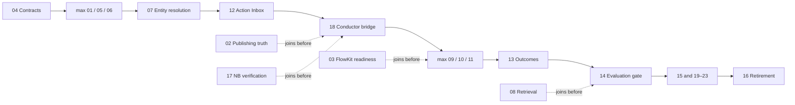

# Research OS v1.0.0 — Session Board

**Board revision:** `execution-board/1.0.1-pro-air-only`
**Program state:** `prepared_not_dispatched`
**Semantic authority:** [`research-os/v1.0.0`](../../specs/evidence-to-action-freeze-2026-08-15/README.md)
**Dependency authority:** [`DEPENDENCY-DAG.md`](../../specs/evidence-to-action-freeze-2026-08-15/DEPENDENCY-DAG.md)

This board maximizes useful parallel work while preserving one writer per artifact, one owner per migration, and one independent decision at every gate. It is an execution projection; it does not alter frozen dependencies.

## 0. Live state — Cohort A, measured 2026-08-23 by the Conductor

Every fact in this section was re-measured on 2026-08-23, not carried forward from the previous snapshot in this file: `gh pr view` on the four merged P04 PRs, a directory listing of `packages/research-os-core/research_os/{models,schemas}/`, a directory listing of `apps/backend-rag/backend/db/migrations_v2/`, and a search for adapter/dual-write/parity files under `packages/research-os-core/`. Re-measure before trusting it — a board is a snapshot, and this one decays the same way the migration ledger below did.

> **Pointer, not a correction (added post-#4783, 2026-08-24):** the P04 rows below have a newer, independent measurement in [`evidence/p04/contract-pass-001.md`](evidence/p04/contract-pass-001.md) §8 — landed via PR #4783, `8089125ec870ce4b7d6965c93d2430be915d4e9c`, 2026-08-24T08:12:03Z. That document carries verdict `PASS_WITH_LIMITS` on P04, and its limitations are in its own §7. This section remains the Conductor's own measurement as of 2026-08-23 — this pointer does not update it; only the Conductor does.

| Lane | Packet | State | Evidence |
|---|---|---|---|
| `H1` | P04 canonical contracts | **lane owner; D1 partial, not landed** | The H1 session on Pro is P04's lane owner. It authored, and all merged 2026-08-23: [#4584](https://github.com/Bali-Zero/Teman2/pull/4584) (ledger revision request 001), [#4587](https://github.com/Bali-Zero/Teman2/pull/4587) (D0 schema inventory, `evidence/p04/schema-inventory-001.md`), [#4586](https://github.com/Bali-Zero/Teman2/pull/4586) (D1 foundation), [#4596](https://github.com/Bali-Zero/Teman2/pull/4596) (ReDoS cure on two name validators in `packages/research-os-core/research_os/primitives.py`). It holds worktrees `backend-rag-ros-v1-p04-contracts-b01` and `docs-ros-v1-p04-inventory` on Pro. Measured on `origin/main`: `research_os/models/` holds 2 models (`successor_edge`, `revocation_receipt`), `research_os/schemas/` holds 2 schemas, against ~25 canonical object kinds defined in the freeze's `CONTRACTS.md`. #4586 landed the foundation (enums, hashing, primitives) plus those two contracts; the remaining ~23 object kinds are still to land, in grouped PRs. |
| `H1` | P04 D2 (migration), D3 (adapters + shadow dual-write + parity probe), D4 (independent contract PASS) | **absent** | `migrations_v2/` head is `278`; no file matching `research_os` or `contract` exists there; no adapter/dual-write/parity file exists under `packages/research-os-core/`. Cohort B (P05 Intel Lake, P06 NAGA) remains blocked by construction until D4's independent PASS is handed to the Conductor. |
| `H3` | P03 WR3/FlowKit | **active, no PR yet** | Holds worktree `wr3-ros-v1-p03-flowkit-ready-b01` on Pro. |
| `H2` | P01 NEXUS Tasks 1-6 | **queued, not dispatched; precondition now satisfied** | A recoverable code-only snapshot of the OSINT-Nexus checkout exists — commit `63311fa6a50be8fde390c52cac600afacc68bf92`, ref `refs/snapshots/pre-p01-2026-08-23`, bundle on Pro at `~/nexus-snapshots/`, mode 0600, proven recoverable by an independent fetch into a virgin repo (fsck clean, one file byte-identical to the working tree). The 82 previously-unpushed commits on branch `feature/lhkpn-cli-entrypoint-2026-05-16` were pushed to the `mini-bare` remote (fast-forward, no force); ahead-of-remote is now 0. The untracked payload (17.6 GB across 168,169 files) was deliberately not copied — inventoried only, manifest kept local at mode 0600. Finding #1, recorded ahead of the packet: the OSINT UI (`com.osint-nexus.ui`, next-server, pid measured on Pro) listens on `*:3333` — wildcard, not loopback — and was proven reachable off-host over Tailscale. The owner has reviewed this and accepted the risk for now (tailnet under his control); the rebind belongs to a successor dispatch, not to Tasks 1-6, which measure without mutating. Dispatch starts once a builder slot frees. |

Builder concurrency on Pro is 2, and both slots are occupied — `H1` on P04, `H3` on P03. `H2` starts when a slot frees.

### Migration-ledger decision 001 (Conductor, 2026-08-23) — stands, re-verified

The freeze reserved `270`–`276` against a migration head of `269`. **All nine slots `270`–`278` are occupied**, re-verified 2026-08-23 against `apps/backend-rag/backend/db/migrations_v2/`: `wa_broker` holds `270`–`274`, `275` is the war_room vision circuit breaker, `276` is the garuda VOA archive comment fix, `277` corrects an Ari email typo, `278` reassigns orphaned CRM clients — none of the nine belongs to Research OS. Head is `278`, with zero open PRs touching `migrations_v2/`. H1 found this, stopped instead of renumbering, and filed the request — the correct move.

The request asked to re-reserve the contiguous block `279`–`285`. **Refused**, on the request's own evidence: its freshness caveat concedes that any unrelated merge voids the new block exactly as it voided the old one. A contiguous integer block frozen at time T against a global mutable counter decays monotonically. The rule instead:

1. A packet reserves a **symbolic name**, never an integer — P04 `research_os_contract_core`, P02 `research_os_publication_truth`, P05 `research_os_intel_lake_events`, P06 `research_os_naga_claims`, P09 `research_os_publication_projection`, P12 `research_os_action_inbox`, P13 `research_os_outcome_collectors`.
2. The **integer is bound at integration time** by the integrating session, from a head re-measured in that same session (`/bin/ls` — `ls` is `eza` on this fleet) plus the open-PR check, never read from a document.
3. **Order preserved, adjacency not**: P04 → P02 → P05 → P06 → P09 → P12 → P13, numbers need not be contiguous, nothing downstream may assume `n+1`.
4. **No number is reserved for a packet that has not authored its SQL.** There is then nothing to void.

`DEPENDENCY-DAG.md` is frozen and is not amended; this is an execution-layer decision and lives here. Also binding on all seven, from H1's finding: the migration must be **PostgreSQL 15 compatible** — CI runs `postgres:15` in `tests.yml` (×2), `fly-deploy.yml`, `intel-router-tests.yml`, `scripts-tests-sweep.yml`, and `docker-compose.yml` uses `postgres:15-alpine`. A PG16+-only feature passes a local 17.8 apply proof and then dies in CI.

## 1. What can and cannot be parallelized

The integration DAG has ten topological levels and a longest path of nine edges. More agents cannot remove those dependencies. Extra capacity is used to pull forward bounded discovery, baselines, fixtures, golden sets, schema design, and isolated prototypes.



Dependency release and integration eligibility by topological level are:

| Level | Packets that may become integration-eligible concurrently after their own entry gates |
|---:|---|
| L0 | `03`, `04` |
| L1 | `01`, `02`, `05`, `06` |
| L2 | `07`, `08`, `17` |
| L3 | `12` |
| L4 | `18` |
| L5 | `09`, `10`, `11` |
| L6 | `13` |
| L7 | `14` |
| L8 | `15`, `19`, `20`, `21`, `22`, `23` |
| L9 | `16`, one retirement target at a time |

Every eligible packet still enters the single serial I1 queue; the table does not authorize concurrent integration. Up to twenty packets permit some early preparation. A preparation lane does not grant contract integration, production reads, canary authority, or a live side effect.

## 2. Logical fleet slots

After S00, live placement is decided immediately before dispatch by the reviewed campaign planner. (Superseded by the 2026-08-23 execution amendment in `README.md` — Amendment A1: S00 was never built, so this is not exercised.) Placement today is `scripts/agent_start.py`; the ceilings in the table below are Conductor-enforced convention, not planner-enforced admission. The existing generic fleet command may supply diagnostics, but it is neither the S00 bootstrap authority nor an admission receipt. The following are admission ceilings, not promises that the nodes are free.

| Slot | Default node | Role | Concurrent ceiling | Boundary |
|---|---|---|---:|---|
| `C0` | Air-M5 | Persistent operator–AI Conductor | 1 | Coordination, public/minimized research, manifests, review queue; no protected runtime |
| `H1–H3` | Pro | Hot-path implementation lanes | 2 host-local (Amendment A2, 2026-08-23 — see `README.md`; label retains three logical slot names, ceiling reduced from three) | Authoritative DB, Qdrant, NEXUS, FlowKit, daemons, render and integration truth |
| `B1–B2` | Pro | Logical batch/preparation/evaluation queue | 1 active across both slots | Public/synthetic fixtures, replay and non-conflicting batch work; the other logical slot remains queued |
| `V1` | Pro or Air-M5 within data boundary | Independent refuter/reviewer | 1 on demand | Different session; Gear-2/refuter family differs from the main builder and reruns critical checks from disk |
| `I1` | Pro | Interactive Claude/operator-controlled serial integrator | 1, exclusive | **Under Amendment A1 (2026-08-23) this role is the GitHub merge queue, not a session**: there is no S00-produced integration manifest. The frozen boundary read "S00-produced dedicated integration manifest; one reviewed SHA at a time; never an external builder/reviewer seat" |
| `X0` | Mini-Pro2 | Excluded node | 0 | No campaign probe dependency, ref, worktree, lease, execution, review, inference, integration, or effect |

Rules:

- `I1` never integrates two branches concurrently.
- The program-wide builder cap is two (Amendment A2, 2026-08-23 — reduced from four; see `README.md`). Host-local ceilings do not add together; a third eligible builder stays queued.
- Both builder slots, when safely admitted, run on Pro; `B1` and `B2` are logical alternatives with one combined active preparation ceiling.
- A saturated Pro reduces builder count; it does not move protected work to Air-M5.
- Mini-Pro2 is outside the dispatch universe. Its darkness does not block S00, but it can never be selected as fallback capacity.
- `V1` may pre-empt the lowest-priority preparation slot so reviews do not starve the critical path.
- Unknown participating-machine state, opaque file ownership, or unavailable Pro lease infrastructure makes placement fail closed. The state of an explicitly excluded node is outside that predicate.
- The practical steady-state target is two bounded builders plus the Conductor. A read-only reviewer may run alongside them only when it does not contend for a saturated host; a review that needs code changes consumes a builder slot through a separate repair dispatch.

The current placement tools are reusable but are not a transactional campaign orchestrator. Before Cohort A, Session S00 must create one Pro-authoritative run registry, freeze one immutable `campaign_root_sha`, and maintain an append-only chain of immutable monorepo integration checkpoints. Every dispatch binds four distinct lineage fields: `campaign_root_sha`, monorepo control-plane `dispatch_base_sha`, `source_repository`, and immutable `source_base_sha`. The Pro authority places lanes sequentially and verifies the resulting worktree repository and `HEAD == source_base_sha`; monorepo lanes require `source_base_sha == dispatch_base_sha`, while external P01/P07 lanes remain blocked until an operator-approved immutable OSINT-Nexus source ref exists. Air-M5 may invoke the Pro authority, but it never writes a local campaign registry or lease. Current `fleet_dispatch.py place` does not propagate the required lineage or write a complete fail-closed scope sidecar, and its collision check plus worktree creation are not atomic; therefore it is advisory only until S00 is independently reviewed. No packet is dispatched through a dry-run/direct-broker workaround. (Superseded by the 2026-08-23 execution amendment in `README.md`: under Amendment A1, the agent-worktree broker — `scripts/agent_start.py` — is the sanctioned dispatch path for this campaign; S00 is not built and this paragraph's registry/lineage machinery is not exercised.)

S00 alone uses the bounded bootstrap exception defined in `README.md`: one reviewed control-room/base composition, one Pro worktree, one branch-bound bootstrap receipt, no concurrent packet and no live effect. S00 commits before review; only its final exact reviewed SHA becomes the campaign root. It also produces the dedicated integration-manifest schema. After that point the exception terminates and every builder, reviewer, repair, or I1 operation must satisfy the normal campaign protocol. (Not exercised — superseded by the 2026-08-23 execution amendment in `README.md`: Amendment A1 substitutes the existing agent-worktree broker, Redis lease registry, and GitHub merge queue for the S00-produced controls described in this paragraph.)

## 3. Event-driven execution cohorts

Packets release as soon as their own predecessors have valid review receipts. A fast lane does not wait for an unrelated slow lane in the same thematic wave.

| Cohort | Parallel implementation lanes | Preparation that may continue alongside | Exit that unlocks the next critical step |
|---|---|---|---|
| A — bootstrap | `04`, `03`, `01-prep` Tasks 1–6 | `02-prep`, `05-prep`, `06-prep`, then `07/08/17` fixtures as capacity permits | P04 independent contract PASS; P01 shadow-ready; P03 zero-spend trace |
| B — contract adoption | `01-final`, `02`, `05`, `06` | `07`, `08`, `12`, `14`, `17`, `18` bounded preparation | G0 and G1 evidence; migrations 271–273 integrated serially |
| C — evidence spine | `07`, `08`, `17`, plus `09-schema` only | P12/P18 prototypes; P09–11 fixtures; P13/14 schemas | G2; migration 274 integrated without activating P09 runtime |
| D1 — action spine | `12` | P18 refresh; P09–11 lossless-interface fixtures | One canonical Action Inbox; migration 275 |
| D2 — operator bridge | `18` | fresh P09–11 successor dispatches from the integrated checkpoint; P13 collectors in fixture mode | Hash-bound handoff that cannot execute by itself |
| E — outcome surfaces | `09-runtime`, `10`, `11` | P13 integration prep; P19–23 inventories | Lossless IDs/receipts across all three surfaces; manual outward stop |
| F — return path | `13` | P14 advisory harness and adoption fixtures | Runnable outcomes; migration 276; complete reporting windows |
| G — release gate | `14` | No canary may use its incomplete measurements | Independent Phase B gate; `insufficient_evidence` does not pass |
| H — adoption | `15`, `19`, `20`, `21`, `22`, `23` | Retirement inventory may refresh read-only | Six independently reviewed lanes and their required windows |
| I — simplification | `16-inventory`, then one named `disable`, then one later `remove` | Other candidate audits may be read-only only | G4, observed disabled window, owner sign-off, separate removal receipt |

Calendar duration is deliberately not guessed. Preregistered operating windows govern wall-clock time. Several packets require two complete windows; Packet 02 and Packet 09 each impose at least a fourteen-day-class observation requirement in their frozen packet. Parallel commits cannot compress evidence that has not yet occurred.

## 4. Packet readiness matrix

`Prep now` means a separate preparation-only manifest with namespaced outputs or read-only evidence. It never means editing the final integration surface before dependencies pass.

| P | Workstream | Prep now | Mutation/integration gate | Primary node/lane | Shared collision |
|---:|---|---|---|---|---|
| 01 | NEXUS containment | Tasks 1–6 after a sanitized Pro snapshot | Task 7 waits for reviewed P04 primitive and five exact effect authorities | Pro, external OSINT-Nexus worktree | NEXUS runtime; P07 waits for containment |
| 02 | Publishing truth | Audit, policy fixtures, golden set | P04 contract PASS; migration 271 after P04's `research_os_contract_core` migration (no fixed number — see §0) | Pro / `backend-rag` | publication state and migration train |
| 03 | WR3/FlowKit readiness | Yes, zero-spend only | Compatibility review against P04 before it can unlock P11 | Pro / `wr3` | same WR3 runtime files later owned by P11 |
| 04 | Canonical contracts | Ready first | None beyond fresh Pro truth and exclusive leases | Pro / `backend-rag` | contract exports, repository core, `research_os_contract_core` migration (no fixed number — see §0) |
| 05 | Intel Lake + MATA | Inventory, replay fixtures, ownership map | P04 PASS; migration 272 after 271 | Pro | Intel/MATA queues and schema |
| 06 | NAGA claim ledger | Schema mapping, fixtures, temporal cases | P04 PASS; migration 273 after 272 | Pro | claim/evidence registry and schema |
| 07 | NEXUS entity resolution | Golden set and synthetic clone plan | P01, P04, P05, P06 PASS; never mutate production graph | Pro / `organism` | P01 external repo boundary; P05 typed message |
| 08 | Hybrid retrieval | Baseline and labeled query set | P05 and P06 PASS; P17 before any grounded canary | Pro | retrieval registry; no embedding change |
| 09 | Blog/Magazine/SEO | Fixtures and schema design | Schema 274 after P02/P04; runtime after P12/P18 | Pro / `cell` | evaluator tree, publication adapter, migration train |
| 10 | WR2 foundry | Visual-contract fixtures and recent-output baseline | P04, P06, P18 PASS | Pro / `wr2` | WR2 scripts and critic path |
| 11 | WR3 foundry | Non-overlapping fixtures only | P03 compatibility PASS plus P04/P06/P12/P18 | Pro / `wr3` | exclusive with P03-owned WR3 files; paid pilot separately gated |
| 12 | Kita Action Inbox | State fixtures and UI prototype | P04/P05/P06/P07 PASS; P08 and P17 required before canary; migration 275 after 274 | Pro / `backend-rag` + `frontend` | action schema, router and Kita route registry |
| 13 | Outcome telemetry | Taxonomy, source mappings, synthetic collectors | P04 and P09–P12 PASS; migration 276 after 275 | Pro / `cell` | Packet 09 SEO files and Packet 14 evaluator tree |
| 14 | Cross-system evaluations | Advisory harness, labeling guide, public/synthetic sets | Blocking Phase B waits for P05–P13, P17, P18 and runnable P13 measurements | Pro | broad evaluator ownership; file-exact lease required |
| 15 | Active learning | Shadow decision collection and offline fixtures | P12/P13/P14/P18 PASS; no autonomous routing mutation | Pro / `ops` | outcome and action registries |
| 16 | Controlled retirement | Inventory and live-use instrumentation plan | All P01–P15/P17–P23 plus G4; one target per dispatch | Pro / `ops` | flags, schedulers, queues, routes; exclusive effect gate |
| 17 | NotebookLM verifier | Routing/privacy fixtures | P04/P06 PASS; reuse canonical repositories or stop for ledger revision | Air-M5 control, Pro-protected processing as required | NLM registry and WR2/WR3 call sites |
| 18 | Conductor bridge | Interaction design and synthetic handoff prototype | P02/P04/P06/P12/P17 PASS; no new migration without ledger revision | Air-M5 design, Pro integration / `frontend` | Action Inbox and Kita registries |
| 19 | Compliance adoption | Inventory and public/synthetic fixtures | P06/P12/P13/P14/P17/P18 PASS | Pro / `backend-rag` | shared Inbox/outcome/evaluator extension points |
| 20 | Client journey | Protected-field map and synthetic fixtures | P12/P13/P14/P18 PASS | Pro / `backend-rag` | shared Inbox/Kita registries; PII remains protected |
| 21 | Revenue/partners | Inventory, aggregate fixtures, PricingTool contract tests | P12/P13/P14/P18 PASS | Pro / `backend-rag` | shared Inbox/outcome registries; no outreach |
| 22 | Product/self-service | Friction inventory and synthetic experiments | P08/P12/P13/P14/P18 PASS | Pro / `frontend` | Kita route and evaluator registries |
| 23 | Team enablement | Inventory, templates, acknowledgment fixtures | P12/P13/P14/P18 PASS | Pro / `frontend` | Kita route and Action Inbox registries; no sends |

## 5. Serial migration train

Schema design can happen on packet branches. Migration integration and application are one ordered queue:

```text
research_os_contract_core P04 canonical core (symbolic name, integer bound at integration time — see §0; shipped as 279)
  ↓
271 P02 publication truth
  ↓
272 P05 Intel Lake v2
  ↓
273 P06 NAGA
  ↓
274 P09 schema-only projections and cursors
  ↓
275 P12 Action Inbox
  ↓
276 P13 outcome aggregates
```

Packet 09 is deliberately split:

- `P09-schema` may prepare and integrate migration 274 after P02/P04 contracts pass; it remains disabled and performs no outward action.
- `P09-runtime` still waits for P12 and P18 before integrating action/publication adapters.

If migration 274 cannot validate without P12/P18, the queue stops. The Conductor raises a formal ledger revision; no worker skips 274, renumbers independently, or applies 275 first.

Packets 17 and 18 have no reservation. They must reuse P04/P12 persistence. Any newly discovered persistence requirement is a hard stop and requires a versioned migration-ledger decision before implementation.

## 6. Shared leases and collision policy

The Conductor maintains one active owner for each shared resource:

| Lease | Normal owner/order | Rule |
|---|---|---|
| `research-os-contract-export` | P04, then compatibility integrator | No domain packet edits canonical definitions |
| `migration-ledger-270-276` | I1 only | Design parallel; integrate/apply serial |
| `backend-router-registry` | I1 | Domain routers are namespaced; mount changes queue serially |
| `mouth-route-registry` | P12, then P18, then P19–23 through I1 | Domain sessions do not concurrently edit shared navigation |
| `wr3-runtime` | P03, then P11 | P11 may prepare non-overlapping fixtures but cannot edit P03 paths concurrently |
| `nexus-runtime` | P01, then P07 | P07 uses synthetic clone until containment is complete |
| `intel-mata-message-contract` | P05 | P07 consumes the repair and never duplicates it |
| `action-inbox-schema` | P12 | P18 and P19–23 use adapters, not a parallel action ledger |
| `outcome-repository` | P04 canonical repository; P13 adapters | P09/P19–23 do not create another outcome store |
| `evaluator-registry` | P14 through I1 | P09/P13/P19–23 own namespaced graders only |
| `launchagent-registry` | I1 plus separate owner effect approval | Source changes do not install or load jobs |

The existing lease tool's availability is not itself proof of ownership. Campaign reservations are Pro-only and bind `authority_host`, absolute registry root, Redis host/port/database/keyspace identity, and a backend fingerprint in every receipt. Air-M5 and Mini-local Redis are invalid authority backends. A missing, unreachable, mismatched, or fail-open lease backend is a stop condition; this campaign has no manual lease fallback.

## 7. Session naming and ownership

Use stable identifiers:

```text
Builder:     ros-v1-pNN-<slug>-bNN
Preparation: ros-v1-pNN-<slug>-prepNN
Reviewer:    ros-v1-pNN-<slug>-rNN
Integrator:  ros-v1-gN-integrate-iNN
Retirement:  ros-v1-retire-rNN-<instrument|disable|remove>
```

Each implementation session:

- owns one packet or one explicitly split sub-packet such as `P09-schema`;
- writes only exact packet-owned paths plus its namespaced evidence bundle;
- is not alone in the codebase and never reverts another session's work;
- stops when a required file lies outside its manifest;
- commits atomically and hands off without merging its own work;
- declares `next_authorized_step: none` unless another immutable dispatch exists.

Preparation evidence is written only under:

```text
research/operations/execution/research-os-v1.0.0/evidence/pNN/<dispatch-id>/
```

It contains public, synthetic, redacted, aggregate, or hash-addressed evidence only. Raw client PII, private locations, protected NEXUS rows, secrets, and source bodies are forbidden.

## 8. Multi-LLM role routing

Models are assigned by role, not prestige. The live fleet roster and health check remain authoritative.

| Role | Preferred family | Use |
|---|---|---|
| Architecture/contract proponent | Opus-class architect | P04 and freeze-change proposals |
| Standard implementation | Sonnet/Terra-class builder | Typed services, adapters, tests, UI work |
| Long-context inventory | Gemini 3.1 Pro | Read-only code/source ingestion and gap maps |
| Domain-grounded verifier | NotebookLM specialist | Exact domain checks; never event storage or execution authority |
| Adversarial refuter / Gear 2 | Current Pro topology's refuter chain | Different session and different family from the main builder; find contract, privacy, replay, and edge-case failures |
| Final empirical gate / Gear 3 | Fable 5 designated judge | Separate Fable session regardless of builder family; inspect actual diff and rerun on-disk evidence at G1–G4; use only the topology-defined degraded fallback |
| Local classifier/batch | Approved Ollama model on Pro | Non-critical asynchronous classification and pre-filtering; Mini-Pro2 is outside this campaign |

The builder cannot review its own work. Gear 2/refuter must use a different session and family from the main builder. Gear 3 is a separate Fable session even when the builder was Anthropic-family; only the current Pro topology's explicit Opus/max degraded fallback applies when all Fable accounts are unavailable. Agreement between models is not evidence, approval, or permission to execute.

## 9. Review and integration flow

```mermaid
sequenceDiagram
    participant C as Conductor
    participant B as Builder
    participant R as Independent reviewer
    participant I as Serial integrator
    participant O as Operator

    C->>B: Immutable manifest + exact ownership
    B->>B: Baseline, tests, implementation, rollback proof
    B->>R: Commit + evidence bundle; stop
    R->>R: Inspect disk, rerun critical checks, adversarial review
    R->>C: PASS / PASS_WITH_LIMITS / FAIL / insufficient_evidence
    C->>I: Exact reviewed SHA + S00-validated integration manifest
    I->>I: Preserve source SHA, merge conflict-free, test integrated checkpoint
    I->>C: Integration receipt; no implied live authority
    C->>O: Exact effect proposal only when eligible
    O-->>C: Separate approval or no action
```

Gate policy:

- A packet reviewer checks its exact branch.
- `I1` checks the integrated candidate, not only the individual branch.
- The ordinary frozen Dispatch Manifest remains merge-forbidden. Reviewed S00 produces the separate hash-bound integration-manifest schema; each instance permits one exact conflict-free merge into one named isolated branch and forbids source rewriting, conflict repair, `main`, deploy, production migration and every live effect.
- G1, G2, G3, and G4 require the separate Gear-3 Fable session defined by current Pro topology; this gate is session-independent rather than family-exclusion-based.
- `PASS_WITH_LIMITS` unlocks only what the receipt explicitly names.
- `insufficient_evidence` never opens a canary or retirement.

## 10. Fail-closed interpretations of freeze ambiguities

The frozen artifacts expose several boundaries that execution must resolve conservatively without silently editing the DAG:

1. **P08 and P12:** the written G2 prose says retrieval supports Action Inbox, but there is no hard `08 → 12` graph edge. P12 may build its core after its declared predecessors; no P12 canary or broader consumer opens before P08 baseline and G2 are valid.
2. **P09 migration 274 versus P12 migration 275:** split `P09-schema` from `P09-runtime` as described above. Stop for a ledger revision if 274 is not independently valid.
3. **P17 canary scope:** P17 does not block offline P08/P12 construction, but grounded canaries that rely on specialist verification wait for its valid receipt.
4. **P03 versus P04 contracts:** P03 may prove zero-spend readiness with frozen fixtures/local adapters. It receives a P04 compatibility review before it can unlock P11.
5. **P17/P18 persistence:** neither invents migration 277 or a private store. They reuse the canonical repositories or stop.
6. **Wave labels versus DAG:** waves are thematic. The DAG and valid receipts determine execution order; specifically, P12 precedes P18, which precedes P09–11.

## 11. Replanning rules

Recompute the launch queue whenever:

- an authoritative baseline or source branch changes;
- a packet fails review;
- a shared lease expires;
- a migration number or purpose drifts;
- a preparation branch reveals a new file collision;
- Pro capacity or the reviewed Pro/Air campaign topology changes materially;
- an operating window produces divergence, stranded messages, duplicate effects, or missing evidence;
- an operator rejects or narrows a proposed effect.

Replanning changes the coordinator board or creates a successor Dispatch Manifest. It never edits an accepted immutable manifest in place.

## Adversarial review

Seat: **Codex** (`codex exec --sandbox read-only`, high effort), 2026-08-23 — generator ≠ grader, a different model family from the Sonnet 5 drafter and the Opus 5 Conductor. Verdict: DEFECTIVE, 15 findings, all disposed of before landing. Findings against this file specifically were unsuperseded S00 sentences and a builder-count arithmetic error, all corrected here. The full review record, including the four findings re-verified against the source files, is in [`README.md`](README.md#adversarial-review).
