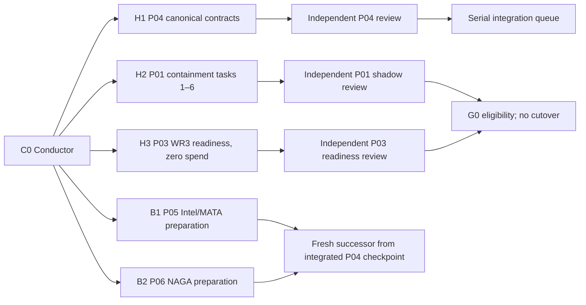

# Research OS v1.0.0 — Wave 0 Dispatch Queue

**Dispatch state:** `prepared_not_dispatched`
**Purpose:** start the critical path with the largest safe fan-out
**Authority:** this document ranks work; it does not authorize a mutation, service effect, paid render, migration application, or production cutover
**Semantic source:** [`research-os/v1.0.0`](../../specs/evidence-to-action-freeze-2026-08-15/README.md)
**Campaign topology:** Pro execution + Air-M5 control; Mini-Pro2 `OUT_OF_CAMPAIGN`

Wave 0 registers three bounded implementation lanes and two preparation lanes. At most two builders run concurrently (Amendment A2, 2026-08-23 — reduced from four; see `README.md`); the remaining three lanes stay ready and enter one at a time as slots clear. The wave creates evidence and reviewed branches; it changes no live service. Every lane receives its own immutable Dispatch Manifest, exact worktree, file scope, leases, builder, reviewer, and completion receipt.

## 1. Launch objective

Open the earliest useful work without allowing two sessions to edit one artifact or letting preparation masquerade as integration.



P04 is the first integration priority because it opens the canonical contract gate. P01 is the first operational-risk priority because it contains NEXUS, but its five production effects remain outside this dispatch. P03 proves the WR3/FlowKit path without spending credits. P05 and P06 pull forward inventories, fixtures, golden sets, and schema mappings so their implementation sessions can start immediately after P04 passes.

## 2. Wave −1: campaign-control preflight

Wave 0 cannot start from the current tools by opening five terminals. The placement utility is a capacity/collision adviser, not a scheduler; it does not pass a frozen base ref to the worktree broker, and its check/create sequence is not atomic. Complete this control preflight first:

> **Superseded as a whole by the 2026-08-23 execution amendment in `README.md`.** Steps 1-7 below describe a preflight performed by the reviewed S00 campaign controller. Under Amendment A1 that controller is not built and none of these steps is executable as written: there is no run directory, no campaign lease keyspace, no `campaign_root_sha`, and no S00 reservation/placement operation. What a lane actually does instead: `python scripts/agent_start.py --lane <lane> --task-id <task-id>`, then `git -C <worktree> rev-parse HEAD` recorded as `base: <sha>` in the claim commit and every PR body, then the existing Redis path leases and the merge queue. The steps are kept unedited below as the specification a future S00 would have to satisfy, not as instructions to follow today.

1. First build and independently review Session S00 from the reviewed control-room commit. Until S00 passes, Wave 0 remains blocked (superseded by the 2026-08-23 execution amendment in `README.md`: under Amendment A1, S00 is not built and Wave 0 dispatch does not wait for it — the agent-worktree broker is the sanctioned dispatch path instead); current placement commands are read-only diagnostics only.
2. Through the Pro-only authority, create one non-repository run directory such as `~/.organism/frozen-packet-runs/<run-id>/`. It is single-writer: only the Pro campaign controller mutates its run manifest through atomic replacement. Air-M5 invokes that controller remotely; workers and reviewers write uniquely named immutable receipts.
3. Bind every reservation to `authority_host=Pro`, the absolute registry root, Redis host/port/database/keyspace identity, and a backend fingerprint. Acquire one campaign lease such as `research-os-v1.0.0:<run-id>`. Redis unavailability, a localhost backend on Air/Mini, or a fingerprint mismatch is a hard stop. Mini-Pro2 itself is excluded from the campaign and is not probed for authority, capacity, or collisions.
4. Select one reviewed `campaign_root_sha` and create an immutable feature ref pointing to it. Maintain a separate append-only monorepo integration-checkpoint chain. Every child dispatch freezes one exact checkpoint as `dispatch_base_sha`, plus `source_repository` and an immutable `source_base_sha`; a moving `main` tip is never an identity. Monorepo lanes require `source_base_sha == dispatch_base_sha`. External P01/P07 lanes keep the monorepo checkpoint as control lineage but use a separately operator-approved immutable OSINT-Nexus `source_base_sha`.
5. Record the freeze hash, contract hash, DAG hash, campaign root, initial checkpoint, reviewed topology policy `authority_host=Pro`, `control_surface=Air-M5`, `excluded_nodes=[Mini-Pro2]`, current Pro topology hash, policy `max_concurrent_builders: 2` (Amendment A2, 2026-08-23 — reduced from four), one combined active preparation ceiling across `B1–B2`, and every packet's exact dependencies/paths in the run manifest.
6. For each lane, use one reviewed S00 reservation/placement operation: reserve packet/path/shared resources, select a safe node, propagate `campaign_root_sha`, `dispatch_base_sha`, `source_repository`, and `source_base_sha`, create the worktree in that exact repository, write complete branch-bound scope/metadata, and recheck `HEAD == source_base_sha`, repository identity, leases, sidecar and collisions before returning success. Sidecar failure returns nonzero or `needs_reconcile`; it never exposes a runnable worker command.
7. Place lanes sequentially through the Pro authority. Execution may be parallel only after all reservations for the admitted set are stable.

Recommended registry states are:

```text
pending → reserved → worktree_ready → running → built
        → review_dispatched → approved | changes_requested
        → integration_queued → integrating → integrated → released
```

`failed`, `blocked`, and `cancelled` are terminal. A stale heartbeat becomes `needs_reconcile`, never automatically `pending`. Every review binds the exact current branch SHA; a later commit invalidates it.

## 3. Admission sequence

> **Superseded as a whole by the 2026-08-23 execution amendment in `README.md`.** Steps 4 and 6 below instruct a lane to be resolved and created "through the reviewed S00 planner / operation", which does not exist under Amendment A1. Nothing in this sequence is executable as written. What a lane actually does: `python scripts/agent_start.py --lane <lane> --task-id <task-id>`, record `git -C <worktree> rev-parse HEAD` as `base: <sha>` (checking the caveat in A1 that this can be a stale LOCAL base), acquire the existing path leases, dispatch, then hand the reviewed SHA to the merge queue. Kept below as the specification a future S00 would have to satisfy.

The Conductor performs these steps once, immediately before launch. A stale result is not reusable.

1. Verify the authoritative Pro checkout, origin relationship, and the exact reviewed execution-plan commit.
2. Run a current campaign-topology capacity probe. Before S00 exists, use direct Pro-authoritative worktree, registry, path and lease inventory under the bounded bootstrap exception. The generic fleet command is diagnostic only: a nonzero result caused solely by its attempt to contact excluded Mini-Pro2 is recorded as `excluded_node_ignored`, not `BOOTSTRAP_AUTHORITY_UNAVAILABLE`. After S00 is independently reviewed, its campaign planner must admit Pro execution resources and the Air-M5 control surface only. Any generic fleet data is filtered before admission and never becomes a reservation receipt.

3. List active worktrees and leases for participating Pro/Air campaign resources. A dark participating node, unreadable participating lane scope, or missing Pro lease backend blocks shared-file mutation. Mini-Pro2 darkness does not block this campaign, and Mini-Pro2 must not receive a campaign ref or lane.
4. Resolve every intended path against current live lanes with the reviewed S00 planner before creating anything. A raw `fleet_dispatch.py place ... --dry-run` may provide diagnostic input, but it is not a reservation or dispatch receipt.
5. Instantiate one copy of `DISPATCH-MANIFEST.md` per admitted lane. Freeze its exact `campaign_root_sha`, `dispatch_base_sha`, `source_repository`, `source_base_sha`, worktree, paths, models, side-effect ceiling, tests, rollback, operating window, and hard stops; hash the manifest.
6. Create the lane only through the reviewed S00 operation and from the exact immutable `source_base_sha`. For monorepo work, require equality with `dispatch_base_sha`; for P01/P07, refuse placement until the approved immutable OSINT-Nexus source ref resolves exactly. Never combine a dry-run decision with a direct broker invocation: the current broker cannot persist the required base/scope lineage fail closed.
7. Acquire the declared shared leases. Start no worker before both the worktree and lease receipts exist.
8. Dispatch the builder. When it reaches `review_ready`, stop it and assign a different model family/session as reviewer.

Do not use `--allow-unknown-scope` or `--no-collision-check` for this program. An inability to measure is a stop, not unused capacity.

## 4. Immediate lanes

### H1 — P04 canonical contracts

**Priority:** 1, critical-path builder
**Preferred node:** Pro
**Lane:** `backend-rag`
**Task ID:** `ros-v1-p04-contracts-b01`
**Packet:** [`04-canonical-contracts.md`](../../specs/evidence-to-action-freeze-2026-08-15/work-packets/04-canonical-contracts.md)

Owned scope:

```text
packages/core/research_os/**
apps/backend-rag/backend/services/research_os/**
apps/backend-rag/backend/db/migrations_v2/<int>_research_os_contract_core.sql
apps/backend-rag/backend/tests/**/research_os/**
apps/backend-rag/tests/**/research_os/**
research/operations/execution/research-os-v1.0.0/evidence/p04/**
```

The migration's symbolic name is `research_os_contract_core`; `<int>` is bound at integration time from a freshly re-measured `origin/main`, never read from this or any other document. The `270`–`276` block this dispatch originally reserved was found entirely void on 2026-08-23 (occupied by unrelated work) and superseded by this symbolic-name rule — see `SESSION-BOARD.md` §0 (Migration-ledger decision 001). The migration in fact shipped as `279_research_os_contract_core.sql` (PR #4740), bound against a head of `278`.

Required exclusive leases:

```text
research-os-contract-export
migration-ledger-270-276
```

Allowed work:

- strict canonical models, fixtures, validators, hashing, compatibility registry, adapters, additive repository primitives, the `research_os_contract_core` migration (integer bound at integration time, not 270 — see the note above), rollback and focused tests;
- test-only dual-write using synthetic/public fixtures;
- the side-effect-free containment/manual materializer needed later by P01.

Forbidden in this dispatch:

- production migration application;
- domain runtime activation;
- edits to Intel Lake, NAGA, NEXUS, WR2, WR3, publishing or CRM behavior;
- merge, deploy, scheduler/LaunchAgent control, external communication, protected-data extraction.

Admission probe template:

```bash
python3 scripts/fleet_dispatch.py place \
  --lane backend-rag \
  --task-id ros-v1-p04-contracts-b01 \
  --prefer pro \
  --files \
    packages/core/research_os \
    apps/backend-rag/backend/services/research_os \
    apps/backend-rag/backend/db/migrations_v2/<int>_research_os_contract_core.sql \
    apps/backend-rag/backend/tests \
    apps/backend-rag/tests \
  --dry-run
```

This is an illustrative read-only diagnostic probe, not a dispatch command. The final scope must narrow broad test roots to the exact new or focused files discovered during the read-only baseline. If that cannot be done before mutation, do not place the lane.

Exit to review:

- migration applies and rolls back only in an isolated database;
- canonical positive/negative fixtures pass across supported languages;
- unknown fields, invalid hashes, unreceipted classification changes, invalid authority pairs, replay races, and partial transaction bundles fail closed;
- every legacy adapter reports mapped, intentionally omitted, or rejected fields;
- no runtime flag is enabled;
- atomic commit and evidence bundle exist.

Reviewer family: architecture/contract refuter different from the builder. A P04 PASS opens G1 eligibility; only the serial integrator may bring the `research_os_contract_core` migration into the integration branch, with its integer bound at that time (not 270 — see the note above).

### H2 — P01 NEXUS containment, Tasks 1–6 only

**Priority:** 2, P0 security preparation
**Required node:** Pro
**Repository:** `/Users/nuzantara/Desktop/OSINT-Nexus`
**Task ID:** `ros-v1-p01-nexus-prep-b01`
**Packet:** [`01-nexus-security-containment.md`](../../specs/evidence-to-action-freeze-2026-08-15/work-packets/01-nexus-security-containment.md)

This is a separate repository with a historically dirty runtime checkout. The monorepo placement tool cannot prove its branch base or file collisions. Before any edit, the operator must approve a recoverable immutable source snapshot/ref and S00 must record it as `source_base_sha`; the contemporaneous monorepo `dispatch_base_sha` remains the packet's control-plane lineage and is not the external worktree HEAD. Placement fails closed until both identities are present and independently checked. No session may reset, stash, clean, copy to Air-M5, or overwrite the live checkout autonomously. Packet 07 uses the same dual-repository rule in its later dispatch.

Exact source ownership is the list frozen in Packet 01, including only:

```text
docker-compose.yml
launchd/com.osint-nexus.ui.plist
ui-v2/src/lib/neo4j.ts
bridge/consumer.py
ui-v2/src/lib/data/entity.ts
ui-v2/src/lib/queries.ts
ui-v2/src/app/api/graph/entity/[label]/[name]/route.ts
ui-v2/src/lib/security/redaction.ts
scripts/nexus_security_doctor.py
scripts/run_nexus_ui_secure.sh
tests/test_nexus_security_doctor.py
tests/test_nexus_secret_boundary.py
ui-v2/src/lib/security/redaction.test.ts
docs/runbooks/nexus-security-containment.md
```

Allowed work:

- sanitized preflight and dirty-path inventory;
- isolated source worktree after approved snapshot;
- failing tests, loopback/secret/redaction implementation, deterministic security doctor;
- shadow UI at loopback-only port 3334;
- aggregate/synthetic verification with production services unchanged.

Hard boundary:

- Tasks 1–6 only;
- no credential rotation, installed plist change, Neo4j bind mutation, UI restart, H24 restart, graph mutation, collector run, stream drain, or promotion;
- no official/entity/address/source-body/credential data in artifacts or prompts;
- no NEXUS UI or graph material may transit through Air-M5 or a cloud model.

Exit to review:

- sanitized baseline and hashes;
- source diff and tests;
- loopback-only shadow proof;
- no secret-shaped literal and no precise-location projection;
- legacy `BankAccount` is exposed only as `DeclaredCashAggregate` semantics;
- production remains byte/process-equivalent to pre-dispatch state.

After independent review, this lane stops. Task 7 is a later successor dispatch after P04 is integrated and five separate effect-specific authority chains exist.

### H3 — P03 WR3/FlowKit zero-spend readiness

**Priority:** 3
**Required node:** Pro
**Lane:** `wr3`
**Task ID:** `ros-v1-p03-flowkit-ready-b01`
**Packet:** [`03-wr3-flowkit-activation.md`](../../specs/evidence-to-action-freeze-2026-08-15/work-packets/03-wr3-flowkit-activation.md)

Owned scope:

```text
scripts/wr3_supervisor.py
scripts/wr3_companion_dispatcher.py
scripts/wr3_flowkit_client.py
docs/wr3/contracts/_router.yaml
docs/wr3/contracts/<exact-cost-or-companion-files>
scripts/tests/test_wr3_<focused-files>
docs/wr3/<new-activation-runbook>
research/operations/execution/research-os-v1.0.0/evidence/p03/**
```

Exclusive lease: `wr3-runtime`.

Allowed work:

- health/readiness probes, typed route repair, cost-truth reconciliation, zero-credit fixtures, dry-run dispatch and watchdog tests;
- compatibility adapter local to WR3 until P04 is reviewed;
- proof that a disconnected FlowKit extension is not reported healthy.

Forbidden:

- any Flow/Veo job submission or credit spend;
- script/storyboard/render/publish execution;
- edits to WR2 or later P11-owned production composition outside the exact scope;
- enabling the WR2→WR3 handoff, a supervisor, scheduler, or service.

Admission probe template:

```bash
python3 scripts/fleet_dispatch.py place \
  --lane wr3 \
  --task-id ros-v1-p03-flowkit-ready-b01 \
  --prefer pro \
  --files \
    scripts/wr3_supervisor.py \
    scripts/wr3_companion_dispatcher.py \
    scripts/wr3_flowkit_client.py \
    docs/wr3/contracts/_router.yaml \
    docs/wr3/contracts \
    scripts/tests \
  --dry-run
```

This is an illustrative read-only diagnostic probe, not a dispatch command. Narrow directory placeholders to exact touched files before S00 placement.

Exit to review:

- known WR2 handoff event has an executable typed route or a deliberate fail-closed rejection;
- readiness distinguishes process health, extension connectivity, and credit truth;
- current per-clip cost is measured and the budget gate uses the same unit;
- all paths are exercised through zero-spend fixtures;
- P04 compatibility review is explicitly pending or passed;
- no credits or external side effects occurred.

P03 releases `wr3-runtime` after handoff. P11 cannot edit these paths until then.

### B1 — P05 Intel Lake/MATA preparation

**Priority:** 4
**Preferred node:** Pro. This logical preparation slot may run only when one of the two Pro builder slots is available.
**Lane:** `intel`
**Task ID:** `ros-v1-p05-intel-prep-b01`
**Packet:** [`05-intel-lake-v2-mata-consolidation.md`](../../specs/evidence-to-action-freeze-2026-08-15/work-packets/05-intel-lake-v2-mata-consolidation.md)

This initial dispatch owns only namespaced preparation evidence under:

```text
research/operations/execution/research-os-v1.0.0/evidence/p05/ros-v1-p05-intel-prep-b01/**
```

Allowed:

- read-only code/topology inventory;
- public or synthetic producer/consumer maps;
- golden-set design, dedup labels, replay cases, schema mapping, exact future file list and lease list;
- aggregate, redacted live counts obtained on Pro when the manifest explicitly permits read-only authoritative access.

Forbidden:

- editing Intel/MATA runtime, ANY migration, queue consumers, NotebookLM feeders, flags, schedulers, DB rows or streams;
  (corrected 2026-08-26: this read "migration 272", which is `272_wa_broker_package_text.sql` — the WhatsApp
  broker's, not this packet's. A prohibition naming the wrong file forbids what nobody would do and leaves the
  real target unnamed. P05's migration has a symbolic name, `research_os_intel_lake_events`, and no integer
  until integration time — see `SESSION-BOARD.md` §0 and §5.)
- copying protected payloads from Pro;
- disabling the broken bridge or duplicate feed;
- calling WR2, publishing, or generating content.

Exit: one reviewable preparation bundle with a lossless contract map, candidate metrics, protected-data boundary, exact implementation scope, and explicit unknowns. After P04 integration, open a fresh successor manifest and worktree from the exact reviewed P04 checkpoint, reference the immutable preparation receipt, and never rebase or reuse the preparation branch. Do not mechanically merge generated schemas.

### B2 — P06 NAGA preparation

**Priority:** 5
**Preferred node:** Pro. `B1` and `B2` share one active preparation ceiling; this lane remains queued while `B1` is active.
**Lane:** `organism`
**Task ID:** `ros-v1-p06-naga-prep-b01`
**Packet:** [`06-naga-claim-ledger.md`](../../specs/evidence-to-action-freeze-2026-08-15/work-packets/06-naga-claim-ledger.md)

This initial dispatch owns only:

```text
research/operations/execution/research-os-v1.0.0/evidence/p06/ros-v1-p06-naga-prep-b01/**
```

Allowed:

- read-only NAGA schema/writer/reader inventory;
- synthetic/public bitemporal, contradiction, supersession, abstention, source-span and invalidation fixtures;
- golden-set plan, adapter mapping, exact future file list, `research_os_naga_claims` migration design notes (symbolic name; the integer is bound at integration time from a head re-measured then, never copied from a document), and test matrix.

Forbidden:

- editing NAGA runtime or schema;
- applying or creating ANY migration in the preparation branch;
  (corrected 2026-08-26: this read "migration 273", which is `273_wa_broker_completion_digest.sql`. Same defect
  as B1's above. P06's migration is `research_os_naga_claims`, integer unbound.)
- external model use with protected data;
- consumer invalidation, draft mutation, publishing or client action.

Exit: a reviewed preparation bundle that can be reconciled against P04 canonical types without claiming P06 implementation readiness.

## 5. Overflow preparation queue

Use spare capacity only after the five lanes above are registered and the active builder count is below two. Admit at most one preparation lane per packet and prefer new namespaced evidence files over shared code.

| Order | Packet | Preparation-only outcome | Must not touch |
|---:|---:|---|---|
| 1 | 02 | publishing baseline, state vocabulary map, golden set | runtime, the `research_os_publication_truth` migration, publisher |
| 2 | 07 | entity-resolution golden set and disposable-clone plan | production NEXUS graph |
| 3 | 08 | labeled retrieval baseline and evaluation harness design | canonical Qdrant collection/config |
| 4 | 17 | NotebookLM routing/privacy fixtures and receipt mapping | live feeds or new persistence |
| 5 | 12 | Action Inbox state/permission fixtures and isolated UI prototype | shared router, schema, the `research_os_action_inbox` migration |
| 6 | 18 | Conductor handoff/lock interaction prototype | action runtime, execution endpoints |
| 7 | 14 | evaluator profile and adversarial-set design | blocking gate or shared evaluator registry |
| 8 | 09–11 | surface fixtures that avoid P03/shared paths | runtime activation, outward action, credits |
| 9 | 13, 15, 19–23 | inventories and synthetic domain fixtures | outcome/action/evaluator registries |

An overflow lane is pre-emptible when a critical-path branch reaches `review_ready` and needs the independent reviewer slot.

## 6. Review queue

Reviews are dispatched in readiness order, with critical-path priority:

1. P04 semantic/contracts review;
2. P01 containment shadow review;
3. P03 readiness/cost/zero-spend review;
4. P05 preparation review;
5. P06 preparation review;
6. overflow preparation reviews.

Each reviewer receives the immutable manifest, exact commit, diff, baseline, test outputs, privacy evidence, rollback proof, and unresolved gaps. The reviewer works read-only unless a separate repair dispatch is issued. The builder cannot be its own reviewer.

Allowed verdicts are `pass`, `pass_with_limits`, `fail`, and `insufficient_evidence`. For preparation, `pass` means only that the bundle is safe to reference from a fresh successor dispatch based on the current integrated checkpoint; it never opens integration or a canary, and the preparation branch is never rebased or reused as an implementation branch.

## 7. Serial integration queue

Only I1 integrates reviewed implementation branches. Initial order:

1. P04 and its `research_os_contract_core` migration (integer bound at integration time, not 270 — see the note in §4);
2. no other schema change until P04's integrated contract suite passes;
3. P02/`research_os_publication_truth`, P05/`research_os_intel_lake_events`, and P06/`research_os_naga_claims` only after their later implementation branches pass — each integer bound at integration time exactly as item 1 requires for P04 (corrected 2026-08-26: this line named `271`/`272`/`273`, all three of which belong to the WhatsApp broker, while the line directly above it already said "not 270" for the same reason);
4. P03 may integrate independently of the schema train only if the exact diff has no shared-contract collision and its P04 compatibility review passes.

I1 is a distinct interactive Claude/operator-controlled role with a dedicated integration manifest instantiated from the S00-produced `INTEGRATION-MANIFEST.schema.json`; it is never the external builder or reviewer. (Superseded by the 2026-08-23 execution amendment in `README.md` — Amendment A1: S00 was never built, so this is not exercised.) Integration is the GitHub merge queue; none of the manifest binding, expiry, or hash-matching described in the rest of this paragraph happens today. The ordinary frozen Dispatch Manifest remains merge-forbidden. The integration manifest binds the exact source/destination repository, reviewed source SHA and review receipt, current monorepo control checkpoint, repository-specific destination checkpoint, worktree/branch, leases, expected merge-tree/result hashes, expiry, and tests, and permits only one conflict-free merge into the named isolated program integration branch. It forbids `main`, rewriting, conflict repair, deploy, production migration, service control, publication, paid use, and every live effect. I1 reruns affected tests, verifies the migration ledger where applicable, and emits the repository result SHA plus a new immutable control-plane checkpoint and receipt. If a conflict, rebase, source edit, absent/stale manifest, or hash mismatch occurs, I1 stops and issues a successor repair dispatch whose new SHA must be independently reviewed.

## 8. Wave 0 completion

Wave 0 is complete only when:

- P04 is independently reviewed and integrated into the isolated program integration branch;
- P01 Tasks 1–6 have a reviewed shadow candidate and production remains unchanged;
- P03 has a reviewed zero-spend readiness candidate and a P04 compatibility result;
- P05 and P06 preparation bundles are reviewed and reconciled to P04;
- every lane has released leases or handed them to an exact successor;
- no outward side effect, production migration, service control, protected-data movement, or paid render occurred;
- the Conductor recomputes the next eligible cohort from current receipts rather than launching all of Cohort B by assumption.

The next launch is event-driven: P01-final, P02, P05, and P06 become candidates independently as their exact entry gates pass.

## Adversarial review

Seat: **Codex** (`codex exec --sandbox read-only`, high effort), 2026-08-23 — generator ≠ grader, a different model family from the Sonnet 5 drafter and the Opus 5 Conductor. Verdict: DEFECTIVE, 15 findings, all disposed of before landing. Findings against this file specifically were unsuperseded S00 sentences and a builder-count arithmetic error, all corrected here. The full review record, including the four findings re-verified against the source files, is in [`README.md`](README.md#adversarial-review).
