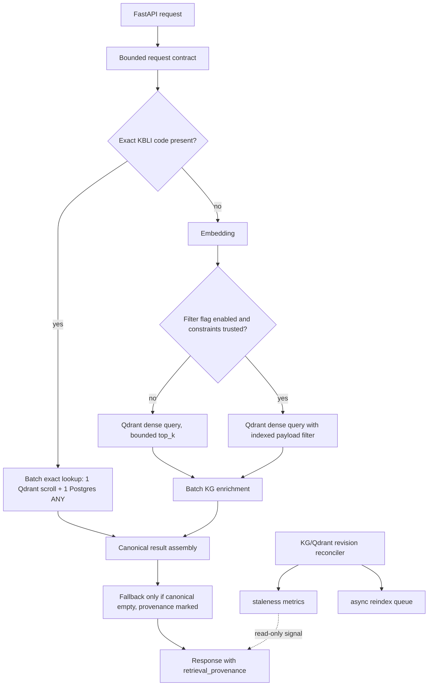

# Spec V2: KBLI Retrieval Consistency and Async Hot-Path Hardening

## 0. Executive Decision

The first audit correctly found real defects, but the panel changed the implementation order.
Do not start with a broad semantic-filter rewrite. Start with deterministic, low-risk fixes
that reduce hot-path cost and remove abuse/leak paths, then introduce Qdrant payload filtering
behind measurement.

Revised order:

1. Bound inputs and close async clients.
2. Batch exact-code lookup and KG enrichment.
3. Remove fallback-score authority.
4. Add payload indexes and measured prefiltering behind a feature flag.
5. Add a revision-based consistency contract and async reconciliation. No reindex enqueue in
   the request hot path.

This spec replaces the first blueprint generated from the static audit. The previous "freshness
guard compares timestamps and queues reindex inline" design is explicitly rejected.

## 1. Problem Statement

The KBLI path currently mixes three persistence layers:

- Postgres relational/KG tables (`kbli_documents`, `kg_nodes`, `kg_edges`)
- Qdrant vector collection (`kbli_2025_final`)
- hardcoded fallback knowledge in router code

The path works operationally, but it has four structural weaknesses:

1. exact-code lookup and enrichment multiply round trips;
2. async resources are not consistently owned by app lifespan;
3. request contracts allow unbounded query/limit growth;
4. vector/KG consistency is implicit, timestamp-only, and not enforced by a shared revision.

Payload filtering is a real improvement, but it is not the first production move because the
current evidence packet does not include recall@k, false-positive rate, or latency traces.

## 2. Evidence Grounding

### 2.1 Hot-path fanout

- `kbli_notebook.py:182-206`: exact-code Qdrant lookup sequentially tries multiple payload
  aliases.
- `kbli_notebook_chat.py:687-745`: chat direct-code path performs per-code Postgres lookup.
- `kbli_notebook_chat.py:990-1011`: semantic results are enriched with per-result KG queries.

Conclusion: the certain defect is round-trip amplification. Pool saturation is plausible, but
requires production traffic data to rank as proven.

### 2.2 Qdrant payload filtering is available but unused

- `kbli_notebook.py:212-223` and `kbli_notebook_chat.py:960-964`: dedicated KBLI vector path
  calls direct Qdrant `/points/query` without payload filter.
- `qdrant_db.py:486-493` and `qdrant_db.py:1159-1167`: generic Qdrant client supports filters.
- `reindex_kbli_2025_final.py:224-260`: payload includes `prefix_2`, `prefix_3`, `sektor`,
  `pma_status`, `bali_blocked`.
- `reindex_kbli_2025_final.py:274-303`: current payload indexes are only `doc_type`,
  `metadata.doc_type`, `kode_kbli`.

Conclusion: prefiltering is technically available, but production rollout needs payload indexes,
coverage verification, and recall measurement.

### 2.3 Consistency is implicit

- `reindex_kbli_2025_final.py:1-15` and `:422-589`: Qdrant reindex is batch/offline.
- `agent1_extract_kbli_qdrant.py:38-101` and `agent2_transform_kg_entities.py:250-333`: KG
  build path is also offline/batch.
- Runtime `/inspect` fuses KG and Qdrant data without a shared version check.
- KG has `updated_at`; Qdrant payload has `indexed_at`; neither is a canonical revision.

Conclusion: timestamp comparison is useful telemetry, not a correctness contract.

## 3. Panel Verdict Incorporated

### Convergent points

- Batch exact lookup is the lowest-risk high-value change.
- Async client lifecycle must be explicit in FastAPI lifespan.
- `query` and `limit` must be bounded before any more retrieval work is added.
- Payload indexes are mandatory before filtering on Qdrant metadata.
- Hardcoded fallback scores must not outrank canonical retrieval without provenance.

### Disagreements resolved

| Topic | Panel spread | Decision |
|---|---|---|
| V1 no prefilter severity | MED to HIGH | Treat as MED-HIGH until recall@k proves impact. Implement behind flag. |
| V2 fanout severity | MED to HIGH | Treat exact-code fanout as P0 because cost is certain; pool saturation remains monitored. |
| V3 drift severity | MED to CRITICAL | Treat as architectural HIGH only after SLO definition. Implement revision contract, not inline reindex. |
| V4 lifecycle | MED to HIGH | Treat as P0 hygiene because verification is binary and fix is low risk. |
| V6 fallback score | MED-LOW but high priority | Fix early because it fabricates authority. |

## 4. Non-Goals

- Do not change the embedding model. `text-embedding-3-small` remains frozen.
- Do not recreate the KBLI collection as part of Phase 0/1.
- Do not move WhatsApp/OSINT data off Pro.
- Do not add paid LLM/API dependencies.
- Do not implement reindex-from-request.
- Do not infer Qdrant filters from arbitrary natural-language user text without typed validation.

## 5. Target Architecture



## 5.1 Operational Campaign Board

Execution is organized as three lines that advance together:

- Army: code that changes retrieval behavior.
- Monitor: tests, counters, latency probes, dashboards, and rollout gates that prove the change.
- Sweepers: cleanup/removal work that prevents old paths from staying alive beside the new ones.

No PR is complete unless all three lines move. A feature-only PR without monitor/sweeper work is
not accepted for this campaign.

### Reuse anchors

Use existing control-plane pieces before adding new infrastructure:

- Worktree isolation: `scripts/agent_start.py`.
- RAG monitoring router: `apps/backend-rag/backend/app/routers/monitoring_rag.py`.
- Prometheus retrieval metrics: `apps/backend-rag/backend/services/rag/evaluation/monitoring.py`.
- Idempotent queue pattern: `apps/backend-rag/backend/migrations/migration_070b_legal_ingest_jobs.py`.
- Runtime/outbox control-plane pattern:
  `apps/backend-rag/backend/migrations/migration_124_autonomous_lab_runtime.py`.

### LLM usage policy

Use LLMs where they add independent failure detection, not as theatre:

- PR 1 and PR 2: orchestrator plus one adversarial review on the diff. These are mechanical enough
  that tests are the primary judge.
- PR 3: one red-team review focused on authority/provenance wording and ranking semantics.
- PR 4: full panel only at the measurement gate because recall/precision tradeoffs can change the
  architecture.
- PR 5: full panel before schema/reconciler merge because this becomes a long-lived consistency
  contract.

Model mix, when invoked: Claude Opus 4.8 for architectural red-team, GPT-5.5 for code review,
Gemini 3.1 Pro for long-context/spec coherence, DeepSeek V4 Pro for failure-mode and math checks.

### Advancement gate

Every PR must close this checklist:

1. Army merged in the isolated worktree and covered by targeted tests.
2. Monitor exposes a falsifiable signal: metric, test, log, dashboard, or measurement report.
3. Sweepers remove or quarantine the superseded path.
4. No request hot path gains unbounded work, request-triggered reindexing, or external LLM calls.
5. Verification is empirical: pytest/import checks/measurement scripts, not LLM approval.

## 5.2 Campaign Phases

| PR | Army advances | Monitor advances | Sweepers advance | Gate |
|---|---|---|---|---|
| PR 1 - bounds/lifecycle | Add bounded request contracts. Move KBLI Qdrant HTTP client into lifespan. Add `CollectionManager.close()`. | 422 tests for oversize query/limit. Shutdown test that closes clients. Import chain check for `backend.app.dependencies`. | Remove module-level unowned client path or make it shutdown-owned. Remove unbounded public `limit`. | Targeted pytest + repeated startup/shutdown test passes. |
| PR 2 - batching | Replace exact-code alias loop with one Qdrant scroll. Replace per-result KG SQL with one `ANY($1)` query. | Mocked call-count tests: one Qdrant call and one PG call for multi-code lookup. Add latency/call-count log fields for KBLI lookup. | Centralize legacy alias list in one helper. Delete duplicate direct-code lookup branches that become unreachable. | Call-count tests fail on N+1 regression. |
| PR 3 - fallback provenance | Add retrieval provenance and lower static fallback score. Canonical hits always outrank fallback. | Fallback counter/log. Tests for canonical-vs-fallback ordering and response provenance. | Remove hardcoded `0.8` static authority and any prompt wording that treats fallback as canonical. | No fallback result can outrank canonical retrieval in tests. |
| PR 4 - indexes/prefilter | Add idempotent Qdrant payload indexes. Add typed filter builder and flag-off query path. | Measurement report with recall@5, precision@5, exact-code hit rate, p95 latency on >=50 curated KBLI queries. | Remove ad hoc natural-language-to-filter mapping if found. Keep low-confidence constraints unfiltered. | Flag stays off until report is attached and non-regression holds. |
| PR 5 - revision/reconciler | Add `kbli_revision/source_version` propagation. Build async mismatch scanner and idempotent reindex queue. | Metrics: mismatch count, max mismatch age, reconciler duplicate-suppression count. Alert threshold for critical codes. | Remove timestamp-as-authority assumptions. Ensure request path only marks staleness, never enqueues reindex. | Reconciler double-run is idempotent; hot path has no queue write. |

## 5.3 Monitor Line Details

The monitor line is not a dashboard-first effort. It must push one falsifiable signal per phase:

- PR 1: validation failures and lifecycle closure are tested; no new dashboard.
- PR 2: call-count tests and latency logs expose round-trip amplification.
- PR 3: fallback usage count and provenance let us see when static knowledge is being used.
- PR 4: offline measurement report is the gate; live metric follows only after the flag exists.
- PR 5: reconciler metrics become operational because drift is not visible from single requests.

Prometheus naming convention for new KBLI-specific metrics:

```text
kbli_lookup_requests_total{path,provenance}
kbli_lookup_latency_milliseconds{path}
kbli_qdrant_prefilter_enabled_total{constraint}
kbli_fallback_results_total{reason}
kbli_revision_mismatch_total{severity}
kbli_revision_mismatch_age_seconds{severity}
kbli_reconciler_jobs_total{status}
```

Avoid high-cardinality labels. Never label metrics by raw query text, client identifier, passport,
KTP, NPWP, WhatsApp sender, or any client PII.

## 5.4 Sweeper Line Details

Sweepers are responsible for preventing dual systems:

- after PR 1, there is one owner for the KBLI Qdrant HTTP client;
- after PR 2, there is one exact-code lookup path and one KG batch-enrichment path;
- after PR 3, fallback is a degraded provenance, not a parallel authority;
- after PR 4, all payload-filter fields are indexed or the flag remains off;
- after PR 5, all drift handling routes through the reconciler, not request handlers.

Sweeper work is also where dead comments, duplicated helpers, stale docs, and unused feature flags
are removed. If a cleanup is risky, quarantine it behind a deletion ticket and add a test that keeps
the new path dominant.

## 5.5 Command Sequence

Recommended execution:

```bash
# PR 1
python scripts/agent_start.py --lane backend-rag --task-id kbli-bounds-life

# PR 2
python scripts/agent_start.py --lane backend-rag --task-id kbli-batch-kg

# PR 3
python scripts/agent_start.py --lane backend-rag --task-id kbli-provenance

# PR 4
python scripts/agent_start.py --lane backend-rag --task-id kbli-prefilter

# PR 5
python scripts/agent_start.py --lane backend-rag --task-id kbli-reconcile
```

Do not implement all five PRs in the current documentation worktree. This worktree carries the
spec. Code work should branch from a fresh backend-rag worktree per PR so monitor and sweeper
evidence stays reviewable.

## 6. Phase 0 - Request Bounds and Resource Lifecycle

### 6.1 Bound public request contracts

Apply bounds before optimizing retrieval.

Target behavior:

- `query`: max 1024 chars for chat/search requests.
- `limit`: min 1, max 25 for public search; any internal admin endpoint may opt into 100 with
  explicit authorization.
- code arrays: max 25 per request.
- reject with 422, do not silently clamp except on internal helper calls.

Example:

```python
from typing import Annotated

from fastapi import Query
from pydantic import BaseModel, Field


class KBLINotebookChatRequest(BaseModel):
    query: str = Field(..., min_length=1, max_length=1024)
    session_id: str | None = Field(default=None, max_length=128)


KBLILimit = Annotated[int, Query(ge=1, le=25)]
```

Acceptance:

- Requests with `limit=100000` return 422.
- Requests with `query` longer than 1024 chars return 422.
- Existing valid requests still pass.

### 6.2 Own clients in lifespan

Remove module-level lifecycle ambiguity. Either:

1. create KBLI-specific `httpx.AsyncClient` in app lifespan and inject through `request.app.state`;
2. or expose `close_kbli_client()` and call it from shutdown.

Preferred design: lifespan ownership.

```python
class KBLIQdrantGateway:
    def __init__(self, base_url: str, headers: dict[str, str]) -> None:
        self._client = httpx.AsyncClient(
            base_url=base_url,
            headers=headers,
            timeout=15.0,
            limits=httpx.Limits(max_connections=20, max_keepalive_connections=10),
        )

    async def close(self) -> None:
        await self._client.aclose()
```

`CollectionManager` must grow a `close()` method:

```python
async def close(self) -> None:
    for client in self._collections_cache.values():
        close = getattr(client, "close", None)
        if close is not None:
            await close()
    self._collections_cache.clear()
```

Acceptance:

- App shutdown closes KBLI gateway and cached Qdrant clients.
- Repeated startup/shutdown in a test does not leave open `httpx` clients.

## 7. Phase 1 - Batch Exact Lookup and KG Enrichment

### 7.1 Batch Qdrant exact-code lookup

Replace up to five sequential scroll calls per code with one scroll using `should` clauses for
legacy aliases.

REST shape:

```python
KBLI_CODE_KEYS = (
    "kode_kbli",
    "kode",
    "metadata.kode",
    "metadata.kode_kbli",
    "metadata.kode_kbli_2025",
)


def build_exact_code_filter(codes: list[str]) -> dict:
    bounded_codes = sorted({code for code in codes if code.isdigit()})[:25]
    return {
        "should": [
            {"key": key, "match": {"any": bounded_codes}}
            for key in KBLI_CODE_KEYS
        ]
    }
```

Notes:

- Use REST `filter` for direct `/points/scroll`.
- If using Python Qdrant SDK later, use `models.Filter` and `models.FieldCondition`; do not mix
  SDK syntax into REST payloads.
- Keep the legacy alias support only in one helper. New payload writes must use `kode_kbli`.

### 7.2 Batch Postgres enrichment

Replace per-result `SELECT properties FROM kg_nodes WHERE entity_id=$1` with one query:

```sql
SELECT entity_id, properties, updated_at
FROM kg_nodes
WHERE entity_id = ANY($1::text[])
LIMIT 25;
```

Acceptance:

- Direct code lookup performs at most one Qdrant call and one Postgres batch call.
- Semantic result enrichment performs one Postgres batch query for all returned codes.
- Add tests that count mocked calls for one-code and multi-code requests.

## 8. Phase 2 - Fallback Scoring and Provenance

Hardcoded fallback can remain as graceful degradation, but it must not pretend to be canonical
retrieval.

Rules:

- Fallback results are emitted only when canonical Qdrant/Postgres retrieval returns no eligible
  result, or when the user explicitly supplied an exact KBLI code that exists only in fallback.
- Fallback score must be lower than canonical confidence. Default: `0.35`.
- Response includes provenance: `canonical`, `fallback_static`, `postgres_text`, `qdrant_vector`.
- UI/LLM context can use fallback, but must label it.

Example:

```python
FALLBACK_SCORE = 0.35


def fallback_result(code: str, payload: dict) -> KBLISearchResult:
    return KBLISearchResult(
        code=code,
        title=payload["title"],
        description=payload.get("description", ""),
        score=FALLBACK_SCORE,
        provenance="fallback_static",
    )
```

Acceptance:

- A fallback result never outranks a canonical Qdrant/Postgres hit.
- Logs show when fallback was used.

## 9. Phase 3 - Payload Indexes and Measured Qdrant Prefilter

### 9.1 Add indexes idempotently

Extend reindex/indexing script to create payload indexes:

- `prefix_2`: keyword
- `prefix_3`: keyword
- `sektor`: keyword
- `pma_status`: keyword
- `bali_blocked`: bool

Before enabling prefilter:

- verify each indexed field has expected coverage;
- verify Qdrant accepts the index creation idempotently;
- run smoke query with filter on each field.

### 9.2 Filter only on trusted constraints

Do not parse arbitrary natural language into Qdrant field names. Only allow typed fields from
server-side extraction:

```python
class KBLISearchConstraints(BaseModel):
    prefix_2: str | None = Field(default=None, pattern=r"^\d{2}$")
    prefix_3: str | None = Field(default=None, pattern=r"^\d{3}$")
    codes: list[str] = Field(default_factory=list, max_length=25)
    pma_status: Literal["TERBUKA", "TERBATAS", "TERTUTUP"] | None = None
    bali_blocked: bool | None = None
```

REST `/points/query` shape:

```python
payload = {
    "query": query_embedding,
    "using": "dense",
    "limit": limit,
    "with_payload": True,
}
if qdrant_filter:
    payload["filter"] = qdrant_filter
```

### 9.3 Feature flag and measurement

Introduce `KBLI_QDRANT_PREFILTER_ENABLED=false` by default.

Measurement gate before enabling:

- curated query set: at least 50 KBLI queries covering F&B, villa/hotel, retail, creator,
  construction, wellness, consulting, and Bali-blocked cases;
- baseline: current unfiltered top-k;
- candidate: indexed prefilter top-k;
- report recall@5, precision@5, exact-code hit rate, and p95 latency.

Acceptance:

- No rollout unless recall@5 is non-regressing for exact-code and high-confidence sector queries.
- If a constraint is missing or low-confidence, query falls back to unfiltered vector search.

## 10. Phase 4 - Revision Contract and Async Reconciliation

### 10.1 Define source revision

Add a canonical `kbli_revision` or `source_version` to every derived store:

- source JSON row;
- Qdrant payload;
- `kbli_documents`;
- `kg_nodes.properties`;
- optional future dedicated column if performance requires it.

`indexed_at` and `updated_at` remain telemetry. They are not the authority.

### 10.2 Hot path rule

The request path may detect staleness, but it must not enqueue reindex inline.

Allowed in hot path:

- mark response metadata: `staleness_status = "unknown" | "fresh" | "stale_signal"`;
- emit metric/log;
- prefer structured KG fields if vector payload revision is stale and the endpoint already has KG.

Forbidden in hot path:

- running reindex;
- enqueueing repeated reindex jobs per request;
- blocking response on reconciliation.

### 10.3 Reconciler job

Separate job:

1. scans KG/Qdrant revision mismatch;
2. emits counts and max age;
3. enqueues idempotent reindex tasks once per code/revision;
4. exposes a dashboard or log summary.

SLO must be configured before enforcement. Initial proposal:

- `kbli_revision_mismatch_count = 0` for critical codes;
- non-critical mismatch maximum age less than 24h;
- alert if mismatch count grows across two consecutive runs.

Acceptance:

- Reconciler can run twice without duplicate queue spam.
- A deliberate stale payload is detected by metrics.
- Runtime response does not call the reindex queue directly.

## 11. Tests

Minimum test set:

1. request validation: query too long and limit too high return 422;
2. exact-code batching: one helper call produces one Qdrant scroll payload with bounded codes;
3. KG enrichment: multi-result response performs one `ANY($1)` query;
4. fallback: canonical result outranks fallback; fallback is provenance-marked;
5. lifecycle: app shutdown closes KBLI gateway and CollectionManager clients;
6. Qdrant filter builder: rejects invalid `prefix_2`, arbitrary keys, oversized code lists;
7. revision reconciler: detects mismatch and enqueues one idempotent job outside request path.

## 12. Rollout Plan

### PR 1 - Bounds and lifecycle

Files likely touched:

- `apps/backend-rag/backend/app/routers/kbli_notebook.py`
- `apps/backend-rag/backend/app/routers/kbli_notebook_chat.py`
- `apps/backend-rag/backend/app/setup/app_factory.py`
- `apps/backend-rag/backend/services/ingestion/collection_manager.py`

Run targeted tests only. No behavior change for normal requests.

### PR 2 - Batching

Replace exact-code and KG enrichment N+1 paths. Add mocked call-count tests.

### PR 3 - Fallback provenance

Lower fallback authority and expose provenance.

### PR 4 - Payload indexes and prefilter flag

Add indexes idempotently. Keep flag off until measurement report is attached.

### PR 5 - Revision contract and reconciler

Add `kbli_revision/source_version` propagation and reconciliation job. No hot-path enqueue.

## 13. Definition of Done

- Public KBLI requests are bounded.
- Async clients close in shutdown.
- Exact-code lookup no longer performs sequential alias scrolls.
- KG enrichment no longer performs per-result SQL.
- Static fallback cannot outrank canonical retrieval.
- Payload filtering is enabled only after index coverage and recall@k measurement.
- KG/Qdrant consistency has a named SLO and a revision-based reconciler.

## 14. Deferred Questions

1. What is the canonical revision source: OSS `id_version`, local schema version, or a generated
   content hash?
2. Should stale vector payload ever be hidden from `/inspect`, or only marked?
3. Which 50 queries form the permanent KBLI retrieval regression set?
4. Should `prefix_2`/`prefix_3` be inferred from exact code only, or also from keyword/domain
   classifier output?
