# Dependency DAG and Execution Boundaries

## 1. Work-packet graph

```mermaid
flowchart TD
    P01["01 NEXUS containment"]
    P02["02 Publishing truth"]
    P03["03 WR3 / FlowKit activation"]
    P04["04 Canonical contracts"]
    P05["05 Intel Lake v2 + MATA"]
    P06["06 NAGA claims + time"]
    P07["07 NEXUS entity resolution"]
    P08["08 Hybrid retrieval"]
    P09["09 Blog / Magazine / SEO"]
    P10["10 WR2 foundry"]
    P11["11 WR3 foundry"]
    P12["12 Action Inbox"]
    P13["13 Outcome telemetry"]
    P14["14 Cross-system evals"]
    P15["15 Active learning"]
    P16["16 Controlled retirement"]
    P17["17 NotebookLM verification"]
    P18["18 Conductor session bridge"]
    P19["19 Compliance protection"]
    P20["20 Client journey"]
    P21["21 Revenue + partnerships"]
    P22["22 Product + self-service"]
    P23["23 Team enablement"]

    P04 --> P01
    P04 --> P02
    P04 --> P05
    P04 --> P06
    P04 --> P17
    P06 --> P17
    P01 --> P07
    P04 --> P07
    P05 --> P07
    P06 --> P07
    P05 --> P08
    P06 --> P08
    P02 --> P09
    P04 --> P09
    P12 --> P09
    P18 --> P09
    P04 --> P10
    P06 --> P10
    P18 --> P10
    P03 --> P11
    P04 --> P11
    P06 --> P11
    P12 --> P11
    P18 --> P11
    P04 --> P12
    P05 --> P12
    P06 --> P12
    P07 --> P12
    P04 --> P18
    P02 --> P18
    P06 --> P18
    P12 --> P18
    P17 --> P18
    P04 --> P13
    P09 --> P13
    P10 --> P13
    P11 --> P13
    P12 --> P13
    P05 --> P14
    P06 --> P14
    P07 --> P14
    P08 --> P14
    P09 --> P14
    P10 --> P14
    P11 --> P14
    P12 --> P14
    P13 --> P14
    P17 --> P14
    P18 --> P14
    P13 --> P15
    P14 --> P15
    P12 --> P15
    P18 --> P15
    P06 --> P19
    P12 --> P19
    P13 --> P19
    P14 --> P19
    P17 --> P19
    P18 --> P19
    P12 --> P20
    P13 --> P20
    P14 --> P20
    P18 --> P20
    P12 --> P21
    P13 --> P21
    P14 --> P21
    P18 --> P21
    P08 --> P22
    P12 --> P22
    P13 --> P22
    P14 --> P22
    P18 --> P22
    P12 --> P23
    P13 --> P23
    P14 --> P23
    P18 --> P23
    P01 --> P16
    P02 --> P16
    P03 --> P16
    P04 --> P16
    P05 --> P16
    P06 --> P16
    P07 --> P16
    P08 --> P16
    P09 --> P16
    P10 --> P16
    P11 --> P16
    P12 --> P16
    P13 --> P16
    P14 --> P16
    P15 --> P16
    P17 --> P16
    P18 --> P16
    P19 --> P16
    P20 --> P16
    P21 --> P16
    P22 --> P16
    P23 --> P16
```

## 2. Parallelism rules

- Packet 01 Tasks 1–6, Packet 03, and Packet 04 may begin in parallel. Packet 01 Task 7 live cutover waits for Packet 04's canonical repository, validators, and narrowly scoped containment/manual authority adapter; that adapter validates the exact durable source revision, canonical `IntelEvent`/`Evidence`/`Claim` lineage with inherited classification, one exact sanitized containment `DecisionPacket`, its exact `WorkflowRun` and verification/sanitization receipts, then only materializes the exact `RequestedActionSpec` → `ActionItem` + `ActionIntent` pair for the five enumerated NEXUS effects and performs no effect. Packet 12 later wraps the same core primitive as the sole general runtime service, so this boundary creates neither a dependency cycle nor a parallel action ledger. Packet 02 may audit and prepare its golden set early, but its implementation imports the Packet 04 base contracts and migration core.
- Packet 03 may restore connectivity, typed dispatch, health truth, and zero-spend FlowKit readiness before Packet 11; it performs no Veo submission or paid pilot.
- Packets 05 and 06 may run in parallel after Packet 04 validators exist.
- Packet 17 may prepare NotebookLM routing and privacy fixtures early; canonical receipts depend on Packets 04 and 06.
- Packet 07 may prepare a golden set during Wave 0. After Packets 01, 04, 05, and 06 satisfy their relevant gates it may mutate only a disposable synthetic clone; production graph candidates are handed to the later Packet 12/18 authority path and are never executed by Packet 07. Packet 05 owns the MATA typed-message repair on which the canonical LHKPN path depends.
- Packet 08 may baseline current retrieval early; canonical hybrid cutover waits for 05 and 06.
- Packets 09–12 may build fixtures and interface prototypes early, but live consumers must use the canonical contracts. WR2 and WR3 consume a versioned Conductor lock before any canary.
- Packet 18 may design the operator handoff interface early; its durable bridge depends on Packets 04, 12, and 17 and cannot execute an action by itself.
- Packets 13 and 14 may define schemas and fixtures early; a Packet 14 release gate remains advisory and blocked until Packet 13 provides runnable outcome measurements against Wave 2 object IDs.
- Packet 15 may collect human decisions in shadow form, but may not alter routing/ranking until Packet 14 validates the learner and Packets 18/12 materialize the exact authorized canary action.
- Packets 19–23 are outcome-family adoption slices. Their inventories and fixtures may start early, but each canary waits for Packets 12–14 and its domain dependencies.
- Packet 16 is last. It retires one named target per independently reviewed change and cannot retire a path because a new one merely exists.

## 3. Integration gates

| Gate | Required proof | Unlocks |
|---|---|---|
| **G0 — Containment** | NEXUS access/redaction/secrets fail closed; publication states truthful; FlowKit health dimensions separated | Any canary touching external or restricted surfaces |
| **G1 — Contract** | Strict validators, fixtures, compatibility matrix, dual-write plan, no PII leakage | Wave 1 writes and Wave 2 consumer work |
| **G2 — Evidence** | Replay-safe Intel events; source-span claims; temporal semantics; entity merge review bands; retrieval baseline | Action Inbox and media/publication consumers |
| **G3 — Outcome** | Shared DecisionPacket, lock/RequestedActionSpec/ConductorHandoff references, ActionItem/ActionIntent/approval/execution IDs, ContentObject, and MediaManifest IDs reach every adopted surface and return canonical OutcomeEvents | Active learning and outcome-family canaries |
| **G4 — Simplification** | Parity windows, zero stranded messages, rollback drill, owner sign-off | Retirement of duplicate paths |

## 4. Ownership and collision map

| Packet | Primary ownership | Explicitly outside its boundary |
|---:|---|---|
| 01 | Pro NEXUS runtime, UI access boundary, secrets, redaction | Entity-resolution algorithms and public publishing |
| 02 | Publication lifecycle vocabulary, risk policy, staging/approval semantics | Magazine growth features and content generation |
| 03 | FlowKit connectivity, WR3 dispatch bug, live credit budget, zero-spend readiness | Veo submission, paid pilot, or WR3 editorial redesign |
| 04 | Shared models, validators, migrations/adapters, contract docs | Domain-specific consumer redesign |
| 05 | Intel Lake ingestion/outbox/routing; MATA producer adapters | NAGA claim truth and NEXUS graph semantics |
| 06 | NAGA claims/evidence/time/invalidation | Entity merging and channel composition |
| 07 | NEXUS temporal entity/relationship model, reviewed promotion code, synthetic-clone proof, and future candidate handoff | Production graph mutation, NEXUS network security, and public content |
| 08 | Qdrant hybrid retrieval adapters, evaluation, router | Embedding replacement and claim storage |
| 09 | Blog/Magazine publishing and SEO feedback | WR2/WR3 rendering and red material |
| 10 | WR2 planning-to-render-to-critic contract | Topic discovery and Instagram final publish |
| 11 | WR3 production service and manifest | Topic authority and autonomous social publish |
| 12 | Kita Action Inbox, action state, ownership, SLA, consumer adapters | New standalone cockpit |
| 13 | OutcomeEvent collectors, domain mappings, attribution policy, cursors, and aggregates through the Packet 04 repository | A second OutcomeEvent contract/repository or automatic optimization decisions |
| 14 | Golden sets, graders, regression harness, scorecards | Production self-approval |
| 15 | Human-decision dataset and offline learning proposals | Self-modifying production prompts/code |
| 16 | One-target-at-a-time feature-flagged retirement and cleanup | New features or fleet-wide deletion in one change |
| 17 | NotebookLM routing, minimization, independent verification receipts | Event storage, primary-source truth, or sensitive prompts |
| 18 | Operator-session handoff, frozen locks, typed action proposals | Autonomous editorial judgment or side effects |
| 19 | Compliance-protection view, routing, SLA, receipts, outcomes | Legal determination or client-specific auto-action |
| 20 | Client-journey view, interventions, protected attribution | General-ledger client PII or autonomous communication |
| 21 | Revenue/partnership signals, opportunity decisions, outcomes | Unapproved outreach or pricing outside PricingTool |
| 22 | Product/self-service evidence, experiments, outcomes | Autonomous production release or embedding replacement |
| 23 | Team-enablement briefs, ownership, SLA, outcomes | New standalone team cockpit or unapproved sends |

## 5. Branch and worktree contract

Every session receives one work packet and creates one dedicated worktree. Before dispatch it must instantiate [DISPATCH-MANIFEST.md](./DISPATCH-MANIFEST.md), then list the exact files it owns before editing. Shared files—especially migrations, registries, router registration, and contract exports—require a lease and serial integration.

### Migration-number reservation

At freeze time, the authoritative Pro v2 migration head is `269`. The program ledger reserves the following contiguous block:

| Migration | Owner | Frozen purpose |
|---:|---:|---|
| `270` | Packet 04 | Canonical contract core and canonical OutcomeEvent repository |
| `271` | Packet 02 | Publication truth, revision, and three-axis state specialization |
| `272` | Packet 05 | Intel Lake v2 event, cluster, and outbox additions |
| `273` | Packet 06 | NAGA evidence, claim-family, bitemporal, and invalidation additions |
| `274` | Packet 09 | Publication/SEO projection, cursor, and materialized snapshot additions |
| `275` | Packet 12 | Action Inbox queue, intent, approval, and execution projections |
| `276` | Packet 13 | Domain outcome collector cursors and materialized aggregates |

Every execution session refreshes the authoritative Pro migration head before editing. If any reserved number is occupied or its purpose has changed, all downstream migrations stop and the Conductor issues one versioned ledger revision; workers never renumber independently. Parallel sessions may design schemas concurrently, but migration integration is serial.

No session may:

- reset, clean, or overwrite another session's changes;
- edit the main checkout;
- merge its own work or push to `main`;
- deploy, publish, enable a LaunchAgent, or flip a production flag unless the packet contains explicit owner authorization;
- use a green test result from fixtures as proof of live readiness.

## 6. Baseline and review contract

Before editing, each session records:

- current commit and machine;
- relevant live process/queue/API state;
- current counts, latency, failures, and side effects;
- a golden set and negative/adversarial cases;
- rollback point and feature-flag default.
- the domain-specific operating window used for reconciliation.

An **operating window** is declared before implementation as the smallest interval covering one complete expected producer-to-outcome cycle for that domain—for example one daily collector cycle, one weekly compliance cycle, or one full editorial publish/index-measure cycle. It is never chosen after seeing results. Unless a packet defines a stricter rule, cutover requires two consecutive complete windows.

After implementation, an independent reviewer must compare the same baseline, inspect the diff, run the relevant deterministic and adversarial tests, and issue `PASS`, `PASS_WITH_LIMITS`, or `FAIL`. The generator cannot be the final grader.

## 7. Program-level rollback

The architecture is adopted through adapters, dual writes, shadow reads, feature flags, and per-consumer cutovers. A packet must retain the old read path until:

1. the new path passes its stated golden set;
2. replay produces no duplicate external effect;
3. two complete operating windows reconcile within tolerance;
4. rollback is tested, not merely documented;
5. the owner approves retirement under Packet 16.

Data migrations are append-only or reversible. Destructive cleanup is a separate, explicitly approved operation.
