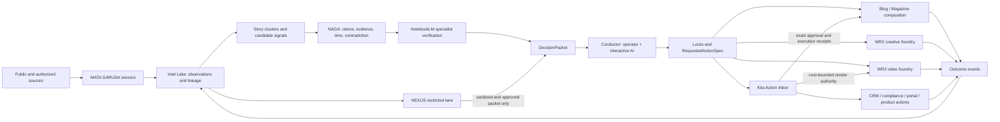

# Nuzantara Evidence-to-Action Research OS

**Frozen architecture:** `research-os/v1.0.0`
**Freeze date:** 2026-08-15 WITA
**Status:** canonical decision record; implementation is split into the twenty-three work packets in this directory
**Change authority:** Antonello/Zero, advised by the interactive Conductor and an independent verifier

## 1. North Star

> Every relevant signal enters once, becomes verifiable evidence, is transformed into the right action or product, and returns to the system as measurable learning.

The target is not a carousel factory. It is an evidence-to-action operating system for Bali Zero. Editorial output is one branch beside compliance protection, client service, revenue, product intelligence, institutional intelligence, team enablement, memory, and platform reliability.

The operator–AI session is the **Conductor**: the place where intent, taste, timing, risk appetite, and final judgment meet. The surrounding system must not imitate that judgment. It must make the session unusually powerful by supplying durable observation, evidence, memory, production capacity, independent checks, distribution, and outcome measurement.

## 2. Frozen outcomes

The Research OS must serve nine outcome families:

1. **Compliance protection:** detect regulatory changes, approaching obligations, contradictions, and expiring facts before they harm a client.
2. **Client journey:** turn evidence into onboarding, service, renewal, escalation, and support actions.
3. **Revenue and partnerships:** surface qualified demand, renewal opportunities, market shifts, and partner signals without leaking client data.
4. **Products and self-service:** improve Kita, KBLI Navigator, calculators, portals, and internal tools from observed questions and friction.
5. **Decision intelligence:** give the operator concise, traceable choices rather than more feeds.
6. **Authority and demand:** create high-value articles, Magazine editions, WR2 carousels, WR3 videos, newsletters, and sales enablement.
7. **Team enablement:** route the right brief, alert, or checklist to the responsible person with an owner and an SLA.
8. **Memory and learning:** preserve decisions, corrections, source quality, human edits, and downstream outcomes.
9. **Platform governance:** make every consequential run replayable, observable, idempotent, reversible, and independently reviewable.

## 3. Frozen system roles

| System | Frozen role | It must not become |
|---|---|---|
| **Intel Lake** | Canonical ledger of observations, events, provenance, freshness, lineage, and delivery receipts | Another editorial brain or a second claim store |
| **MATA GARUDA** | Sensors, collectors, deterministic enrichers, and source-health probes feeding Intel Lake | A parallel lake, a parallel NotebookLM feeder, or an autonomous publisher |
| **NAGA** | Canonical claim/evidence/contradiction/expiry ledger | A second document archive or a free-form research report store |
| **NEXUS** | Local, restricted institutional-intelligence graph for entities, roles, public records, temporal relations, research gaps, and reviewed anomalies | A public content source, accusation engine, or PII-export path |
| **NotebookLM** | Specialist ground-truth verifier for defined domains | The event ledger, workflow engine, or sole source of truth |
| **Conductor** | Operator plus interactive AI: intent, synthesis, editorial sensitivity, priority, and final judgment | A background daemon or a replacement for independent verification |
| **Kita Action Inbox** | One persistent decision queue with specialized views, owners, SLAs, receipts, and downstream state | A new dashboard beside existing queues |
| **WR2** | Creative carousel foundry after topic and Creative Lock | An autonomous editor that chooses the topic or silently flattens visual intent |
| **WR3** | Industrial video foundry after topic/script/shot lock | An autonomous editorial brain or unmetered credit spender |
| **Blog / Magazine / CRM / portals / alerts** | Outcome surfaces consuming shared, verified objects | Independent pipelines that recreate truth and state |
| **GSC / GA4 / CRM / human decisions** | Outcome and learning signals returned to Intel Lake | Vanity-only reporting or automatic prompt/code mutation |

## 4. Frozen architecture

### Control-plane rule

- Air-M5 may operate lightweight control clients and the FlowKit control tunnel. It may dispatch and inspect sanitized status, but it does not host render workers, protected data, databases, or NEXUS UI/data access.
- Pro is authoritative for production daemons, protected data, databases, NEXUS, FlowKit execution, rendering, and heavy processing.
- Mini-Pro2 remains the H24 companion for dedicated batch and local inference where assigned.
- No protected raw OSINT or client PII is copied to Air-M5 or cloud prompts.

## 5. Four frozen operating assumptions

1. **Magazine becomes a public surface**, not merely a private workbench.
2. **Unattended green autopublish is a deferred capability, not an authorization in `research-os/v1.0.0`.** It may be proposed only after deterministic verification, a successful shadow/canary period, and a versioned freeze change that represents policy authorization truthfully instead of calling it human approval.
3. **Instagram, amber regulatory content, and every NEXUS-derived insight keep a human gate.** Red content is never autonomously published.
4. **Air-M5 controls FlowKit; Pro executes heavy rendering.** A healthy tunnel is not proof that the browser extension or credit path is healthy.

## 6. Publication risk policy

| Class | Typical material | Allowed automation | Mandatory gate |
|---|---|---|---|
| **Green** | Low-risk, public, non-regulatory Bali facts, culture, infrastructure, events, or service-adjacent explainers with no sensitive inference | In v1.0.0: research, verification, composition, and staging. A later version may authorize unattended publication after shadow/canary proof | Per-revision human approval in v1.0.0; future policy authorization requires a freeze change and post-publish audit |
| **Amber** | Visa, tax, company, property, regulations, deadlines, prices, legal interpretation, consequential numbers | Research, claim verification, composition, rendering, staging | One explicit human approval receipt before publication |
| **Red** | NEXUS-derived intelligence; named persons and assets; reputation; investigations; PII; unresolved allegations | Internal analysis and sanitized decision packets only | No autonomous publication; case-specific legal/privacy review and owner approval |

Risk is determined by the strongest applicable class. A green article with one amber claim is amber. A downstream object cannot weaken the class assigned upstream.

### Green-autopublish activation boundary

The current canonical lifecycle intentionally contains `human_approved`. Therefore no packet in this freeze may label a policy decision as human approval or silently bypass that state. A future green-only autopublish proposal must introduce a truthful, versioned authorization contract, prove it against the Packet 02 and 09 golden sets, pass Packet 14, name the exact surface and rollback owner, and receive explicit owner approval. Until then, the current research lane may generate and stage automatically but does not have architectural authority to publish unattended.

## 7. Frozen primary contracts

All work packets consume `research-os/v1.0.0` contracts defined in [CONTRACTS.md](./CONTRACTS.md). The contract families are:

1. **Evidence spine:** `IntelEvent`, `Evidence`, `Claim`, `StoryCluster`, `DecisionPacket`.
2. **Decision and action control:** `TopicLock`, `CreativeLock`, `RequestedActionSpec`, `ActionItem`, `ActionIntent`, `ApprovalReceipt`, immutable started `ExecutionAttempt`, typed `OperationalReceipt`, `ConductorHandoff`, `VerificationReceipt`, `WorkflowRun`.
3. **Production and publication:** `ContentObject`, `MediaManifest` and the Packet 02 publication specialization.
4. **Learning and protection:** `OutcomeEvent`, `SanitizationReceipt`, `RiskReclassificationReceipt`, `RevocationReceipt`, `ObjectSuccessorEdge`, `MetricProfile`, `MetricResult`.

Contract adoption is additive first: canonical validators and repositories are owned by Packet 04; domain packets import them and add adapters or namespaced extensions. Dual-write and shadow-read precede every cutover.

## 8. Frozen decisions versus benchmark candidates

### Frozen now

- Postgres plus transactional outbox remains the event backbone.
- Intel Lake, NAGA, and NEXUS have distinct responsibilities.
- `text-embedding-3-small`, 1536 dimensions, remains frozen for the canonical dense index.
- External publication is fail-closed according to the green/amber/red policy.
- NEXUS remains local and restricted; downstream systems receive only sanitized, approved packets.
- Human edits and decisions are first-class outcome data, not discarded corrections.
- Claims are stored atomically with immutable version IDs, claim families, source-version hashes, half-open valid-time intervals, and system-time intervals derived from append-only successor versions.
- One Action Inbox replaces competing decision queues over time.
- WR2 and WR3 are foundries invoked after a creative/editorial lock, not autonomous topic authorities.

### Candidates that require an evaluation gate

- CloudEvents-inspired event envelope and OpenLineage semantics, implemented inside the existing stack.
- A cascaded dedup challenger beyond the deterministic exact/normalized/near incumbent. Semantic or LLM clustering is adopted only if it wins the preregistered Packet 05 evaluation; the simpler incumbent may remain canonical.
- Automated claim atomization inspired by Claimify; atomic canonical storage is already frozen.
- Additional W3C PROV-compatible exchange mappings beyond the frozen lineage and bitemporal semantics.
- Probabilistic entity resolution inspired by Splink, with explicit merge/review/reject bands.
- Qdrant dense+sparse retrieval, Reciprocal Rank Fusion, and selective reranking.
- Selective GraphRAG for proven global or multi-hop queries only.
- LangGraph only for truly agentic, interruptible paths; deterministic cron stays deterministic.
- OpenTimelineIO-compatible concepts for WR3 timelines and optional C2PA asset provenance.

### Explicitly rejected without a new architectural decision

- Kafka/Pulsar, a new temporal database, a new graph database, or a third claim store.
- Re-embedding the canonical corpus or changing embedding dimensions.
- Full-corpus GraphRAG by default.
- LLM-only deduplication, entity merging, contradiction judgment, ranking, or self-approval.
- Name-only entity auto-merge.
- A new cockpit beside Kita.
- Mass low-value SEO page generation.
- Automatic mutation of production prompts or code from live feedback.

## 9. Live baseline at freeze

This is a dated baseline, not a permanent truth. Every execution packet must refresh it before making changes.

- The daily Bali research lane is alive and produces staged material, but its names blur internal fast-track with public publication. On the 2026-08-15 run it gathered 188 items, validated 169, filtered 163, created 20 dossiers, enriched/SEO-processed 7, staged 7, and publicly autopublished 0.
- The public blog is live but its newest article-like sitemap timestamp was 2026-07-25 at audit time. Magazine is code-complete but its scheduled jobs are not installed and its reachable site is protected.
- Intel Lake is a real production ledger. MATA GARUDA is also live, but duplicate ingestion/feed paths and a broken WR2 bridge prevent it from serving as one coherent research nervous system.
- NAGA already has claim, evidence, conflict, transition, quality, and expiry foundations, but is not yet the universal contract.
- WR2 has substantial creative machinery, but the daemon path can reduce a multi-slide visual plan to a cover-only hero contract and its automatic renderer reports a limited legibility pass rather than the full independent critic gate.
- WR3 has real render/audio/assembly/QA components, but no recent complete production flow. Its WR2 handoff is off and the currently declared route can resolve to a no-op. FlowKit service health does not currently prove browser-extension connectivity.
- NEXUS is alive on Pro with a substantial graph and LHKPN data, but has security exposure, semantic contract drift, a broken MATA-to-NEXUS closure, and an inactive reviewed-promotion path.
- SEO sensors observe GSC, GA4, and CRM signals, but indexing submission is not verified indexing, and the learning loop is not closed at content/topic/claim level.

## 10. Delivery waves

### Wave 0 — containment and shared language

- Packet 01 — NEXUS security containment; Tasks 1–6 may prepare and shadow in parallel, while Task 7 live cutover waits for Packet 04's reviewed canonical authority primitive and five-effect containment adapter
- Packet 03 — WR3/FlowKit activation
- Packet 04 — canonical contracts
- Packet 02 — publishing truth and risk policy, implemented after Packet 04

### Wave 1 — evidence spine

5. Intel Lake v2 and MATA consolidation
6. NAGA claim/evidence and bitemporality
7. NEXUS temporal entity resolution
8. Hybrid retrieval and evaluation
17. NotebookLM verification adapter

### Wave 2 — action and production surfaces

9. Blog/Magazine publication truth and SEO outcome loop
10. WR2 Creative Foundry
11. WR3 Video Foundry
12. Kita Action Inbox and action routing
18. Conductor session bridge

### Wave 3 — measurement, learning, and business adoption

13. Outcome telemetry
14. Cross-system evaluations
15. Active learning from human decisions
19. Compliance protection adoption
20. Client journey adoption
21. Revenue and partnerships adoption
22. Product and self-service adoption
23. Team enablement adoption

### Wave 4 — simplification

16. Controlled retirement of duplicates

The authoritative dependency graph and collision boundaries are in [DEPENDENCY-DAG.md](./DEPENDENCY-DAG.md). Every child session begins from [DISPATCH-MANIFEST.md](./DISPATCH-MANIFEST.md). Outcome-family coverage is frozen in [SURFACE-COVERAGE.md](./SURFACE-COVERAGE.md).

## 11. Invariants for every execution session

Every packet is a prompt for a separate session. Each session must first instantiate the Dispatch Manifest and then:

1. identify the machine and refresh the live baseline;
2. work in its own worktree and declared file-ownership boundary;
3. preserve unrelated and concurrent changes;
4. never copy client PII or protected OSINT to cloud tools or artifacts;
5. never publish, deploy, merge, or arm an external side effect unless the packet and owner explicitly authorize it;
6. implement adapters and reversible migrations before retiring an old path;
7. record versions, hashes, attempts, approvals, and failure reasons;
8. run deterministic tests plus a golden-set evaluation where judgment is involved;
9. operate in shadow mode before canary and general cutover;
10. be reviewed by a session/model that did not generate the implementation.

## 12. Global exit gates

The program is not complete because all twenty-three branches exist. It is complete only when:

- one source observation has one canonical identity and replay does not duplicate side effects;
- every consequential claim can be traced to a source span, validity interval, and reviewer state;
- red material cannot escape NEXUS through any normal or failure path;
- every pending decision has one owner, SLA, risk class, and downstream receipt;
- publication states describe public reality; v1.0.0 cannot publish without the required human receipt; any future green-autopublish change has its own authorization, shadow/canary proof, and rollback;
- WR2 preserves per-slide creative intent and passes an independent critic;
- WR3 completes a cost-bounded pilot with manifest, identity/audio/legal gates, and manual publish stop;
- content and operational outcomes return at object/topic/claim level;
- every one of the nine outcome families has one protected source-to-decision-to-action-to-receipt-to-outcome path in the Surface Coverage Matrix;
- duplicate bridges, queues, feeds, and cockpits are retired only after parity, replay, rollback, and operator sign-off.

## 13. Work-packet index

| # | Packet | Wave |
|---:|---|---:|
| 01 | [NEXUS security containment](./work-packets/01-nexus-security-containment.md) | 0 |
| 02 | [Publishing truth and policy](./work-packets/02-publishing-truth-and-policy.md) | 0 |
| 03 | [WR3 and FlowKit activation](./work-packets/03-wr3-flowkit-activation.md) | 0 |
| 04 | [Canonical contracts](./work-packets/04-canonical-contracts.md) | 0 |
| 05 | [Intel Lake v2 and MATA consolidation](./work-packets/05-intel-lake-v2-mata-consolidation.md) | 1 |
| 06 | [NAGA claim ledger and bitemporality](./work-packets/06-naga-claim-ledger.md) | 1 |
| 07 | [NEXUS temporal entity resolution](./work-packets/07-nexus-temporal-entity-resolution.md) | 1 |
| 08 | [Hybrid retrieval and evaluation](./work-packets/08-hybrid-retrieval-evaluation.md) | 1 |
| 09 | [Blog, Magazine, and SEO loop](./work-packets/09-blog-magazine-seo-loop.md) | 2 |
| 10 | [WR2 Creative Foundry](./work-packets/10-wr2-creative-foundry.md) | 2 |
| 11 | [WR3 Video Foundry](./work-packets/11-wr3-video-foundry.md) | 2 |
| 12 | [Kita Action Inbox](./work-packets/12-kita-action-inbox.md) | 2 |
| 13 | [Outcome telemetry](./work-packets/13-outcome-telemetry.md) | 3 |
| 14 | [Cross-system evaluations](./work-packets/14-cross-system-evaluations.md) | 3 |
| 15 | [Active learning](./work-packets/15-active-learning.md) | 3 |
| 16 | [Controlled retirement](./work-packets/16-controlled-retirement.md) | 4 |
| 17 | [NotebookLM verification adapter](./work-packets/17-notebooklm-verification-adapter.md) | 1 |
| 18 | [Conductor session bridge](./work-packets/18-conductor-session-bridge.md) | 2 |
| 19 | [Compliance protection](./work-packets/19-compliance-protection-slice.md) | 3 |
| 20 | [Client journey](./work-packets/20-client-journey-slice.md) | 3 |
| 21 | [Revenue and partnerships](./work-packets/21-revenue-partnership-slice.md) | 3 |
| 22 | [Product and self-service](./work-packets/22-product-self-service-slice.md) | 3 |
| 23 | [Team enablement](./work-packets/23-team-enablement-slice.md) | 3 |

## 14. Freeze-change protocol

A change to a frozen role, invariant, risk policy, primary contract, or rejected technology requires:

1. a written decision record describing the observed constraint;
2. a measured baseline and a falsifiable expected improvement;
3. at least two viable options, including “keep the current design”;
4. privacy, security, cost, and rollback analysis;
5. an independent adversarial review;
6. explicit owner approval;
7. a version change to the architecture and affected contracts.

Implementation discoveries may refine field names or internal code placement without changing the architecture, provided compatibility and invariants remain intact.
